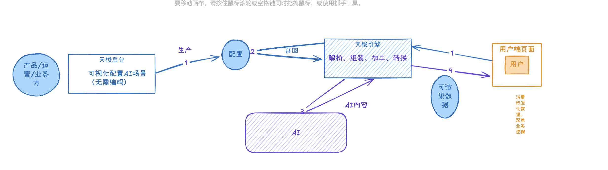
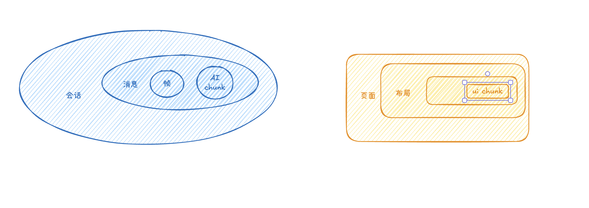
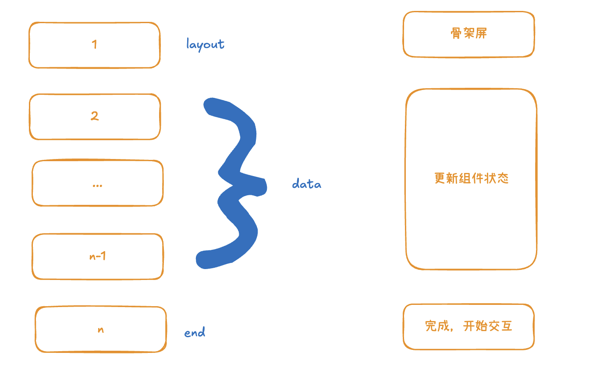
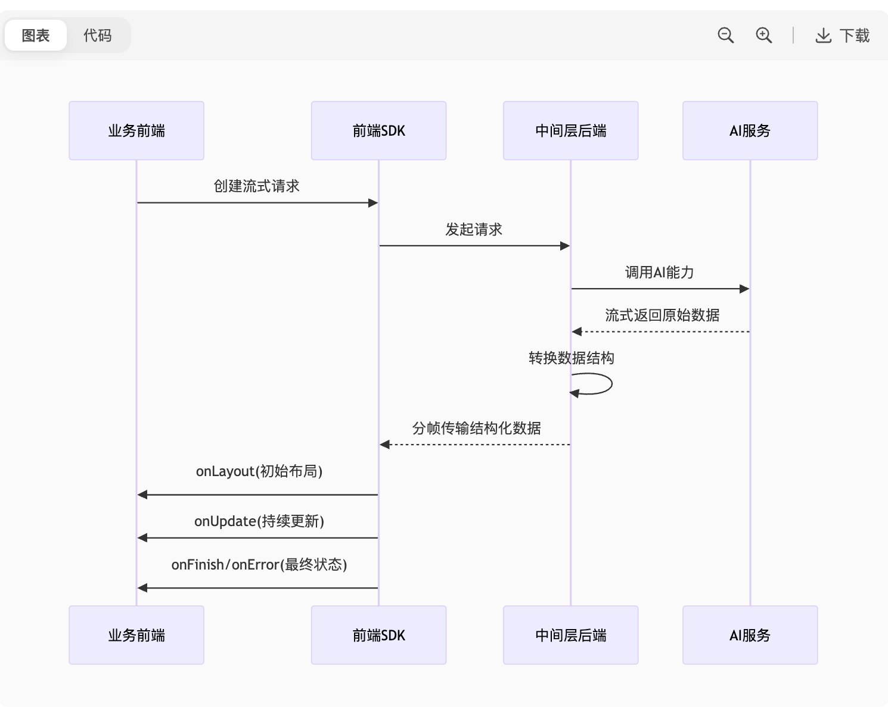

## 1.背景 
如今，AI已经融入到各种应用中，比如在搜索中的插入AI生成内容：  

传统请求与AI问答存在显著差异，带来了新的技术挑战：
1. **流式数据特性**：模型生成内容是渐进式的，不像传统API一次性返回完整结果  
2. **数据结构复杂**：模型生成的原始内容需进一步解析和补全才能被用户理解  
3. **智能编排复用**：如何构建可复用的智能体能力，通过编排快速接入不同业务场景，实现开发提效 

<!-- 高亮架构图中引擎部分，突出引擎的作用：解析转换、编排复用、多种接入方式 -->


## 2.demo演示
1. [天梭后台](场景详情链接待补充)、
2. 业务前端实现（片段）
```tsx
export default function IndexPage() {
  /* step1 常规开发的本地状态 */
  const [status, setStatus] = useState<"wait" | "process" | "finish" | "error">("wait");
  const [itemList, setItemList] = useState<any[]>([]);
  const [stepItems, setStepItems] = useState<any[]>([]);
  const [staticConfig, setStaticConfig] = useState<any>(null);
  /* step2 AI问答能力的实例 */
  const { current: stream } = useRef(new Stream({sceneCode: "SC_1f1445b21",bizType: "plugin_search_ai_find"}));

  const init = async () => {
    /* step2 调用实例方法发起问答 */
    stream
      .createStream({bizParams: {query: "适合夏天汉服的轻盈头饰" }})
      .onLayout((layout) => {
        setStatus("process");
        setStaticConfig(layout?.[0]?.staticConfig);
      })
      .onUpdate((compsInfo) => {
        /* step3 刷新本地状态，数据驱动渲染 */
        setItemList(compsInfo?.[0]?.streamData?.multi_offer_list?.data || []);
        setStepItems(compsInfo?.[0]?.streamData?.common_cot?.cotStepList || []);
      })
      .onFinish((e) => {
        setStatus("finish");
      })
      .onFail((e) => {
        setStatus("error");
      });
  };


  useEffect(() => {
    init();
  }, []);

 
  const firstCategoryOffers = itemList[0]?.subItemList || [];
  return (
    <div className="test-page">
      <div className="contentContainer">
        {status !== "wait" && (
          <>
            <GuideHeader data={staticConfig}/>
            <h3>分析步骤</h3>
            <SimpleSteps steps={stepItems} />
          </>
        )}
        {status === "finish"  && (
          <>
            <h3>AI找商机结果</h3>
            <Result categories={itemList} />
          </>
        )}
        {status === "error" && (
          <Error/>
        )}
      </div>
    </div>
  );
}
```
3. [前台demo页面](链接待补充)、、
4. 修改天梭后台的配置，前台demo页面刷新生效


## 3.实现方案
接下来深入解析MUI的核心技术设计，了解如何实现高效AI交互开发

### 3.1 基础概念


### 3.2 分层流式数据协议 
在流式请求的生命周期中，我们设计了分层数据协议，确保业务开发只需关注数据更新：
<!-- 与AI对话的一问一答是消息级别，一次问答对应一次流式请求，从刚才的demo可以看出业务开发不需要感知”流式“，只需要不断地update本地状态就行了，这就依赖于
天梭引擎的能力。
从刚刚demo中看到流式请求是一个长连接，浏览器的网络中是一帧一帧在不断返回数据的 -->




### 3.3 技术细节
1.抛几个问题
2.API 表格

#### 3.3.1 createStream
1. layout 时，初始化UI框架和读取静态配置
2. update 时，更新数据，驱动UI更新

<!-- 天梭引擎将AI返回的字段（如x.xx.xxx）映射到propCode（如common_cot）
业务组件通过compsInfo[0].streamData.common_cot获取实时数据 -->
3. finish或error时，标记一次问答到达最终态


#### 3.3.2 replayStream 断点续流&历史重放
用户查看历史记录时，无论记录是否完整，都能获得一致体验
<!-- 场景	处理方式	用户感知
新请求	建立新连接	实时流式体验
中断历史继续流	从断点恢复	无缝接续
已完成历史	直接渲染完整结果	即时展示 -->
<!--  -->
<!-- 刚刚的例子是伴生式的使用方式，用户实际使用的时候，可能希望是有历史记录的，点击历史某一条可以重放结果。这里会有比较复杂的情况，可能正在流的过程中用户刷新页面或者什么操作使得请求中断了，当他查看历史的时候，点击这一条也希望可以重放结果。基于我们的SDK，业务不需要感知是没流完的回放，还是完整结果的回放，调用实例方法 replayStream 都可以渲染完整的结果。 -->

2. 业务前端代码（片段）
```tsx
export default function IndexPage() {
  /* step1 常规开发的本地状态、step2 AI问答能力的实例 */
  // 同上个demo
  const init = async () => {
    /* step3 调用实例方法重放问答 */
    stream
      .replayStream({msgId: "点击的那一条的消息id"})
      .on// 同上个demo
  };
  useEffect(() => {
    init();
  }, []);
  const firstCategoryOffers = itemList[0]?.subItemList || [];
  return (
   //  同上个demo
  );
}
```
[前台demo页面](链接待补充)、、

#### 3.3.3 token
- 准入控制能力
- 失效可以自动获取
#### 3.3.2 防抖更新
1. **防抖更新**
高频数据更新可以采用防抖机制
<!-- 有时候流太快了，巴拉巴拉 -->
```tsx
// 创建流实例时配置
new Stream({
  throttleUpdate: 300 // 300ms内只触发一次更新
})

```
#### 3.3.3 错误分层
2. **错误分层**：
   ```mermaid
   pie
       title 错误处理分层
       "网络层" ： 35
       "协议层" ： 25
       "业务层" ： 25
       "渲染层" ： 15
   ```
   - 每层独立错误处理和上报
   - 错误边界隔离，避免级联故障

   
## 展望
### 未来演进方向
1. **动态UI组合**：
   - AI驱动UI组件动态编排
   - 基于场景的自动布局优化
   - 个性化UI生成
2. **自然语言搭建**：
   - "创建商品推荐页，包含分类过滤和热销排序"
   - 对话式界面配置
   - AI辅助设计建议
3. **生产级AI UI**：
   - 端到端测试覆盖率 > 90%
   - 99.99%的流式可靠性
   - 亚秒级响应体验
### 愿景
> "让AI交互如常规开发般可靠，让复杂业务如对话般简单"
通过MUI平台，我们将实现：
- 业务迭代速度提升10倍
- AI交互开发门槛降低90%
- 用户体验一致性达100%
## Q&A
### 典型问题准备
1. **与传统UI开发的对比优势？**
   - 数据驱动 vs 手动编码
   - 实时响应 vs 请求/响应模式
   - 动态组合 vs 静态组件
2. **如何处理大数据量场景？**
   - 分块加载技术
   - 虚拟滚动支持
   - 增量渲染优化
3. **如何保证数据一致性？**
   - 全量更新策略
   - 版本化数据快照
   - 最终一致性保证
注意：以上内容即为1.0版本的技术分享文稿，以Markdown源码格式输出。

