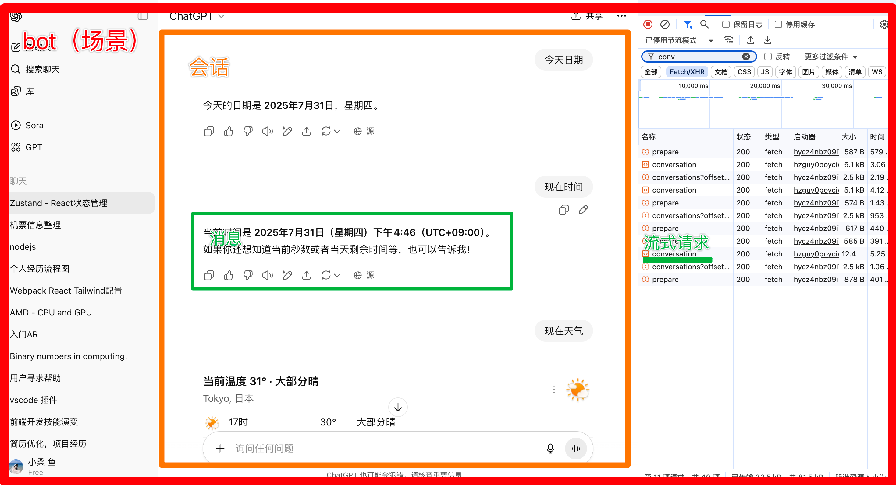
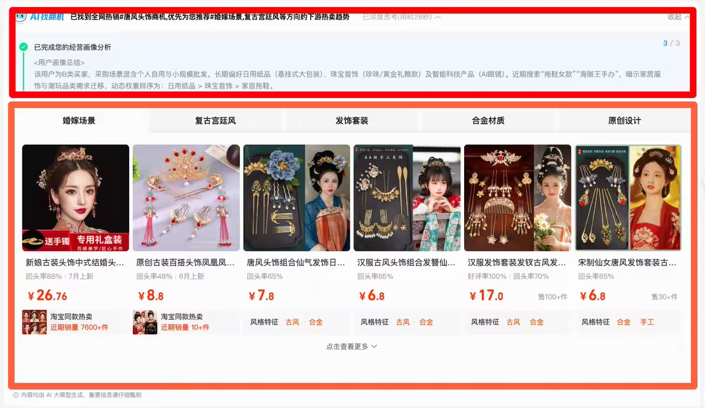
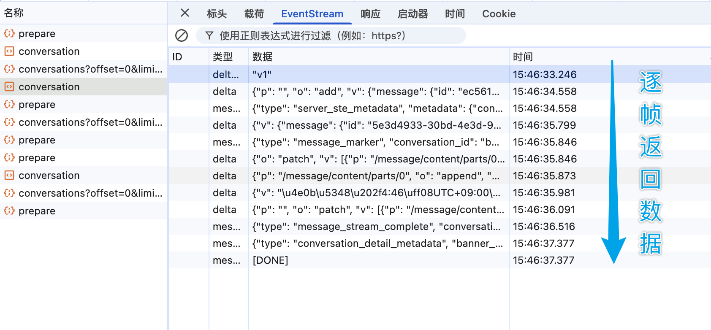
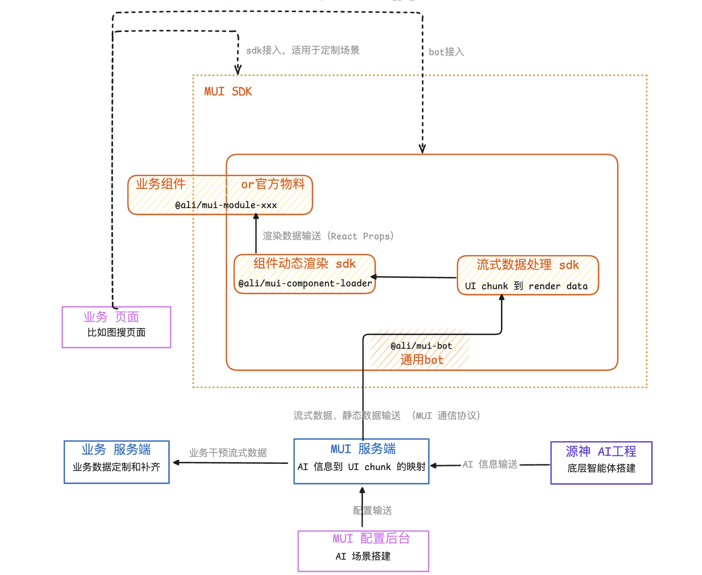
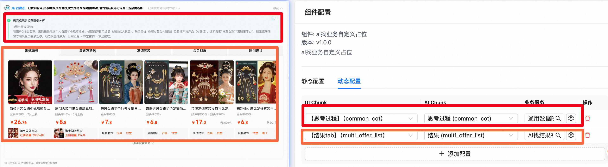
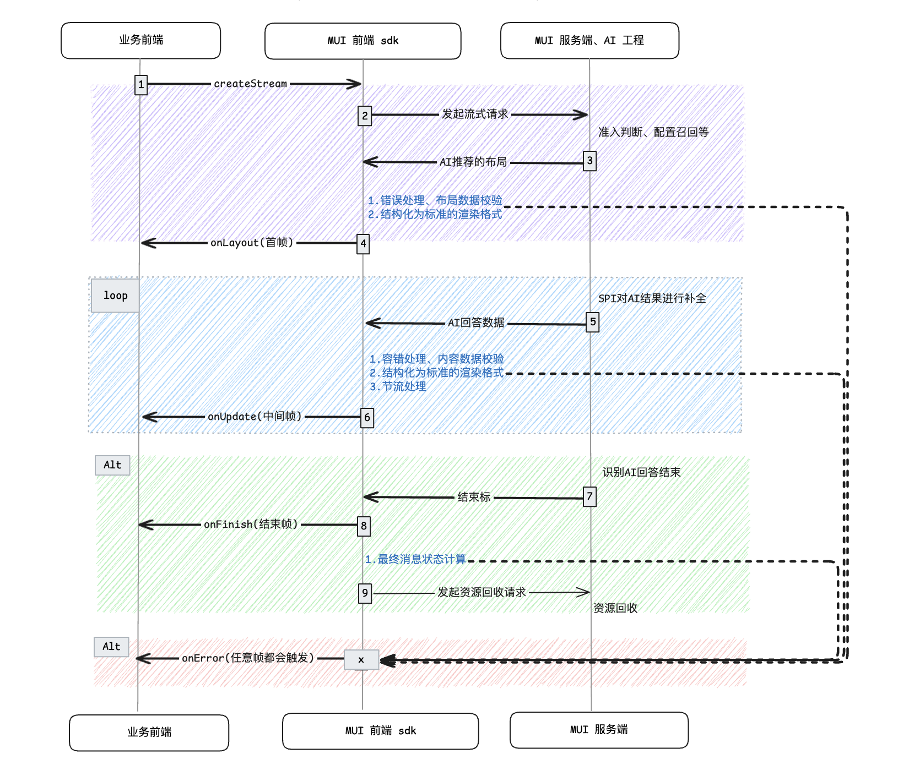
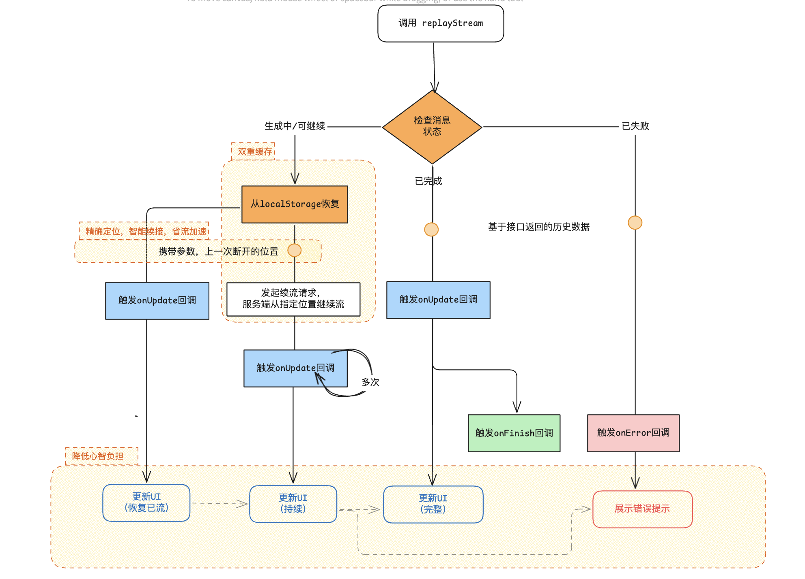
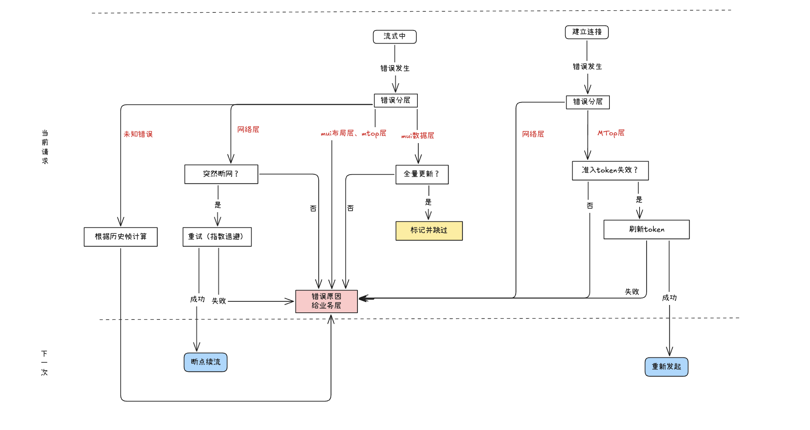

## 1.背景

介绍 MUI 之前，先简单了解一些概念  
提到 AI 应用，以 chatgpt 为例介绍基础概念

结合电商业务场景，通常一次消息需要渲染的内容会复杂的多，不会是纯文本，比如 AI 找一次消息

如果业务自己开发，直接对接模型返回的数据，需要消化的概念和需要处理的数据逻辑会很复杂，因为
传统请求与 AI 问答存在显著差异：


1. **流式数据特性**：模型生成内容是渐进式的，不像传统 API 一次性返回完整结果
2. **数据结构复杂**：原始内容直接拿来用就是 markdown，没办法渲染成丰富的 ui 形式
3. **智能编排复用**：不同业务使用的 AI 底层能力很有可能一样，如何复用而不用 AI 工程每次适配业务
4. **模型推 UI**：每个业务都想搞个类似 copilot，如何快速搭建出一个 bot，尽量复用已有的能力或者物料  
   **为了让业务开发像日常写个 React 组件那样丝滑，让底层能力高度复用，通用能力可插拔，让就产生了 mui**
   

   业务接入有两种形式，

- 高度定制时推荐使用 sdk 接入方式，mui 会处理好数据
- 简单通用场景可以走 0 代码搭建出一个 bot

## 2.demo 演示

目前三个落地的场景都是高度定制，通过 sdk 接入的  
以 AI 找为例，简单介绍一下使用流程

1. 平台上进行一系列配置，[跳转到天梭后台](场景详情链接待补充)
<!--  -->
2. [演示前台 demo 页面](链接待补充)，关注网络面板中的流式过程
<!-- 、、 -->
3. 业务前端实现（片段）

```tsx
export default function IndexPage() {
  /* step1 常规开发的本地状态 */
  const [status, setStatus] = useState<"wait" | "process" | "finish" | "error">("wait");
  const [itemList, setItemList] = useState<any[]>([]);
  const [stepItems, setStepItems] = useState<any[]>([]);
  const [staticConfig, setStaticConfig] = useState<any>(null);
  /* step2 AI问答能力的实例 */
  const { current: stream } = useRef(new Stream({ sceneCode: "SC_1f1445b21", bizType: "plugin_search_ai_find" }));

  const init = async () => {
    /* step2 调用实例方法发起问答 */
    stream
      .createStream({ bizParams: { query: "适合夏天汉服的轻盈头饰" } })
      .onLayout((layout) => {
        setStatus("process");
        setStaticConfig(layout?.[0]?.staticConfig);
      })
      .onUpdate((compsInfo) => {
        /* step3 刷新本地状态，数据驱动渲染 */
        setItemList(compsInfo?.[0]?.streamData?.multi_offer_list?.data || []);
        setStepItems(compsInfo?.[0]?.streamData?.common_cot?.cotStepList || []);
      })
      .onFinish((e) => {
        setStatus("finish");
      })
      .onFail((e) => {
        setStatus("error");
      });
  };

  useEffect(() => {
    init();
  }, []);

  const firstCategoryOffers = itemList[0]?.subItemList || [];
  return (
    <div className="test-page">
      <div className="contentContainer">
        {status !== "wait" && (
          <>
            <GuideHeader data={staticConfig} />
            <h3>分析步骤</h3>
            <SimpleSteps steps={stepItems} />
          </>
        )}
        {status === "finish" && (
          <>
            <h3>AI找商机结果</h3>
            <Result categories={itemList} />
          </>
        )}
        {status === "error" && <Error />}
      </div>
    </div>
  );
}
```

4. 修改天梭后台的配置，前台 demo 页面刷新生效

## 3.实现方案

从前端 sdk 切入（部分核心），来分享一下 mui 中的核心设计思想和能力

- 实例属性
  | 名称 | 含义 |
  |---------|---------|
  | messageInfo | 消息详情包含 id 和状态等 |
  | componentsInfo | 包含布局信息和渲染数据 |

- 实例方法
  | API 名称 | 使用场景 | 返回值 |
  |---------|---------|---------|-------|
  | createStream | 创建新的消息 | 当前 stream 实例 |
  | replayStream | 重放消息（恢复中断的流、显示流完的历史消息） | 当前 stream 实例 |
  | abortStream | 中断当前消息 | void |

- 监听事件/生命周期 hook  
  调用示例（伪代码）：new Stream().createStream().onStart(callback)

  | Event 名称 | 触发时机                     |
  | ---------- | ---------------------------- |
  | onStart    | 开始响应                     |
  | onLayout   | 响应了布局信息               |
  | onUpdate   | 数据更新事件（后续每帧数据） |
  | onFinish   | 消息正常结束                 |
  | onFail     | 消息失败                     |

### 3.1 createStream & 分层流式数据协议

分层的数据协议，简单理解就是对于 onLayout、 onUpdate、onFinish（结合时序图和 demo，createStream 触发流式请求，然后触发生命周期中几个重要的事件）

> 

**这样设计的原因：**

- 动态 UI 架构 - 我们采用模型驱动的动态 UI 架构，AI 会实时输出结构化的 UI 描述，决定展示哪些组件、怎样排列。而前端这边，我们用了一套基于微模块的组件体系，可以按需加载不同的组件，实现灵活组合和渲染。
<!-- layout:是因为我们的目标 model 动态判断 ui，比如在 AI 找的场景中，你让它找商机，它就返回一个比较复杂的布局，有 tab 类目，每个类目下有商品卡片等；比如你让它在这些中就选中最好的一个商品，那它可能就返回一个文案和表格，罗列优缺点等等。 -->
- 抹平流式复杂度 - 拆解数据和 UI，产生最小数据单元（AI chunk）和最小渲染单元（UI chunk）。通过 chunk 映射的机制，mui 这一层把对数据输分发到对应的组件，业务开发无需感知数据分帧到达过程。经过拆解就更加原子化，有利于复用和编排。
  <!-- 如果不拆解，就很难复用，AI每次都要配合业务开发。如果没有前端sdk这一层，那每个业务前端都得写if（xxx）渲染某一小块ui，就是sdk里面进行数据组装的代码，每个业务都得写一遍 -->
  [详细解释](./static/Snipaste_2025-08-02_18-30-54.png)
  [映射关系](./static/Snipaste_2025-07-21_15-16-33.png)

**对比传统优势**
|传统方式 | MUI 方式 |
| ---------- | ---------------------------- |
|业务需手动解析每帧数据 |SDK 自动完成数据聚合|
|每个业务重复实现流式逻辑 |通用逻辑一次封装多次复用|
|强耦合 AI 返回数据结构 | AI 与 UI 解耦|

<!-- | 时间线 | 原始数据                     | sdk 内 stream.componentsInfo                                                                                                                  | 业务组件代码                                                                                               |
| ------ | ---------------------------- | --------------------------------------------------------------------------------------------------------------------------------------------- | ---------------------------------------------------------------------------------------------------------- |
| n-1    | `"为您精选了如下top3的商品"` | `[{ summaryText: "为您精选了如下top3的商品", offerList: [] }]`                                                                                | ` 如下代码片段无需感知流式......................... ` |
| n      | `"商品 id 有 1"`             | `[{ summaryText: "为您精选了如下top3的商品", offerList: [ {id: 1, imgUrl: "xxx.png"} ]}]`                                                     | `同上`                                                                                                     |
| n+1    | `"2，3"`                     | `[{ summaryText: "为您精选了如下top3的商品", offerList: [ {id:1, imgUrl: "xxx.png"}, {id:2,imgUrl: "xxx.png"}, {id:3, imgUrl: "xxx.png"} ]}]` | `同上`                                                                                                     |

```jsx
const ResultList = ({ streamData }) => (
  <ul>
    {streamData.offerList.map((item) => (
      <OfferItem data={item} />
    ))}
  </ul>
);
``` -->

### 3.2 replayStream & 断点续流的能力

#### 为啥有 replayStream

更复杂的 AI 应用场景可能还需要更多能力比如：

- AI 回答时可以暂停和恢复，类似播放歌曲那样
- 查看历史消息记录
- AI 回答太慢了，我关了页面（网络波动、意外刷新、多端同步），但希望下次进入能看到完整结果。

`replayStream`方法正是为解决这类问题设计

#### demo

1. [演示前台 demo 页面](链接待补充)，
2. 调用示例，和 createStream 一样，调用后也进入流式生命周期

```js
stream.replayStream({ msgId: "点击的那一条的消息id" }).onxxx; // 同上个demo
```

#### 怎么续流的

replayStream 通过**双重缓存机制**实现智能断点续流：


- 双重缓存策略

**本地缓存（localStorage）**：页面刷新、网络中断、实例销毁时，实时保存流式过程中的渲染数据和断点位置等关键信息
**服务端缓存**：持久化存储完整的流式数据帧，及时客户端断开，仍然保持接收 AI 数据

- 核心实现机制

**精确定位**：通过 `lastComponentChunkId` 参数，服务端能够精确定位到中断前的最后一个有效数据帧位置
**智能续接**：服务端只传输缺失的数据部分，避免重复传输已接收的内容
**统一 API**：无论哪种续流场景，业务层都使用相同的 `replayStream()` 方法，无需关心底层是继续流式还是展示历史数据

**SDK 内部自动处理**：

- 自动判断消息状态（生成中/已完成/已失败）
- 自动选择恢复策略（localStorage vs 服务端）
- 自动处理续流参数（lastChunkId）
- 自动触发对应的生命周期回调

#### 有什么价值

- 开发提效：业务方不需要维护复杂的「中断判断 + 重建 UI」逻辑，无论记录是否完整，开发者都只需要和 createStream 一样 onUpdate 就行；
- 用户体验提升：刷新 / 崩溃 / 切端场景依然保证「能看到完整回答」；

### 3.3 sdk 中的其他 API 和能力

- 准入控制  
  通过`getAccessToken` 支持实验和切流，自动刷新失效凭证，有效控制 AI 功能开放范围。

- 防抖更新  
  可配置的节流机制`new Stream({throttleUpdate: 300})`，合并高频数据帧更新，减轻业务 update 压力，减少性能损耗。

- 错误分层  
  
  五级精细化错误处理（网络/MTop 网关/布局/数据/渲染），通过完整的错误传播链管理体系，覆盖 12 种核心异常场景。基于精准定位技术（错误层级+位置溯源）与自愈式处理机制，实现差异化恢复策略，确保业务流畅度。

<!-- // 指数退避 + 随机抖动算法
private calculateRetryDelay(): number {
  const baseInterval = 1000; // 基础间隔1秒
  const maxInterval = 30000; // 最大间隔30秒
  const retryCount = this.retryHelper.getRetryCount();

  // 指数增长：2^retryCount * baseInterval
  const exponential = Math.pow(2, retryCount) * baseInterval;

  // 随机抖动：±30% 随机波动
  const jitter = exponential * 0.3 * (Math.random() > 0.5 ? 1 : -1);

  // 最终延迟 = 指数值 + 抖动值
  const delay = Math.min(exponential + jitter, maxInterval);

  debugConsole.info(`第${retryCount+1}次重试，延迟${delay}ms`);
  return delay;
} -->

- 监控体系

**通过分层抽象将复杂流式交互标准化，使业务开发聚焦核心逻辑，将稳定性、性能、体验保障下沉至 SDK 层实现。**

## 4.规划

1. **动态 UI 组合**：
   - AI 驱动 UI 组件动态编排
   - 基于场景的自动布局优化
   - 个性化 UI 生成
2. **自然语言搭建**：
   - "创建商品推荐页，包含分类过滤和热销排序"
   - 对话式界面配置
   - AI 辅助设计建议

## 总结

| 传统 AI 开发痛点              | mui 的解决思路                                   |
| ----------------------------- | ------------------------------------------------ |
| 流式数据难处理（渐进式返回）  | 分层数据协议 + 生命周期钩子（onLayout/onUpdate） |
| 数据结构复杂（原始 Markdown） | 结构化 UI 描述 → 动态渲染组件                    |
| 能力复用成本高                | 微模块组件体系 + 智能编排引擎                    |
| 快速搭建 Copilot 困难         | 支持 SDK 接入 + 0 代码搭建双模式                 |
