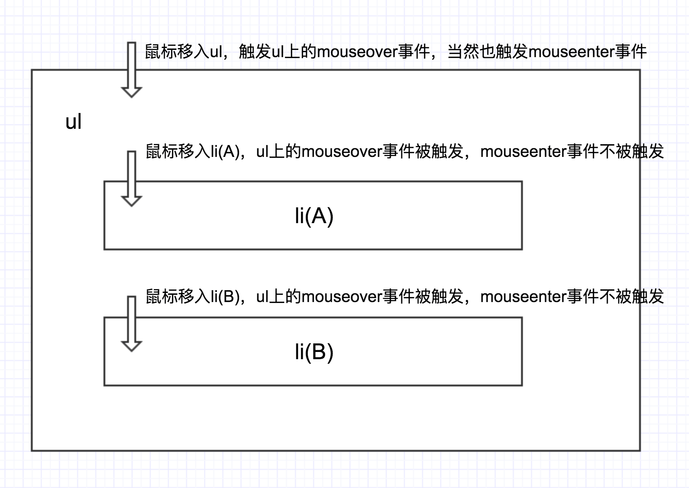

# DOM 对象
## DOM 是什么

DOM 是用来呈现 HTML 文档以及与 HTML 文档交互的 API,独立于平台与编程语言（如 js java）。DOM 数据结构的本质是树 DOM 树中每个节点的类型是 Node。

## 为什么

能够为所有的浏览器提供一致的方式,去创建、修改、删除文档中的节点。

## Node 和 Element，NodeList 和 HTMLCollection

- NodeList 是由 Node 组成的集合
- HTMLCollection 是由 Element 组成的集合
- Element 继承 Node 所以 Node 用的 Element 都可以用
- NodeList 是 likeArray 的对象
- 可以通过[index]和.item(index)方法访问集合中的某个元素
- NodeList 是静态集合，HTMLCollection 为动态集合

## 属性和方法

### 属性(用来表示 dom 直接的关系)

> 以下属性都是 readonly

| 返回 Node 类型  | 返回 Element 类型      |
| --------------- | ---------------------- |
| parentNode      | parentElement          |
| childNodes      | children               |
| firstChild      | firstElementChild      |
| lastChild       | lastElementChild       |
| nextSibling     | nextElementSibling     |
| previousSibling | previousElementSibling |

### 属性(用来 get 和 set 节点内容)

> 前两个只有 Element 类型才拥有

- innerHTML
- outerHTML
- innerText
- outerText
- textContent

### document.createElement()

> createElement 只能由 document 来调用

### 方法(用来获取 dom 节点)

> element 特有

| 名称                                    | 返回值是什么类型的对象 |
| --------------------------------------- | ---------------------- |
| getElementById(id:String)               | Element                |
| getElementByTagName(name:String)        | HtmlCollection         |
| getElementByClassName(className:String) | HtmlCollection         |
| querySelector(selector:String)          | Element                |
| querySelectorAll(selector:String)       | NodeLiist              |

> node.childNodes 和 element.children 分别返回 NodeList 和 HtmlCollection 类型

### 方法(用来操作 dom 节点)

| methods       | 参数类型                                                    |
| ------------- | ----------------------------------------------------------- |
| hasChildNodes | 无                                                          |
| contains      | Node                                                        |
| appendChild   | Node                                                        |
| append        | Nodes/DOMString(被当成文本节点处理)                         |
| removeChild   | Node                                                        |
| remove        | 无                                                          |
| insertBefore  | newChild:Node,referChild:Node                               |
| prepend       | newChild:Node/DOMString(被当成文本节点处理) referChild:Node |
| replaceChild  | newChild:Node,referChild:Node                               |
| cloneNode     |

## attribute 和 property 区分

- property 和 Node 实例对象的属性永远一致
- attribute 和标签上的显示永远一致
- 访问 property 可以直接通过 . 运算符
- 访问 attribute 通过 getAttribute() 方法

```js
const ele = document.createElement("div");
ele.title; //''
ele.getAttribute("title"); //null
```

> 有很多细节看笔记吧

## 事件

### 事件发展

- dom0
  ele.onclick = function(){}
- dom2
  ele.addEventListerner('click',function(){},false)
- dom3
  ele.addEventListerner('keyup',function(){},false)
  > 第三个参数 true 则是在捕获阶段触发 false 是在冒泡阶段触发 默认 false

## dom 事件模型和事件流

捕获阶段->目标阶段->冒泡阶段



### 描述 dom 事件捕获流程

- 捕获阶段
  window->document->html->body->...
  html = document.documentElement
  body = document.body
- 目标阶段
- 冒泡阶段
  与捕获反向

### Event 对象的常见应用

- 阻止默认事件 ：event.preventDefault()
- 停止冒泡 ：event.stopPropagation()
- 事件响应优先级 ：event.stopImmediatePropagation()
  - 同一个 dom 同一个类型 click 注册了两个事件 a b，a 里面执行它 则不继续触发 b
- 当前所响应的元素(事件绑定在谁上) ：event.currentTarget
- 当前被点击的元素 ：event.target

#### 事件代理(委托)

- 基本应用：列表的点击
- 适合用事件委托的事件：click，mousedown，mouseup，keydown，keyup，keypress。值得注意的是，mouseover 和 mouseout 需要经常计算它们的位置，代理起不太容易。
- 不适合的很多，例如，mousemove，每次都要计算它的位置，非常不好把控。还有，focus，blur 之类的，本身就没冒泡的性，自然就不能用事件委托了。

```js
$("#test").click((e) => {
  console.log(e);
  if (e.target && e.target.nodeName == "LI") {
    console.log("li click");
  } else {
    let target = e.target.parentNode;
    while (target.nodeName !== "ul") {
      if (target.nodeName == "LI") {
        console.log("li click because propo");
        break;
      }
      target = target.parentNode;
    }
  }
});
```

#### 下拉框

下拉框的一般做法， 是把下拉面板放在容器元素内部，通过绝对定位将元素展示出来，通过 z-index 控制元素浮在其他元素上层

> 此时在页面上任意一处的点击事件， 都应关闭下拉框， 但是面板内点击不会关闭弹出面板， 我们会在 document 上注册一个 click 事件， 当这个事件被触发的时候， 关闭面板， 根据事件冒泡原则， 在面板上点击， 最终也会冒泡到 document 上， 同样会关闭面板，这是我们不想要的， 那么我们会在面板上也注册一个事件， 触发的时候调用 stopPropagation， 阻止冒泡， 那么点击面板的时候， 由于事件不会冒泡到 document， 则不会关闭面板， 这个结果是我们需要的。

> 但是此时还有另外一个问题， 如果有其他元素也阻止了事件冒泡， 那么界面上会出现点击其他元素而下拉面板不关闭的情况， 此时， 我们可以将 document 的事件注册在捕获阶段， 这样其他元素是无法阻止事件传播到 document 上， 当然， 面板也无法阻止， 此时就需要判断 target 了， 如果 target 在面板内部， 不关闭， 否则关闭。 会显得比上一个方法要麻烦一点， 但是效果是最好的， 这里是一个取舍的问题。
#### mouseover 和 mouseenter
父子元素，子元素在父元素中间
父over-父enter-父out-子over-子out-父over-父out-父leave
### 自定义事件

```js
//定义test事件
const customEve = new Event("test");
// const customEve = new Event('test',someObj);
// 也可以用 CustomEvent , 区别是 CustomEvent 有两个参数可以接收
ele.addEventListener("test", () => {
  console.log("test event");
});
//触发test件
ele.dispatchEvent(customEve);
```

## 面试题
- 获取页面上哪个元素最多
``` js
const elements = document.getElementsByTagName('*');
// 2.遍历、计数
// 3.找到最多的
```
