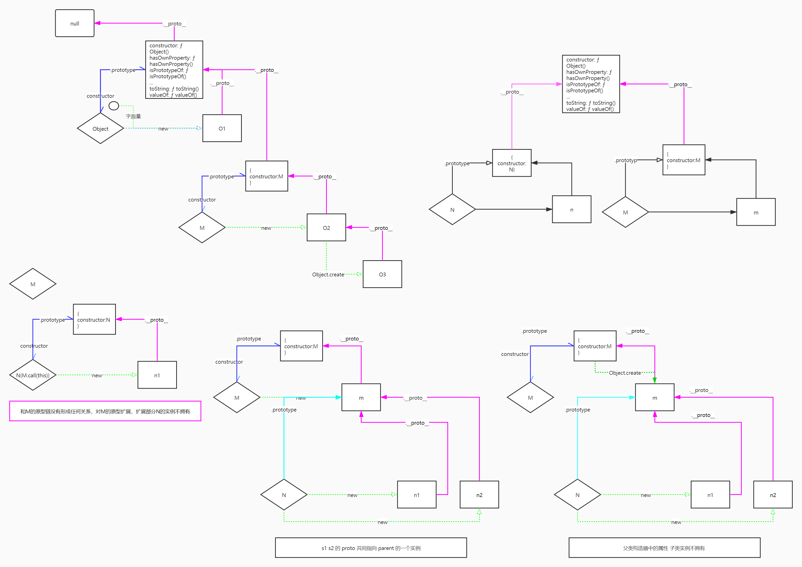

<!--
 * @Author: 鱼小柔
 * @Date: 2020-11-15 21:35:29
 * @LastEditors: your name
 * @LastEditTime: 2021-06-06 12:09:50
 * @Description: file content
-->

# 原型链

## 为什么
实现继承


## 什么是原型链

  
通过  prototype、 \_\_proto\_\_ 、constructor 的关系来看  

- 非函数的对象没有 prototype 属性，只有\_\_proto\_\_属性
- 函数既有 prototype 又有\_\_proto\_\_属性

```js
// 既定关系
Object.prototype.__proto__ === null;
Function.prototype === Function.__proto__;
```

- Object.create(null) 生成的对象没有 prototype、\_\_proto\_\_

- 所有的对象都是 Object 实例
- 所有的函数都是 Function 实例

- Object 本身也是个函数所以

```js
Object instanceof Function; //true
Object.__proto__ === Function.prototype; //true
```

- Function.prototype 本身是个对象所以

```js
Function.prototype instanceof Object; //true
Function.prototype.__proto__ === Object.prototype; //true
```

```js
// instanceof 含义：the presence of constructor.prototype in object's prototype chain.
// 假如
function A() {}
const a = new A();
// 形成关系1
a.__proto__ === A.prototype;
A.prototype.__proto__ === Object.prototype;
// instanceof
a instanceof A;
A.prototype instanceof Object;
A instanceof Object;
// 形成关系2
A.__proto__ === Function.prototype;
// instanceof
A instanceof Function;
// Object 本身是个函数所以有 关系3
Object.__proto__ === Function.prototype;
Function.prototype.__proto__ === Object.prototype;
// instanceof
Object instanceof Function;
Function.prototype instanceof Object;
Function instanceof Object;
```

```js
let a = {};
let b = Object.create(Object.prototype);
let c = new Object();
// a 和 b 的效果是等价的 a.__proto__=== b.__proto__=== c.__proto__ === Object.prototype
```

## 构造函数创建对象具体过程

1. 创建一个对象挂在构造器的原型上
2. this 绑定
3. 构造函数有返回值 k 并且是对象则返回 k 否则返回 o

```js
// new 过程
const myNew = function(constructor) {
  let o = Object.create(constructor.prototype); // 创建一个对象挂在构造器的原型上
  // 相当于 let o = {} o.__proto__ = constructor.prototype
  const k = constructor.call(o); // this 绑定 运行 constructor 函数体
  if (typeof k === "object") {
    // 构造函数有返回值 k 并且是对象则返回 k
    return k;
  } else {
    // 否则返回 o 此时的 o 已经作为 构造函数的上下文执行过了 不是空对象
    return o;
  }
};
```
