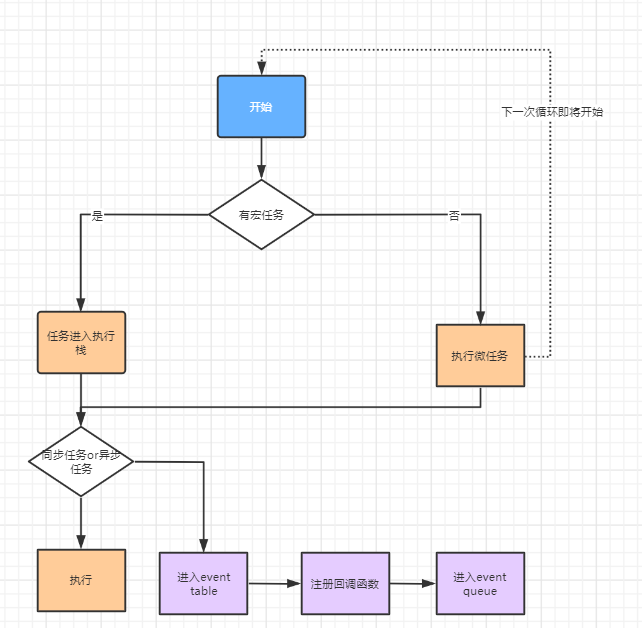

<!--
 * @Author: 鱼小柔
 * @Date: 2020-11-15 17:33:52
 * @LastEditors: your name
 * @LastEditTime: 2021-06-06 12:35:31
 * @Description: file content
-->

# 事件轮询

[事件轮询【参考资料】]('https://www.cnblogs.com/dong-xu/p/7000163.html)

## 为什么要有宏任务、微任务

更好的控制事件优先级和执行顺序，提高性能和响应性

### 深刻理解

需要时间等待的微任务就直接作为宏任务就好了呀，不需要等待的直接执行就好了呀。还是觉得微任务没啥用？  
当我们遇到一个需要等待的操作（如网络请求、定时器等）时，我们通常会使用异步编程模型，将这个操作放在一个回调函数中，然后将这个回调函数放入事件队列中，等待操作完成后再执行。这样，主线程就可以继续执行其他的任务，不会被阻塞。

然而，这种模型有一个问题，那就是回调函数的执行时间是不确定的，它取决于事件队列中的其他任务。为了解决这个问题，JavaScript 引入了微任务。

微任务允许我们在当前任务结束后、下一个任务开始前，插入一些额外的任务。这意味着，我们可以确保微任务在当前任务结束后立即执行，而不需要等待事件队列中的其他任务。

例如，Promise 就是利用微任务来实现的。当我们调用 Promise.resolve().then(callback) 时，callback 会被放入微任务队列，等待当前任务结束后立即执行。这使得我们可以更好地控制代码的执行顺序，提高性能和响应性。

## 宏任务 微任务

- 宏任务：setTimeout、setInterval、immediate、I/O （后两个是 node 的）
- 微任务：Promise.then、MutationObserver、IntersectionObserver
  > MutationObserver 是用来监视 DOM 变化的 API。当你创建一个 MutationObserver 并使用它来监视某个 DOM 节点时，每当这个节点或其子节点发生变化时，你指定的回调函数就会被调用。这个回调函数是一个微任务，它会在当前宏任务结束后，下一个宏任务开始前执行。  
  > IntersectionObserver 是用来监视元素与其祖先元素或视口（viewport）相交状态的 API。当你创建一个 IntersectionObserver 并使用它来监视某个元素时，每当这个元素的相交状态发生变化时，你指定的回调函数就会被调用。这个回调函数也是一个微任务，它会在当前宏任务结束后，下一个宏任务开始前执行。  
  > Promise 中有请求，成功的时候 resolve，那么它是一个宏任务。浏览器原生的 Promise.then 是微任务

## 轮巡过程



## 考点

```js
// 3、end、2、4
// 如果去掉 resolve（2） 这行则打印 3、end、4、1
let p = function () {
  return new Promise((resolve) => {
    const p1 = new Promise((resolve) => {
      setTimeout(() => resolve(1), 0);
      resolve(2);
    });
    p1.then(console.log);
    console.log(3);
    resolve(4);
  });
};
p().then(console.log);
console.log("end");
```
