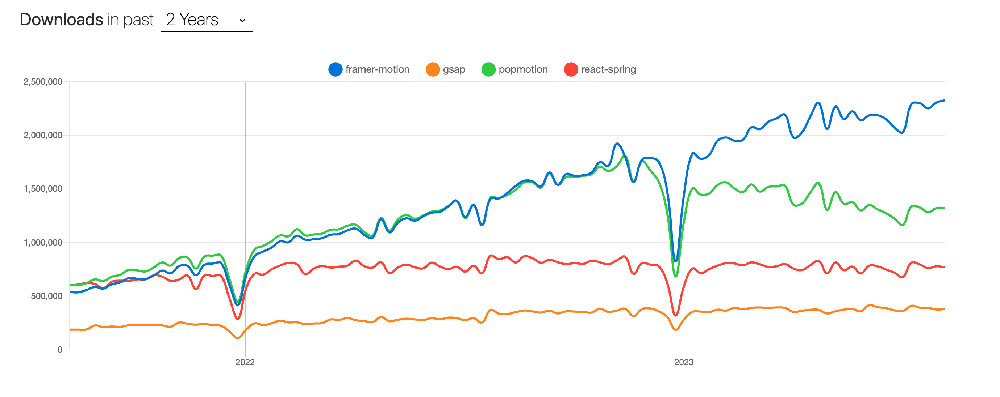
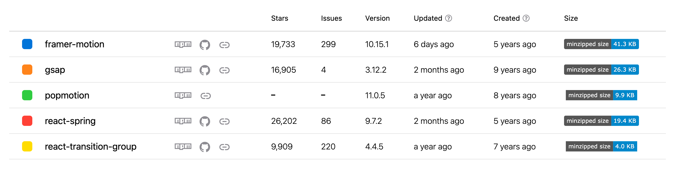
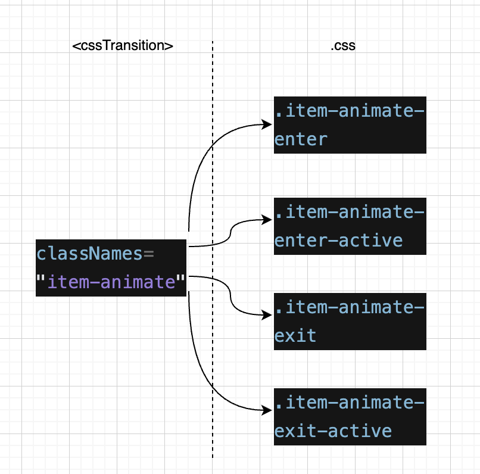

# React 动画库

面向用户的客户端，动画是提升用户体验重要的一环，今天就来说说 React 中可用的动画库吧(＾＿－)。

## 简单对比

##### 调研了一下 star >≈10k、仍在维护的动画库在 npm 上的情况如下




> react-transition-group 的下载量是远超于其他库的

##### 能力概览如下

✔️ 支持、很好 👍、还行 👌、弱 👎、无 ✖️、需要插件 🔌、不知道 🤔

| -                      | 物理 | 3D  | hook | 浏览器兼容性 | 手势 | 滚动驱动 | svg 变形 | ts  | React Native | 非 react 可用 |
| ---------------------- | ---- | --- | ---- | ------------ | ---- | -------- | -------- | --- | ------------ | ------------- |
| react-transition-group | ✖️   | ✖️  | ✖️   | 👍           | ✖️   | ✖️       | ✖️       | ✖️  | 👎           | ✖️            |
| React Spring           | ✔️   | 🔌  | ✔️   | 👍           | 🔌   | ✔️       | 🤔       | 👍  | 👍           | ✖️            |
| Framer Motion          | ✔️   | 🔌  | ✔️   | 👎           | ✔️   | ✖️       | ✔️       | 👍  | ✖️           | ✖️            |
| gsap                   | 🔌   | ✖️  | ✖️   | 👍           | ✖️   | ✔️       | ✔️       | 👎  | 👍           | ✔️            |
| popmotion              | ✔️   | ✖️  | ✖️   | 👌           | ✖️   | ✖️       | ✖️       | 👍  | 👍           | ✔️            |

> 这几个性能都 OK 的，moti 和 Framer Motion api 很像，可以在 React Native 中使用。

### react-transition-group

- 与 React 无缝集成；简单易用；轻量；性能和兼容性也好。
- 只支持简单的动画，无法细粒度控制，无物理效果。

### React Spring 的特点

- 与 React 无缝集成；涵盖了用户界面所需的大多数动画，灵活易用，细粒度控制；性能尚佳；跨浏览器和跨设备的兼容性也不错；社区也是比较完善的，有文档、有示例、有插件。
- React Spring 的不足在于体积较大，上手不太容易。

### Framer Motion

- React Spring 与 React 无缝集成；动画效果丰富且高度可定制，更少的代码更炫的效果；性能尚佳；社区也是比较完善的，有文档、有示例、有插件；对体积较大进行了优化，可以按需加载。
- 不足之处就是兼容性不太好，需要时间学习较多的概念。

### gsap

- 非为 React 打造； gasp 是通过时间线进行补间动画的，自带滚动监听；性能也好；兼容性跨平台性很好；有文档和庞大的插件生态系统。
- 但是上手难，非完全开源免费；

> 与 React Spring 和 Framer Motion 不同，gsap 是基于时间的（准确的说，依赖于 React 的逐帧渲染），更像 css 的 keyframe，而基于物理的是不需要设置时间的。

### popmotion

- 非为 React 打造；更像运动引擎，支持帧、弹簧等物理模式；兼容性跨平台性比较好；轻量；
- 直接做动画效果需要自己封装，不算易用，更偏底层。
  > frame-motion 的运动引擎就是 popmotion

### 如何选择？

react 项目中，

- 只是简单的动画淡入淡出，不强调交互与物理，react-transition-group 就够了。
- 重交互重物理的动画首要考虑 frame-motion，封装的更丰富，用起来更高效。
- 强调物理且需要自由度和细粒度更高的，React Spring 是不错的选择。
- gsap 虽然也强大并且高性能，但是在 react 中用确实不方便，不推荐。
- popmotion 属于只有运动，无交互，也不推荐。

## 用法对比

列出一些基础用法，maybe 可以从使用上感觉到框架设计风格的迥异，在能够达到需求的基础上选择自己喜欢的框架～
>  React Spring 和 Framer Motion 都很厉害，一下子学不完，再次强调这篇就是 基础用法 感受风格 

### react-transition-group

这里用一个列表动画举[例子](https://codesandbox.io/s/zen-brook-z95wdv?file=/src/TransitionEg/index.jsx)，添加的项目从下侧滑入，删除的项目从左侧滑出

1. 用 CSSTransition 包裹要执行动画的组件，用 TransitionGroup 包裹多个 CSSTransition
2. 设置关键属性： classNames、timeout、unmountOnExit

```jsx
<TransitionGroup className="todo-list">
  {items.map(({ id, text }) => (
    <CSSTransition
      key={id}
      timeout={500}
      classNames="item-animate"
      unmountOnExit
    >
      <div className="todo-list-item">
        <button className="cancel" onClick={() => delItem(id)}>
          ×
        </button>
        <span className="text">{text}</span>
      </div>
    </CSSTransition>
  ))}
</TransitionGroup>
```

3. 编写 css 代码

```css
.item-animate-enter {
  transform: translate(0, 50px);
  opacity: 0.01;
}
.item-animate-enter-active {
  transform: translate(0, 0);
  opacity: 1;
  transition: all 300ms ease-out;
}
.item-animate-exit {
  transform: translate(0, 0);
  opacity: 1;
}
.item-animate-exit-active {
  transform: translate(-50px, 0);
  opacity: 0.01;
  transition: all 300ms ease-out;
}
```

**注意到了吗？**  


- CSSTransition 拥有 item-animate 类名，而 .css 代码中是类名是 item-animate-enter、item-animate-enter-active、item-animate-exit、item-animate-exit-active，对应着 todo-list-item 的不同动画状态。todo-list-item 将在加入列表时类名将从 -enter 到-enter-active；从列表移除时类名将从 -exit 到-exit-active，具体的动画效果就去取决于我们自己编写的 .css 代码。
- 注意 .css 中的 transion-duration 应该 <= CSSTransition 的 timeout ，否则动画未执行完就会突变为目标样式。
- unmountOnExit 为 true 时，组件在退出动画执行完毕后会被卸载，否则会保留在 dom 中。

其他用法和 TransitionGroup + CSSTransition 用法类似，内核都是显隐于类名挂钩，然后通过 css 控制动画效果。比如单独用 CSSTransition 控制元素显隐（也可能是加载与卸载）和 TransitionSwitch + CSSTransition 控制两个节点切换

### React Spring

React Spring 内容比较多，这里就用一个最基础的 useSpring Hook 举[例子](https://codesandbox.io/s/zen-brook-z95wdv?file=/src/TransitionEg/index.jsx)。

> ✨ [系统讲解 API 可以看这篇](https://juejin.cn/post/6872606363478933517)，比官方文档好理解。

1. 需要发生动画的节点用 animate.xxx 表示，animate 本质上是一个 HOC，用来包裹 xxx，返回的是一个带有动画效果的组件。

```jsx
<animated.div
// ...
/>
```

2. 使用 useSpring ，useSpring 是其余的 api 的基础，它接收的参数 props 有几种形式，返回的对象 object 可以直接用在组件的 style 属性上。

```jsx
const props = useSpring({
  // ...
});
```

3. 在 animate.xxx 与 object 连接。

```jsx
export default function App() {
  const [open, toggle] = useState(false);
  const props = useSpring({ width: open ? 200 : 0 });
  //width(准确的说是width的目标值) 受 open 控制，
  
  //变化的过程并不触发 react 重新渲染，而是直接改变 dom 节点
  //变化的过程不是随着时间平均过渡，而是像弹簧一样，如果要明确运动周期，则config只配置easing和duration。
 

  return (
    <div className={styles.container}>
      <div className={styles.main} onClick={() => toggle(!open)}>
       {/* width 改变， animated.div 朝着目标值去变化，可以获取到变化中的 width */}
        <animated.div className={styles.fill} style={props} />
        <animated.div className={styles.content}>
          {props.width.to((x) => x.toFixed(0))}
        </animated.div>
      </div>
    </div>
  );
}
```

### FramerMotion

在 Framer Motion 中，有三种元素变化模式，分别是 Tween（补间动画）Spring（弹性），Inertia（惯性）。不同模式的参数配置是不同的，这里的[例子](https://codesandbox.io/s/react-dong-hua-ku-z95wdv?file=/src/FramerMotionEg/index.jsx)是 Spring 模式最基础的用法，主要是 animation 和 transition 属性。（为了能够和 React Spring 对比，特意实现了相似的动画）

> ✨ 也有个[宝藏文档](https://motion.framer.wiki/basic-anilogic)，适合系统的学习 Framer Motion，它的用法比 Spring 还多！

1. 需要发生动画的节点用 motion.xxx 表示
2. 使用 animation 和 transition 属性， transition.type 设置运动模式我们的例子中用的是 spring，不同模式下 transition 的配置形式不同。

```jsx
export default function App() {
  const [open, toggle] = useState(false);
  //width 的值受 open 控制，

  //变化的过程并不触发 react 重新渲染，而是直接改变 dom 节点
  

  return (
    <div className={styles.container}>
      <div className={styles.main} onClick={() => toggle(!open)}>
        <motion.div
          className={styles.fill}
          // width 发生改变时，就会触发 motion.div ，变化过程中的width我们拿不到
          animate={open ? { width: 200 } : { width: 0 }}
          // 支持交互配置
          whileHover={{
            background: "linear-gradient(180deg, #f08, #d0e)",
          }}
          //变化的过程不是随着时间平均过渡，而是像弹簧一样，也可以配置 duration ，duration 与 一系列弹簧物理系数的配置之间会有优先级的关系不会同时全部生效
          transition={{
            type: "spring",
            bounce: 0.6,
            volocity: 1.5,
            stiffness: 80,
          }}
        />
      </div>
    </div>
  );
}
```

**vs 一下 ？**
- 🎼 React Spring 和 Framer Motion 有一些相似之处，比如 animated.xxx 和 motion.xxx 就有异曲同工之妙，都可以通过绑定属性变化来触发运动
- ⚙️ 对于弹簧的运动方式，都支持配置一系列的物理参数。此时 duration 的使用是有限制性的
- ☝️ 都不依赖 React 渲染
- 🧶 🪢 写法上 Framer Motion 好像更简洁，更偏向配置，甚至可以直接通过 whilexxx 配置交互
- 🎵 🎶 Framer Motion 除了弹簧模式，还有补间和惯性的方式
- 📨 📧 React Spring 简单用法通过 useSpring 返回的 props 可以拿到变化中的值，Framer Motion 的简单用法变化中的值是个黑盒，不过 Framer Motion 的一些高级 hook 可以拿到
- 再对比 transition-group，transition-group的动画触发条件都是数据的变化->元素的渲染与卸载，使用面更窄，没有物理和交互的能力。


## 参考

- [Medium · Which React Animation Libraries to Use in 2023](https://javascript.plainenglish.io/react-animation-libraries-in-2023-daec149d7280)
- [官网 · react-transiton-group](https://reactcommunity.org/react-transition-group/)
- [官网 · React Spring](https://www.react-spring.dev/)
- [官网 · Framer Motion](https://www.framer.com/motion/)
- [发现宝藏：frame-motion 中文文档](https://motion.framer.wiki/introduction)
- [官网 · gsap](https://greensock.com/gsap/)
- [官网 · popmotion](https://popmotion.io/)


