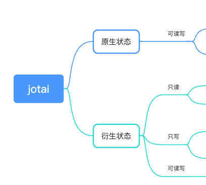

状态管理的学习又续上了，死磕 React 状态管理到底！ jotai 现在也获得了很多人的喜爱，是 React-context 的完善版（解决 Provider 嵌套和 re-render），是 Recoil 的简化版。和 Recoil 理念一致，都是“原子化”。现在开始！！！
[完整示例](https://codesandbox.io/s/react-zhuang-tai-guan-li-xue-xi-dglmj8?file=/src/by-zustand/main.tsx)

## 特点

#### 用起来感觉（和 zustand 比好的 ✔️，差的 ✖️）

- 🤗 与时俱进：积极拥抱 hooks
- 🫧 简洁无比：不需要使用 context providers 包裹应用、✔️ 不用 selector 映射 state
- 😊 门槛低：心智负担比较低 atom、useAtom 够用，又神似 useState
- ⚛️ 原子化：✔️ 天然 re-render 优化，不需要借助外部在组件中手动处理
- 💝 可以持久化（存到 localStorage）
- 🔌 可扩展（插入中间件）
- 🚧 ✖️ 外部不可用，只能组件中用
- 📑 没有 action 的概念，✖️ 复用性差一些

#### 原理架构上

与 redux、zustand 完全不同的设计理念，基于 react-context 的穿透能力把状态以原子形式分散到 React 内部全局。而 Zustand 状态 在 React 之外的 store 中，通过 hook 进行外部与 React 的连接。

- atom.ts 导出 atom 方法，用来存入状态配置即“原子”。
- store.ts 是实际的状态管理层，实现“原子”到状态的映射，管理状态之间的依赖关系，实现状态的增删改逻辑。向外部暴露状态的读 get、写 set、订阅 sub 的方法。
- useAtomValue.ts 执行 sub 注册 listener，通过 rerender 对组件进行重渲染。
- useSetAtom.ts 主要逻辑就是返回 store.set 的能力。
- useAtom.ts 就是返回 [useAtomValue(),useSetAtom()] 了啦。

## 使用

#### 类型

atom 可以细分为以下几种类型：  
  
具体区别要结合下面定义和使用 atom 的代码来看

#### 定义 atom

每一种 atom 定义的时候都有一个固定的格式

- todoStore.js

```ts
import { atom } from "jotai";

/* 原生 */
export const todoListState = atom([]);
/* 只读 */
export const todoTotalState = atom((get) => get(todoListState).length);
/* 只写 */
export const todoListQuery = atom(null, async (get, set, payload) => {
  const list = await queryMockList();
  set(todoListState, list);
});
/* 读写 */
export const testDriveReadAndWrite = atom(
  (get) => {},
  async (get, set, payload) => {}
);
```

#### 使用 atom

使用的时候也有固定格式

- List 列表组件

```tsx
const List = () => {
  console.log("=======list render ======");
  /* 原生atom，使用时类似useState，
  只需要set函数的时候建议用 useSetAtom，
  只需要值的时候可以用 useAtomValue */
  const [todoList, setTodoList] = useAtom(todoListState);
  /* 只读的衍生atom,用法 */
  // const [todoTotal] = useAtom(todoTotalState); //也ok
  const todoTotal = useAtomValue(todoTotalState);
  /* 只写的衍生atom，用法 */
  // const [_,queryTodoList] = useAtom(queryTodoList); //也ok
  const queryTodoList = useSetAtom(todoListQuery);
  const deleteTodoItem = (id) => {
    setTodoList(todoList.filter((item) => item.id !== id));
  };
  const editTodoItem = (id) => {
    setTodoList(todoList.map((item) => (item.id === id ? { ...item, content: "random" } : { ...item })));
  };
  useEffect(() => {
    console.log("======= list useEffect []   ======");
    queryTodoList();
  }, []);

  return (
    <section>
      <span>（共{todoTotal}条）</span>
      <ul>
        {todoList.map((item) => (
          <li key={item.id}>
            <span>{item.content}</span>
            <button
              onClick={() => {
                deleteTodoItem(item.id);
              }}
            >
              ✔️
            </button>
            <button
              onClick={() => {
                editTodoItem(item.id);
              }}
            >
              ✏️
            </button>
          </li>
        ))}
      </ul>
    </section>
  );
};
```

- Header 用来新增 todo

```tsx
const HeaderOne = () => {
  console.log("=======HeaderOne render ======");
  // const [todoList, setTodoList] = useAtom(todoListState); //会触发 HeaderOne render
  const setTodoList = useSetAtom(todoListState); //HeaderOne 不 render, 起到性能优化的作用

  const addTodo = () => {
    const content = document.getElementById("todo-input").value;
    setTodoList((prev) => [...prev, { content, id: new Date().getTime() }]);
  };
  return (
    <section>
      <input id="todo-input" type="text" />
      <button onClick={addTodo}>➕</button>
    </section>
  );
};
```

- Root

```tsx
const rootElement = document.getElementById("root");
const root = createRoot(rootElement);
root.render(
  <StrictMode>
    <div className="App">
      <h1>使用了jotai</h1>
      <h2>添加一个待办</h2>
      <HeaderOne />
      <Suspense fallback={<div>加载中。。。</div>}>
        <h2>待办列表</h2>

        <List />
      </Suspense>
    </div>
  </StrictMode>
);
```

## 源码分析

学艺不精呀，只能了解一个粗略的流程，没办法实现一个简易版的 jotai  

1. 调用 atom

- - 接收两个参数，分别用于 ① 读取/初始状态 ② 写入状态相关（下文简称 readFn/initialValue，writeFn）
- - 得到一个状态配置，下文简称 **“原子”**

```ts
export function atom<Value, Args extends unknown[], Result>(
  read: Value | Read<Value, SetAtom<Args, Result>>,
  write?: Write<Args, Result>
) {
  const key = `atom${++keyCount}`; //不需要像 Recoil 那样指定 key， 内部生成
  const config = {
    toString: () => key,
  } as WritableAtom<Value, Args, Result> & { init?: Value };
  if (typeof read === "function") {
    config.read = read as Read<Value, SetAtom<Args, Result>>;
  } else {
    config.init = read;
    config.read = (get) => get(config);
    config.write = ((get: Getter, set: Setter, arg: SetStateAction<Value>) =>
      set(
        config as unknown as PrimitiveAtom<Value>,
        typeof arg === "function" ? (arg as (prev: Value) => Value)(get(config)) : arg
      )) as unknown as Write<Args, Result>;
  }
  if (write) {
    config.write = write;
  }
  return config; // 返回配置
}
```

2. 组件中调用 useAtom 或 useAtomValue 或 useSetAtom

- - 传入刚刚定义的“原子”

3. 内部经过 useAtomValue/useSetAtom/依次调用 useAtomValue 和 useSetAtom -> useStore -> useContext 的逐层调用拿到 store（真正的状态容器）
4. 如果 store 里没数据，说明是首次调用，继续调用 createStore 进行 store 的初始化；否则直接到 step 6.
5. store 中用 WeakMap 这种数据类型来维护原子到状态的映射，store 暴露给外部 get、set、sub 方法

```ts
export const createStore = () => {
  const atomStateMap = new WeakMap<AnyAtom, AtomState>();
  const mountedMap = new WeakMap<AnyAtom, Mounted>();
  const pendingMap = new Map<AnyAtom, AtomState /* prevAtomState */ | undefined>();
  let storeListenersRev1: Set<StoreListenerRev1>;
  let storeListenersRev2: Set<StoreListenerRev2>;
  let mountedAtoms: MountedAtoms;
  //...
  // readAtom、getAtomState、writeAtom、setAtomState、subscribeAtom 等操作 store 的方法
  //...
  return {
    get: readAtom,
    set: writeAtom,
    sub: subscribeAtom,
  };
};
```

6. 拿到有数据的 store ，如果组件中调用的是 useAtomValue 则通过 store.get 拿到状态的值；如果组件中调用的是 useSetAtom 则返回 store.set ；如果调用的是 useAtom 则依次进行前两种逻辑

```ts
export function useAtomValue<Value>(atom: Atom<Value>, options?: Options) {
  const store = useStore(options);
  const [[valueFromReducer, storeFromReducer, atomFromReducer], rerender] = useReducer<
    ReducerWithoutAction<readonly [Value, Store, typeof atom]>,
    undefined
  >(
    (prev) => {
      const nextValue = store.get(atom);
      if (Object.is(prev[0], nextValue) && prev[1] === store && prev[2] === atom) {
        return prev;
      }
      return [nextValue, store, atom];
    },
    undefined,
    () => [store.get(atom), store, atom]
  );
  //...
  useEffect(() => {
    const unsub = store.sub(atom, () => {
      if (typeof delay === "number") {
        // delay rerendering to wait a promise possibly to resolve
        setTimeout(rerender, delay);
        return;
      }
      rerender();
    });
    rerender();
    return unsub;
  }, [store, atom, delay]);
  //...
}
```

```ts
export function useSetAtom<Value, Args extends any[], Result>(
  atom: WritableAtom<Value, Args, Result>,
  options?: Options
) {
  const store = useStore(options);
  const setAtom = useCallback(
    (...args: Args) => {
      return store.set(atom, ...args);
    },
    [store, atom]
  );
  return setAtom;
}
```

- - 到这里 const\[value,setValue\] = useAtom(xxx) 的 value 和 setValue 都拿到了

7. 组件中调用 setValue 改变了状态，内部经过 store.set -> writeAtom -> writeAtomState -> atom.write 的逐层调用改变状态
   > [store.ts](https://github.com/pmndrs/jotai/blob/main/src/vanilla/store.ts#L156) 中的逻辑是最复杂的，也是代码量最多的一个文件，不过作为使用者基本不用关心内部实现，因为我们是没有直接调用的 store 的。
8. 更新
