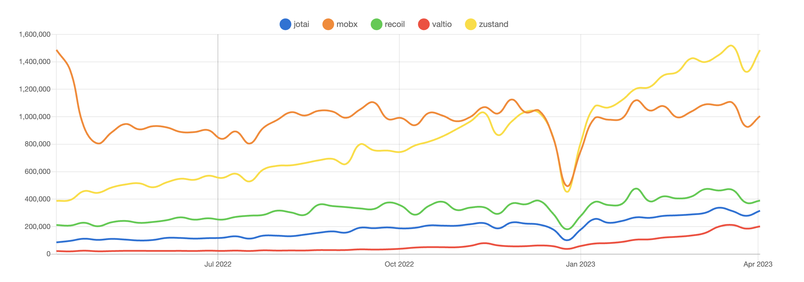
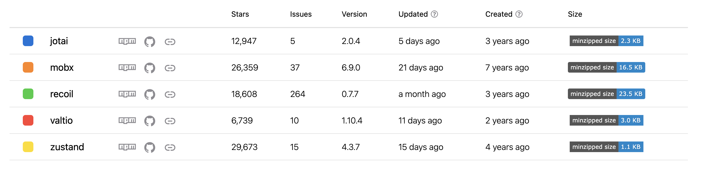

React 的状态管理库，除了无人不知的 redux，还有一个仍然历史悠久的 mbox，另外近两年来看 Facebook 出品的 recoil 好评也越来越多。这三种状态管理的设计理念各不相同。这个时候有个[神奇的组织](https://github.com/pmndrs)写了三个状态管理的库分别对标以上三个，zustand 对标 redux、jotai 对标 recoil、valtio 对标 mbox。  
先放上 npmtrends 针对以上六种库的[对比](https://npmtrends.com/jotai-vs-mobx-vs-recoil-vs-redux-vs-valtio-vs-zustand)

- 下载量
  （别问我为什么不放 redux🐶）  
  
- 综合信息  
  

可以看到 zustand 真的是一颗格外耀眼的新星，虽然很时髦但是下载量已经反超老牌 mbox，star 的数量也是仅次于 redux 位于第二！
