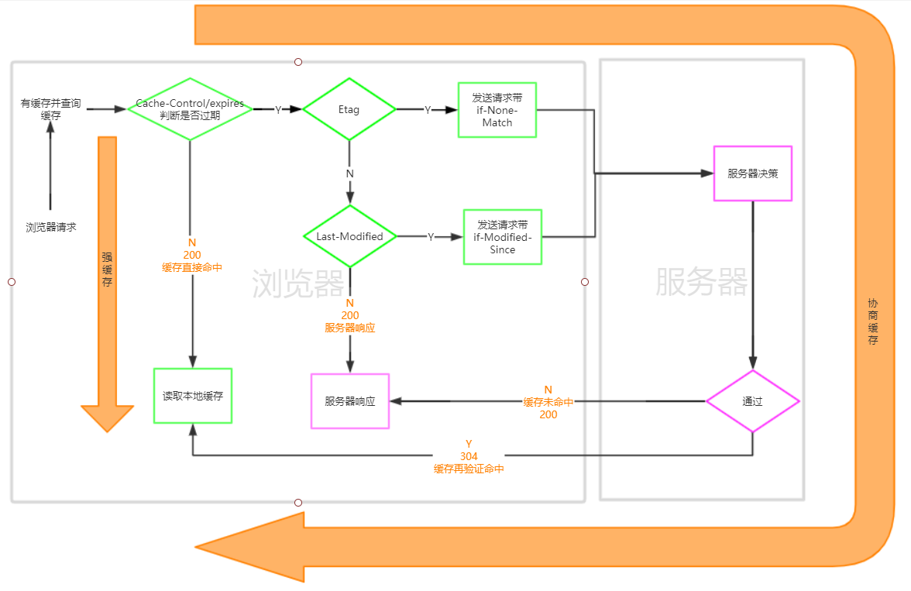

<!--
 * @Author: hanqing5
 * @Date: 2021-03-29 09:43:17
 * @LastEditors: your name
 * @LastEditTime: 2021-04-08 14:17:28
 * @Description: 文件描述
-->

# 浏览器缓存

## DNS 缓存

域名查找 IP 地址的过程就是 dns 解析。
www.dnscache.com (域名) - DNS 解析 -> 11.222.33.444 (IP 地址)

这个过程会对网络请求带来一定的损耗，所以浏览器在第一次获取到 IP 地址后，会将其缓存起来。下次相同域名再次发起请求时，浏览器会先查找本地缓存，如果缓存有效，则会直接返回该 IP 地址，否则会继续开始寻址之旅。

## memory cache（本地内存缓存、开发者不可控）

memory cache 机制保证了一个页面中如果有两个相同的请求 (例如两个 src 相同的 ，两个 href 相同的 <link>)都实际只会被请求最多一次，避免浪费。memory cache 注定只能是个“短期存储”。当数据量过大，即使网页不关闭，缓存依然会失效。

## disk cache (硬盘缓存、开发者可控)

1. (Cache-Control: max-age) 和 Expires 字段去判断是否过期
   > Expires 是 http1.0 字段。现在不咋用了
2. 没有过期则直接到 disk 去取,此时状态吗为 200(from disk)
3. 过期了携带着 If-None-Match、If-Modified-Since 字段发起一个协商请求
4. 服务器说没有变更，此时状态吗为 304，只返回 header 不返回 body，浏览器去 disk 取,
5. 服务器说变更了,返回 header 包含 Etag、last-modified 字段并且是新的值，也返回 body,此时状态吗为 200
   
   (1-2 为强缓存 1-3-4 为协商缓存 1-3-5 为重新请求)
   > [【Cache-Control 所有字段】](https://juejin.cn/post/6844903751493369870)
   > no-cache（不使用本地缓存，走协商缓存），no-store（禁止浏览器缓存数据，每次都是重新获取数据），public（可以被客户端和中间商 CDN 做缓存），private（只能客户端缓存，CDN 不能缓存）

## CDN 缓存

CDN 缓存与以上三个不同，不是浏览器端的，是服务器端的。
[【通过一个故事讲解 CDN】](https://juejin.cn/post/6844903742362353677)
一个全球出差的老板只想喝清华大学的奶茶，然后在老板经常去的地方都建立了奶茶仓库，同时聘请了一位首席分发官，负责从总部定期将最新的奶茶分发运送到各个地方的仓库。秘书还请了一位首席调度官，每次老板需要喝奶茶的时候，秘书就问他要到最合适的仓库。这样一来，秘书就能最快速度地拿到老板的奶茶。
