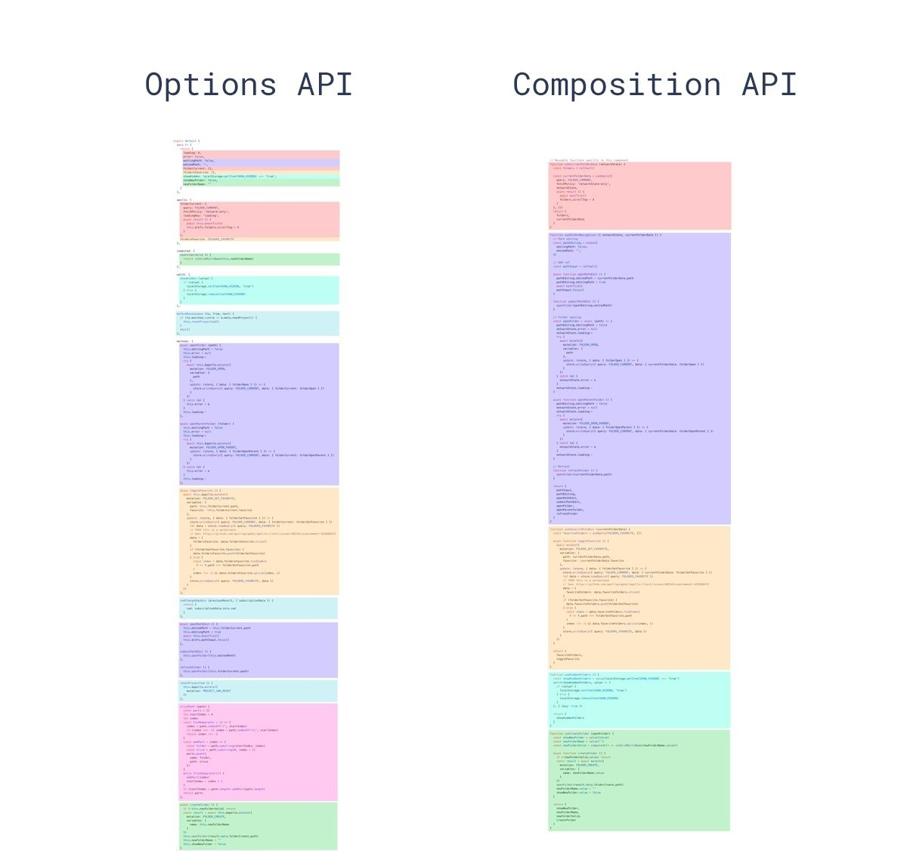
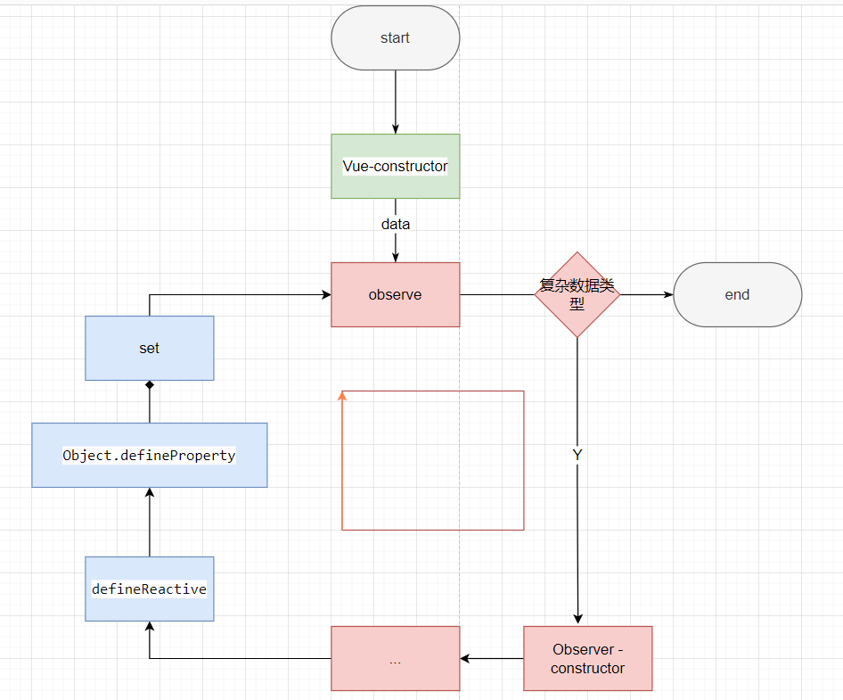
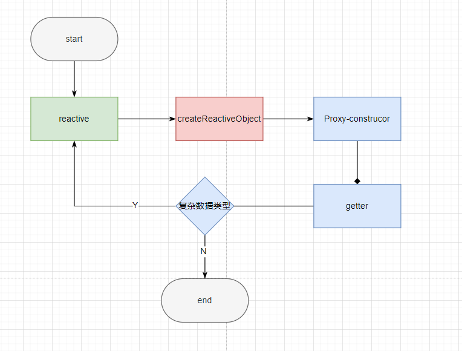
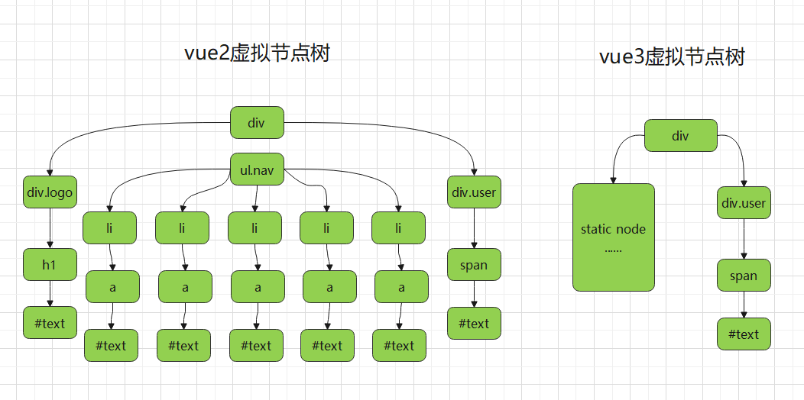
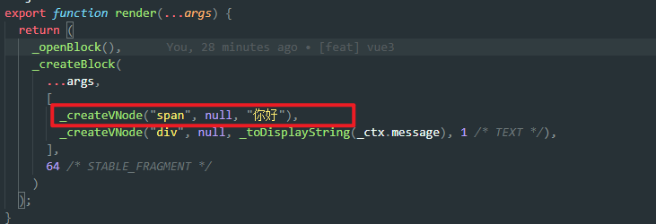
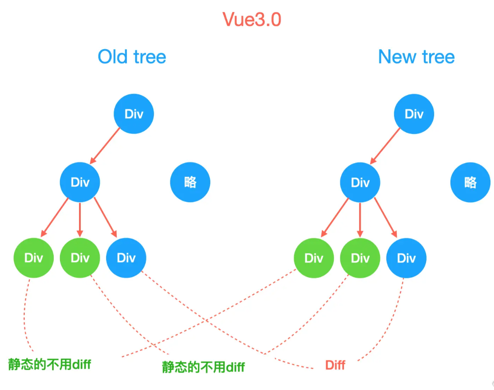
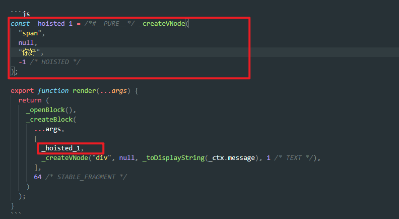
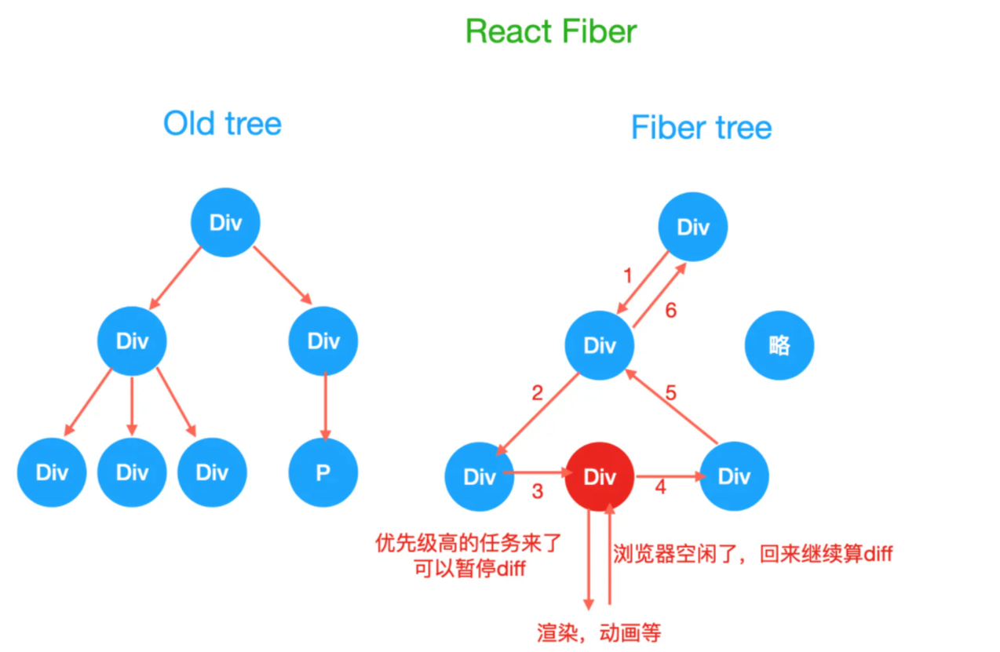
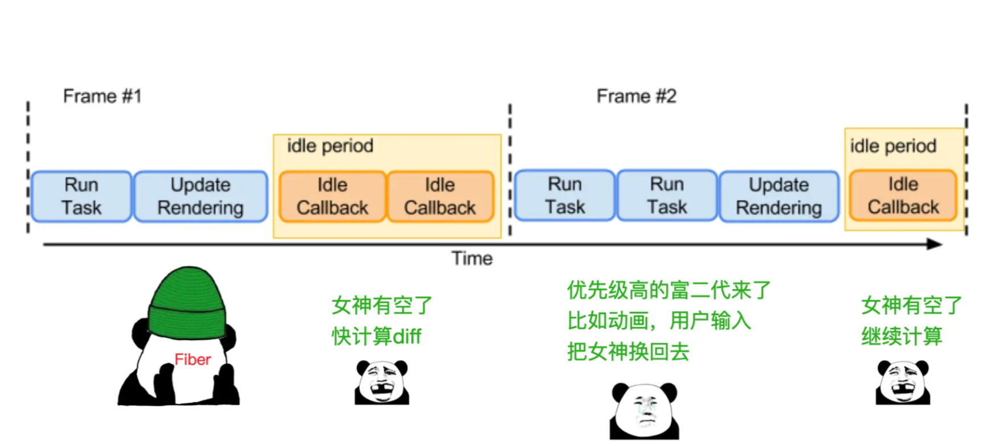

<!--
 * @Author: 鱼小柔
 * @Date: 2021-11-21 15:42:21
 * @LastEditors: your name
 * @LastEditTime: 2021-11-28 23:00:18
 * @Description: vue3 好在哪里
-->

# vue3 好

## 使用体验方面

相比较 React Vue2.x 使用上有一些缺点。  
② 对 ts 弱支持  
① 逻辑散  
③ 组件化不彻底\无法监控到数组下标的变化
④ 数据驱动：检测不到对象属性的添加和删除\
在 Vue3 中，这些缺点都改掉了，甚至比 React 做的更好

### 支持 ts

### 逻辑聚合

假设一个列表筛选的业务场景：
Vue 2.x 中逻辑分布可能是这样的：数据和逻辑被分散在了各个 option 中  
得益于 composition api ，Vue3.x 中逻辑分布聚合了


### 组件化更清晰

得益于 hook。 通过对比 Vue Hooks 与 React Hooks 可以发现，Vue 3.0 将 Mutable 特性完美与 Hooks 结合，规避了一些 React Hooks 的硬伤。所以我们可以说 Vue 借鉴了 React Hooks 的思想，但创造出来的确实一个更精美的艺术品。

并且对比 ReactHook 有如下优势
对 Hooks 使用顺序无要求，而且可以放在条件语句里。

不需要使用 usecallback useEffect useMemo 等进行性能优化，所有性能优化都是自动的。

## 运行性能方面（速度)

（例子：https://www.yuque.com/hugsun/vue3/perf）（（https://www.yuque.com/hugsun/vue3/bta09m））

### 初始化

#### proxy 代替 Object.defineProperty

Object.defineProperty 只能劫持对象的属性, 所以在 Vue.js 2.x 中，对于一个深层属性嵌套的对象，要劫持它内部深层次的变化，就需要在**Vue 实例初始化的时候递归遍历**这个对象，执行 Object.defineProperty 把每一层对象数据都变成响应式的。


Proxy 是对象层的劫持，在 Vue.js 3.x 中，初始化一个响应式数据时不会直接进行深层递归调用，**递归调用是发生在 getter 的时候**，也就是说只有属性被使用了才会进一步的深层调用。这其实是一种延时定义子对象响应式的实现，在性能上会有一定的提升。


### 更新

（依赖跟踪速度提升约 40%（更高效的 ref 实现（读取速度提升约 260%，写入速度提升约 50%）

#### 响应式

https://juejin.cn/post/7034880625047765000、https://segmentfault.com/a/1190000040163047

#### template 预字符串化

通过 template 预字符串化 vdom 节点数量减少，结构变得简单，遍历时间缩短。  
举例说明什么是 template 预字符串化  



<!-- ```vue
<div class="menu-bar-container">
    <div class="logo">
      <h1>介绍</h1>
    </div>
    <ul class="nav">
      <p><a href="">1</a></p>
      <p><a href="">2</a></p>
      ....
      <p><a href="">19</a></p>
      <p><a href="">20</a></p>
    </ul>
  </div>
<div class="user">
    <span>{{user.name}}</span>
</div>
```
 -->

除了 span 元素是动态元素之外，其余都是静态节点。 vue3 模板编译的时候会去识别动/静比例，当遇到大量连续的静态内容时，会直接将他编译为一个普通的字符串节点。  


#### vdom 静态标记与静态提升

（https://juejin.cn/post/6844904134647234568）


diff 算法增加 HOISTED = -1， 特殊标志是负整数表示永远不会用作 diff  
用下面的代码举例

```vue
<template>
  <span>你好</span>
  <div>{{ message }}</div>
</template>
```

没有静态标记之前，vdom 全量 diff，即使是静态节点也会走一遍 \_createVNode



<!-- ```js
export function render(...args) {
  return (
    _openBlock(),
    _createBlock(
      ...args,
      [
        _createVNode("span", null, "你好"),
        _createVNode("div", null, _toDisplayString(_ctx.message), 1 /* TEXT */),
      ],
      64 /* STABLE_FRAGMENT */
    )
  );
}
``` -->

① PatchFlag = -1 表示永远不会用于 Diff。 在创建 vnode 的时候，会根据 vnode 的内容是否可以变化，为其添加静态标记 PatchFlag。 PatchFlag = -1 永远不会用于 Diff。  

② 做了静态提升之后，直接引用。静态内容\_hoisted_1 被放置在 render 函数外，每次渲染的时候只要取 \_hoisted_1 即可  


<!-- ```js
const _hoisted_1 = /*#__PURE__*/ _createVNode(
  "span",
  null,
  "你好",
  -1 /* HOISTED */
);

export function render(...args) {
  return (
    _openBlock(),
    _createBlock(
      ...args,
      [
        _hoisted_1,
        _createVNode("div", null, _toDisplayString(_ctx.message), 1 /* TEXT */),
      ],
      64 /* STABLE_FRAGMENT */
    )
  );
}
``` -->

#### diff 算法内部优化
diff 算法由双端对比升级成最长递增子序列。属于 vue2.x 的双端对比和 react 的递增法的结合。
#### 对比 React Fiber
（https://github.com/vuejs/rfcs/issues/89）
React走了另外一条路，既然主要问题是diff导致卡顿，于是React走了类似cpu调度的逻辑，把vdom这棵树，微观变成了链表，利用浏览器的空闲时间来做diff，如果超过了16ms，有动画或者用户交互的任务，就把主进程控制权还给浏览器，等空闲了继续，特别像等待女神的备胎

diff的逻辑，变成了单向的链表，任何时候主线程女神有空了，我们在继续蹭上去接盘做diff，大家研究下requestIdleCallback就知道，从浏览器角度看 是这样的

React只是一个'JavaScript'，同时只能做一件事情，这个和 DOS 的单任务操作系统一样的，事情只能一件一件的干。要是前面有一个傻叉任务长期霸占CPU，后面什么事情都干不了，浏览器会呈现卡死的状态，这样的用户体验就会非常差。

对于’前端框架‘来说，解决这种问题有三个方向:

1️⃣ 优化每个任务，让它有多快就多快。挤压CPU运算量
2️⃣ 快速响应用户，让用户觉得够快，不能阻塞用户的交互
Vue 选择的是第1️⃣, 因为对于Vue来说，使用模板让它有了很多优化的空间，配合响应式机制可以让Vue可以精确地进行节点更新, 读者可以去看一下今年Vue Conf 尤雨溪的演讲，非常棒!；而 React 选择了2️⃣ 。对于Worker 多线程渲染方案也有人尝试，要保证状态和视图的一致性相当麻烦。

在这里面 React 会递归比对VirtualDOM树，找出需要变动的节点，然后同步更新它们, 一气呵成。这个过程 React 称为 Reconcilation(中文可以译为协调).

在 Reconcilation 期间，React 会霸占着浏览器资源，一则会导致用户触发的事件得不到响应, 二则会导致掉帧，用户可以感知到这些卡顿

React 的 Reconcilation 是CPU密集型的操作, 它就相当于我们上面说的’长进程‘。所以初衷和进程调度一样，我们要让高优先级的进程或者短进程优先运行，不能让长进程长期霸占资源。
🔴所以 React 通过Fiber 架构，让自己的Reconcilation 过程变成可被中断。 '适时'地让出CPU执行权，除了可以让浏览器及时地响应用户的交互，还有其他好处:

但是它肯定不是完美的，因为浏览器无法实现抢占式调度，无法阻止开发者做傻事的，开发者可以随心所欲，想挖多大的坑，就挖多大的坑。
为了共同创造美好的世界，我们要严律于己，该做的优化还需要做: 纯组件、虚表、简化组件、缓存...

尤雨溪在今年的Vue Conf一个观点让我印象深刻：如果我们可以把更新做得足够快的话，理论上就不需要时间分片了。

时间分片并没有降低整体的工作量，该做的还是要做, 因此React 也在考虑利用CPU空闲或者I/O空闲期间做一些预渲染。所以跟尤雨溪说的一样：React Fiber 本质上是为了解决 React 更新低效率的问题，不要期望 Fiber 能给你现有应用带来质的提升, 如果性能问题是自己造成的，自己的锅还是得自己背.
## 内存（内存使用量减少约 17%

vue 的 hook 得益于 setup 只运行一次
不会再每次渲染重复调用，减少 GC 压力。
