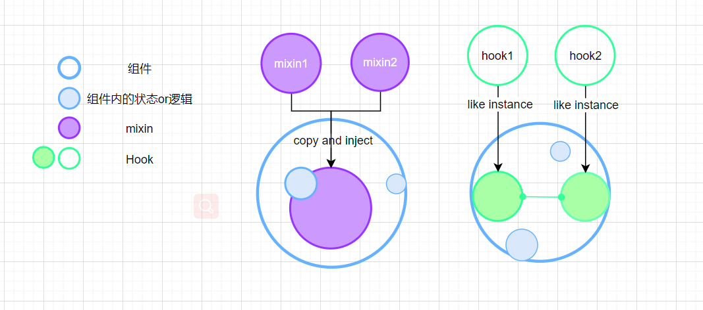
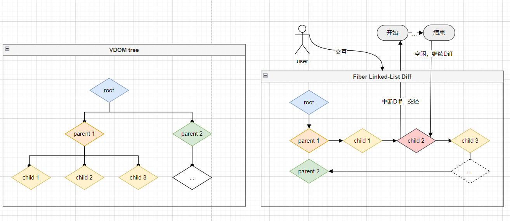
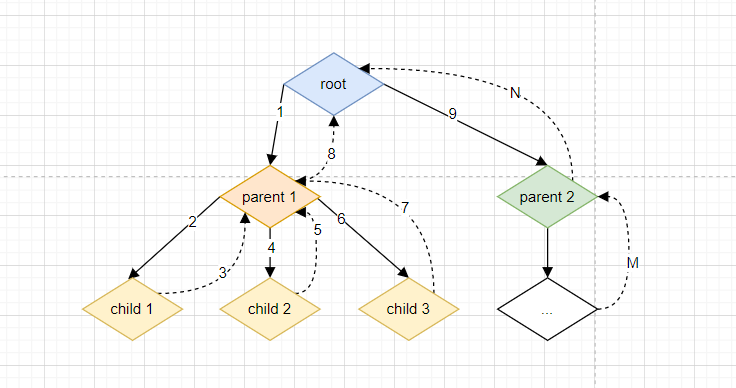
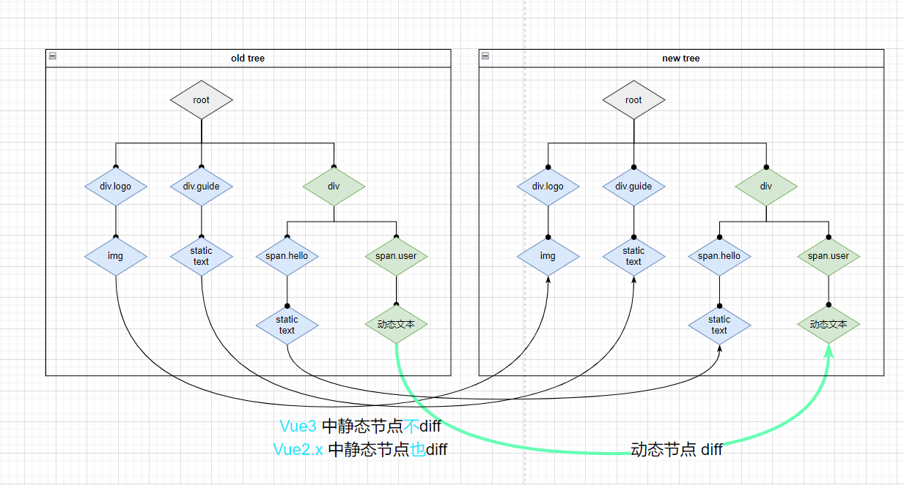

<!--
 * @Author: 鱼小柔
 * @Date: 2021-11-21 15:42:21
 * @LastEditors: your name
 * @LastEditTime: 2021-12-12 21:29:22
 * @Description: Vue3 好在哪里
-->

# Vue3 优化（React 对比）

这次主要是想和大家介绍 Vue3 的优点。因为大家对 Vue2 都有基础了，所以会以 Vue2 为基础来说它的用法改变和性能提升。遇到与 React 思想相同，或者用法相似的地方，也会与 React 做比较。  
内容上，只会说设计思路，尽量配图，通俗易懂的让大家了解到它优秀的地方。不会上升到源码讲解，因为每个点细节的去讲都值得一整篇文章了。

## 使用体验方面

相比较 React，Vue2.x 使用上有一些缺点。  
1️⃣ 对 ts 弱支持  
2️⃣ 功能点的数据和逻辑分散：Vue2.x 是选项配置式（Options API）的写法  
3️⃣ 组件化不彻底：纯逻辑复用不优雅，mixin 痛点较多  
4️⃣ 响应式不完善：检测不到对象属性的添加和删除、无法监控到数组下标的变化  
在 Vue3 中，这些缺点都改掉了，甚至比 React 做的更好。

### 支持 ts

Vue3.x 用 ts 重写，对 ts 支持友好。🎉🎉🎉

### 逻辑聚合

Vue3 中使用 Composition API 使逻辑更加聚合。  
官方示例：  

每个颜色代表一个功能点，  
在 Vue2.x 中以 Options API 的形式分布。每个功能点的数据在 data 中定义，也可能存在与 computed 中。功能点的逻辑可能分散 methods，watch 等 option 中。  
在 Vue3.x 中以 Composition API 的形式分布，每个功能点的数据逻辑聚合到一个代码区域。

#### 🌰 Composition API 使用

来看一下 vue3 中 data、computed、methods、watch、生命周期函数的用法：

```js
function setup() {
  /* 类似 data */
  const greetings = ref("unknow");
  /* computed */
  const greetingLen = computed(() => {
    return greetings.value.length;
  });
  /* methods */
  const updateGreeting = () => {
    greetings.value += "Hello ";
  };
  /* watch */
  watch(greetings， () => {
    document.title = `updating ${greetings.value}`;
  });
  return {
    greetings，
    greetingLen，
    updateGreeting，
  };
}
```

### 逻辑复用完善

Vue3.x 中也采用了 Hook 的思想，使用 Hook 更利于逻辑复用。  
在 Vue2.x 中，纯逻辑复用会采用 mixin 的方式，mixin 是代码注入，所以与使用它的组件之间存在隐式依赖，可能产生命名冲突等，降低了应用的可预测性。  
Hooks 不是注入代码片段，类似一个独立的实例，不会与引入它的组件代码发生耦合或者覆盖，也不能更改组件传递给它的属性。并且多个 Hooks 之间可以串联使用，也可以相互调用。

Vue Hooks 不仅是对 mixin 的一种替代升级方案，而且 Vue Hooks 规避了一些 React Hooks 的使用上的限制和麻烦之处。  
1️⃣ React Hooks 必须在顶层调用，不能在条件语句使用。Vue Hooks 的使用没有这些限制，只把它当成一个普通的函数用就 ok。

> React 的 Hook 底层是链表，每一个 Hook 的 next 是指向下一个 Hook 的，if 会导致顺序不正确，从而报错，所以 react 是不允许这样使用 Hook 的。

2️⃣ React Hooks 有时需要手动使用 useCallback，useMemo 去优化，避免子组件无必要的重新渲染。Vue 是不需要开发人员去考虑这些手动优化的。

> Vue 的组件渲染是基于响应式的，内部做了细粒度的监听机制，不会产生无必要的子组件重新渲染。

3️⃣ React 会在每次渲染都执行一遍 Hooks ， 可能导致性能不佳。Vue Hooks 只在初始化执行。

> React 我们定义的是渲染函数，Vue 我们定义的是组件，在 setup 中 使用 Hooks，setup 只会在初始化时执行一次，所以 Vue Hooks 每次渲染时都重复执行。

#### 🌰 Vue Hooks 的例子

实现一个 Hooks，检查是否在目标元素以外进行点击。应用场景：点击下拉框的以外的任意位置关闭下拉框。  
**Hook 内部代码**

```js
import { ref， onMounted， onUnmounted， Ref } from "vue";
// elementRef 目标元素
export default (elementRef: Ref<null | HTMLElement>) => {
  // 定义一个状态表示是否在元素外点击
  const isClickOutside = ref(false);
  const handler = (e: MouseEvent) => {
    if (elementRef.value) {
      if (elementRef.value.contains(e.target as HTMLElement)) {
        isClickOutside.value = false;
      } else {
        isClickOutside.value = true;
      }
    }
  };
  // Hook 被注册时开启监听
  onMounted(() => {
    document.addEventListener("click"， handler);
  });
  // Hook 被注销时移除监听
  onUnmounted(() => {
    document.removeEventListener("click"， handler);
  });
  // 把状态传递给父级组件
  return isClickOutside;
};
```

**组件中应用 Hook**

```js
import useClickOutside from "../Hooks/useClickOutside";
// ....
function setup() {
  // ....
  const dropdownRef = (ref < HTMLElement) | (null > null);
  const isClickOutside = useClickOutside(dropdownRef);
  watch(isClickOutside， () => {
    if (isClickOutside.value && isOpen.value) {
      // 打开状态下，点击非目标元素和它的孩子节点则关闭目标元素
      isOpen.value = false;
    }
  });
  return {
    // ...
    isOpen，
    isClickOutside，
    dropdownRef，
  };
}
```

### 响应式改写

Proxy 代替 Object.defineProperty ，得益于 Proxy 原生能力，可以劫持对象增删属性、数组下标变化。🎉🎉🎉

在 Vue2.x 中如果想要监听对象增删属性，需要使用 Vue 的静态方法，Vue.set、Vue.delete。对于 Vue3 来说，不需要这种补丁写法了。 Vue2.x 中响应式数据是通过 data(){} 这个 Option 返回的。  
Vue3 中响应式数据是在初始化时（setup 函数）通过 ref API 或者 reactive API 定义的，然后作为 setup 的返回值。

#### 🌰 响应式数据基本用法

```js
function setup() {
    /* 通过下标更改数组的值 */
    const list = ref([0， 1， 2， 3]);
    const changeList = () => {
      const i = Math.floor(Math.random() * 3);
      const v = Math.random();
      list.value[i] = v; //更改下标可以响应
    };
    /* 为对象增添属性 */
    const obj: any = ref({ name: "语文"， score: "98" });
    const changeObj = () => {
      const index = Object.keys(obj.value).length + 1;
      const k = "prop-" + index;
      const v = "value-" + index;
      obj.value[k] = v; //直接添加就可以响应
    };
    return {
      // 用于template渲染
      list，
      changeList，
      obj，
      changeObj，
    };
}，
```

可以通过[这个在线例子](https://codesandbox.io/s/pedantic-lehmann-3mw88?file=/src/App.vue)来查看完整代码，以验证。

## 性能-初始化速度

### 响应式

Object.defineProperty 只能劫持对象的属性， 所以在 Vue.js 2.x 中，对于一个深层属性嵌套的对象，要劫持它内部深层次的变化，就需要在**Vue 实例初始化的时候递归遍历**这个对象，执行 Object.defineProperty 把每一层对象数据都变成响应式的。


Proxy 是对象层的劫持，在 Vue.js 3.x 中，初始化一个响应式数据时不会直接进行深层递归调用，**递归调用是发生在 getter 的时候**，也就是说只有属性被使用了才会进一步的深层调用。这其实是一种延时定义子对象响应式的实现，在性能上会有一定的提升。


实验数据可以参考[这个](https://www.yuque.com/hugsun/Vue3/perf)

## 性能-更新速度

Vue 和 React 两者都具有数据驱动视图的思想，也都用到了 VDOM，对流程最简洁的概括： data->VDOM->DOM->view ，这个流程本质上就是 js 执行。js 执行要考虑性能问题，因为 js 执行期间会一直占据着 CPU，如果时间过长，一则会导致用户触发的事件得不到响应， 二则会导致掉帧即阻塞浏览器渲染，用户的角度去感知就是卡顿。  
解决这种由于 js 执行时间过长导致卡顿的问题 Vue3 和 React 走了不同的路。

### 与 React 更新性能总体对比

#### React 的思路：CPU 总运算量不变，利用时间切片的思想，做到快速响应用户，让用户觉得够快。

所以 React 走了类似 CPU 调度的逻辑，让 整个更新流程 可以中断。把 VDOM tree，设计成链表的结构，利用浏览器的空闲时间来做数据驱动视图更新的流程，如果有动画或者用户交互的任务，就把主进程控制权还给浏览器。这就像 CPU 调度进程一样，我们要让高优先级的进程或者短进程优先运行，不能让长进程长期霸占资源。

> 核心是应用了这个原生 API ：requestIdleCallback。链表数据结构 ：Fiber



链表结构的形成是基于树的深度优先遍历  



#### Vue3 的思路：优化每个任务，让它有多快就多快，达到挤压 CPU 总运算量的目的（废除了时间切片的思路）。

根据尤大公布的数据就是 Vue3 update 性能提升了 1.3~2 倍，具体优化点下面小节介绍。

> 为什么移除时间切片呢？因为每个任务极致优化后，cpu 总运算量降低，已经不需要时间切片了。 尤大亲自解释可以看[这里](https://github.com/Vuejs/rfcs/issues/89)

#### 为什么会走不同的路呢？

React 和 Vue 虽然都有 data->VDOM->DOM->view 这样的转换思想，但具体的数据驱动的原理不同。  
当数据改变时， React 会递归比对整个新旧 VirtualDOM 树，找出需要变动的节点，然后一气呵成的更新。所以对于 React 来说，js 执行时间长主要就在于新旧 VDOM tree 对比时间长，就算 diff 算法再快也避免不了这个过程长，所以 React 走了时间切片的思路。

Vue 与 React 不同的数据驱动更新机制让 Vue 有更多的优化空间：  
1️⃣ 在组件级别采用的是响应式的机制，可以让更新精确地定位到具体的组件（不需要整棵树对比），响应式有一定的优化空间  
2️⃣ 组件内部使用的是 VDOM diff，并且是边对比变更新，不是一气呵成。diff 算法可以进一步优化。  
3️⃣ 使用模板相比 JSX，易于静态分析(AOT)，也让它有更多优化的空间。

> React 也可以做组件树级别的优化(即防止不必要的子组件重新呈现)需要显式使用 usemo，但是用好 usemo 不是一件容易的事。

### template 预字符串化

通过 template 预字符串化使 VDOM 节点数量减少，DOM tree 结构变得简单，遍历时间缩短。  
Vue3 模板编译的时候会去识别动/静比例，当遇到大量连续的静态内容时，会直接将他编译为一个普通的字符串节点。

🌰 比如这样的代码片段

``` html
<div class="menu-bar-container">
    <div class="logo">
      
    </div>
    <ul class="nav">
      <li>菜单项 1 </li>
      <li>菜单项 2 </li>
      ...
      <li>菜单项 19</li>
      <li>菜单项 20</li>
    </ul>
    <div class="user">
      <span class="user">{{user.name}}</span>
    </div>
</div>

```

除了 span 元素是动态元素之外，其余都是静态节点。在编译阶段，会把连续的静态元素部分合并为字符串。对比 vue2.x 来看如图：


### 静态标记、静态提升与事件缓存

创建 VDOM 的时候会根据 VDOM 的内容是否可以变化，为其添加静态标记 PatchFlag，如果 patchFlag = -1 表示当前节点是静态的，永远不会用作 diff。应用静态标记，大大的减少了 diff 工作量，剪短 diff 算法运行的时间。  
静态提升是指标记为静态的节点，会缓存在 render 函数之外，创建 VDOM 的时候直接引用，不需要重新创建。

🌰 用下面的代码举例

```Vue
<template>
  <div class="logo">
      
  </div>
  <div class="guide">
      进入主页
  </div>
  <div class="user">
      <span class="hello">你好,</span>
      <span class="user">{{ user.name }}</span>
  </div>
</template>
```

span 元素 这行代码是静态的，在没有静态标记的时候，每次 diff 它也会参与，渲染之前总是会被重新创建。  
加入静态标记后，它就不用参加 diff 流程了。  
有了静态提升之后，假设内存中\_hosted_1 这个变量代表 span 元素的 VDOM，每次渲染的时候只要取 \_hoisted_1 即可。



#### 事件侦听缓存

与 VDOM 静态提升相似，事件的回调函数，通常都是不变的。这种情况下，函数会被缓存起来，不用追踪它的变化。事件响应时，直接从内存中取出函数执行。

> 疑问: 静态标记静态提升，React 为啥不做呢?

### diff 算法内部优化

算法复杂，很难抽象出流程图。简单列一下区别和性能对比：  
React 的 DOM tree 是链表结构，注定只能从单边开始比较，原地复用、下标递增法移动复用。  
Vue2 双端比较，比较时总共有五种情况（四种相等＋一种不相等），分别做不同的处理。相比 React，双端比较更能节约次数。  
Vue3 先双端比较，原地复用。然后最长递增子序列移动复用。(最长递增子序列使用的是“贪心 + 二分查找”的算法)。比 Vue2 更快。  

### 响应式

从 Vue2.x 到 Vue3.0，响应式改写提升了初始化性能上面已经说过了。从 3.0 到 3.2，响应式进一步优化，更新性能进得到了显著提升。  
官方数据：依赖跟踪速度提升约 40%、ref 读取速度提升约 260%，写入速度提升约 50%。

响应式的优化是代码细节的优化，大概思想也是用空间换时间。增加几个标记，并且巧妙的运用位运算。推荐阅读[这篇文章](https://juejin.cn/post/6995732683435278344)

<small><i>PS:真滴难！/(ㄒ o ㄒ)/~~ ，希望有朝一日看得明明白白、真真切切。</i></small>

## 体积

### Vue tree shaking

源码支持 tree shaking，打包体积变小。之前时引入整个 Vue 、现在是引入 Vue 中的 各个 API 组合使用，没用到的就不会打包。

<!--  -->

<!-- ```js
export function render(...args) {
  return (
    _openBlock()，
    _createBlock(
      ...args，
      [
        _createVNode("span"， null， "你好")，
        _createVNode("div"， null， _toDisplayString(_ctx.message)， 1 /* TEXT */)，
      ]，
      64 /* STABLE_FRAGMENT */
    )
  );
}
``` -->

<!--  -->

<!-- ```js
const _hoisted_1 = /*#__PURE__*/ _createVNode(
  "span"，
  null，
  "你好"，
  -1 /* HOISTED */
);

export function render(...args) {
  return (
    _openBlock()，
    _createBlock(
      ...args，
      [
        _hoisted_1，
        _createVNode("div"， null， _toDisplayString(_ctx.message)， 1 /* TEXT */)，
      ]，
      64 /* STABLE_FRAGMENT */
    )
  );
}
``` -->
