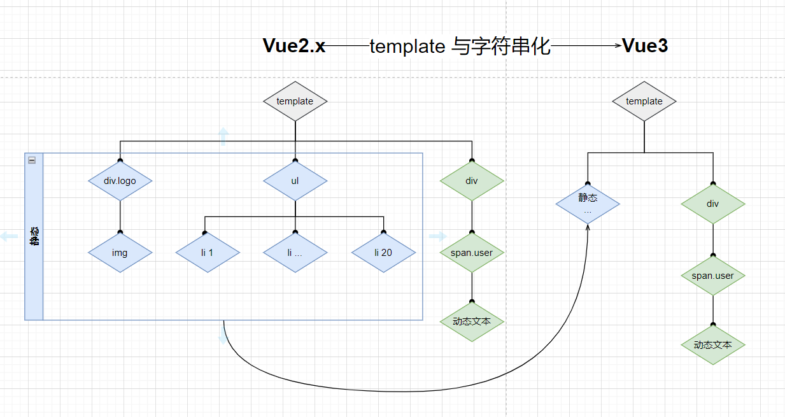

<!--
 * @Author: 鱼小柔
 * @Date: 2021-11-21 15:42:21
 * @LastEditors: your name
 * @LastEditTime: 2021-12-05 11:56:54
 * @Description: vue3 好在哪里
-->

# vue3 好

这次主要是想和大家介绍 vue3 的优点。因为大家对 vue2 都有基础了，所以会以 vue2 为基础来说它的用法改变和性能提升。遇到与 react 思想相同，或者用法相似的地方，也会与 react 做比较。  
内容上，只会说设计思路，尽量配图，通俗易懂的让大家了解到它优秀的地方。不会上升到源码讲解，因为每个点细节的去讲都值得一整篇文章了。

## 使用体验方面

相比较 React Vue2.x 使用上有一些缺点。  
② 对 ts 弱支持  
① 逻辑散  
③ 组件化不彻底\无法监控到数组下标的变化
④ 数据驱动：检测不到对象属性的添加和删除\
在 Vue3 中，这些缺点都改掉了，甚至比 React 做的更好

### 支持 ts

### 逻辑聚合

假设一个列表筛选的业务场景：
Vue 2.x 中逻辑分布可能是这样的：数据和逻辑被分散在了各个 option 中  
得益于 composition api ，Vue3.x 中逻辑分布聚合了


### 组件化更清晰

得益于 hook。 通过对比 Vue Hooks 与 React Hooks 可以发现，Vue 3.0 将 Mutable 特性完美与 Hooks 结合，规避了一些 React Hooks 的硬伤。所以我们可以说 Vue 借鉴了 React Hooks 的思想，但创造出来的确实一个更精美的艺术品。

并且对比 ReactHook 有如下优势
对 Hooks 使用顺序无要求，而且可以放在条件语句里。

不需要使用 usecallback useEffect useMemo 等进行性能优化，所有性能优化都是自动的。

### 例子

```html
<script setup>
  // 用ref: 新语法声明
  ref: count = 1;
  function inc() {
    // 直接操作变量 不用.value
    count++;
  }
</script>
```

## 运行性能方面-初始化

### 响应式：proxy 代替 Object.defineProperty

[实验数据](https://www.yuque.com/hugsun/vue3/perf)

Object.defineProperty 只能劫持对象的属性, 所以在 Vue.js 2.x 中，对于一个深层属性嵌套的对象，要劫持它内部深层次的变化，就需要在**Vue 实例初始化的时候递归遍历**这个对象，执行 Object.defineProperty 把每一层对象数据都变成响应式的。


Proxy 是对象层的劫持，在 Vue.js 3.x 中，初始化一个响应式数据时不会直接进行深层递归调用，**递归调用是发生在 getter 的时候**，也就是说只有属性被使用了才会进一步的深层调用。这其实是一种延时定义子对象响应式的实现，在性能上会有一定的提升。


## 运行性能方面-更新

vue 和 react 本质上都是 js 框架，数据驱动流程是对运行速度影响最大的一个因素。两者都用到了 VDOM，相同的思想是 data-VDOM-view 。这整个流程，除了最后更新视图，其他的本质上都是 js 执行。js 执行期间会一直占据着 CPU，如果时间过长，一则会导致用户触发的事件得不到响应, 二则会导致掉帧即阻塞浏览器渲染，用户可以感知到这些卡顿。  
解决这种由于 js 执行时间过长导致卡顿的问题 Vue 和 React 走了不同的路。  
1️⃣ React 的思路：CPU 总运算量不变，但是做到快速响应用户，让用户觉得够快。  
于是 React 走了类似 CPU 调度的逻辑，把 VDOM tree，设计成链表的结构，（链表的节点数据结构是 Fiber），利用浏览器的空闲时间来做数据驱动视图更新的流程，有动画或者用户交互的任务，就把主进程控制权还给浏览器。这就像 CPU 调度进程一样，我们要让高优先级的进程或者短进程优先运行，不能让长进程长期霸占资源。

> 核心是应用了这个 API ：requestIdleCallback。

2️⃣ Vue3 的思路：优化每个任务，让它有多快就多快，达到挤压 CPU 总运算量的目的（废除了时间切片的思路）。具体优化点下面小节介绍。

> 为什么移除时间切片呢？因为每个任务极致优化后，cpu 总运算量降低，已经不需要时间切片了。[尤大亲自解释](https://github.com/vuejs/rfcs/issues/89)

#### 为什么会走不同的路呢？

我的理解：React 和 Vue 数据驱动的原理不同，尽管它们的思想轮廓是相似的（data-VDOM-view）。
当数据改变时， React 会递归比对整个新旧 VirtualDOM 树，找出需要变动的节点，然后一气呵成的更新。所以对于 React 来说，能优化的点就是从 diff 算法入手，但是由于整棵树去 diff 然后统一渲染，diff 时间还是会很长。


> React 组件树级别的优化(即防止不必要的子组件重新呈现)需要显式使用 usemo。但是用好 usemo 不是一件容易的事。

对于 Vue 来说，① 在组件级别采用的是响应式的机制，可以让 Vue 精确地定位，而不是整棵树做 diff。响应式有一定的优化空间 ② 组件内部使用的是 VDOM diff，边对比变更新，不是一气呵成。（和选择不同的路有啥关系）③ 使用模板相比 JSX，易于静态分析(AOT)，也让它有更多优化的空间。

### 响应式

从 Vue2.x 到 Vue3.0,响应式从 Object.defineProperty 变成 Proxy，对初始化性能有一定提升。上面已经说过了。从 3.0 到 3.2 ，响应式性能进一步显著提升。

> 与 3.0 版本相比有一组数据：依赖跟踪速度提升约 40%、ref 读取速度提升约 260%，写入速度提升约 50%。

上文提到过 effect 是嵌套调用的，所以我们用 effectTrackDepth 来记录目前这个 effect 在第几层，每当有 effect 执行 effectTrackDepth++，每当 effect 执行完毕 effectTrackDepth--。
再通过 trackOpBit 作为它位标记，可以理解为唯一 ID，具体为 trackOpBit = 1 << effectTrackDepth。
对于 dep 我们也需要改造一下，原来的 dep 就只是一个 set，我们在此基础上加上两个属性，用来标记该属性上次和本次在哪些 effect 中使用过，再通过对比进行删除和新增。
由于一个 reactiveData 的属性可能会用到多个 effect 中，所以我们通过按位或给 dep 打标记，又因为每个 effect 的位标记各不相同，在通过按位与判断得出的值是否大于零，这样就可以分辨出这个值到底都在哪些 effect 中用过了。

### template 预字符串化

通过 template 预字符串化 VDOM 节点数量减少，结构变得简单，遍历时间缩短。  
举例说明什么是 template 预字符串化



<!-- ```vue
<div class="menu-bar-container">
    <div class="logo">
      <h1>介绍</h1>
    </div>
    <ul class="nav">
      <p><a href="">1</a></p>
      <p><a href="">2</a></p>
      ....
      <p><a href="">19</a></p>
      <p><a href="">20</a></p>
    </ul>
  </div>
<div class="user">
    <span>{{user.name}}</span>
</div>
```
 -->

除了 span 元素是动态元素之外，其余都是静态节点。 vue3 模板编译的时候会去识别动/静比例，当遇到大量连续的静态内容时，会直接将他编译为一个普通的字符串节点。

### VDOM 静态标记与静态提升

（https://juejin.cn/post/6844904134647234568）

diff 算法增加 HOISTED = -1， 特殊标志是负整数表示永远不会用作 diff  
用下面的代码举例

```vue
<template>
  <span>你好</span>
  <div>{{ message }}</div>
</template>
```

没有静态标记之前，VDOM 全量 diff，即使是静态节点也会走一遍 \_createVNode


<!-- ```js
export function render(...args) {
  return (
    _openBlock(),
    _createBlock(
      ...args,
      [
        _createVNode("span", null, "你好"),
        _createVNode("div", null, _toDisplayString(_ctx.message), 1 /* TEXT */),
      ],
      64 /* STABLE_FRAGMENT */
    )
  );
}
``` -->

① PatchFlag = -1 表示永远不会用于 Diff。 在创建 vnode 的时候，会根据 vnode 的内容是否可以变化，为其添加静态标记 PatchFlag。 PatchFlag = -1 永远不会用于 Diff。  

② 做了静态提升之后，直接引用。静态内容\_hoisted_1 被放置在 render 函数外，每次渲染的时候只要取 \_hoisted_1 即可  


<!-- ```js
const _hoisted_1 = /*#__PURE__*/ _createVNode(
  "span",
  null,
  "你好",
  -1 /* HOISTED */
);

export function render(...args) {
  return (
    _openBlock(),
    _createBlock(
      ...args,
      [
        _hoisted_1,
        _createVNode("div", null, _toDisplayString(_ctx.message), 1 /* TEXT */),
      ],
      64 /* STABLE_FRAGMENT */
    )
  );
}
``` -->

### diff 算法内部优化

react 单边比较,原地复用、下标递增法移动复用。 (单向的链表)
vue2 双端比较。  
vue3 双端比较，原地复用。最长递增子序列移动复用。（使用的是“贪心 + 二分查找”的算法）。  
双端比较会比单边比较减少比较次数，vue 的 diff 算法性能上更占优。

## 内存

内存使用量减少约 17%

vue 的 hook 得益于 setup 只运行一次
不会再每次渲染重复调用，减少 GC 压力。

React 的虚拟 DOM 调整天生就慢，因为它的架构很重;
没有响应式，使用钩子的 React 应用默认会过度重新渲染。
