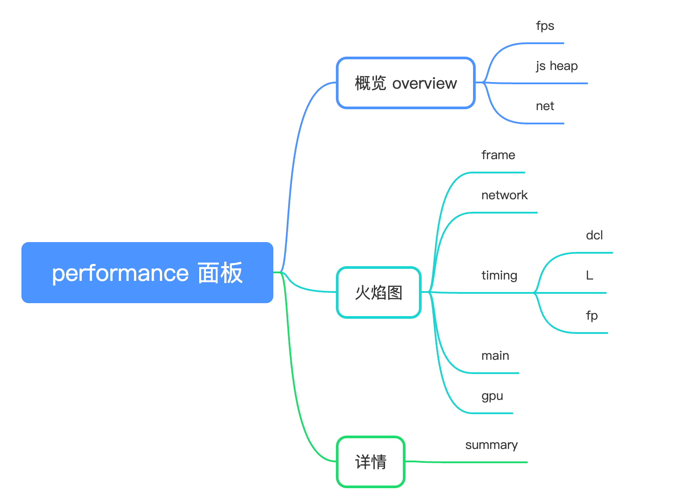

<!--
 * @Author: 鱼小柔
 * @Date: 2021-04-08 17:26:36
 * @LastEditors: your name
 * @LastEditTime: 2021-04-08 17:48:56
 * @Description: file content
-->

## 骨架图

1. 首屏时展示默认的区块以灰色背景为主、展示默认的图片
2. 请求成功隐藏这部分节点

## 上报日志（跨域的问题）

- img、script 标签的方式

## 防刷

### 防机器刷

图片验证码。

### 防人为

记录手机号，记录 ip。一定时间内不让请求。

## 面试题

### 首屏加载速度

- spa -> mpa
- code splitting 按需加载
- 懒加载
- 优化静态资源 webp cdn 合并、压缩代码
- 服务端渲染

### 卡了怎么办

1. 定位问题

- - 检查 performance 面板中的 Main 主线程执行情况，某个 Task 标红则有问题。
- - 检查 Network，看是否存在请求时间过长的情况。
- - 查看 Frames，看是否GPU内存使用过高。
- - 查看 Memory，看是否存在内存泄露问题。

2. 解决问题

- 代码内存泄漏了或者死循环了改代码、确实计算量大导致 task 时间长使用 webworker
- 网络请求的优化类似首屏渲染优化：摇、分&懒、分&并、压、cdn缓存、预、离线缓存
- 渲染优化：虚拟列表、webp

## performance 面板

main:主线程的执行记录，可以分析主线程的 Event Loop，分析每个 Task 的耗时、调用栈等信息

### 前端的性能指标

#### 加载速度

- DCL（DOMContentLoaded）：这个事件在 HTML 文档被完全加载和解析完成之后立即触发，不等待样式表、图像和子框架的完成加载。这个指标反映了 HTML 文档解析完成的速度。
- L（Load）：这个事件在整个页面及所有依赖资源如样式表和图像都已完成加载时触发。这个指标反映了页面及其所有依赖资源加载完成的速度。
- FP（First Paint）：这个指标表示浏览器首次渲染任何在视觉上不同于导航前屏幕内容的内容的时间，包括背景的改变。这个指标反映了页面开始渲染的感知速度。

#### 运行效率

- Main 部分看 Task 是否标红
- Frames 部分看到帧率
- 在 Memory 看到内存使用情况

#### 用户体验

- 可交互时间（Time to Interactive，TTI）：页面内容已加载并且处理器能够立即响应用户输入的时间。这个指标反映了页面可用的速度。
- 输入延迟（Input Delay）：用户输入（例如点击按钮）到页面开始响应的时间。这个指标反映了页面响应用户输入的速度。
- 累计布局偏移（Cumulative Layout Shift，CLS）：页面加载过程中，视觉内容位置变化的总和。这个指标反映了页面的视觉稳定性。

### 讲讲虚拟列表

- 是什么？只渲染视口
- 高度不定怎么做? observe
- 上滑下滑时，白屏区域怎么半？buffer 空间
