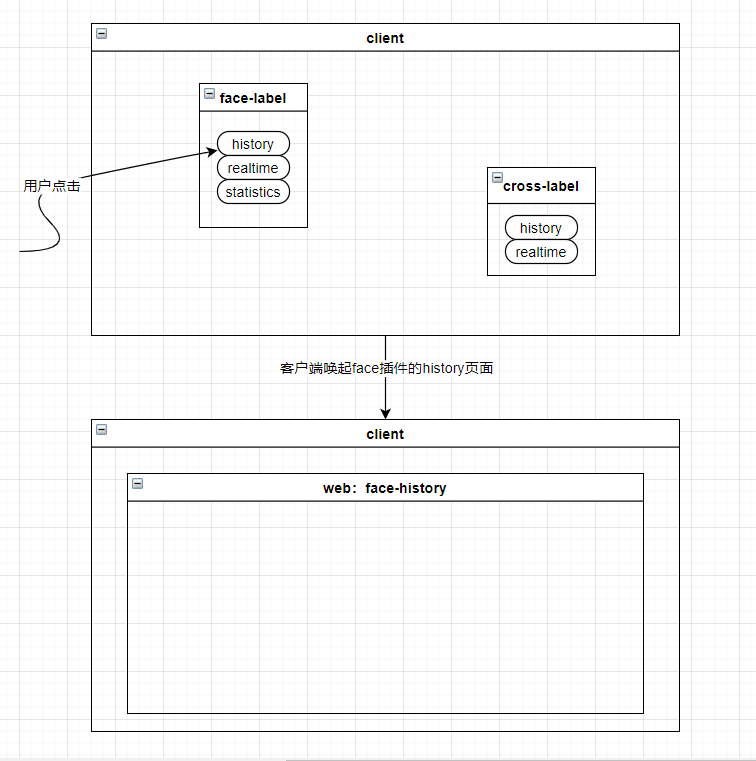
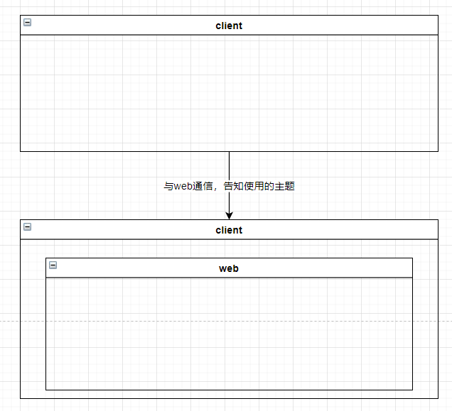
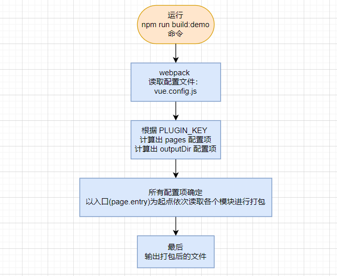
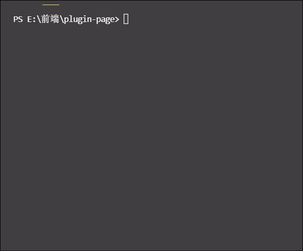
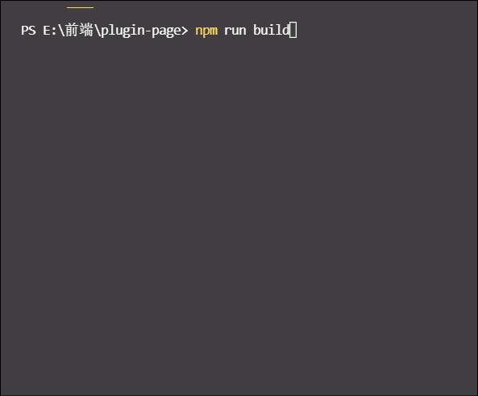
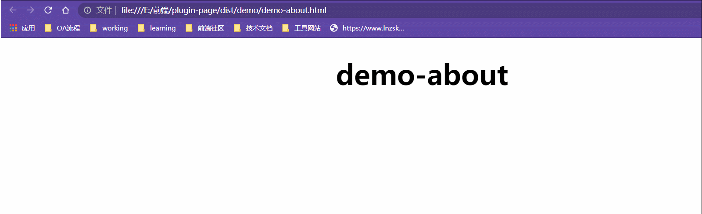

<!--
 * @Author: 鱼小柔
 * @Date: 2020-12-14 21:01:05
 * @LastEditors: your name
 * @LastEditTime: 2021-09-13 01:25:47
 * @Description: file content
-->

# 标题没想好

## 需求

1. 插件化。客户端有多个标签(可以理解为几个功能按钮的组合体)，标签类型有多种，从业务角度来讲，是对应多种不同的监控摄像头，从代码角度来讲，是对应多个 iarrm 插件。多个插件要完全独立，可以单独安装使用。点击一个标签中的一个按钮，根据当前标签的类型和点击的按钮，唤起对应的 web 页面, 相当于浏览器打开一个新的标签页。  
   例如，安装了人脸插件的客户端，就携带有查看人脸抓拍历史、人脸实时抓拍情况、人脸数据统计图等功能。当点击人脸标签上的人脸历史按钮时，就打开人脸历史的 web 页面，使用其中的功能。
   

2. 支持多皮肤。客户端唤起网页时，通知 web 当前使用的主题，web 全局应用该主题。
   

3. 要提供一个脚手架（公司内部前端工程都是 webpack+vue）给分公司，当新增标签类型时，尽量能够复用组件，只开发业务。

根据需求可以分析出来几个技术点：1 插件化 2 多主题 3 客户端与 web 通信 4 脚手架。下面就逐一击破吧~

## 插件化

### 基本思路

“插件化” 这个概念映射到前端工程代码，该怎么理解呢？

① 根据需求多个插件完全独立，就说明每个插件~完整前端应用包

> TIPS  
> 准确来讲每个插件对应前端应用包+后端应用包，但是我们这里不讨论后端。  
> 下文前端应用包或插件会使用 app 代指

这些插件对于前端开发来说，大多数的依赖和使用的组件都是相同的（比如上图的人脸、卡口插件都包含历史这个页面，页面上的具体功能都差不多。)
所以正确的方案应该是一个前端工程，可以输出多个不同的 app。这样更方便的实现组件的复用，也更方便项目的维护。

② 根据需求，客户端标签中的每个按钮都会唤起一个 web 页面，所以每个 app 都包含多个 page，这是典型的 MPA。  
所以我们的每个 app 都是一个 MPA。

### 具体方案

假设我们的需要输出两个两个插件，demo 和 other，demo 包含两个页面 home 和 about，other 包含一个页面 home

```code

iarrm
  ├── demo
  |   ├──home
  |   └──about
  └── other
      └──home
```

我们期望生成的目录是这样滴，并且希望可以单独输出一个插件或多个插件一起输出

```
 plugins
      └── demo
      |   ├── demo-home.html
      |   ├── demo-about.html
      |   └── assets
      |       ├── js
      |       ├── css
      |       └── img
      └── other
          ├── other-home.html
          └── assets
              ├── js
              ├── css
              └── img

```

那么，在源码中，目录的基本骨架可以这样设置

```
project
├── ...
└──src
  └── apps
      ├── demo                 // ~ app
      |   ├── home             // ~ page
      |   |   ├──main.js
      |   |   └──App.vue
      |   └── about            // ~ page
      |       ├──main.js
      |       └──App.vue
      └── other                // ~app
          └── home            // ~ page
              ├──main.js
              └──App.vue


```

通过命令行去控制具体输出某一个或多个 app  
配置命令行，关键点是 set PLUGIN_KEY=xxx

```json
//package.json
"scripts": {
    "build:demo": "set PLUGIN_KEY=demo&&vue-cli-service build", //想要输出demo插件则执行这个命令
    "build:other": "set PLUGIN_KEY=other&&vue-cli-service build",//想要输出other插件则执行这个命令
    "build": "npm run build:demo&&npm run build:other",//想要依次输出多个插件则用&&相连命令行
  }
```

为每个插件配置输出位置

```js
module.exports = {
  outputDir: `dist/${process.env.PLUGIN_KEY}`,
};
```

配置 MPA，即为每个插件配置多页面。

```js
const apps = {
  demo: {
    home: {
      entry: `src/apps/demo/home/main.js`, // page 的入口(相对于项目的根目录)
      template: `src/common/template/index.html`, // 模板来源(相对于项目的根目录)
      filename: `demo-home.html`, // 输出位置(相对于 outputDir
    },
    about: {
      entry: `src/apps/demo/about/main.js`,
      template: `src/common/template/index.html`,
      filename: `demo-about.html`,
    },
  },
  other: {
    home: {
      entry: `src/apps/other/home/main.js`,
      template: `src/common/template/index.html`,
      filename: `other-home.html`,
    },
  },
};
module.exports = {
  pages: apps[process.env.PLUGIN_KEY],
  //当 PLUGIN_KEY 为 demo 的时候，打包 demo 下的页面。
  //    ......       other     .....  other
};
```

以输出 demo 插件为例，流程可以概括为  


打包出来的目录结构

```code
 dist
  └── demo
      ├── demo-home.html
      ├── demo-about.html
      └── assets
```

有图有真相  


那如果 npm run build 是怎样的呢，看图就知道啦  
 

直接打开html文件
 

结果就是依次启动两次打包流程，相当于  
① 手动 npm run build:demo 输出文件后。  
② 然后再手动 npm run build:other 输出文件。  

以上已经能达到插件化的基本需求，对于生产环境来说没什么问题。但是对于开发环境下可能会不太方便，我们可能需要同时开发多个插件的多个页面。  
开发环境下我们就不分插件，让apps下面的所有page都参与打包。所以我们需要修改一下pages配置项，其他配置项不变。
``` js
const pages = {
  demoHome: {
    entry: `src/apps/demo/home/main.js`, // page 的入口(相对于项目的根目录)
    template: `src/common/template/index.html`, // 模板来源(相对于项目的根目录)
    filename: `demo-home.html`, // 输出位置(相对于 outputDir
  },
  demoAbout: {
    entry: `src/apps/demo/about/main.js`,
    template: `src/common/template/index.html`,
    filename: `demo-about.html`,
  },
  otherHome: {
    entry: `src/apps/other/home/main.js`,
    template: `src/common/template/index.html`,
    filename: `other-home.html`,
  },
};
module.exports = {
  pages: pages,
  // apps下所有page
};
```

然后我们 npm run serve 启动项目  
可以正常运行


```js
const path = require("path");
const fs = require("fs");
let pages = {};
// vue.config.js -- 在生产环境下 ===== start
// 当前的 process.env.PLUGIN_KEY值是 demo
// 读取 src/pages/demo 下面的的所有目录，也就是 home、about
const pageNameList = fs.readdirSync(path.resolve(__dirname, `src/pages/${process.env.PLUGIN_KEY}`));
// 设置当前plugin所有page下面的main.js为入口，也就是 home、about 目录下的 main.js 为两个入口
pageNameList.forEach((pageName) => {
  pages[`${pluginKey}-${pageName}`] = `src/pages/${pluginKey}/${pageName}/main.js`;
});
// 最后形成的多页面配置项是这样的
// pages:{
//   "demo-home":"src/pages/demo/home/main.js",
//   "demo-about":"src/pages/demo/about/main.js"
// }
// vue.config.js -- 在生产环境下 ===== end
// vue.config.js -- 在开发环境下 ===== start
const pluginKeyList = fs.readdirSync(path.resolve(__dirname, `src/pages`));
pluginKeyList.forEach((pluginKey) => {
  const pageNameList = fs.readdirSync(path.resolve(__dirname, `src/pages/${pluginKey}`));
  pageNameList.forEach((pageName) => {
    pages[`${pluginKey}-${pageName}`] = `src/pages/${pluginKey}/${pageName}/main.js`; //根据pluginKey去配置pages选项
  });
});
// vue.config.js -- 在开发环境下 ===== end
module.exports.pages = pages;
```

process.env.PLUGIN_KEY 拿到命令行中 PLUGIN_KEY=xxx 的 xxx。然后根据 process.env.PLUGIN_KEY 去 pages 对应的目录下找 main.js,配置 vue.config.js 中的 pages 选项。在开发环境下，是没有 process.env.PLUGIN_KEY 的，那么就是把 pages 下所有目录中的 main.js 都找到配置 vue.config.js 中的 pages 选项。

## 与客户端通信

在 window 上注册一个方法供客户端调用，通过客户端传参设置皮肤等信息

```js
// pages/demo/home/client-call.js
window.clientCallJs = function(params) {
  {skin,data} = JSON.parse(params);
  if (!(skin && data)) {
    console.error("客户端传参不完整");
  }
  setSkin(skin)
};
function setSkin(skin){
  // 设置皮肤
  // 下面小节将补充这个函数
}
```

## 换肤功能

根据需求，多套皮肤每次需要根据客户端传参来决定使用其中的一套，也就是说可能有 5 套皮肤代码，但是其实浏览器中只需要用到 1/5。所以 5 套皮肤需要分 5 个文件，每次去加载其中 1 个文件，这样才合理。 如果全部都在一份文件中，那么一份文件体积过大，且实际用到的只是很小一部分，会造成浪费。在 webpack 中，最后的产生的文件都来源于 chunk，所以分文件就要知道怎么分 chunk。

### 目录结构以及使用示例

```code
  src
  ├── main.js
  ├── ...
  ├── skin
  |   ├── green
  |   |   ├── theme.less # 定义一些主题通用的变量
  |   |   ├── demo-vars.less # 定义一些业务相关的变量
  |   |   └── index.less # green 主题的主人口 里面引用了green/theme.less、green/demo-vars.less、style/demo.less
  |   ├── blue
  |   |   ├── theme.less # 定义一些主题通用的变量
  |   |   ├── demo-vars.less # 定义一些业务相关的变量
  |   |   └── index.less # blue 主题的主人口 blue/theme.blue/demo-vars.less、style/demo.less
  |   └── style
  |       └── demo.less # demo 使用对应的业务变量或者直接引用主题变量定义样式
  └── ...

```

- green

```less
// green/theme.less
@main-color: #08ff70;
@main-act-color: #e6941a;
@text-color: white;
//green/demo-vars.less
@demo-home-border-color: lightgreen;
// green/index.less 顺序必须是先引入变量文件然后引入业务代码
@import "./theme.less";
@import "./demo-vars.less";
@import "../style/demo.less";
```

- blue

```less
//blue/theme.less
@main-color: #1a68c2;
@main-act-color: #e3e61a;
@text-color: white;
//blue/demo-vars.less
@demo-home-border-color: skyblue;
//blue/index.less 顺序必须是先引入变量文件然后引入业务代码
@import "./theme.less";
@import "./demo-vars.less";
@import "../style/demo.less";
```

- style

```less
//style/demo.less
.demo-home-root {
  background-color: @main-color;
  border: 5px solid @demo-home-border-color;
  &:hover {
    background-color: @main-act-color;
  }
}
```

### how to 分 chunk

引入 模块的几种方式 import、require、import()。这几种方式只有 import() 能实现自动划分 chunk，如果使用 import 或者 require 需要手动配置 splitChunk，所以采用了 import() 的方式。如果想要了解配置 splitChunk 主动划分移步 chunk 章节。

> (webpack 官方提示：可以自己配置分包，但是不要在没有实践测量的情况下，尝试手动优化这些参数。默认模式是经过千挑万选的，可以用于满足最佳 web 性能的策略。)

#### 写法

```js
// pages/demo/home/client-call.js
function setSkin(skin) {
  /* webpackChunkName: "global-themes" */
  import(`../../skin/${skin}/index.less`);
}
// 使用魔法注释为chunk命名,这样打包出来的文件名就是global-themes0、global-themes1、...
```

#### 打包后两个皮肤文件分别为 global-themes0.css(绿色主题对应的 css)、global-themes1.css (蓝色主题对应的 css)

```css
/* global-themes0.css 绿色主题对应的css */
.demo-home-root {
  background-color: #08ff70;
  border: 5px solid #90ee90;
}
.demo-home-root:hover {
  background-color: #e6941a;
}
/* global-themes1.css 蓝色主题对应的css */
.demo-home-root {
  background-color: #1a68c2;
  border: 5px solid #87ceeb;
}
.demo-home-root:hover {
  background-color: #e3e61a;
}
```

## webpack 通用优化

移步 webpack 优化章节

## 规范性方面

> 如何自定义打包后的文件名称？

### css 文件

通过上文知道 css 文件就两种，一个是通过主入口 js 提取出来的 css，一个是异步 css。在 vue.config.js 中，前者命名配置 css.extract 选项，后者可以通过魔法注释。

#### 如果是异步 import 产生的 chunk

[webpack 魔法注释](https://webpack.docschina.org/api/module-methods/#magic-comments)

```js
// src/pages/demo/home/main.js
// 就拿换肤那段代码举例子，可以这样写
import(
  /* webpackChunkName: "global-themes" */
  `../../skin/${params.tag}/index.less`
);
```

输出 global-themes0.css、global-themes1.css

#### css.extract 的配置

```js
// vue.config.js
module.exports.css.extract = {
  // 入口js生成的chunk中提取出的css后，为css文件命名
  // [name] 就是入口的key，src/pages/demo/home/main.js 配置pages选项的时候key是demo-home
  filename: `assets/css/[name].css`,
  // 非入口文件生成chunk后，设置css文件名。
  // 该项目中，非入口文件生成的css就是异步引入皮肤样式代码产生的，
  // 在import()时使用了魔法注释，形成chunk时，名称就是遵照魔法注释来的，
  // 我们希望最后生成的文件名与形成 chunk 时一致，所以仍然是 "assets/css/[name].css"
  // 如果这一项不配置则会取 filename 的值，所以我们得配置为默认的 "assets/css/[name].css"
  chunkFilename: `assets/css/[name].css`,
};
```

输出 demo-home.css

### js 文件

通过上文，没有配置特定的插件，没有使用 splitChunk，输出的 js 来源也是只有两种，一个是主入口形成的，一个是懒加载的。懒加载的同 css 使用魔法注释。来源于主入口的可以通过配置 webpack 原生的 output 选项。

```js
//vue.config.js
module.exports.chainWebapck = (config) => {
  // [name] 就是入口的key，src/pages/demo/home/main.js 配置pages选项的时候key是demo-home
  config.output.filename(`assets/js/[name].js`).end();
};
```
