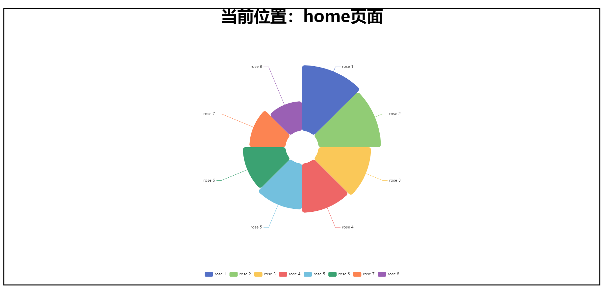
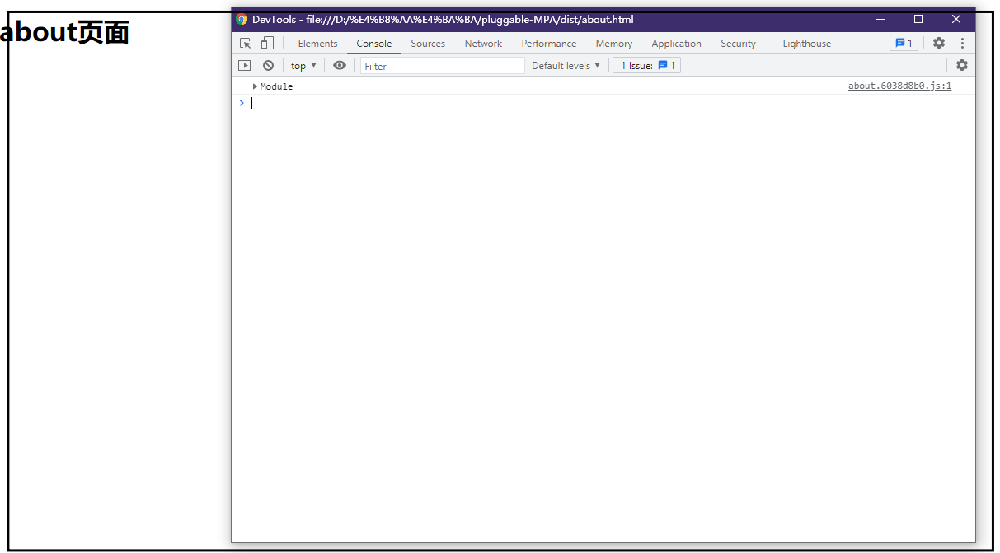
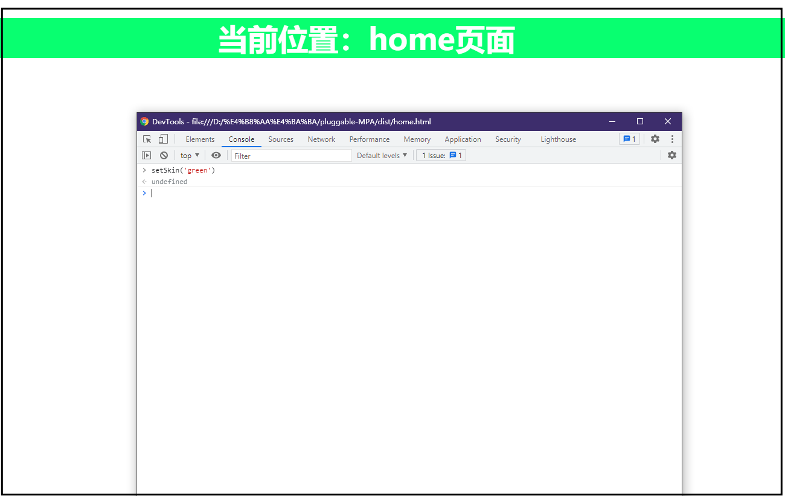

<!--
 * @Author: 鱼小柔
 * @Date: 2021-01-24 11:07:56
 * @LastEditors: your name
 * @LastEditTime: 2021-09-05 23:36:20
 * @Description: webpack chunk 相关的知识点和实战例子
-->

# webpack chunk

## 拆分 chunk 的意义

先说一个概念 code splitting  
代码分割（code splitting）① 和首屏加载优化有紧密的关系，利用 code splitting 的思想把一些首次加载不会用到的代码单独拆分出来，页面首次加载时不去请求这部分代码，进而提高首屏加载的速度。② 再比如，很多业务代码都引入了相同的第三方库，并且这个代码体积比较大，这个时候把这部分代码单独拆分出来，就可以减少入口形成的 chunk 的体积。并且单独拆分出文件也可以提高缓存的命中率。  
那和 chunk 有什么关系呢？  
webpack 最后输出的文件是 bundle，chunk 是 bundle 的前身。所以拆分 chunk 很大程度上决定了最后 bundle 是如何进行 code splitting 输出多个文件的

## chunk 来源

1. webpack 配置中的 entry(入口) 选项
2. import() 按需加载函数
   > import 命令、require() 函数不会产生 chunk。具体见[import()、import、require() 工作原理和区别](https://kittyfairy-han.github.io/knowledge-system/engineering/design/modularity.html#六、额外说明)
3. webpack 配置中的 optimization.splitchunk 选项

### entry

#### 对应关系 🖇️

每一个入口就会对应地形成一个 chunk。

entry 可以配置为字符串、数组、对象。前两种都是单入口；用对象形式配置的时，是多入口，形如 entry:{e1:'入口 1',e2:'入口 2'}。[详细写法说明](https://webpack.docschina.org/concepts/entry-points/#root)。

#### 举例说明 🌰

为了方便介绍 chunk 与 entry 的对应关系，下面用一个多页应用作为例子。

```code
  src
  ├── ...
  ├── pages
  |   ├── home //home 页面
  |   |    ├── main.js
  |   |    └── ...
  |   └── about //about 页面
  |        ├── main.js
  |        └── ...
  └── ...

```

webpack.config.js 中的配置

```js
// webpack.config.js
module.exports = {
  entry: {
    home: {"./src/pages/home/main.js"},
    about: "./src/pages/about/main.js",
  },
};
```

如果使用了 vuecli3 脚手架，vue.config.js 中的配置

```js
// vue.config.js
module.exports = {
  pages: {
    home: {
      // page 的入口(相对于项目的根目录)
      entry: `src/pages/home/main.js`,
      // 其他配置项...
    },
    about: {
      // page 的入口(相对于项目的根目录)
      entry: `src/pages/about/main.js`,
      // 其他配置项...
    },
  },
};
```

最后会对应的输出 2 个 html 和 2 个主要 js

```code
  dist
  ├── home.html //引入了home.[hash].js
  ├── about.html //引入了about.[hash].js
  └── assets
     ├── js
     |    ├── home.[hash].js //home入口形成的
     |    ├── about.[hash].js //about入口形成的
     |    └── ...
     └── ...

```

#### 小结 🎀

每个 entry 会对应形成一个 chunk 最后打包出来对应的 js 和 html。entry 会对应形成 chunk，但是它不是为了拆分 chunk 而生的，它是为了构建多页应用而生的。

> TIPS  
> entry.home、entry.about 可以配置为一个对象，支持的选项与拆分 chunk 没关系，所以这里就不介绍了。

### import()

#### 对应关系 🖇️

import() 一个具体的路径会把该模块静态引入的所有模块一起拆分为一个独立的 chunk；

import() 也可以是固定目录下，不固定的文件。  
例如， import(`src/skin/${color}.less`) 会把 src/skin 目录中的每个 .less 文件打包到新的 chunk 中。在运行时，计算完变量 color 后，映射到对应的文件。

import() 必须至少包含一些关于模块的路径信息，打包可以限定于一个特定的目录或文件集。也就是说 import([变量]/xxx/xxx) 是不允许的，但是 import([常量字符串路径]/xxx/xxx) 是允许的。

#### 举例说明 🌰

假设我现在有一个多皮肤的需求，每次只需要用到一套皮肤。目录结构如下

```code
  src
  ├── main.js
  ├── ...
  ├── skin
  |   ├── green.less 绿色主题样式文件
  |   └── blue.less 蓝色主题样式文件
  └── ...

```

这种情况就很适合用 import() 把每个主题形成一个 chunk 然后按需加载

```js
function setSkin(skin) {
  import(`../../skin/${skin}/index.less`);
}
```

另外，我们可以通过魔法注释对代码分割后的 chunk 有更多的控制权，可配置项有:webpackInclude、webpackExclude、webpackChunkName、webpackMode、webpackPrefetch、webpackPreload。[配置项含义和可接收的值看这里](https://webpack.docschina.org/api/module-methods/)
（import()一个具体路径，webpackInclude、webpackExclude 不可用）

=================================================================

- webpackInclude、webpackExclude 是用来对目录下文件进行一些筛选过滤。  
  本例希望 skin 目录下的所有 less 文件都会被打包。默认情况就是不进行筛选，全部参与打包，这两项可以不配置。
- webpackChunkName 为打包后的文件命名。  
  本例设置 webpackChunkName = "global-theme-"
- webpackMode 是与拆分 chunk 相关的一个关键配置。有四个值可选
- - 'lazy' 每个文件都生成一个独立的懒加载 chunk。blue.less->blue.css,green.less->green.css。懒加载的含义在于，执行 setSkin 的时候才去加载具体的文件。
- - 'lazy-once' 只生成一个独立的懒加载 chunk。也就是说 blue.less、green.less 会打包到一个 css 文件中。执行 setSkin 的时候才去加载这个文件。
- - 'eager' 不会生成独立的 chunk。如果 setSkin 这个函数是在 main.js 中定义的，那么 blue.less、green.less 会打包到主包中。
    > 值为 'eager' 与 静态 import 的区别？
    > 对于 less 文件来说和静态的 import 没有区别。但是对于 js 则表现不一样，假设 import() 的是一个 js 文件，那么执行 setSkin 的时候才把该 js 文件的内容执行一遍。

- - 'weak' 官网的解释没看懂 o(╥﹏╥)o。自己试验的过程中发现 green.less,blue.less 没有被打包进主包，也没有独立形成 chunk，调用 setSkin 的时候发生了报错。

  通过上面的分析本例设置 webpackMode = 'lazy' 满足独立分包的需求。默认配置就是 'lazy'，所以这项也可以不配置~

- webpackPrefetch、webpackPreload 与拆分 chunk 的关系不大，这两项主要是影响文件的加载时机。  
  本节末尾会简单介绍一下区别，默认是 webpackPrefetch:true。

=================================================================

最后，只要配置个名字就可以了

```js
function setSkin(color) {
  /* webpackChunkName: "global-theme-" */
  import(`../../skin/${color}/index.less`);
}
```

这样使用后，打包出来两个主题文件，名称为 global-theme-0.css、global-theme-1.css。

```code
  dist
  ├── assets / css
  |   ├── global-theme-0.css
  |   ├── global-theme-1.css
  |   └── ...
  └── ...

```

在入口 html 中引用的方式

```html
<link href=assets/css/global-theme-green.css rel=prefetch> <link
href=assets/css/global-theme-blue.css rel=prefetch>
```

prefetch 的表现：html 初始化时，本身时没有引入主题样式的，当执行 setSkin 函数的时候，浏览器去加载了对应的 css 文件内容。  
preload 的表现：html 初始化时，就去加载了 css 文件内容，当执行 setSkin 函数的时候，使对应的 css 文件生效。所以用 preload 可能会浪费一定的请求次数。

#### 小结 🎀

import() 会拆分出 chunk，但它是为了按需加载而生的，它也不是专门为了拆分 chunk 而生的。

### optimization.splitchunk

#### 对应关系 🖇️

splitchunk 有很多配置项，其中 **splitchunk.cacheGroups 对象中的每一项对应一个 chunk**。

optimization.splitchunk 是 webpack4+ 的一个内置插件。（webpack4 之前是 CommonsChunkPlugin）。  
splitchunk 可以更加细粒度的拆分 chunk，可以对 entry 形成的同步 chunk 和 import()形成的按需 chunk，再进行拆分和提取。  
比如多页面应用的场景下， 多个入口都引用了 echarts 这种比较大的第三方库，如果 cacheGroup 对象为空，那么每个入口形成的 chunk 都会包含一份 echarts 的代码。  
webpack[默认情况](https://webpack.docschina.org/plugins/split-chunks-plugin/#optimizationsplitchunks)下，cacheGroup 已经配置了两个组，但是不作用于入口形成的 chunk。如果是使用 vuecli3 这样的脚手架，它对 splitchunk 又进行了一些修改，它的默认情况(补充说明部分)会把入口 chunk 中的 echarts 和其他的 node_modules 模块一起拆分出来形成一个独立的 chunk。

#### 举例说明 🌰

对于以下的一个多页应用，假设我们想要把 echarts 单独拆分为一个 chunk 进而打包到一个独立的文件该怎么做呢？

```code
  src
  ├── ...
  ├── pages
  |   ├── home
  |   |    ├── main.js （import ./App.vue）
  |   |    ├── ...
  |   |    └── App.vue （import echarts）
  |   └── about
  |        ├── main.js （import ./App.vue）
  |        ├── ...
  |        └── App.vue （import echarts）
  └── ...

```

根据 cacheGroup 与 chunk 的对应关系，大概的思路

```js
module.exports = {
  // ...
  optimization: {
    splitChunks: {
      //... 默认
      cacheGroups: {
        //... 默认
        // 增加
         echarts: {
             // TODO 具体配置项
        },
      },
    }
  // ...
}

```

cacheGroup 有很多（将近 20 个）配置项， 下面介绍我在实践过程中用到的几个 name、chunks、test、minChunks、minSize、priority。（还有一些配置项我也还没有学习的很透彻，就不介绍了）

- name 是打包后的文件名。当我们设置 name 为 chunk-echarts 后，打包出来的文件名是 chunks-echarts.[hash].js

```js
module.exports = {
  // ...
  optimization: {
    splitChunks: {
      //... 默认
      cacheGroups: {
        //... 默认
        // 增加
         echarts: {
             name: "chunk-echarts",
        },
      },
    }
  // ...
}
```

chunks 和 test 共同决定哪些模块会被这个缓存组包括进来，最后形成一个 chunk。是一个“锁定目标”的作用。

- chunks 可以配置为函数或者是三个特定的值（'initial'、'async'、'all'）。  
  设置为 initial 代表这个缓存组只对入口形成的 chunk 起作用，设置为 async 只对按需 import()形成的 chunk 起作用，设置为 all 则可以共享同步和按需的 chunk。
  本例中，echarts 是静态 import 引入，会存在于入口形成的 chunk 中，所以 chunks = initial。
- test 值可以是函数或者正则。在 chunks 限制之上，再根据正则（或函数中定义的条件）进行模块名称的匹配。  
  我们就要匹配 echarts，所以设置 test = /(echarts)/ 。

（[type 选项](https://webpack.docschina.org/plugins/split-chunks-plugin/#splitchunkscachegroupscachegrouptype)也是用来锁定目标的，本例中没有使用到，暂不介绍）

```js
module.exports = {
  // ...
  optimization: {
    splitChunks: {
      //... 默认
      cacheGroups: {
        //... 默认
        // 增加
         echarts: {
             chunks: "initial", // 用all也行
             test: /(echarts)/,
        },
      },
    }
  // ...
}
```

除此之外，拆分 chunk 还有一些其他限制。同时满足这些条件才能成功的拆分出来 chunk

- minChunks 拆分前共享的最小 chunks 数。这其实是对使用频率的一个限制，结合本例具体展开说明是这样的：echarts 没拆分出来之前至少被在几个 chunk 所共享？  
  echarts 拆分前被 2 个 chunk 共享(我们设置了 chunks 是 initial，只考虑由 entry 形成的两个 chunk，home 和 about，这两个里面分别都用了 echarts),所以 minchunk 设置为 1 或者 2 都可以。默认值是 1，是可以满足需求的，这一项可以省略配置。
- minSize 拆分后最小字节数。这是对体积的一个限制，  
  echarts 拆分出来压缩前>8k，所以 minsize 可以设置为比 8k 小的数字就行。默认值是 20000，是可以满足需求的，这一项可以省略配置。
- splitChunks.maxInitialRequests 与入口 js 文件并行加载的文件个数（包括入口文件）进行限制。如果拆分的 chunk 超出这个数目，优先体积大的 chunk 独立拆分出来。  
  本例中，home 页面，与入口 home.js 一起加载的有 node_moudles 形成的 chunk，echarts 形成的 chunk。一共三个，所以 maxInitialRequests 应该设置为>=3 的数字。
- splitChunks.maxAsyncRequests 对按需加载并行次数进行限制。其他要点与 maxInitialRequests 想同。
  > 注意这两个不是属于每个 cacheGroup 的配置项，是 splitChunks 的配置项。
- enforce 是用来打破限制的，告诉 webpack 忽略 minChunks、minChunks、maxAsyncRequests 和 maxInitialRequests 选项，并始终为此缓存组创建 chunk。

```js
module.exports = {
  // ...
  optimization: {
    splitChunks: {
      //... 默认
      cacheGroups: {
        //... 默认
        maxInitialRequests:5,
        // 增加
         echarts: {
             chunks: "initial", // 用all也行
             test: /(echarts)/,
             // minChunks:1,//默认行为
             // minsize:20000,//默认行为
        },
      },
    }
  // ...
}
```

优先级相关

- priority 这个配置项是用来协调各个缓存组之间的优先级的。  
  默认情况下 webpack 已经内置了两组缓存  
  ① 是来自 node_modules 中的模块会独立出一个 chunk，这组的优先级是-10。
  ② 是被重复使用（引用次数>=2）的模块会独立出一个 chunk，这组的优先级是-20。  
  echarts 它即是来自 node_modules、是被重复使用、也是满足我们自定义的缓存组的。我们要让它最终归属于我们自定义的缓存组，那么 priority 就要高于-10、-20。priority 的默认值是 0，大于默认两组的优先级，这一项也可以省略配置。

```js
module.exports = {
  // ...
  optimization: {
    splitChunks: {
      //... 默认
      maxInitialRequests:5,
      cacheGroups: {
        //... 默认
        // 增加
         echarts: {
             chunks: "initial", // 用all也行
             test: /(echarts)/,
             // minChunks:1,//默认行为
             // minsize:20000,//默认行为
             // priority: 0,//默认行为
        },
      },
    }
  // ...
}
```

上面提到的 cacheGroup 中的配置项，chunks、maxAsyncRequests、maxInitialRequests、minChunks、minSize ，也可以作为 splitChunks 的配置项进行一个全局配置。当 cacheGroup 中没有配置的时候，就用 splitChunks.xxx 的值。如果 cacheGroup 中配置了，那么就用 cacheGroup 中配置的值。  
自定义拆分 chunk 后要在入口配置一下，这样才能在 html 中正常引入。

```js
// vue.config.js
module.exports = {
  pages: {
    home: {
      // page 的入口(相对于项目的根目录)
      entry: `src/pages/home/main.js`,
      // 其他配置项...
      // 与入口js一起加载的
      chunks: ["chunk-echarts", "chunk-vendors", "chunk-common", "home"], //默认是['chunk-vendors', 'chunk-common', 'index']
    },
    about: {
      // page 的入口(相对于项目的根目录)
      entry: `src/pages/about/main.js`,
      // 其他配置项...
      // 与入口js一起加载的
      chunks: ["chunk-echarts", "chunk-vendors", "chunk-common", "home"], //默认是['chunk-vendors', 'chunk-common', 'index']
    },
  },
  chainWebpack: (webpackConfig) => {
    // 其他配置...
    /* 主动分 chunk */
    webpackConfig.optimization.splitChunks({
      cacheGroups: Object.assign(
        {},
        defaultCacheGroups,
        config.customCacheGroups
      ),
    });
  },
};
```

打包后 chunk-echarts 会在 dist/assets/js 下。并且会和入口 js 一起在页面启动时就加载。

#### 小结 🎀

当原始 chunk（entry 形成的、import()形成的),需要再次拆分以便于提取出公共部分或则其他用途就适合派出 splitChunks 啦 !

### 补充说明

- vuecli3 中 splitchunk 的默认配置

```js
{
  cacheGroups: {
    vendors: {
      name: 'chunk-vendors',
      test: /[\\\/]node_modules[\\\/]/,
      priority: -10,
      chunks: 'async'
    },
    common: {
      name: 'chunk-common',
      minChunks: 2,
      priority: -20,
      chunks: 'async',
      reuseExistingChunk: true
    }
  }
}
```

## 示例使用

[代码地址](https://github.com/KittyFairy-Han/pluggable-MPA/tree/learning/webpack-chunk)

1. 下载到本地
2. npm i
3. npm run build_test
4. 查看 dist 文件夹，打包结果应该是如下这样的：

```code
  dist
  ├── home.html
  ├── about.html
  └── assets
     ├── js
     |    ├── home.[hash].js //home入口形成的
     |    ├── about.[hash].js //about入口形成的
     |    ├── chunk-echarts.[hash].js //通过splitchunk对echarts进行了拆分，独立出一个文件
     |    ├── chunk-vendors.[hash].js //splitchunk默认配置下，node_modules中的模块独立出一个文件
     |    ├── app-theme-0.[hash].js //配合app-theme-0.css
     |    └── app-theme-1.[hash].js //配合app-theme-1.css
     └── css
          ├── home.css //webpack默认配置会把入口js中的css代码单独拆分出一个css文件
          ├── about.css //webpack默认配置会把入口js中的css代码单独拆分出一个css文件
          ├── app-theme-0.css //通过import()动态引入主题文件，产生了一个独立的异步加载文件
          └── app-theme-1.css //通过import()动态引入主题文件，产生了一个独立的异步加载文件
```

3. 本地打开 home.html、about.html。能够正常启动。
   
   
4. home 页面，浏览器控制台执行 setSkin('green')。能够应用绿色主题
   

## 参考文档
[webpack](https://webpack.js.org/)   
