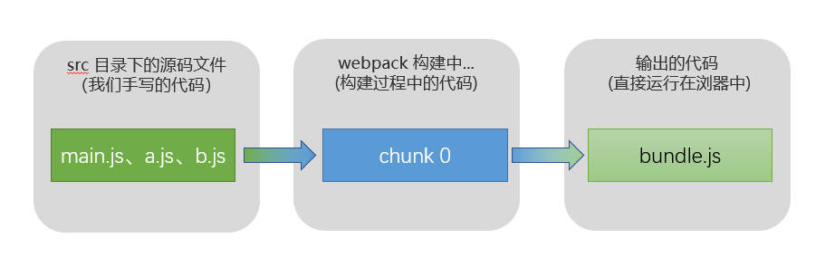
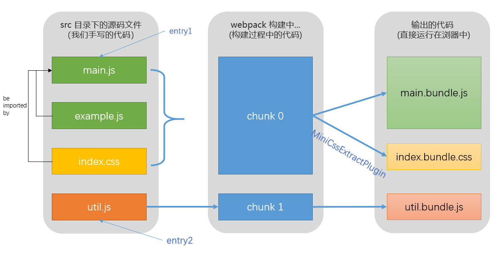

# webpack 工作流程

这篇文章没有贴源码，仅作为自己学习的一个小总结和(✿◠‿◠)，欢迎大佬们指正。希望以后可以更加深入源码，把每一步的关键源码真正看懂(ง •_•)ง！  
进入正题啦  
了解总体的工作流程，首先要了解 webpack 中的一些核心概念。

## 核心概念

### module

模块。<br>
module 是 webpack 的中的核心实体，要加载的一切和所有的依赖都是 module，可以理解为一个文件就是一个 module，我们写的代码都是 moudle。

### entry

入口、起点。<br>
webpack 会对我们写的代码进行编译、查找依赖。entry 就是编译过程中第一个进行编译的文件。如 main.js

> webpack 支持多入口，打包出多个 html 文件。

### loader

模块转换器。<br>
把浏览器中不能直接运行的代码转换成浏览器中可以直接运行的代码。举几个例子：

- babel-loader 通过它把 ES6 转换成 ES5
- ts-loader 把 typescript 转换成 JavaScript
- less-loader 把 less 转换成 css
- css-loader 对 css 样式进行处理
- style-loader 把打包的样式插入到 HTML 结构中

比如我们开发的时候使用了 ES6 新的特性语法，那么就需要 webpack 在打包流程中用 babel-loader 把浏览器不理解的 ES6 语法转换为浏览器理解的 ES5 语法。一般我们日常业务开发无需自己写 loader，都是直接使用第三方库。

### plugin

webpack 打包构建的流程比作一条生产线，那么插件就像是插入到生产线中的一个功能，在特定的时机对生产线上的资源做处理。
webpack 在运行过程中会广播事件，插件只需要监听它所关心的事件，就能加入到这条生产线中，去改变生产线的运作。 webpack 通过 [Tapable](https://juejin.cn/post/6844903588112629767) 来组织这条复杂的生产线。 webpack 的事件流机制保证了插件的有序性，使得整个系统扩展性很好。

### chunk、bundle 与 moudle

module、chunk、bundle 这三个都可以理解为文件，区别在于：我们直接写出来的是 module，webpack 处理时是 chunk，最后生成浏览器可以直接运行的 bundle。也可以这样理解，module，chunk 和 bundle 其实就是同一份逻辑代码在不同转换场景下的取了三个名字。



> chunk 知识细节见 chunk 章节

#### 用一个具体例子表现 module、chunk 和 bundle 的关系

- src 目录结构

```code
  src
  ├── index.css
  ├── index.html # 这个是 HTML 模板代码
  ├── index.js
  ├── common.js
  └── utils.js
```

- 代码

```js
// mian.js
import "./example.js";
import "./index.css";
// example.js
console.log("a module file for example");
// util.js
export function square(a) {
  return a * a;
}
```

```css
/* index.css */
body {
  background-color: green;
}
```

```js
// webpack 配置
moudle.exports={
    entry: {
        index: "../src/main.js",
        utils: '../src/utils.js',
    },
    output: {
        filename: "[name].bundle.js", // 两个 bundle 文件名与两个 entry 对应
    },
    module: {
        rules: [
            {
                test: /\.css$/,
                use: [
                    MiniCssExtractPlugin.loader, // MiniCssExtractPlugin 创建一个 link 标签
                    'css-loader', // css-loader 负责解析 CSS 代码, 处理 CSS 中的依赖
                ],
            },
        ]
    }
    plugins: [

        new MiniCssExtractPlugin({ // MiniCssExtractPlugin 抽离出 css 文件，以 link 标签的形式引入样式文件
            filename: 'index.bundle.css' // 输出的 css 文件名为 index.bundle.css
        }),
    ]
}
```

- 关系图
  

前面说到的是面向使用者的重要概念，下面说一写 webpack 打包构建中（webpack 源码中）的重要概念。

### compiler、complication

- compiler  
  可以理解为 webpack 编译的调度中心，是一个编译器实例，在 compiler 对象中记录了完整的 webpack 环境信息，在 webpack 的每个进程中，compiler 只会生成一次。（举例，npm run dev 一次只有一个 compiler)
- complication  
  是 compiler 的生命周期内一个核心对象，它包含了一次构建过程中所有的数据(modules、chunks、assets)。也就是说一次构建过程对应一个 complication 实例。（举例，比如热更新的时候，webpack 会监听本地文件改变，改变了重新生成一个 complication）

### compiler 几个重要的钩子：

- make ：在钩子的回调中有开始读取 webpack 配置文件的逻辑
- emit ：在钩子的回调中执行生成文件（也就是 bundle）的逻辑
- done ：文件已写入文件系统后触发这个钩子

### complication 几个重要的方法

- addEntry
- seal
- emitAssets

### AST

抽象语法树。通过它来表示各个模块的以来关系。

## 主线剧情


webpack 就像一条生产线，要经过一系列处理流程后才能将源文件转换成输出结果。 这条生产线上的每个处理流程的职责都是单一的，多个流程之间有存在依赖关系，只有完成当前处理后才能交给下一个流程去处理。  
webpack 源码非常复杂，想完全看明白源码太困难，对于应用它的人来说，只要看懂主线剧情就可以了。主线剧情就是从读取配置文件中的 entry 开始，到最后输出 bundle 的过程。

#### 具体是解开哪些疑问呢？

- webpack 编译我们的源码过程中具体都做了些什么？
- loader 是在哪个过程起作用的？
- 依赖树是怎么形成的？
- chunk 是如何划分的？
- 最后怎么形成 bundle 的？

### 1.准备工作阶段

1. 初始化 compiler 对象，注册内置插件和配置文件中的插件。
2. 执行 compiler.run-->compiler.compile 开始构建流程。
3. compiler.compile 中创建此次编译的 complication 对象，触发 compiler 的 **make 钩子**。
4. compiler 的 make 钩子中，主要做两件事。  
   一是执行 compiler.hooks.make.callAsync()负责应用各个 plugin（执行订阅了 make 钩子的 plugin 的回调函数）。  
   二是执行 **complication.addEntry()** 进入主线剧情。

### 2.modules 的生成阶段


> （这里的 modules 指 webpack 模块化后的 JS 对象非手写的源文件）

1. addEntry  
   addEntry 方法会开始第一批 module 的解析，即我们配置的入口文件（例如 main.js）。addEntry 主要执行\_addModuleChain(),\_addModuleChain 中调用**addModule**
2. addModule
   ，使用对应的工厂 NormalModuleFactory （具体方法是 create）生成一个空的 webpack 模块化 对象。把它 存入 complication.modules 中，由于当前是入口文件，也会存入 complication.entries 中。随后执行 buildModule->**doBuild**。

   > 在创建 complication 的时候 compiler 对象会开始实例化两个核心的工厂对象，分别是 NormalModuleFactory 和 ContextModuleFactory。

3. doBuild
   读取 module 中内容并进行处理。用对应的 **loaders** ，把我们的源码 module 转成标准的 JS 模块对象。然后执行 **parse()**
4. parse  
   将 JS 解析为 AST。然后**遍历 AST**。
5. 遍历 AST  
   找到入口中的所有依赖 module，加入 dependencies 数组。再依次对 dependencies 中的依赖 module 进行 2->-3->4->5 的过程，这是一个递归遍历过程，会把所有的原来的 module 源码 都聚合到一个对象（后面称为“chunk 初始态对象”）中。如果发现动态引入例如 import(),那么就开启新的一轮\_addModuleChain。
6. 直到每一轮的递归结束，执行 **seal()** ，进入下一个阶段。此时调用多少次\_addModuleChain,就形成了多少个依赖树，就有多少个 chunk 初始态对象。

#### 概括

根据配置中的 entry 找出所有的入口文件，从 entry 开始，使用到 loader 先完成模块转换，然后解析形成 AST，接着遍历 AST 把所有 require 找出来形成 依赖树。递归遍历依赖树节点对应的文件，做相同的模块转换、形成依赖树的处理，直到递归结束。这样就形成了一个 chunk 初始态对象。
如果遇到动态的 import，那么就和上面对 entry 的处理一样，最后形成一个独立的 chunk 初始态对象。

### 3.chunks 生成阶段


1. seal  
   执行**createChunkAssets()**
2. createChunkAssets
   主要调用 MainTemplate.render()或者 ChunkTemplate.render()。MainTemplate.render 对入口形成的 chunk 对象进行处理，ChunkTemplate.render 对动态引入形成的 chunk 对象进行处理。处理知之后的对象可以理解为固定结构的字符串 。然后分别调用 **ModuleTemplate.render()**
   > 其实上面的 xxxTemplate 是和 complication 同时初始化的。
3. ModuleTemplate.render
   保存了最终需要输出到文件的 js 代码字符串。然后执行 **emitAsset()**。
4. emitAsset  
   将生成好的字符串保存到 complication.assetes 中。assets 就是最终更要生成的文件列表。至此 **complication** 实例的工作到此也全部**结束**。

#### 概括

complication.seal 方法用于生成 chunks，对 chunks 进行一系列的优化操作，形成的 chunk 保存在 complication.assets 中。

### 4.生成 bundle 文件阶段

1. assets 准备好后，触发 compiler 的 **emit 钩子**
2. emit 钩子，主要做两件事。  
   一是 compiler.hooks.emit.callAsync()负责应用各个 plugin（执行订阅了 emit 钩子的 plugin 的回调函数，这是我们修改最终文件的最后一个机会。  
   二是 遍历 complication.assets 生成所有 bundle 写入文件系统，写入后触发 compiler 的 **done 钩子**。
3. 到了 done 钩子，就代表结束构建流程了。

## 参考

[github·aasailan-webpack 运行流程](https://github.com/lihongxun945/diving-into-webpack/blob/master/6-process-pipe-line.md)
[github·lihongxun945-Webpack 源码解析](https://github.com/lihongxun945/diving-into-webpack)
[webpack 官网·https://webpack.docschina.org/](https://github.com/lihongxun945/diving-into-webpack)
