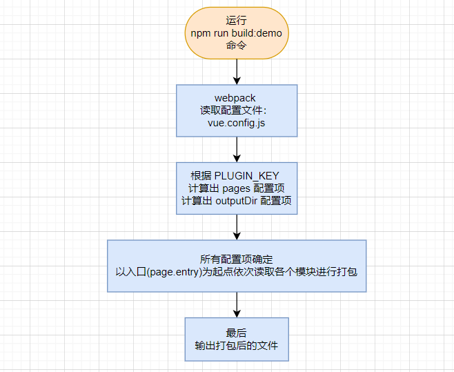

<!--
 * @Author: 鱼小柔
 * @Date: 2021-09-25 11:04:00
 * @LastEditors: your name
 * @LastEditTime: 2021-09-25 15:47:40
 * @Description: file content
-->

# 一个工程多个app包

## 背景

工作中的一个项目称为 iarrm，遇到过一个插件化的需求，具体的业务场景是这样的:  
客户端有多个标签(可以理解为几个功能按钮的组合体)，标签类型有多种。每种类型的标签支持以插件的形式独立安装，安装后，客户端就携带这种插件的功能。点击一个标签中的一个按钮，根据当前标签的类型和点击的按钮，唤起对应的 web 页面, 相当于浏览器打开一个新的标签页。  
例如，安装了人脸插件的客户端，就携带有查看人脸抓拍历史、人脸实时抓拍情况、人脸数据统计图等功能。当点击人脸标签上的人脸历史按钮时，就打开人脸历史的 web 页面，使用其中的功能。

> 标签的多种类型，从业务角度来讲，是对应多种不同的监控摄像头；从代码角度来讲，是对应多个 iarrm 插件。


## 基本思路

“插件化” 这个概念映射到前端工程代码，该怎么理解呢？

① 根据需求多个插件完全独立，就说明每个插件 ≈ 完整前端应用包

> TIPS  
> 准确来讲每个插件对应前端应用包+后端应用包，但是我们这里不讨论后端。  
> 下文前端应用包或插件会使用 app 代指

这些插件对于前端开发来说，大多数的依赖和使用的组件都是相同的（比如上图的人脸、卡口插件都包含历史这个页面，页面上的具体功能都差不多)。
所以正确的方案应该是**一个前端工程，可以输出多个不同的 app**。这样更方便的实现组件的复用，也更方便项目的维护。

② 根据需求，客户端标签中的每个按钮都会唤起一个 web 页面，所以每个 app 都包含多个 page，这是典型的 MPA。  
所以我们的**每个 app 都是一个 MPA** 即多页面应用。

## 具体方案

我们以要输出 demo、other 两个插件为例，继续往下说~  
具体：demo 和 other，demo 包含两个页面 home 和 about，other 包含一个页面 home。

### 目录定制

#### 插件结构

```code
iarrm
  ├── demo
  |   ├──home
  |   └──about
  └── other
      └──home
```

#### 打包后输出目录

我们期望生成的目录是这样滴，并且希望可以单独输出一个插件或多个插件一起输出

```

 plugins
      └── demo
      |   ├── demo-home.html
      |   ├── demo-about.html
      |   └── assets
      |       ├── js
      |       ├── css
      |       └── img
      └── other
          ├── other-home.html
          └── assets
              ├── js
              ├── css
              └── img

```

#### 源码中的目录

那么，在源码中，目录的基本骨架可以这样设置

```
project
├── ...
└──src
  └── apps
      ├── demo                 // ~ app
      |   ├── home             // ~ page
      |   |   ├──main.js
      |   |   └──App.vue
      |   └── about            // ~ page
      |       ├──main.js
      |       └──App.vue
      └── other                // ~app
          └── home            // ~ page
              ├──main.js
              └──App.vue


```

文件内容


### 打包配置

通过命令行去控制具体输出某一个或多个 app  
配置命令行，关键点是 set PLUGIN_KEY=xxx

```json
//package.json
"scripts": {
    "build:demo": "set PLUGIN_KEY=demo&&vue-cli-service build", //想要输出demo插件则执行这个命令
    "build:other": "set PLUGIN_KEY=other&&vue-cli-service build",//想要输出other插件则执行这个命令
    "build": "npm run build:demo&&npm run build:other",//想要依次输出多个插件则用&&相连命令行
  }
```

为每个插件配置输出位置

```js
module.exports = {
  outputDir: `dist/${process.env.PLUGIN_KEY}`,
};
```

配置 MPA，即为每个插件配置多页面。

```js
const apps = {
  demo: {
    home: {
      entry: `src/apps/demo/home/main.js`, // page 的入口(相对于项目的根目录)
      template: `src/common/template/index.html`, // 模板来源(相对于项目的根目录)
      filename: `demo-home.html`, // 输出位置(相对于 outputDir
    },
    about: {
      entry: `src/apps/demo/about/main.js`,
      template: `src/common/template/index.html`,
      filename: `demo-about.html`,
    },
  },
  other: {
    home: {
      entry: `src/apps/other/home/main.js`,
      template: `src/common/template/index.html`,
      filename: `other-home.html`,
    },
  },
};
module.exports = {
  pages: apps[process.env.PLUGIN_KEY],
  //当 PLUGIN_KEY 为 demo 的时候，打包 demo 下的页面。
  //    ......       other     .....  other
};
```

以输出 demo 插件为例，流程可以概括为  


### 实现效果

运行 npm run build:demo 试一下吧  


那如果 npm run build 是怎样的呢，看图就知道啦  


依次启动两次打包流程，相当于  
① 手动 npm run build:demo 输出文件后。  
② 然后再手动 npm run build:other 输出文件。

打包后的目录  


直接打开 html 文件，看看能否正常加载到资源正常运行  


大功告成！  
以上已经能达到插件化的基本需求，对于生产环境来说没什么问题。但是对于开发环境下可能会不太方便，我们可能需要同时开发多个插件的多个页面。应该怎么做呢？

### 针对开发环境的改造

开发环境下我们就不分插件，让 apps 下面的所有 page 都参与打包。所以我们需要修改一下 pages 配置项，其他配置项不变。

```js
const pages = {
  demoHome: {
    entry: `src/apps/demo/home/main.js`, // page 的入口(相对于项目的根目录)
    template: `src/common/template/index.html`, // 模板来源(相对于项目的根目录)
    filename: `demo-home.html`, // 输出位置(相对于 outputDir
  },
  demoAbout: {
    entry: `src/apps/demo/about/main.js`,
    template: `src/common/template/index.html`,
    filename: `demo-about.html`,
  },
  otherHome: {
    entry: `src/apps/other/home/main.js`,
    template: `src/common/template/index.html`,
    filename: `other-home.html`,
  },
};
module.exports = {
  pages: pages,
  // apps下所有page
};
```

然后我们 npm run serve 启动项目  
可以正常运行

这样就可以同时开发多个插件了

### 更自动化

上面的方案，每次新增插件或者页面的时候都需要重新配置。如果想要更自动化一点，可以利用 node 去读取固定目录下的文件，自动生成 pages。
在 vue.config.js 同级位置增加一个 config 目录

```code
project
  ├── ...
  ├── config
  |    ├── dev.js
  |    ├── prod.js
  |    └── util.js
  └── vue.config.js

```

util.js 中定义一些公用的 node 方法

```js
const path = require("path");
const fs = require("fs");

function getAppKeys() {
  const pluginsPath = path.resolve(__dirname, "../src/apps");
  const appKeys = fs.readdirSync(pluginsPath);
  return appKeys;
}
function getPageNames(appKey) {
  const pagesPath = path.resolve(__dirname, `../src/apps/${appKey}`);
  const pageNames = fs.readdirSync(pagesPath);
  return pageNames;
}

function setPage(appKey, pageName) {
  return {
    // page 的入口(相对于项目的跟目录)
    entry: `src/apps/${appKey}/${pageName}/main.js`,
    // 模板来源(相对于项目的跟目录)
    template: `src/common/template/index.html`,
    // 输出位置(相对于 outputDir
    filename: `${appKey}-${pageName}.html`,
    // 当使用 title 选项时，
    // template 中的 title 标签需要是 <title><%= htmlWebpackPlugin.options.title %></title>
    title: `${appKey}标签${pageName}页面`,
  };
}
module.exports = {
  getAppKeys,
  getPageNames,
  setPage,
};
```

dev.js 中是针对开发环境的配置

```js
const { getAppKeys, getPageNames, setPage } = require("./utils");
const getAllPages = () => {
  const pages = {};
  const pluginKeys = getAppKeys();
  for (const pluginKey of pluginKeys) {
    const pageNames = getPageNames(pluginKey);
    for (const pageName of pageNames) {
      pages[`${pluginKey}-${pageName}`] = setPage(pluginKey, pageName);
    }
  }
  return pages;
};

module.exports = {
  publicPath: "/",
  // ...
  pages: getAllPages(),
};
```

prod.js 中是针对生产环境的配置

```js
/*
 * @Author: 鱼小柔
 * @Date: 2020-12-26 15:30:15
 * @LastEditors: your name
 * @LastEditTime: 2021-09-25 15:21:24
 * @Description: 开发环境配置，会被vue.config.js引入和使用
 */
const { getPageNames, setPage } = require("./utils");
const getPagesFrom = (appKey) => {
  const pages = {};
  const pageNames = getPageNames(appKey);
  for (const pageName of pageNames) {
    pages[`${appKey}-${pageName}`] = setPage(appKey, pageName);
  }
  return pages;
};

module.exports = {
  publicPath: "./",
  // ....
  outputDir: `dist/${process.env.PLUGIN_KEY}`,
  pages: getPagesFrom(process.env.PLUGIN_KEY),
};
```

vue.config.js 中根据环境变量进行区分，引入相应的配置

```js
const config =
  process.env.NODE_ENV === "production"
    ? require("./config/prod.js")
    : require("./config/dev.js");


module.exports = {
  // html中资源引入时的根路径
  publicPath: config.publicPath,
  // 输出包的根目录(相对于项目根目录
  outputDir: config.outputDir,
  // 静态资源目录（相对于outputDir
  assetsDir: "assets",

  pages:config.pages,

  // ...
};
```
## 资料
[完整的代码在这里](https://github.com/KittyFairy-Han/study-demos)
