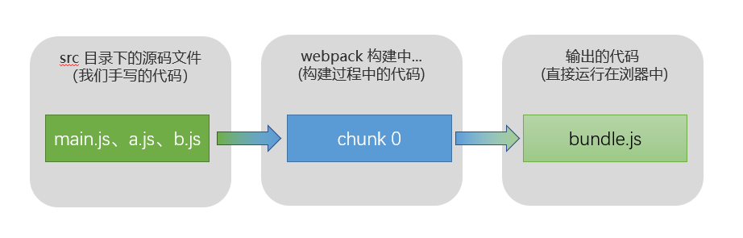
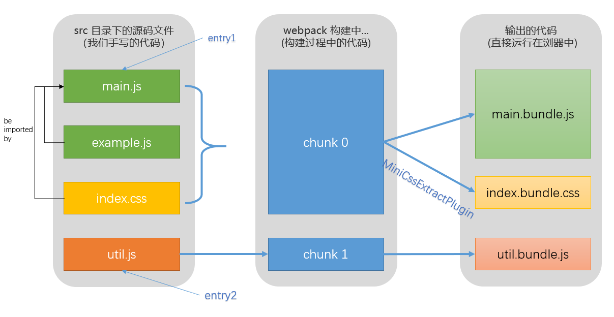
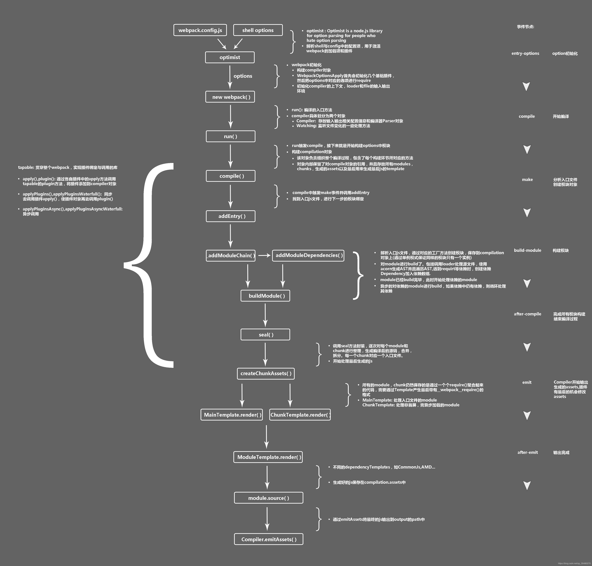

# webpack 工作流程

## 为什么要打包和构建

#### 代码层面

- 体积更小：Tree-Shaking,压缩、合并,加载更快

- 编译高级的语言和语法：TS,ES6+,模块化,less,scss

- 兼容性和错误检查：Polyfill，postcss，eslint

#### 流程方面

- 统一、高效的开发环境

- 统一的构建流程和产出标准

- 集成公司构建规范：提测、上线等

## 核心概念

### module

模块。Module 是 webpack 的中的核心实体，要加载的一切和所有的依赖都是 Module，一个文件就是一个 module。

### entry

入口、起点。webpack 会对我们写的代码进行编译、查找依赖，entry 就是编译过程中第一个进行编译的文件。

> webpack 支持多入口，打包出多个 html 文件。

### loader

模块转换器。把浏览器中不能直接运行的代码转换成浏览器中可以直接运行的代码。举几个例子：

- babel-loader 通过它把 ES6 转换成 ES5
- ts-loader 把 typescript 转换成 JavaScript
- less-loader 把 less 转换成 css
- css-loader 对 css 样式进行处理
- style-loader 把打包的样式插入到 HTML 结构中

### plugin

webpack 打包构建的流程比作一条生产线，那么插件就像是插入到生产线中的一个功能，在特定的时机对生产线上的资源做处理。
webpack 在运行过程中会广播事件，插件只需要监听它所关心的事件，就能加入到这条生产线中，去改变生产线的运作。 webpack 通过 [Tapable](https://juejin.cn/post/6844903588112629767) 来组织这条复杂的生产线。 webpack 的事件流机制保证了插件的有序性，使得整个系统扩展性很好。

### chunk、bundle

我们直接写出来的是 module，webpack 处理时是 chunk，最后生成浏览器可以直接运行的 bundle。



#### 先回顾一下 module

当手写下一个一个的文件，它们无论是 ESM 还是 commonJS 或是 AMD，他们都是 module。但是他们并不是浏览器可以直接运行的文件。

#### chunk

当 webpack 对 module 源文件进行处理时，webpack 会根据依赖关系生成 chunk 文件。

> chunk 知识细节见 chunk 章节

#### bundle

当 webpack 对 chunk 文件处理后，最后输出的就是 bundle 文件。 bundle 文件才可以直接在浏览器中运行。

#### 其实，module，chunk 和 bundle 其实就是同一份逻辑代码在不同转换场景下的取了三个名字。

#### 用一个例子表现 module，chunk 和 bundle

- 目录结构

```code
  src
  ├── index.css
  ├── index.html # 这个是 HTML 模板代码
  ├── index.js
  ├── common.js
  └── utils.js
```

- 文件内容

```js
// mian.js
import "./example.js";
import "./index.css";
// example.js
console.log("a module file for example");
// util.js
export function square(a) {
  return a * a;
}
```

```css
/* index.css */
body {
  background-color: green;
}
```

- webpack 配置

```js
moudle.exports={
    entry: {
        index: "../src/main.js",
        utils: '../src/utils.js',
    },
    output: {
        filename: "[name].bundle.js", // 两个 bundle 文件名与两个 entry 对应
    },
    module: {
        rules: [
            {
                test: /\.css$/,
                use: [
                    MiniCssExtractPlugin.loader, // MiniCssExtractPlugin 创建一个 link 标签
                    'css-loader', // css-loader 负责解析 CSS 代码, 处理 CSS 中的依赖
                ],
            },
        ]
    }
    plugins: [

        new MiniCssExtractPlugin({ // MiniCssExtractPlugin 抽离出 css 文件，以 link 标签的形式引入样式文件
            filename: 'index.bundle.css' // 输出的 css 文件名为 index.bundle.css
        }),
    ]
}
```



## 主线流程


<br>
webpack 就像一条生产线，要经过一系列处理流程后才能将源文件转换成输出结果。 这条生产线上的每个处理流程的职责都是单一的，多个流程之间有存在依赖关系，只有完成当前处理后才能交给下一个流程去处理。
<br>
webpack 源码非常复杂，想完全看明白源码太困难，对于应用它的人来说，只要看懂主线剧情就可以了。主线剧情就是从配置文件读取 entry 开始，到最后输出 bundle.js 的过程。在 webpack 内部逻辑中就是 compilation.addEntry 方法开始。

#### 解开哪些疑问？

- webpack 编译我们的源码过程中具体多做了写什么？
- loaders 在哪个过程起作用的？
- 依赖树是怎么形成的？
- 最后形成的 bundle 是怎么划分的？

#### 编译中的重要概念

- compiler
  compiler 可以理解为 webpack 编译的调度中心，是一个编译器实例，在 compiler 对象记录了完整的 webpack 环境信息，在 webpack 的每个进程中，compiler 只会生成一次。
- Compilation
  compiler 的生命周期内一个核心对象，它包含了一次构建过程中所有的数据(modules、chunks、assets)。也就是说一次构建过程对应一个 Compilation 实例。
- compiler 几个重要的钩子：
- - make 在钩子的回调中有 compilaiion.addEntry 方法
- - emit 在钩子的回调中执行生成文件的逻辑
- - done 文件已写入文件系统后触发

### 1.准备工作阶段

1. webpack 启动入口，我们对 webpack 的配置会传入这个入口。
2. 用上一步得到的参数初始化 Compiler 对象，注册内置插件和配置文件中的插件。
3. 初始化 compiler 后，启动 compiler.run 来构建文件，代表着要开始编译了。
4. compiler.compile 开始真正执行我们的构建流程。在这个阶段，Compiler 对象会开始实例化两个核心的工厂对象，分别是 NormalModuleFactory 和 ContextModuleFactory。工厂对象后续用来对应创建 NormalModule 和 ContextModule 实例。
5. 创建此次编译的 Compilation 对象，在创建 Compilation 实例时会触发钩子 compilaiion 和 thisCompilation。
6. 创建完 Compilation 实例后，webpack 的准备阶段已经完成，下一步将开始 modules 的生成阶段。

### 2.modules 的生成阶段

- 概括：根据配置中的 entry 找出所有的入口文件，从 entry 开始，使用到 loader 先完成模块转换，形成 AST，然后遍历 AST 把所有 require 找出来形成 依赖树。递归遍历依赖树节点对应的文件，每个文件都经历上述 loader-AST-module 这个过程，直到递归结束。

1. this.hooks.make.callAsync()：执行订阅了 make 钩子的插件的回调函数。make 在钩子的回调中有调用 compilaiion.addEntry 的逻辑。
2. compilation.addEntry： addEntry 方法会触发第一批 module 的解析，即我们在 entry 中配置的入口文件。addEntry 主要执行\_addModuleChain()
3. \_addModuleChain：使用对应的工厂函数 NormalModuleFactory.create 方法生成一个空的 module 对象，回调中会把此 module 存入 compilation.modules 对象和 dependencies.module 对象中，由于是入口文件，也会存入 compilation.entries 中。随后执行 buildModule 进入真正的构建 module 内容的过程
4. buildModule： buildModule 中调用了 doBuild，doBuild 调用了相应的 loaders ，把我们的模块转成标准的 JS 模块。
5. Parser.parse：经过 doBuild 之后，我们的任何模块都被转成了标准的 JS 模块。接下来就是调用 Parser.parse 方法，将 JS 解析为 AST。
6. 遍历 AST 找到所有依赖，得到 dependencies 数组。再依次对其他文件进行 2->-3->4 的过程直到遍历结束。具体的递归思路是：每个 module 解析完成之后，都会触发 Compilation 例对象的 succeedModule 钩子，订阅这个钩子获取到刚解析完的 module 对象。随后，webpack 会遍历 module.dependencies 数组，递归解析它的依赖模块生成 module。
7. make 阶段到此结束，接下去会触发 compilation.seal 方法，进入下一个阶段。

### 3.chunks 生成阶段

- 总述：compilation.seal 方法主要生成 chunks，对 chunks 进行一系列的优化操作，并生成要输出的代码。

1. compilation.seal： 从 entry 中的 module 开始，生成一个新的 chunk 包含 entry 中的所有 module。
2. 遍历 module.dependencies，将其依赖的模块也加入到上一步生成的 chunk 中。若某个 module 是动态引入的，为其创建一个新的 chunk，接着遍历依赖。(比如 import() 函数就会创建一个新的 chunk)
   > 在生成 chunk 的过程中与过程后，webpack 会对 chunk 和 module 进行一系列的优化操作，优化操作大都是由不同的插件去完成。
3. compilation.createChunkAssets： 生成 chunk 后，compilation.seal 中调用 compilation.createChunkAssets 方法，遍历 chunks，来渲染每一个 chunk 生成代码。其实，compilation 对象在实例化时，同时还会实例化三个对象，分别是 MainTemplate, ChunkTemplate 和 ModuleTemplate。这三个对象是用来渲染 chunk，得到最终代码模板的。
4. emitAsset：每个 chunk 的源码生成之后，会调用 emitAsset 将其存在 compilation.assets 中。当所有的 chunk 都渲染完成之后，assets 就是最终更要生成的文件列表。
5. 至此，compilation 的 seal 方法结束，也代表着 compilation 实例的所有工作到此也全部结束，接下来触发 compiler 的 emit 钩子。

### 4.生成文件阶段

compiler emit 钩子触发，这是我们修改最终文件的最后一个机会，在此之后，我们的文件就不能改动了。webpack 会直接遍历 compilation.assets 生成所有文件，然后触发钩子 done，结束构建流程。
