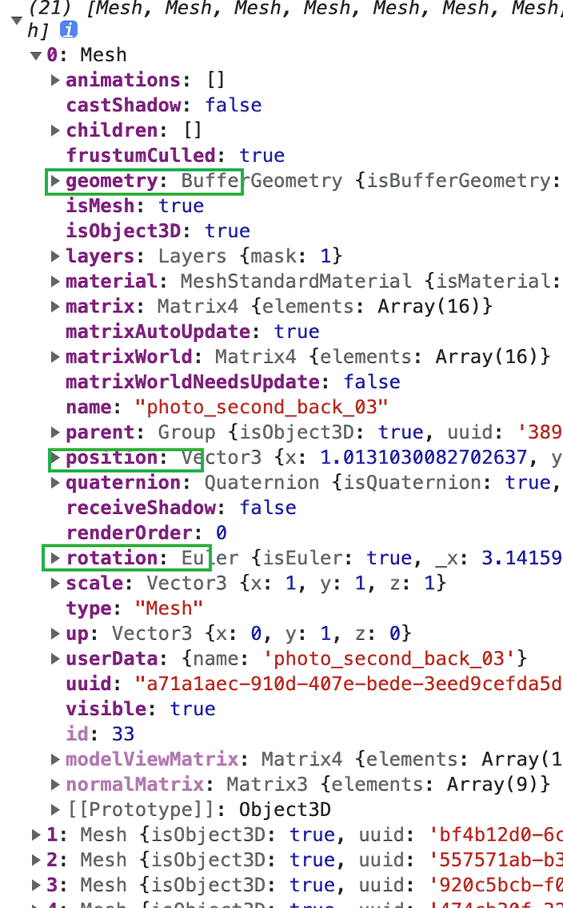

# 相框处理
## 需求
录屏一个效果列出以下点
- 相机运镜
- 更新图片纹理
- 显示规则：大小比例一致，但不超出原有画框的大小（与css中 object-fit：contain规则一致）
- 画框大小不固定，取决于模型设计。画框位置、旋转量都取决于模型的设计。所以画框的展示是与模型数据强关联的。
## 难点
在于探索过程，技术方案的选择，规范的制订。   
1. step1 
相框的位置、旋转量、尺寸、图片的url、尺寸都是来自后端的json，根据这些信息去创建展品（本质是3d物体）。  
  
这个方案符合常规的开发思路，对前端来说是最友好最方便的。但实际上可行性差，因为模型软件不具备直接导出部分json数据的能力，模型导出的数据是二进制文件或者类似这样的json：可以看出来是很不直观的，不满足我们预设的数据结构。  
这种时候就需要针对模型软件开发一个插件，实现一层数据的转化。模型软件我们完全是不熟知的，所以这个方案的可行性很低。
2. step2
模型软件导出模型，前端加载模型。结合后端的图片url，把模型原有的纹理替换掉。

这个方案复用了模型中的3d相框的位置、旋转量、几何体，无需知道这三个信息的具体值，只需要获取到纹理进行替换，获取到几何体进行缩放。看起来好像挺容易的，但实际效果会不尽如我们的期望。比如会出现纹理映射不正确的问题，本来我们期望的左图这样，实际映射后是右图。
 
 
要避免这种情况，需要制作模型的人有一定的纹理映射知识，在制作模型中去注意把纹理铺满整个几何体。这对于模型制作者来说会有一定的学习成本，而且这也增加了工作流程中的沟通成本。所以这个方案可行性也不高。
3. step3
解析模型数据，得到相框的位置、旋转量、尺寸。从后端获取图片url。根据这些信息去创建展品。

加载模型后，查看相框的数据，如图:  

位置和旋转量直接获取和复用，关键是在于如何获取画框的宽高。从画框模型几何体信息来看只能看到顶点坐标（自身坐标系，原点为几何体中心）。那怎么从这些数字中计算出画框的长宽呢。如图一看便知  

由于相框都是正方形的，顶点数据都是对称的，所以边长其实就是：2*|position[0]| 即：Math.abs(position[0])*2

