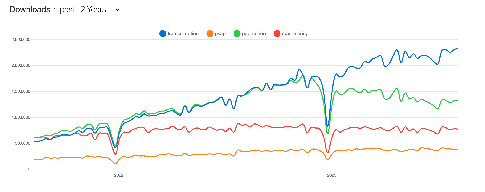
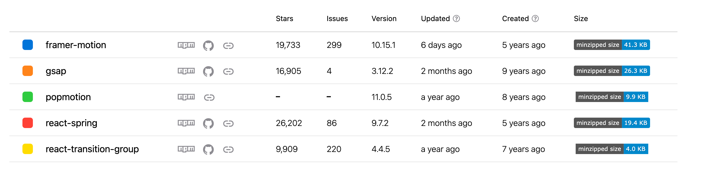

# 动画库

star >≈10k、仍在维护

https://javascript.plainenglish.io/react-animation-libraries-in-2023-daec149d7280

## 总体

| -                      | 物理 | 3D         | hook | 浏览器兼容性 | 手势         | 滚动驱动 | svg变形 | ts  | 非react可用 |
| ---------------------- | ---- | ---------- | ---- | ---------- | ------------ | ------- | ------- | --- | ---------- |
| framer-motion          | 1    | 1（+插件） | 1    | 一般       | 1   | 0          | 1       | 1   | 0         |
| react-spring           | 1    | 1（+插件） | 1    | 很好       | 1（+插件）   | 1         | - | 1   | 0         |
| react-transition-group | 0    | 0          | 0    | 很好       | 0            | 0       | 0       | 0   | 0         |
| popmotion              | 1    | 0          | 0    | 可以       | 0            | 0       | 0       | 1   | 1         |
| gsap                   | 0    | 0          | 0    | 很好       | 0            | 1       | 1       | 弱   | 1         |

性能、跨平台、服务端渲染没有研究

React Spring 的特点
React Spring 的一个非常酷的特点是能够应用动画，而无需依赖 React 逐帧渲染更新？。
灵活易用，涵盖了用户界面所需的大多数动画。
性能尚佳
流行、有社区有文档
对动画参数的细粒度控制？
支持涉及多个元素的复杂动画？
与 React 无缝集成
跨浏览器和跨设备兼容性
不足
只有弹簧
大体积

framer motion
灵活易用
性能尚jia
动画功能丰富
高度可定制
可以异步加载
流行、有社区有文档

总体而言，Framer Motion 是一个非常强大、高度可定制且功能强大的库：
不足
兼容性差

gsap
具有补间、时间线和变形的多功能动画
跨浏览器兼容性，提供一致的体验
高性能
对动画参数的细粒度控制
高级 SVG 动画功能，包括变形和路径动画
滚动驱动的动画带来迷人的效果
庞大的插件生态系统，用于扩展基于物理的动画、运动路径等功能。
流行、有社区有文档
Greensock动画平台 (GSAP)是一个出色的 Web 动画库，因为它使您能够对任何可通过 JavaScript 访问的内容进行动画处理，包括 DOM 元素、SVG、通用对象、画布等。
GSAP 是一个很棒的工具，可以用来构建简单到非常复杂的基于物理的动画。它允许开发人员对运动进行排序并动态控制动画。
不足
上手难
GSAP对商业用途是免费的，但在某些情况下需要署名，这可能会给某些项目带来一些不便
## 用法对比
### React Spring

## FramerMotion
-  物理
- 手势：hover、tap、pan、drag