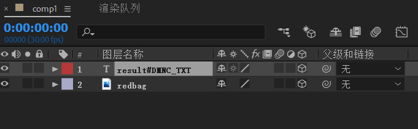
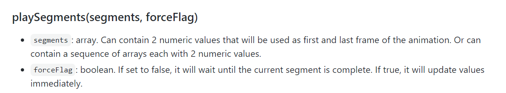
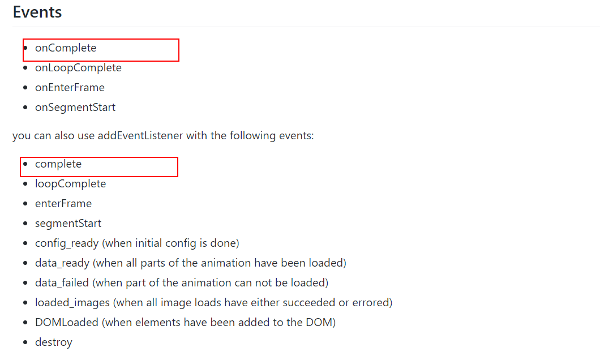
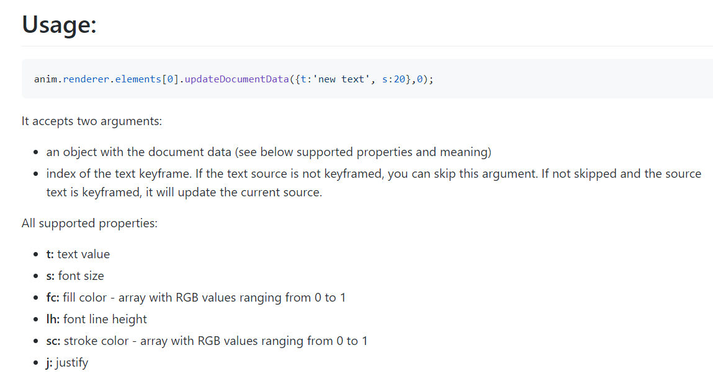
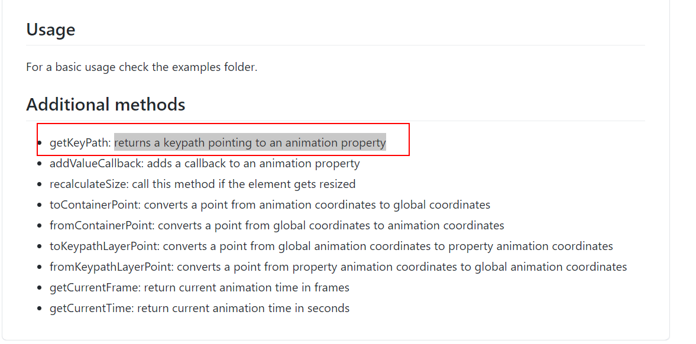
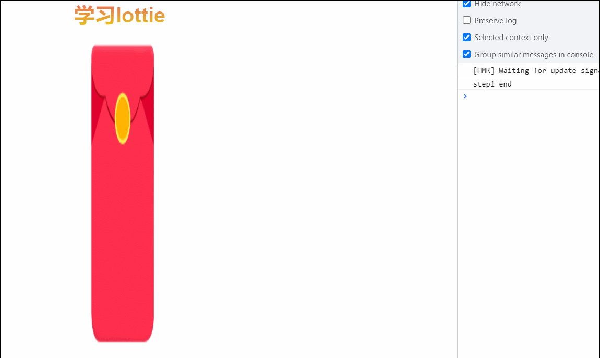
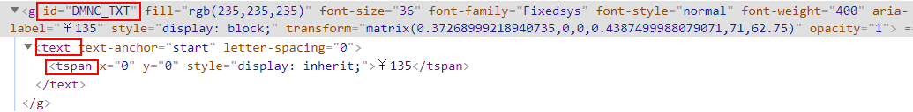
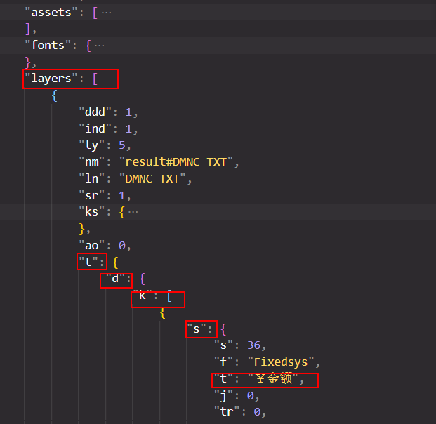

<!--
 * @Author: 鱼小柔
 * @Date: 2021-07-04 09:26:36
 * @LastEditors: your name
 * @LastEditTime: 2021-07-19 01:02:11
 * @Description: file content
-->

# Lottie 常见应用

这篇分享是基于[如何制作 Lottie 动画并应用在前端项目](https://kms.netease.com/article/36099)的续集，所以这里不会再介绍引用和加载动画，是对 lottie 进一步使用的介绍(我是在 vue 中做这个 demo，所以会有一些 vue 中的特定用法)。<br>

- [json 源文件](https://github.com/KittyFairy-Han/study-demos/blob/master/vue-demo/public/lottery/data.json)
- AE 中的结构<br>
  
- 动画效果<br>
  

## 灵活的控制动画播放

有一些业务需求中会出现比较复杂的动画适合用 Lottie 来实现，比如抽奖活动，抽奖过程中一些物理碰撞的动画和展示结果前的一些过度的魔法光效。在前端开发中，通常都是调用后端接口（获取抽奖结果）的同时播放一些过度的动画，获取到结果后展示结果。理想的效果是获取到结果刚好动画播放结束。但是接口请求时间终究是不可控的，所以这就需要对动画播放过程和播放时间做一些处理来配合接口请求时间。<br>
官方提供了一些控制播放的 api[传送门](http://airbnb.io/lottie/#/web?id=usage)<br>
以上面的红包动画为例子，动画是一个完整的开奖过程，但实际应用中因为配合接口时间，可以把动画分为三部分。

1. step1 前奏阶段（红包放大):动画播放一次
2. step2 请求阶段（红包旋转）：发起请求的同时开启循环播放直到接口请求回来，结束播放
3. step3 结果阶段（渐显“金额”）：动画播放一次。
   > 在具体的业务场景中，“金额”应该替换为具体的结果数字，这个我们后面会讨论到，暂先不讨论。

### 进阶（一）动画分段，通过异步封装实现播放可控

#### 播放片段

官方提供了 playSegments 的方法，第一个参数是双元素数组 [start,end] ，播放指定的起始帧和结束帧之间的片段。（动画 0~50 帧是红包放大过程、51~60 帧是动画旋转过程、63~90 帧是出现文字过程。）<br>

<br>官方文档截图 playSegments ↑ <br>

以前奏阶段为例，大概的代码思路就是：

```js
anim.playSegments([0, 50]);
```

#### 感知结束

拆分后要实现按步骤播放，需要利用 promise 把每步播放封装成一个异步任务。要实现这样的异步封装，我们需要感知播放结束，在结束的时候调用 resolve。官方提供了 complete 事件，每一次动画播放结束会触发该事件。<br>
每次播放结束的含义是，不论是 play 还是 playSegments 当渲染了全程或者片段的最后一帧的时候都执行回调，这里需要注意的是 lottie 并不会告诉我们现在播放完的是哪一段动画，如果需要知道当前播放完哪一段动画，需要我们自己区分。<br>
我每段动画都会添加 complete 事件监听，在回调中 resolve 不同的数据并且移除当前的监听。(为什么要移除？如果不移除的话，第二段动画播放完依然会执行第一段动画的回调，第三段播放完会执行第一段和第二段动画的回调)<br>

<br>官方文档截图 events ↑<br>

以前奏阶段为例，大概的代码思路就是：

```js
new Promise((resolve) => {
  anim.playSegments([51, 60], true);
  anim.addEventListener("complete", () => {
    resolve("step1 end");
    anim.removeEventListener("complete");
  });
});
```

#### 结合 async await 按照 1-1-2-3 的顺序播放动画

有了以上的基础，我们就可以自由的控制每个片段了，这里之所以第一段播放两遍，是为了明显看出对动画的控制成功了。

- 定义方法 step1st、step2nd、step3rd 分别代表前奏阶段、过度阶段、结果阶段
- 结合 async await 控制播放

```js
import lottie from "lottie-web";
const JSON_DATA = require("../../public/lottery/data.json"); //引入json源文件
export default {
  data() {
    return {
      lottieAnim: null,
    };
  },
  async mounted() {
    this.lottieAnim = this.loadLottieAnimation(JSON_DATA);
    const r1a = await this.step1st();
    console.log(r1a);
    const r1b = await this.step1st();
    console.log(r1b);
    const r2 = await this.step2nd();
    console.log(r2);
    const r3 = await this.step3rd();
    console.log(r3);
  },
  methods: {
    loadLottieAnimation(data) {
      return lottie.loadAnimation({
        container: this.$refs.LottieD, //挂在到对应的dom节点
        renderer: "svg",
        loop: false,
        animationData: data,
        autoplay: false,
      });
    },

    step1st() {
      return new Promise((resolve) => {
        this.lottieAnim.playSegments([0, 50], true);
        this.lottieAnim.addEventListener("complete", () => {
          resolve("step1 end");
          this.lottieAnim.removeEventListener("complete"); //移除事件监听，不然在第二段播放的时候也会执行这个回调。
        });
        // 或者
        /* this.lottieAnim.onComplete = () => {
          resolve("step1 end");
          this.lottieAnim.onComplete = null //不移除也行，后面onComplete重新赋值会直接替换。
        }; */
      });
    },
    step2nd() {
      return new Promise((resolve) => {
        this.lottieAnim.playSegments([51, 60], true);
        this.lottieAnim.addEventListener("complete", () => {
          resolve("step2 end");
          this.lottieAnim.removeEventListener("complete");
        });
      });
    },
    step3rd() {
      return new Promise((resolve) => {
        this.lottieAnim.playSegments([61, 90], true);
        this.lottieAnim.addEventListener("complete", () => {
          resolve("step3 end");
          this.lottieAnim.removeEventListener("complete");
        });
      });
    },
  },
};
```

#### 效果<br>


### 进阶（二）加上请求逻辑，第二段动画与请求同时进行

请求与第二段动画"并发"，请求和动画都结束再进行第三段动画，关键点在于“并发”，采用 Promise.all。关键思路如下:<br>

- 添加 getData 方法，模拟一个异步请求
- 修改 mounted 中的逻辑。用 Promise.all([this.step2nd(), this.getData()]) 实现“并发”请求。

```js
// vue-methods ，模拟一个异步请求
getData() {
  return new Promise((resolve) => {
    setTimeout(() => {
      resolve(parseInt((Math.random() + 1) * 100));
    }, 3000);
  });
},
// vue-mounted ，用Promise.all([this.step2nd(), this.getData()]) 实现“并发”请求
this.lottieAnim = this.loadLottieAnimation(JSON_DATA);
const r1 = await this.step1st();
console.log(r1);
const [r2, data] = await Promise.all([this.step2nd(), this.getData()]);
console.log(r2, data);
const r3 = await this.step3rd();
console.log(r3);
```

#### 效果


### 进阶（三）循环播放播放第二段动画直到拿到请求结果

上面实现的效果还有很大的缺陷，就是当请求时间比较长的时候，第二段动画（过度阶段）在拿到结果之前播放完了，会让人觉得卡住了。这里应该实现一个循环播放第二段动画的效果。我采用了 while 循环的方式，关键思路如下：<br>
(可能大家想到 loop 属性，但是播放片段的方法 playSegments 不支持传入 loop 参数去控制该片段循环播放。)

- data 中添加一个属性 pending 作为循环的条件控制
- 修改 getData 的方法，用于给 pending 赋值
- 添加一个 rollStep2nd 方法，循环播放第二段动画的函数
- 修改 mounted 中的逻辑,把 step2nd 替换成 rollStep2nd

```js

// vue-method
// 修改 getData 的方法，用于给 pending 赋值
async getData() {
  this.pending = true;
  const result = await new Promise((resolve) => {
    setTimeout(() => {
      resolve(parseInt((Math.random() + 1) * 100));
    }, 3000);
  });
  this.pending = false;
  return result
},
// 添加一个 rollStep2nd 方法，循环播放第二段动画的函数
async rollStep2nd() {
  while (this.pending) {
    await this.step2nd();
  }
},

//vue-mounted,把 step2nd 替换成 rollStep2nd
this.lottieAnim = this.loadLottieAnimation(JSON_DATA);
const r1 = await this.step1st();
console.log(r1);
const [data] = await Promise.all([this.getData(),this.rollStep2nd()]);
console.log(data);
const r3 = await this.step3rd();
console.log(r3);

```

#### 效果


### 小结

现在我们已经实现了最开始期望的状态即：

1. step1 前奏阶段（红包放大):动画播放一次
2. step2 请求阶段（红包旋转）：发起请求的同时开启循环播放直到接口请求回来，结束播放。
3. step3 结果阶段（渐显“金额”）：动画播放一次。
   接下来我们将替换“金额”为具体的结果，甚至可以把红包换成其他图片！

## 替换文字

首先我们修改上面的代码，把返回值保存下来。

- data 中新增一个属性 result
- 修改 getData 方法，给 result 赋值
- 新增 changeText 方法，用于修改文案
- 修改 mounted 中的逻辑，在 step3rd 之前调用 changeText

```js
// vue-methods 修改getData给result赋值
async getData() {
  this.pending = true;
  const result = await new Promise((resolve) => {
    setTimeout(() => {
      resolve(parseInt((Math.random() + 1) * 100));
    }, 500);
  });
  this.pending = false;
  this.result = result
  return result
}
//vue-methods 新增changeText方法，目前还没讲到具体如何修改，先放一个壳子
changeText() {

},
//vue-mounted
this.lottieAnim = this.loadLottieAnimation(JSON_DATA);
const r1 = await this.step1st();
console.log(r1);
const [data] = await Promise.all([this.getData(),this.rollStep2nd()]);
console.log(console.log(`will change “金额” to ${data}`))
this.changeText()
const r3 = await this.step3rd();
console.log(r3);

```

### 方案（一）通过 updateDocumentData 方法

在官方 Wiki 中有提到替换的文字[传送门](https://github.com/airbnb/lottie-web/wiki/TextLayer.updateDocumentData)。<br>

 <br>
<br>官方 wiki 截图 updateDocumentData ↑<br>

大概思路就是在 anima.render 下找到要修改的 element，然后调用 updateDocumentData 方法，这个方法可以修改文字的值、字号、颜色等信息，具体参见 wiki 说明。

```js
//vue-methods,修改changeText方法
changeText(){
   this.lottieAnim.renderer.elements[0].updateDocumentData({ t: '￥'+this.result }, 0);//修改改传入的值必须是字符串不能是数字，否则会失败
}
```

#### 效果

可以看到“金额”已经变成了具体的返回值。


### 方案（二）通过 lottie-api 库

官方提供了 lottie-api 这个库，用于对动画示例做一些修改，[传送门](https://github.com/bodymovin/lottie-api)。我们这里主要使用了 getKeyPath、getElements 这两个方法。相比方案（一），只要知道文字图层在 AE 中的关键路径即可，不需要查看 json 数据。<br>
getKeyPath 接收一个字符串参数，用逗号分割表示路径，返回一个对象。这个对象有 getElements 方法，返回满足条件的元素列表。元素有 setText 方法，接收一个字符串参数，表示新的文字内容。<br>
本例中，文字所属的图层名称为'result',调用 getKeyPath('result').getElements()拿到列表，因为本例中，只有一个名为 result 的图层，所以第一个元素就是我们需要寻找的元素。然后再调用 setText 方法，传入新的文字内容即可。

> 本例中我是直接导出 comp1 这个合成，如果新建了一个 comp 包含 comp1，那么 getKeyPath 传值为"comp1,result"。

 <br>
<br>官方文档截图 getKeyPath ↑<br>

- 先安装依赖并且引入
- 通过 getKeyPath、getElements 方法找到需要修改的 element
- setText 修改元素

```js
import loApi from "lottie-api";
//vue-methods,修改changeText方法
changeText(){
   const api = loApi.createAnimationApi(this.lottieAnim);
   const elements = api.getKeyPath("result#DMNC_TXT").getElements(); // 查找对象
   const ele = elements[0]
   ele.setText('￥'+this.result);//修改改传入的值必须是字符串不能是数字，否则会失败
}
```

#### 效果

可以看到“金额”已经变成了具体的返回值。


### 方案（三）原生 JS 修改 svg

抛开 lottie 的思路，采用 svg 渲染，最后所有的数据都会转换为 svg 元素，用原生的 JS 修改 svg 的内容也是可行的。如果是用这种思路的话，也是需要知道最后要修改的元素位于最终的 svg 元素哪个位置，也是需要人肉查看一遍 svg 结构。不过有一种更便捷的方式，就是在图层命名时尾部加入 #xxx ，那么生成的 svg 元素结构如下,通过 document.querySelector 就可以快速的定位到要修改的元素。然后把 innerHtml 属性赋值为新的内容。

 <br>
<br>svg 结构 ↑<br>

- 设计师配合，AE 图层采用“#xxx”特殊后缀命名
- document.querySelector 定位到 svg 元素
- 修改 innerHtml 属性的值

```js
//vue-methods,修改changeText方法
changeText(){
  const node = document.querySelector("#DMNC_TXT tspan");
    if (node) {
      node.innerHTML = '￥'+this.result;
    }
}
```

### 小结

- 方案（一、二） VS 方案（三）

  方案三优点是最便捷快速，但是比起前两种局限性也最大。① 需要设计师配合度高一点 ② 如果文字有复杂的动画如路径动画等，这样的情况文字是按字符分别渲染的，替换整体的文字内容破坏了结构，动画会错误。

- 方案（一）VS 方案（二）

  updateDocumentData 优点是灵活，但是比起用 lottie-api 就会比较麻烦。需要人肉查找要修改的对象是哪个 element，如果 JSON 文件非常大，或者 element 是嵌套层级比较深的，那么这个方法就不太适用了。<br>
  lottie-api 是一个比较便捷的方式，灵活性稍差，但我认为关键的缺点是学习成本大。官方对它的使用说明过于简单，其他相关学习资源也少，很多东西要自己看源码去摸索。

  > 上面的 setText 方法的底层也是调用 updateDocumentData 的

## 其他应用场景

### 动态替换文字以外的内容

上面的动态替换只说到了替换文字，其实 updateDocumentData，lottie-api，修改 svg 可以实现修改图形颜色、图片 url 等其他需求。会更复杂一些，所以这部分打算后续但写一篇文章。

### 静态替换

可能有一些业务情景是不需要在动画过程中去替换内容的，只是需要在动画播放之前进行一些文字内容和图片的修改，然后播放动画。基本思路：

1. JSON 转换为 JS 对象或者字符串处理一些修改
2. 转回 JSON
3. loadAnimation

下面我会把红包的图片替换为[礼盒图片](https://img2.baidu.com/it/u=3027700886,229179963&fm=26&fmt=auto&gp=0.jpg)，把“￥金额”替换为“中奖啦”。

> 动画的 AE 源文件和 JSON 源文件和上面两节一样，代码与上面不关联。

```js
import lottie from "lottie-web";
const JSON_DATA = require("../../public/lottery/data.json");
export default {
  data() {
    return {};
  },
  async mounted() {
    const data = this.changeData();
    this.loadLottieAnimation(data);
  },
  methods: {
    changeData(){
      return JSON_DATA
    }
    loadLottieAnimation(data) {
      return lottie.loadAnimation({
        container: this.$refs.LottieD, //挂在到对应的dom节点
        renderer: "svg",
        loop: false,
        animationData: data,
        autoplay: true,
      });
    },
  },
};
```

#### 通过修改 JS 对象的属性值来修改数据

关键点在于找到 JSON 源文件中文字和图片的位置<br>
① 图片资源在 JSON 文件中存储的位置是在 assets 数组中，assets[n].u 代表图片所在的目录，aseets[n].p 代表图片的名称。所以只要重新给这两个属性赋值就可以了。<br>
② 文字的位置就没有特定规律了，其实一般情况不会采用这种方式替换文字，本例中文字所在的位置是 JSON_DATA.layers[0].t.d.k[0].s.t<br>

关键的代码：

```js
JSON_DATA.assets[0].u = ""; //图片所在的相对目录
JSON_DATA.assets[0].p = "https://img2.baidu.com/it/u=3027700886,229179963&fm=26&fmt=auto&gp=0.jpg"; //'图片名称'
JSON_DATA.layers[0].t.d.k[0].s.t = "中奖啦"; //文字所在目录
```

#### 转换为字符串处理

① 这种方案对于修改文字是比较方便的，不过替换的内容最好是有唯一标识的（比如￥这个前缀），防止替换错误。<br>
② 对于修改图片，如果是一张在线图片同理修改文字。但如果是一张本地资源，就不合适了。<br>
为什么呢？当使用本地资源的时候，可能很多图片都在一个路径下，替换一张图片的时候，需要同时把路径（asset[n].u）和文件名(asset[n].p)都替换掉，那么其他图片路径就不对了！<br>
本例只是用了一张本地资源图片，下面的代码我还是会替换掉图片，仅仅为了展示效果，但是实际应用中慎重！！！

```js
const str = JSON.stringify(JSON_DATA);
const newStr = str
  .replace("￥金额", "中奖啦")
  .replace("images/", "")
  .replace("img_0.png", "https://img2.baidu.com/it/u=3027700886,229179963&fm=26&fmt=auto&gp=0.jpg");
const newJson = JSON.parse(newStr);
```

#### 结合使用

一般情况下，可以结合使用这两种方式，这样处理起来是最不容易出错且便捷的。修改 changeData 方法：

```js
changeData(){
  JSON_DATA.assets[0].u = ""; //图片所在的相对目录
  JSON_DATA.assets[0].p =
    "https://img2.baidu.com/it/u=3027700886,229179963&fm=26&fmt=auto&gp=0.jpg"; //'图片名称'
  const str = JSON.stringify(JSON_DATA);
  const newStr = str
    .replace("￥金额", "中奖啦")
  const newJson = JSON.parse(newStr);
  return newJson;
},
```

#### 效果

可以看到，动画都是保持不变的，只是替换了图片和文案。

相比动态替换的方法，静态替换的逻辑更简单。当遇到一些简单的业务场景，只需要在初始化的时候改变一下资源，用这种方式还是比较便捷和高效的。

## 参考
[github·lottie-web](https://github.com/airbnb/lottie-web/)<br>
[github·lottie-api](https://github.com/bodymovin/lottie-api)<br>
[语雀·Aha Lottie](https://www.yuque.com/lottie/kla7m4)<br>
[知乎·让动效更酷炫！4 个常见且常用的 SVG 交互动画方法](https://zhuanlan.zhihu.com/p/88117124)<br>
