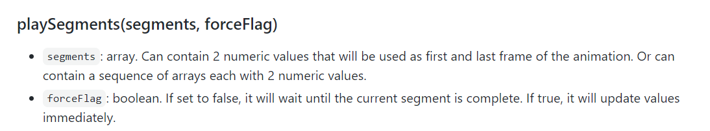
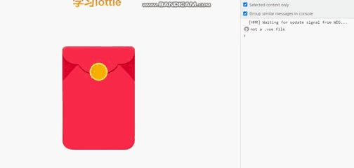

<!--
 * @Author: 鱼小柔
 * @Date: 2021-07-04 09:26:36
 * @LastEditors: your name
 * @LastEditTime: 2021-07-12 00:29:08
 * @Description: file content
-->

# Lottie 常见应用

这篇分享是基于[如何制作 Lottie 动画并应用在前端项目](https://kms.netease.com/article/36099)的续集，所以这里不会再介绍引用和加载动画，是对 lottie 进一步使用的介绍(我是在 vue 中做这个 demo，所以会有一些 vue 中的特定用法)。<br>

- [源文件](https://github.com/KittyFairy-Han/study-demos/blob/master/vue-demo/public/lottery.json)
- 动画效果<br>
  

## 灵活的控制动画播放

有一些业务需求中会出现比较复杂的动画适合用 Lottie 来实现，比如抽奖活动，抽奖过程中一些物理碰撞的动画和展示结果前的一些过度的魔法光效。在前端开发中，通常都是调用后端接口（获取抽奖结果）的同时播放一些过度的动画，获取到结果后展示结果。理想的效果是获取到结果刚好动画播放结束。但是接口请求时间终究是不可控的，所以这就需要对动画播放过程和播放时间做一些处理来配合接口请求时间。<br>
官方提供了一些控制播放的 api[传送门](http://airbnb.io/lottie/#/web?id=usage)<br>
以上面的红包动画为例子，动画是一个完整的开奖过程，但实际应用中因为配合接口时间，可以把动画分为三部分。

1. step1 前奏阶段（红包放大):动画播放一次
2. step2 请求阶段（红包旋转）：发起请求的同时开启循环播放直到接口请求回来，结束播放
3. step3 结果阶段（渐显“金额”）：动画播放一次。
   > 在具体的业务场景中，“金额”应该替换为具体的结果数字，这个我们后面会讨论到，暂先不讨论。

### 动画分段，通过异步封装实现播放可控

#### 播放片段

官方提供了 playSegments 的方法，第一个参数是双元素数组 [start,end] ，播放指定的起始帧和结束帧之间的片段。（动画 0~50 帧是红包放大过程、51~60 帧是动画旋转过程、63~90 帧是出现文字过程。）

- 官方文档截图 playSegments
  

- 以第一段为例，大概的代码思路就是：anim.playSegments([0, 50])

#### 感知结束

拆分后要实现按步骤播放，需要利用 promise 把每步播放封装成一个异步任务。要实现这样的异步封装，我们需要感知播放结束，在结束的时候调用 resolve。官方提供了 complete 事件，每一次动画播放结束会触发该事件。<br>
每次播放结束的含义是，不论是 play 还是 playSegments 当渲染了全程或者片段的最后一帧的时候都执行回调，这里需要注意的是 lottie 并不会告诉我们现在播放完的是哪一段动画，如果需要知道当前播放完哪一段动画，需要我们自己区分。<br>
我每段动画都会添加 complete 事件监听，在回调中 resolve 不同的数据并且移除当前的监听。(为什么要移除？如果不移除的话，第二段动画播放完依然会执行第一段动画的回调，第三段播放完会执行第一段和第二段动画的回调)

- 官方文档截图 events
  

- 以第一段为例，大概的代码思路就是：

```js
new Promise((resolve) => {
  anim.playSegments([51, 60], true);
  anim.addEventListener("complete", () => {
    resolve("step1 end");
    anim.removeEventListener("complete");
  });
});
```

#### 结合 async await 按照 1-1-2-3 的顺序播放动画

- 代码

```js
import lottie from "lottie-web";
const JSON_DATA = require("../../public/lottery.json");
export default {
  data() {
    return {
      lottieAnim: null,
    };
  },
  async mounted() {
    this.lottieAnim = this.loadLottieAnimation(JSON_DATA);
    const r1a = await this.step1st();
    console.log(r1a);
    const r1b = await this.step1st();
    console.log(r1b);
    const r2 = await this.step2nd();
    console.log(r2);
    const r3 = await this.step3rd();
    console.log(r3);
  },
  methods: {
    loadLottieAnimation(data) {
      return lottie.loadAnimation({
        container: this.$refs.LottieD, //挂在到对应的dom节点
        renderer: "svg",
        loop: false,
        animationData: data,
        autoplay: false,
      });
    },

    step1st() {
      return new Promise((resolve) => {
        this.lottieAnim.playSegments([0, 50], true);
        this.lottieAnim.addEventListener("complete", () => {
          resolve("step1 end");
          this.lottieAnim.removeEventListener("complete"); //移除事件监听，不然在第二段播放的时候也会执行这个回调。
        });
        // 或者
        /* this.lottieAnim.onComplete = () => {
          resolve("step1 end");
          this.lottieAnim.onComplete = null //不移除也行，后面onComplete重新赋值会直接替换。
        }; */
      });
    },
    step2nd() {
      return new Promise((resolve) => {
        this.lottieAnim.playSegments([51, 60], true);
        this.lottieAnim.addEventListener("complete", () => {
          resolve("step2 end");
          this.lottieAnim.removeEventListener("complete");
        });
      });
    },
    step3rd() {
      return new Promise((resolve) => {
        this.lottieAnim.playSegments([61, 90], true);
        this.lottieAnim.addEventListener("complete", () => {
          resolve("step3 end");
          this.lottieAnim.removeEventListener("complete");
        });
      });
    },
  },
};
```

- 效果<br>
  

### 加上请求逻辑，第二段动画与请求同时进行

- 请求与第二段动画"并发"，请求和动画都结束再进行第三段动画，关键点在于“并发”。关键思路:<br>
  Promise.all([this.step2nd(), this.getData()])

```js
// vue-methods ，模拟一个异步请求
getData() {
  return new Promise((resolve) => {
    setTimeout(() => {
      resolve(parseInt((Math.random() + 1) * 100));
    }, 3000);
  });
},
// vue-mounted ，修改 mounted 中的代码
this.lottieAnim = this.loadLottieAnimation(JSON_DATA);
const r1 = await this.step1st();
console.log(r1);
const [r2, data] = await Promise.all([this.step2nd(), this.getData()]);
console.log(r2, data);
const r3 = await this.step3rd();
console.log(r3);
```

- 效果<br>
  

### 循环播放播放第二段动画直到拿到请求结果
上面实现的效果还有很大的缺陷，就是当请求时间比较长的时候，第二段动画（过度阶段）在拿到结果之前播放完了，会让人觉得卡住了。这里应该实现一个循环播放第二段动画。

## 替换

有些业务场景中，会需要替换动画中的文字和图片。[例如](https://cloud.video.taobao.com/play/u/270923/p/1/d/hd/e/6/t/1/250398793745.mp4?auth_key=YXBwX2tleT04MDAwMDAwMTImYXV0aF9pbmZvPXsidGltZXN0YW1wRW5jcnlwdGVkIjoiNTE0YzYwMjY4NmU3NDlmN2VhNGQ2MDY4YmY4NjE4MWYifSZkdXJhdGlvbj0mdGltZXN0YW1wPTE2MjUxOTEyMjQ=)。这段动画中的 「3.39%」「2.43%」以及「1000 万」都属于业务数字，数字变化频率高，如果每次数字变化要重新导出视频效率太低，这种场景下就需要动态替换动画中数字。
动态替换又进一步分为，① 动画初始化之前替换一次，播放动画时动画中的文字或图片内容不变（下文称为静态替换）;② 动画播放时，改变动画中的文字或图片（下文称之为动态替换）。

下面以如图所示的 JSON 数据作为例子。(笔者是在 vue 中学习使用 lottie 的)

- 动画截图

- JSON 源码数据

### 静态替换文字

静态替换文字，主要有两种方式。一种是把接口返回的数据解析成 JS 对象，然后找到要替换的位置，重新赋值。另外一种就是把接口返回的 JSON 数据转换为字符串然后替换文字。

#### 改变 JS 对象中的属性值

- 这是一个公用的方法

```js
function loadLottieAnimation(data) {
  lottie.loadAnimation({
    container: this.$refs.lottieDom, //挂在到对应的dom节点
    renderer: "svg",
    loop: true,
    animationData: data,
  });
}
```

```js
const path =
  "https://gw.alipayobjects.com/os/finxbff/2d0c4a95-568f-4923-bef0-e20fca6018ca/7abc1e3d-c381-49ed-ad54-3a48366f0180.json";
const resp = await fetch(path);
const data = await resp.json(); //转换为js对象
data.assets[0].layers[0].t.d.k[0].s.t = "new text"; //找到对应的属性，改变属性的值
loadLottieAnimation(data);
```

这种方式的有一个致命的缺点，就是需要把 JSON 数据格式化后，一层一层的人肉查找要修改的内容在哪里，然后再去赋值。

#### 字符串替换

```js
const path =
  "https://gw.alipayobjects.com/os/finxbff/2d0c4a95-568f-4923-bef0-e20fca6018ca/7abc1e3d-c381-49ed-ad54-3a48366f0180.json";
const resp = await fetch(path);
const str = await resp.text(); //转换为字符串
const newStr = str.replace("${文本}", "new text"); //找到对应的属性，改变属性的值
const lottieAnim = loadLottieAnimation(JSON.parse(newStr));
```

这种方式看起来比上一个方便一些，但是这是需要设计师高度配合的，要先和设计师沟通，把需要替换的部分做一个特殊的标识'\${}'，所以这也是存在不确定性的方法。
修改 lottie 解析后的运行时 JS 对象，理论上一样可以修改文本，官方其实提供了相应的 API，仔细查找的话在 lottie-web 的官方文档里有提及，请看 https://github.com/airbnb/lottie-web/wiki/TextLayer.updateDocumentData

### 动态替换文字

### 动态替换图片
