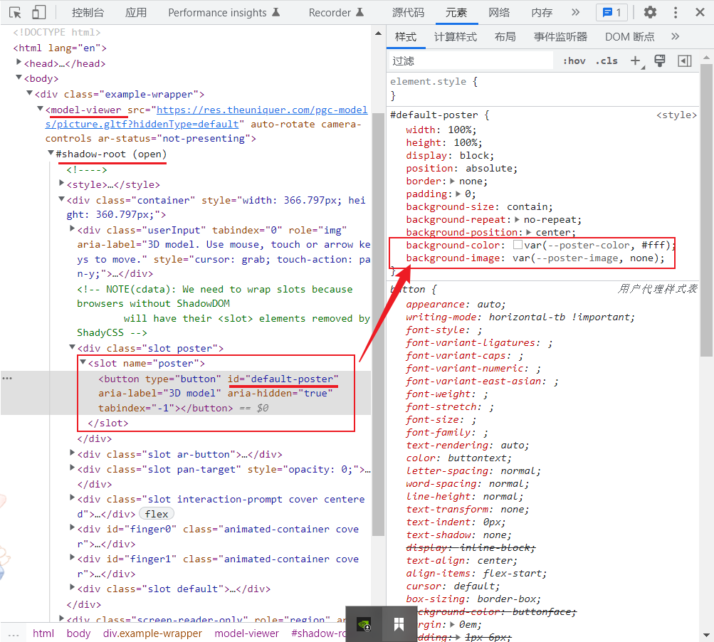

<!--
 * @Author: 鱼小柔
 * @Date: 2022-06-25 07:30:39
 * @LastEditors: your name
 * @LastEditTime: 2022-07-01 00:15:32
 * @Description: file content
-->

## 3d 渲染相关的基础概念

如果不了解材质、纹理这些基本概念，下面的材质纹理部分可能会比较懵。在这里简单介绍一下：

- 材质(Material):是表现光照效果的一个数据集
- 纹理(Texture):应用到物体上的样式
- 着色器(Shader):本质上是程序代码，根据光照、材质来计算最后映射到每个像素的颜色,这个颜色来源于纹理。可以把材质和纹理都理解为着色器要用的一个素材。
- 变体(Variant):很多时候，效果不同，但 shader 代码差异较小。这个时候 shader 就会有多个分身，变体就可以理解为分身。

## model-viewer 核心概念

model-viewer 的能力大致分为：**控制相机、设置环境与光线、控制模型动画、设置材质纹理、XR(AR+VR)、导出模型**这几个大部分。  
model-viewer 对外的几个核心概念：

- **attributes**, 是指 html 标签内联的属性,可读写,例如 auto-rotate。(下面的例子可以区分 attributes 与 properties)

- **properties**, 字面意思看也是属性,不能通过内联形式去设置,只能读取例如 turntableRotation ：

```html
<model-viewer auto-rotate id="my-ar-mv"></model-viewer>
```

```js
const modelViewer = document.getElementById("my-ar-mv");
//modelViewer.autoRotate = true 为 attribute 写入的另一种方式
console.log(modelViewer.autoRotate);
//attribute 读取
console.log(modelViewer.turntableRotation);
//开启自动旋转后,可以通过这个property,获取模型自转的角度(逆时针)
```

> 下文的 modelViewer 都是指 model-viewer 对应的 node 节点

- **methods**, 方法有通过 modelViewer 调用的,也有通过 modelViewer.model 调用的,或更深层的属性比如材质去调用的。
- **events**, 监听事件 绑定在 modelViewer 上。
- **slots**, 通常用在跟随模型的可交互的标记点。

## model-viewer 基本使用

model-viewer 的文档对新手来说可读性和引导性一般,在做项目的时候去查文档效率比较低,有时会因为实现一个效果反复的试错。所以我才会写这一 Part。

### 控制相机

- camera-controls 开启用户交互：旋转和缩放
- enable-pan 开启交互：位移
- disable-zoom 关闭缩放的交互
- custom-prompt 自定义操作

自动旋转与交互手势旋转可以同时用

- auto-rotate 自动旋转
- auto-rotate-delay 自动旋转
- camera-orbit 设置 0~3.5m 生效,大于 3.5m 不生效

### 环境光

- skybox-image 应用背景并模拟出环境光
- environment-image 环境光但不应用于背景,通过配置一个图片去计算出环境光,不设置也有一个默认的环境光,另外有个内置的值 neutral,
  可以同时使用
  环境图像应该不超过 1k (1024x512),因为它们在内部被固定到这个分辨率。
- exposure 曝光度
  这些表现和模型表面的粗糙度有关系可以查看[这个例子](https://modelviewer.dev/examples/lightingandenv/#anotherHDRExample) 

### 动画(针对内置了动画的模型)

- animationName 通过动画名称控制模型现在播放的动画,播放的同时改变动画时,它们会交叉淡出
- autoplay 自动播放所有的动画,顺序就按内置的来
- animation-crossfade-duration 交叉变换的时间
- modelViewer.play() 函数主动触发播放函数
  animationName 配合 autoplay 或者 modelViewer.play()使用时才会播放动画,否则动画处于暂停状态,会显示第一帧

### 模型变换

>模型变换和相机变换不一样

- availableVariants 只读属性,读取模型变体
- variantName 变体名称
- orientation 模型旋转
- scale 模型缩放
- updateFraming() 模型加载后改变 orientation 和 scale 需要调用这个方法,才生效。

### 材质和纹理

- modelviewer.model.getMaterialByName() - 获取材质常用方法
- modelviewer.createTexture() -创建纹理
- material[xxx].setMetallicFactor() - 设置材质的金属程度
- material[xxx].setRoughnessFactor() - 设置材质的粗糙程度

### 导出模型

主要依赖这个方法：

- exportScene()
  [例子](https://modelviewer.dev/examples/scenegraph/#pickMaterialExample)

## 使用经验分享

上面对 model-viewer 已经有了基础的认知，下面介绍一下我在工作中的一些使用经验。

### 内容替换

#### 需求

需要实现的需求大概是：展示一个 3d 旋转的相框，相框是固定的，相框上的相片是动态数据。

#### 思路

有了上面对模型材质、纹理概念的了解，就很容易想到把相片作为 texture，根据动态的数据去替换 material 上的 texture 即可。不就是

1. 创建纹理 const t = modelViewer.createTexture('xxx.jpg')
2. 找到对应的材质，然后设置纹理 material[channel].setTexture(t)
   嘛~好简单呐~但真的实践起来就会发现纸上谈兵真容易哈哈哈...

#### 实践

(均为思路讲解代码，无法直接使用)

- 迈坑一  
  这里有个比较麻烦的点就是不知道 setTexture 要用谁去调用，那要怎么确定呢？  
  方案 ① 提供模型的人要给出一个具体的材质名，和具体的属性路径，如材质名是 Center，属性路径为.pbrMetallicRoughness.baseColorTexture。  
  方案 ② 和提供模型的人商量一个标志位，让 ta 把要替换的纹理名称作为标志，开发时去 json 文件里去找到这个标志位，属性路径也就一目了然了。

```html
<model-viewer src="xxx.gltf" auto-rotate camera-controls> </model-viewer>
```

```js
const targetMaterial = modelViewer.model.materials.find((material) => material.name == "xxx"); //找到材质
const targetTexture = await modelViewer.createTexture("xxx.jpg"); // 用图片创建纹理
targetMaterial.pbrMetallicRoughness.baseColorTexture.setTexture(targetTexture);
```

迈坑二:需要注意的是，要在 modelViewer loaded 之后再去进行上面的步骤，加个事件监听的逻辑。

```js
modelViewer.addEventListener("load", () => {
  //上面的替换逻辑
});
```

迈坑三:如果要替换的位置本身就有了纹理图片，我们的替换操作可能失败。原因不确定，通过现象推断应该是个 bug，模型已有的纹理图片和我们设置的纹理图片哪个加载的慢，哪个就是最终展示出来的纹理。我当时采用的方法是，让提供模型的人不要设置默认的纹理图片，只设置颜色。曲线解决了问题。

终于可以愉快的实现这个功能辣~[这是一个完整示例-1](https://codesandbox.io/s/cranky-mopsa-qg5jhr?file=/index.html)

### 白底优化

#### 发现问题

发现模型加载的过程中有白底，这种体验不太好，当页面的背景不是白色的时候会很违和。

#### 解决思路

可能很多人第一反应和我一样就是给 model-viewer 背景颜色设置成透明的，设置了之后发现模型加载结束后这个背景颜色是生效的，但是加载过程中还是白的。（体验一下上面的例子就可以发现）  
 有了上面对基本使用的了解，就可以马上联想到既然是加载过程中的，那应该和 poster 这个 attr 有关。官方[在这个 example 中](https://modelviewer.dev/examples/loading/#displayPoster)确实提到了，看起来就是

1. 配置 model-viewer 的 poster 属性
2. css 里面写上 model-viewer{--poster-color: transparent;} 就行了。

这次没有坑了~顺顺利利设置成功~[基于上面的完整示例-1 改进版](https://codesandbox.io/s/cranky-mopsa-qg5jhr?file=/poster-color.html)可能比官方例子看起来更明显一些。

#### 原因

model-viewer 在模型加载之前会有一个海报占位区域,本质上是一个 background-color 为白色的 button。  
  
配置了 poster 后,这个 button 的 background-image 就是 poster。如果 poster 有透明的部分, 那么白色的 background-color 还是会露出来。所以要从根本解决问题不仅要配置 poster 还得把 background-color 改为透明的。  
设置 background-color 就用上面的 css 变量方法，其实 poster 的配置也可以通过 css 变量的方式，可以查看[完整示例-1 改进版](https://codesandbox.io/s/cranky-mopsa-qg5jhr?file=/poster-color.html)中 css 部分被注释的代码。

#### 继续思考

- 一问：这中方式行不行呢？

```css
model-viewer #default-poster {
  background-color: transparent;
}
```

- 二问：答案肯定是不行辣，为啥妮？  
  因为 model-viewer 基于 web components 实现的,web components 的 shadowRoot 里面元素的样式通过外部是无法修改的,选择器选不到内部元素。

> MDN 上的解释：Web Components 是一套不同的技术,允许您创建可重用的定制元素（它们的功能封装在您的代码之外）并且在您的 web 应用中使用它们。简而言之就是自定义的 html 标签。

- 三问：怎么修改 shadowRoot 内部的样式？
  通过插 style 标签到 shadowRoot 内部去设置样式。如：

```js
const styleStr = `
#default-poster {
  background-color: transparent;
  background-size: contain;
  background-repeat: no-repeat;
  background-position: center;
  background-image: none;
  height: 102%;
}`;
const styleTag = document.createElement("style");
styleTag.textContent = styleStr;
const shadow = modelViewer.shadowRoot;
shadow.appendChild(styleTag);
```


### 一些其他避坑指南

- 不启用某个属性,就不写这个属性,拿位移举个例子位移。

```jsx
// 特别要注意的是这种写法还是会启动这个属性
<model-viewer enable-pan={false} />
// 正确写法
<model-viewer />
```

- onload事件
模型的加载不是 model-viewer 这个 dom 节点的 onload 事件,模型加载完成是一定晚于 onload 事件的。  
我们上面用的 onload 事件都是 dom 节点上的。  
model-viewer没有提供模型加载的钩子,所以业务页面无法监听到模型加载完成事件。
