# h5 支付

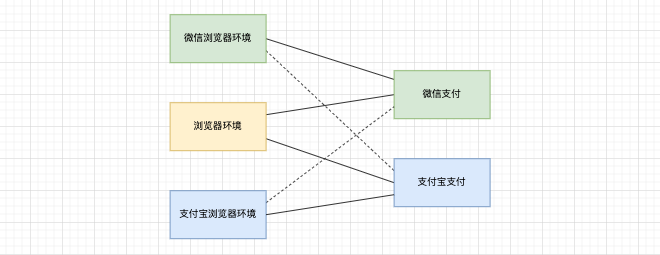  
分为如图的六种情况，  
其中，微信环境用支付宝支付是行不通的，[这里是支付宝官方说明](https://opendocs.alipay.com/support/01rfu4)；  

## 从前端的角度看 下单、支付 流程

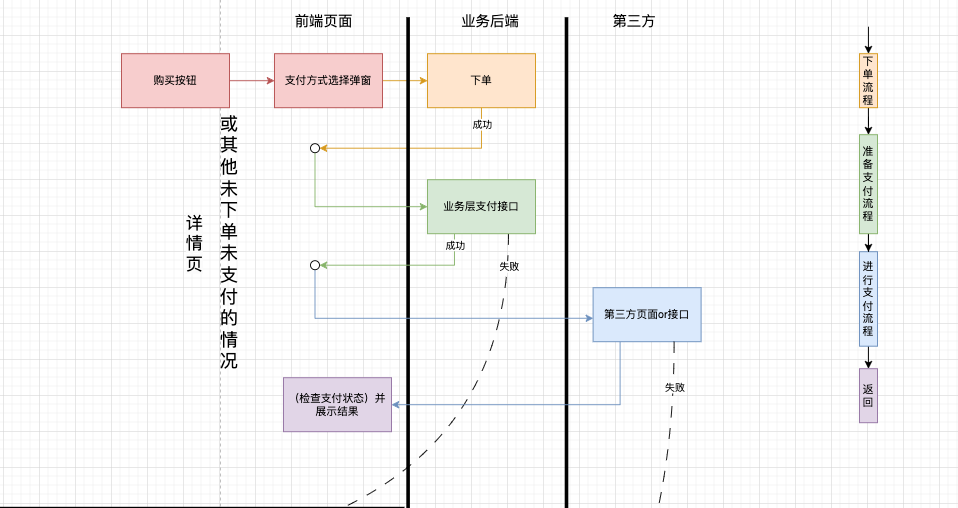  
总体来说分为

1. 下单：接口调用成功则进行了库存扣减
2. 准备支付：此时调用业务后端的支付接口，获取需要传给第三方信息或者跳转到第三方的 url
3. 进行支付：调用第三方 sdk 或者跳转到第三方支付页面
4. 返回：支付成功后进行后续流程，跳转进行的支付需要手动检查支付状态

### tips

到<span style="color:#a8cb98">第 2 步</span>失败：  
业务后端并没有记录到支付渠道，所以继续支付时需要<b style="color:#d79593">重新选择支付方式</b>然后直接进行<b style="color:#a8cb98">准备支付流程</b>

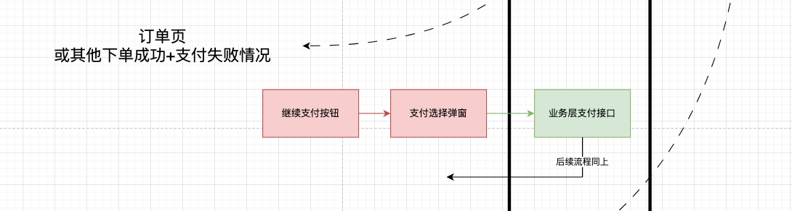

到<span style="color:#8ea9ce">第 3 步</span>失败：  
<b style="color:#d79593">继续支付</b>时进入<b style="color:#a8cb98">准备支付流程</b>，获取支付需要的信息，然后继续后面的流程

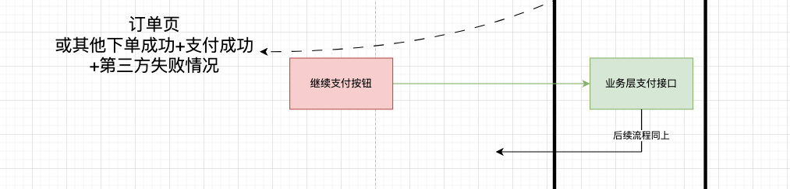

不过，不同的支付渠道，不同的环境还需要不同的处理，下面分情况聊聊，代码都是 React 代码片段

## 浏览器环境-支付宝支付

要成功的调用支付宝支付，需要到支付宝开放平台进行一系列的配置，[查看官方文档：接入前准备](https://opendocs.alipay.com/open/203/107084)，虽然这些可能是其他人去配的，但开发必须懂，要不然遇到问题不知道哪里配的不对，真的很麻烦。  
总流程的步骤 2 到步骤 4 之间的详细流程如图  
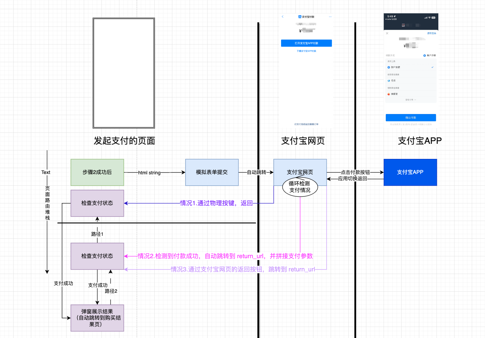

### 模拟表单提交（支付）

后端调用支付宝接口后拿到表单字符串，然后返回给前端，前端模拟表单提交又调用到了支付宝的后端接口，然后跳转到支付宝的 h5 页面

```ts
const h5AliPay = (payHtml: string) => {
  const div = document.createElement("div");
  div.innerHTML = payHtml;
  div.id = "form-wrapper-for-alipay";
  document.body.appendChild(div);
  const form = div.getElementsByTagName("form")[0];
  form.submit();
};
```

> 2023 年 6 月支付宝对外的支付方案升级了，原来是业务端通过参数拼接访问 url，现在是模拟表单提交

### 检查支付状态

和前端关系密切的另一个流程就是回到我们的 h5 页面需要检查支付状态，分如图的三种情况。其中：

- **情况 2**和**情况 3**是支付宝跳转的，跳转地址是后端接口通过 return_url 传给支付宝的，一般 return_url 和发起支付的页面是同样的路由，这两种情况是**路由继续堆栈**的；
- **情况 1**是**路由出栈返回**发起支付的页面  
  假设在详情页（<code>/detail?id=xxx</code>）支付，<code>return_url</code> 也是详情页。那我们需要考虑的细节有两个

#### 1.详情页有两种状态：购买操作前、购买操作后

详情页需要区分是购买前还是购买后，购买后进入页面就要弹窗检查，购买前不需要  
在笔者看来这里只有两个方案，① 路由参数定义一个标识 ② 本地存储，毕竟已经跳出我们的应用了，store 啥的肯定不行，当时笔者采用的是方案 ①  
<code>return_url</code> 定义为 <code>/detail?id=xxx&orderNo=xxx</code>，有<code>orderNo</code>则弹窗

```ts
useEffect(() => {
  if (getQuery("orderNo") && checkCountRef.current === 0) {
    // 因为 useEffect(()=>,[]) 会触发两次，所以这里checkCountRef.current计数一下
    H5PayStatusHandler(); //弹窗逻辑
    checkCountRef.current++;
  }
}, []);
```

不过还有个问题，要兼容情况 1，所以在跳转到第三方支付平台之前要主动进行路由替换，因为路由没变只是参数变化，所以页面不会跳转刷新和重新渲染等，能够做到用户无感知

```ts
const beforeJumpTo = (orderNo: number) => {
  const { pathname, search } = location;
  const newRoute = search ? `${pathname}${search}&orderNo=${orderNo}` : `${pathname}?orderNo=${orderNo}`;
  navigate(newRoute, { replace: true });
};
const h5AliPay = (payHtml: string) => {
  // ...
  const form = div.getElementsByTagName("form")[0];
  beforeJumpTo();
  form.submit();
};
```

> ✨ 这里不直接指定路由而是动态计算路+径参数，是因为考虑多个页面通用，我们的项目中支付行为发生在三个页面，这些逻辑都是写在 hook 中共用的

检查支付状态后要把<code>orderNo</code>去掉，否则路径 2 到详情页，会再次弹窗。

```ts
const afterJumpBackAndCheck = () => {
  const { pathname } = location;
  searchParams.delete("orderNo");
  const search = searchParams.toString();
  const newRoute = search ? `${pathname}?${search}` : `${pathname}`;
  navigate(newRoute, { replace: true });
};
const H5PayStatusHandler = () => {
  // Modal ...
  afterJumpBackAndCheck();
};
```

> ❓ 其实还有个问题，情况 3 会拼接很多支付宝支付相关的参数，此时这个页面无法再次成功的发起支付，这些参数也要剔除。这个在下面小结一起解决

#### 2.详情页又返回详情页了？

假设现在是由情况 3 到详情页，检查支付状态后，路径 1，就是从详情页返回到详情页，并且会再次弹窗。为了避免这个情况，笔者的思路是如果是情况 3 或者情况 2，自动进行路由出栈。也就是这样  
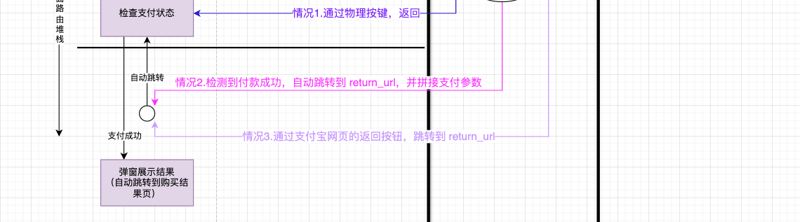  
这样就也同时解决了上一小结遗留的问题！那就再加个参数<code>fromThirdPayPlatform</code>区分咯

```ts
useEffect(() => {
  console.log("=======  useEffect [] ======");
  if (searchParams.has("fromThirdPayPlatform")) {
    console.log("======= fromThirdPayPlatform 从第三方平台回来 ======");
    navigate(-1);
    return;
  }
  if (getQuery("orderNo") && checkCountRef.current === 0) {
    console.log("======= orderNo 发起支付的页面 ======");
    H5PayStatusHandler();
    checkCountRef.current++;
  }
}, []);
```

#### 3.兼容华为原生浏览器

问题是：  
路由出栈时，不会触发页面 render，也就是说回到发起支付的页面不会走到 <code>useEffect(()=>,[])</code> 这段逻辑, 就没办法弹窗了。笔者采用的方法是用这个 [visibilitychange](https://developer.mozilla.org/zh-CN/docs/Web/API/Document/visibilitychange_event) 事件

```js
useEffect(() => {
  if (isHuawei()) {
    document.addEventListener("visibilitychange", () => {
      if (document.visibilityState === "visible" && getQuery("orderNo")) {
        H5PayStatusHandler();
      }
    });
  }
}, []);
```
### tips
支付宝中，h5页面使用支付宝支付和浏览器中使用支付宝支付完全可以看做一个流程，只是少了app切换那一步。

## 浏览器环境-微信支付

要成功调用微信支付，要到微信支付平台做一些[接入前的准备](https://pay.weixin.qq.com/wiki/doc/apiv3/open/pay/chapter2_6_1.shtml)[开发指引](https://pay.weixin.qq.com/wiki/doc/apiv3/open/pay/chapter2_6_2.shtml)。微信比支付宝要麻烦一些，需要到[商户平台](https://pay.weixin.qq.com/)（mchid）和[公众号](https://mp.weixin.qq.com/)平台（appid）同时操作，并进行 appid 和 mchid 的关联以及一系列的其他配置，具体看官方文档吧。  
总流程的步骤 2 到步骤 4 之间的详细流程如图  
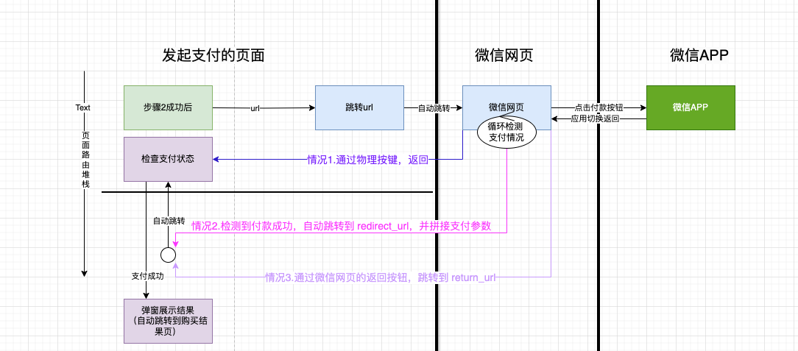
其实和浏览器环境的支付宝支付差不多，面临的问题和处理方式也和支付宝支付一样，这里就只说一下区别点：

- 支付宝返回的是表单字符串，微信返回的是 url。
- redirect_url 携带在路由参数中，需要业务端去拼接（笔者做项目时，是让后端拼接的哈哈哈哈）
  > redirect_url 非必须，默认返回发起支付的页面，❓ 是跳转还是返回


### tips  

支付宝中使用微信支付这种场景我们项目中没太考虑，待补充。预估两种情况①不能支付②和浏览器中使用微信支付一样。

## 微信环境-微信支付

虽然都是微信支付，但在微信环境调用微信支付和其他浏览器内调用微信支付流程上完全不同。  
对于前端开发来说，利好是不用每次跳到站外去支付，也就不用检查支付状态，不用处理各种路由情况了。但是！重要的永远是后半句 O(∩_∩)O 哈哈~支付前多了一个流程：**授权**。

### 授权

授权相关配置参考[官方文档这里](https://pay.weixin.qq.com/wiki/doc/apiv3/open/pay/chapter2_3.shtml)，先展示一下授权流程：

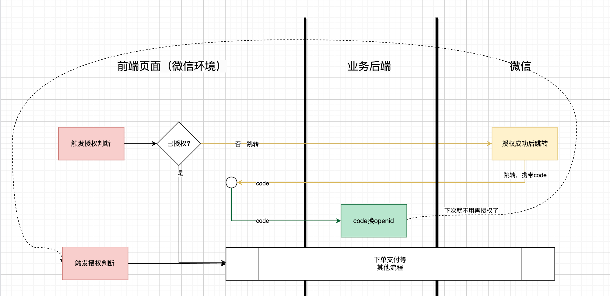  
一般情况下是否授权都是从用户信息接口获取，授权是通过跳转行为完成，

1. 跳转时通过路由参数携带的两个重要信息是 appid 和 return_uri, 跳转回来微信会通过路由参数传递给业务层 code，
2. 业务后端通过 code 置换 openid，并存在用户信息接口

下次识别到用户信息中标记为已授权，就不用再走一次流程了

> 虽然从代码上来是跳转行为，实际上表现并不会离开当前页面，而是弹窗的形式，可以理解为和微信的一种通信方式

```ts
const toAuth = () => {
  const encodeUrl = encodeURIComponent(window.location.href);
  window.location.href = `https://open.weixin.qq.com/connect/oauth2/authorize?appid=${APPID}&redirect_uri=${encodeUrl}&response_type=code&scope=snsapi_base&state=${WX_AUTH_STATE}#wechat_redirect`;
};

const afterWxAuth = async (code: string) => {
  await setOpenId({ code }); //code 置换 openid
  getUserInfo(); //更新用户信息
  // 处理路由：为了用户授权后，路由到别的页面，再返回时，不再重复afterWxAuth流程
  const { pathname } = location;
  searchParams.delete("code");
  searchParams.delete("state");
  const search = searchParams.toString();
  const newRoute = search ? `${pathname}?${search}` : `${pathname}`;
  navigate(newRoute, { replace: true });
};

useEffect(() => {
  const code = getQuery("code");
  const state = getQuery("state");
  if (code && state === WX_AUTH_STATE) {
    afterWxAuth(code); //说明是微信授权通过了
  }
}, []);
```

### 支付

还记得文章最开始的支付总流程图吗？  
授权过程插到总流程图中大概是这样的：  
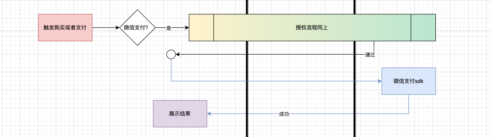
可以看到，支付总流程的<span style="color:#8ea9ce">第 3 步</span>和<span style="color:#c2accc">第 4 步</span>都简化了，代码上的变化：

- 引入 sdk，WeixinJSBridge 对象才挂在全局

```html
<script src="https://res.wx.qq.com/open/js/jweixin-1.4.0.js"></script>
```

- 调用微信 sdk

```ts
const { appId, channel, nonce, packageNo, prepayId, redirectUrl, sign, timestamp, url } = payData;
    //大多数字段都是要后端通过步骤2给前端
    const payload = {
      appId,//这个是个固定值，可以不从后端接口取
      timeStamp: `${timestamp}`,
      nonceStr: nonce,
      package: `prepay_id=${prepayId}`,
      signType: "RSA",
      paySign: sign,
    };
    WeixinJSBridge.invoke("getBrandWCPayRequest", payload,(res: any) => {
        if (res.err_msg === "get_brand_wcpay_request:ok") {
            //支付成功逻辑
        }else if (res.err_msg === "get_brand_wcpay_request:cancel") {
            //取消支付
        }else if (res.err_msg === "get_brand_wcpay_request:fail") {
            //支付失败
        }
    }
```


### 授权发生的时机
从理论上讲，需要微信授权要同时满足两个条件①在微信环境②选择微信支付。所以在支付的总流程图中，授权出现在已经确定了支付方式和下单之后：  
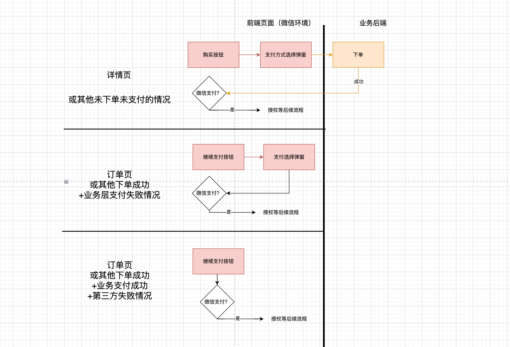  
不过，我们产品的逻辑稍微调整了一下，把授权前置了  
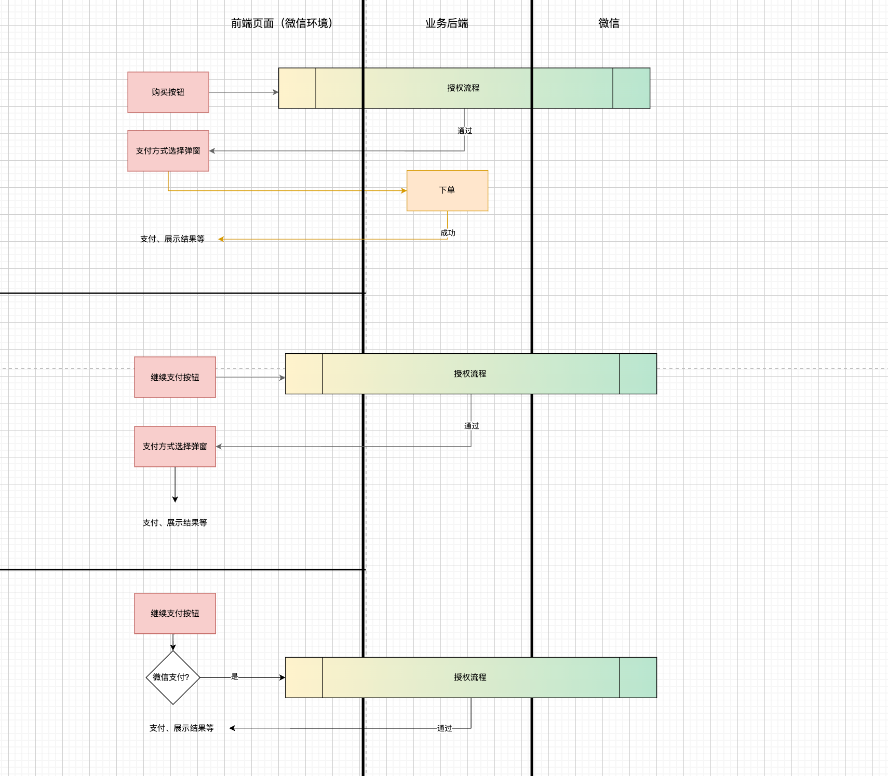  
取决于产品逻辑，可供参考

