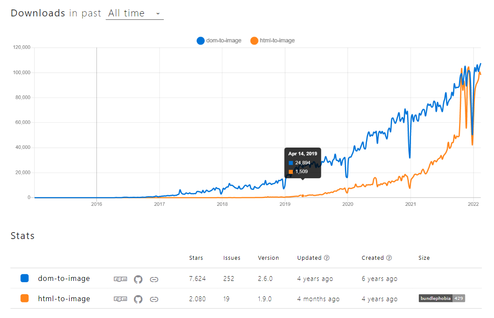
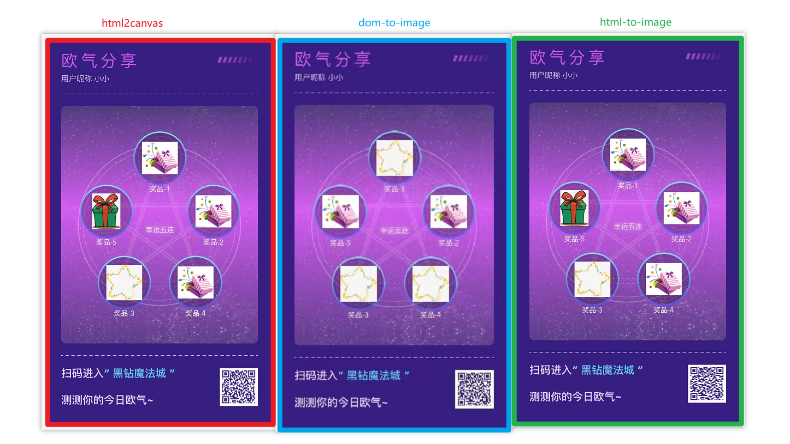

<!--
 * @Author: 鱼小柔
 * @Date: 2022-01-23 11:29:45
 * @LastEditors: your name
 * @LastEditTime: 2022-02-06 19:50:59
 * @Description: 前端截屏
-->

## 说在前面

工作需求，以海报形式分享，本质就是 html 转换为图片。就前端而言有两种技术技术（见原理方案）,当时采用了使用最广泛的库 html2canvas。实际应用到业务时候踩了很多坑，在探究原因过程中了解到一些原理，了解原理的好处是培养举一反三的能力，便于以后遇到新的问题也有一个尝试的方向。  
所以本文会对原理进行概述，对实践过的 js 截图库给出 checklist，希望能够帮看到文章的你少走一点弯路。  
js 截屏的坑太多，可能这篇涉及的还是很片面 o(╥﹏╥)o，所以希望可以和大家一起总结、探讨和进步哦~

## 原理方案

js 截屏方案主要基于三个核心原理：

### 方案(一)：DOM->canvas->image

将目标 DOM 节点绘制到 canvas 画布，然后利用 canvas 相关的 API 以图片形式导出。  
可简单标记为绘制阶段和导出阶段两个步骤：

① 绘制阶段：选择希望绘制的 DOM 节点，根据 DOM 的 nodeType 属性调用 canvas 对象的对应 API，将目标 DOM 节点绘制到 canvas 画布（例如对于 img 标签的绘制使用 drawImage 方法)。

② 导出阶段：通过 canvas 的 toDataURL 或 getImageData 等对外接口，最终实现画布内容的导出。

### 方案(二)：DOM->svg->canvas->image

将 html 作为 svg 的外联元素，利用 svg 的 API 导出为图片

### 方案(三)：nodeJS 调用浏览器方法

通过 nodeJS 调用浏览器的 page 对象，基于 page.screenshots 截图并保存到磁盘。

### 小结

- 前两种方案是前端截屏方法，而第三种方案是通过浏览器进行截屏。
- 前两种的共同之处在于都是讲 html 转换为 canvas 然后再转换为图片，不同之处在于转换为 canvas 这个过程中的实现思想不同。

下面就结合每种方案的 js 库进行一下原理概括和 checklist 总结。

## html2canvas

html2canvas 是方案(一)的典型代表。html2canvas 可以完成把 DOM 重新绘制到 canvas 的流程,并把绘制完的 canvas 返回。

### html2canvas 基本使用：

```js
html2canvas(node, options);
```

html2canvas 接收两个参数，第一个参数代表需要绘制部分的顶层 dom 节点，第二个参数是配置项 [options](http://html2canvas.hertzen.com/configuration)。  
html2canvas 返回 canvas 元素。

业务层拿到绘制完成的 canvas 后，剩下的步骤就简单了。通过调用一些原生 API 就可以导出图片。 （也可以利用[canvas2image](https://github.com/hongru/canvas2image)实现 canvas 导出为图片的流程）
但 html2canvas 在实际使用时，会有很多细节需要注意，否则会高频踩坑，这也是因为本身 html2canvas 实现把一个一个 DOM 绘制到 canvas 本身就是很复杂很庞大的工程。  
所以下面简单介绍一下 html2canvas 的原理实现流程再提供一个使用时的 checklist。

### html2canvas 流程概括：

1. 递归遍历目标节点及其子节点，收集节点的样式信息；
2. 计算节点本身的层级关系，根据一定优先级策略将节点逐一绘制到 canvas 画布中；
   - 分析节点类型和样式，结合[CanvasRenderingContext2D](https://developer.mozilla.org/en-US/docs/Web/API/CanvasRenderingContext2D)API 去‘画图’
3. 重复这一过程，最终实现目标节点内容的全部绘制。

### 使用 html2canvas 时的 checklist

> 在了解原理的基础之上，总结出 checklist，并且结合原理说明原因和避免方法

#### 只适用于静态 DOM

当 DOM 节点有动画时，调用 html2canvas 绘制时只会绘制该节点的第一帧状态。比如某个 DOM 会执行 opacity 从 0->1 的 animation，那么 html2canvas 只会把该 DOM 的 opacity 为 0 的状态绘制到画布上。

> 在实际的应用场景中，保存截图之前都会有一个静态的预览页面。所以这个问题出现的机率并不大，这里更多是作为提醒。

#### 资源加载完毕后再调用 html2canvas。

尤其应该注意图片资源的加载，有多张图片时，img.onload 与 Promise.all 结合使用：

```js
const preloadImg = (src) => {
  return new Promise((resolve, reject) => {
    const img = new Image();
    img.src = src;
    img.onload = () => {
      resolve();
    };
  });
};
const preloadList = ["./pic-1.png", "./pic-2.png", "./pic-3.png"];

await Promise.all(preloadList.map((src) => preloadImg(src)));
// 调用html2canvas
```

#### 存在跨域图片时，html2canvas 需要把配置项 useCORS = true

img 的 crossorigin 属性，结合合适的 CORS 响应头，就可以实现在画布中使用跨域 img 元素的图像。html2canvas 基于这个[原理](https://developer.mozilla.org/en-US/docs/Web/HTML/Attributes/crossorigin)，
在源码中对于 useCORS 配置项置为 true 的处理，实质上是将目标节点中的 img 的 crossOrigin 的属性应用 “anonymous”的值 ，从而允许载入符合 CORS 规范的图片资源。

#### 使用支持的 css

按照官方文档使用[支持的 css 属性和值](http://html2canvas.hertzen.com/features)，当使用了不支持的属性或值时，html2canvas 无法解析会让属性不生效或使用默认值。这样最后 canvas 绘制出来的效果与原生 DOM 不一样，比如样式不生效或者会发生图片的变形拉伸等。
举例：

```css
img.example {
  object-fit: contain;
}
/* 由于不支持object-fit属性，图片会按照100%100%拉伸填充显示 */
```

#### 尽量使用精准单位

也就是说，尽量使用 px，少用 rem、%等相对单位。  
 当使用%、rem 等相对单位计算出小数时，由于舍位进位等原因，会使像素发生拉伸，所以看起来会变模糊。

```html
<!-- ... -->
<div class="par">
  <p class="chi"></p>
</div>
<!-- ... -->
```

```css
div.par {
  width: 45px;
}
div.chi {
  width: 10%;
  /* （比如使用%计算出来的像素是4.5，实际到设备上显示是5个像素，这样就会发生原图像素的拉伸。） */
}
```

#### 尽量用 img 标签展示图像

将 background-image 改成 img 的形式，图片清晰度显著提升。

> 但是其中原理没有摸透，希望各位大佬有知道的评论留言。

## html-to-image

dom-to-image、html-to-image 这两个库都是方案(二)的典型代表。 可以完成方案(二)的整个流程,接收 node 输出图片。  
以下是它们之间的数据对比，两者的下载量趋势相近；前者创建比较早，累计下载更多，但是最近四年都没有更新;后者属于后起之秀但现在更活跃一些。所以还是采用 html-to-image 进行下面的小节。



### html-to-image 基本使用：

```js
// 伪代码
htmlToImage.toxxx(node, options);
```

htmlToImage 提供了[多个方法](https://github.com/bubkoo/html-to-image#usage)， 每个方法接收两个参数，第一个参数代表需要绘制部分的顶层 dom 节点，第二个参数是配置项 [options](https://github.com/bubkoo/html-to-image#options)。  
htmlToImage 提供的多个方法返回对应格式的图片。例如 htmlToImage.toPng 返回 png 格式的图片、例如 htmlToImage.toSvg 返回 svg 格式的图片等等。

### html-to-image 流程概括

1. 递归 clone 原始的 dom 节点
2. 样式内联处理：把 css 样式全部转换为内联 style 属性的形式
   - 获取 节点以及子节点 上的 computed style，并将这些样式添加进新建的 style 标签中
   - 把 style 属性加到对应的 dom 上
3. html 转换为 svg 内联  
   转换后大概结构为:
   ```html
   <!-- 伪代码 -->
   <svg><foreignobject>{xhtml}</foreignobject></svg>
   ```
   html 转换为 xml，放到 foreignobject 标签中，放到 svg 中
4. svg 转换为 data:uri 格式。类似：  
   'data:image/svg+xml;charset=utf-8,' + {上一步的 svg 标签}
5. data:url 转换为 canvas
   - 用上一步得到的 data:url 创建 Image 对象
   - 创建 canvas 并通过 drawImage 方法在 canvas 上绘制图像
   - return canvas
6. 利用 canvas 相关 API 转换为各种格式的图片或者图片二进制数据等


### 优势

使用 html-to-image 时也要注意资源加载结束后再调用 htmlToImage.toxxx。  
笔者做需求时是使用 html2Canvas，对 html-to-image 的实践经验较少。但在需求结束后，系统学习截屏方案时也试用了 html-to-image 和 dom-to-image，并且也对比了使用三个库输出图片的效果。  

目前，比较推荐 html-to-image，优点:

- 流程顺畅没有踩坑
- 不需要自己写 canvas 到 image 的步骤
- 清晰度足够

## puppter

### puppter 基本使用

以下仅为关键代码步骤，业务中还需考虑更多细节（比如截取局部等）。

```js
const puppeteer = require("puppeteer");
// 启动puppeteer
puppeteer.launch().then(async (browser) => {
  // 打开浏览器后，新建tab页
  const page = await browser.newPage();
  // tab访问需要截图的页面，使用await可以等待页面加载完毕
  await page.goto("https://example.com");
  // 页面渲染完毕后，开始截图
  await page.screenshot({ path: "screenshot.png" });
  await browser.close();
});
```

### puppter 原理概括

puppeteer 是谷歌官方出品的一个通过 DevTools 协议控制 headless Chrome 的 Node 库。可以通过 Puppeteer 的提供的 api 直接控制 Chrome 模拟大部分用户操作，在上面的“基本使用”中，我们就是模拟了截屏操作。对于业务层来说具体步骤就是：

1. 启动 puppeteer 拿到 browser 对象
2. 通过 browser 拉起一个新的 tab 页面，url 就是我们要截屏的网页
3. 调用 page.screenshot 一步截屏并保存到磁盘
   > 这已经不是前端 html 生成图片了，这是需要运行在服务器上的，是后端截屏方法。

### 说明

因为笔者对 puppter 没有实操经验，所以也就没有总结 checklist，只是在系统的总结 js 截屏时看到这个方案，暂且记录一下。

## 参考

[github·html-to-canvas](https://github.com/niklasvh/html2canvas)  
这篇超赞!❥(^\_-)[云音乐·高质量前端快照](https://segmentfault.com/a/1190000021275782)  
[github·html-to-image](https://github.com/bubkoo/html-to-image/)  
[npmtrends](https://www.npmtrends.com/dom-to-image-vs-html-to-image)  
[puppeter 文档](http://www.puppeteerjs.com/#?product=Puppeteer&version=v13.3.2&show=api-class-page)
