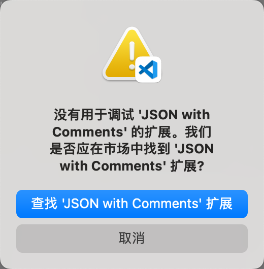
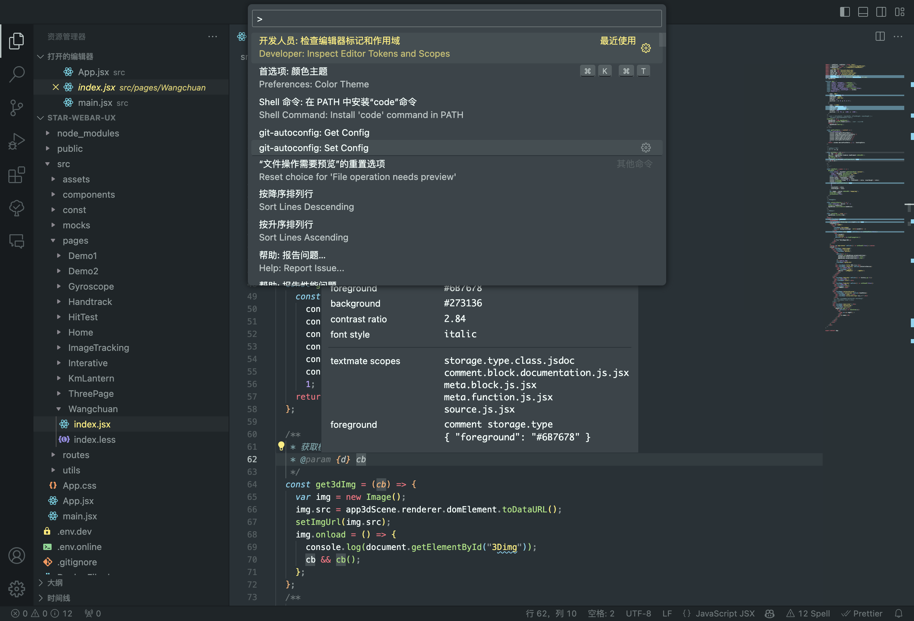
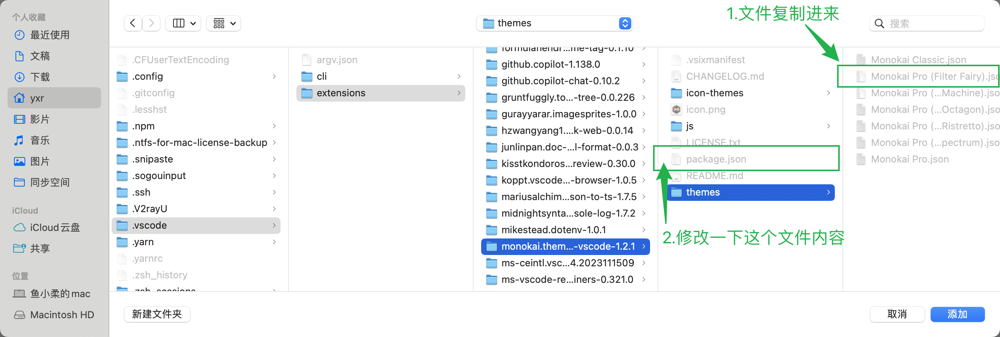
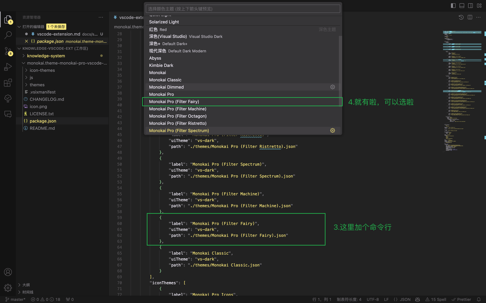
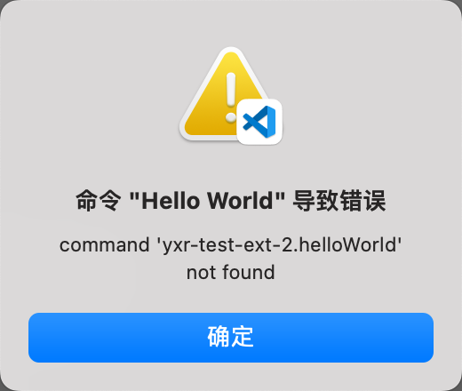
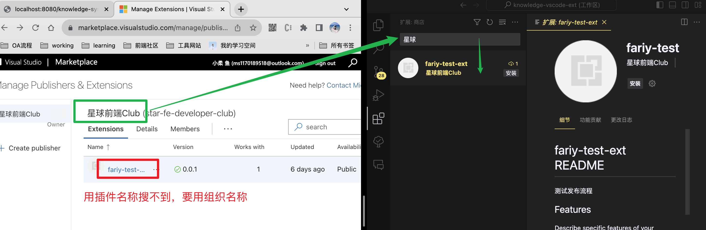
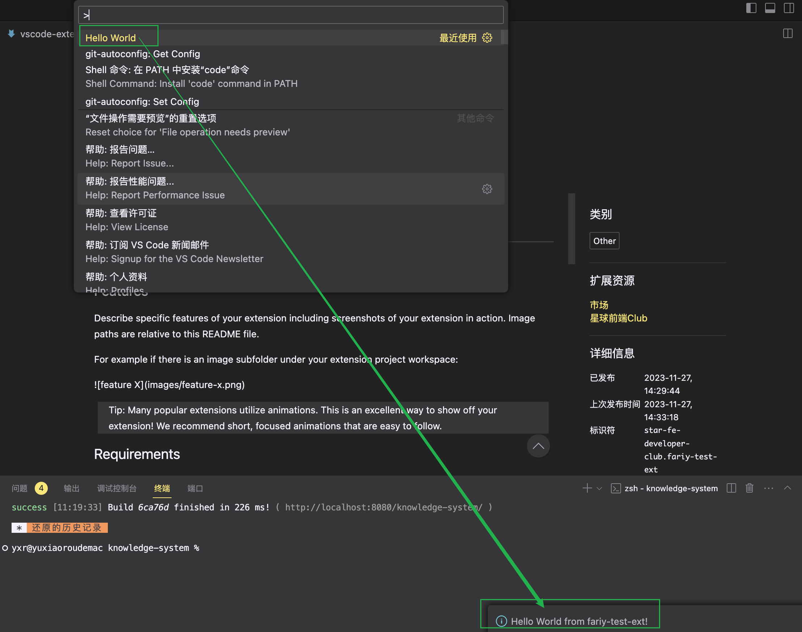
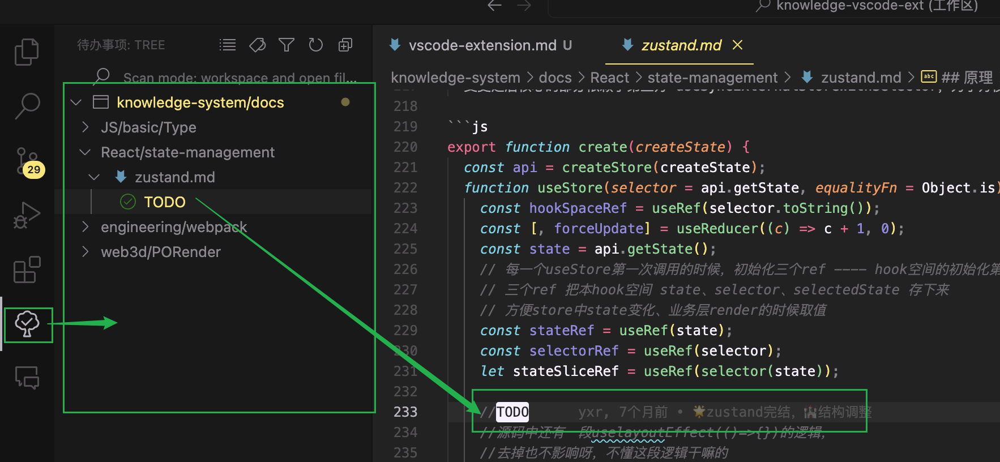

笔者一直以来前端工具这块欠缺，这不，想继续解锁个新技能 ————> 学习做个 vscode 插件。  
这篇另一个功能就是为我积攒了一年的焦虑做个出口。。。不想看碎碎念的提前预警了喔。

## 做个 vscode 主题

做插件的流程不难，官方文档还有很多其他人的经验，我这里就不赘述了。我这里记录一下遇到的奇怪问题和解<i style="font-size:12px">（凑）</i>决<i style="font-size:12px">（字）</i>的<i style="font-size:12px">（数）</i>心<i style="font-size:12px">（就）</i>路<i style="font-size:12px">（用）</i>历<i style="font-size:12px">（流）</i>程<i style="font-size:12px">（水）</i>吧<i style="font-size:12px">（账）</i>。

#### 问题一 没有用于调试 JSON with Comments 的扩展

安装 yo 和 yo code 之后，生成模板代码，按下 f5 调试，报错了，说没有用于调试 JSON with Comments 的扩展。



1.  根据 vscode 的提示（报错弹窗中的蓝色按钮），直接搜索插件，看着都不靠谱，就没安装。
2.  去 google 一下，有人说安装一个 c++ 的插件，然后我发现那个插件已经弃用了，安装了看起来一样功能的插件，还是同样的报错。
3.  问 chatgpt，也是说安装插件。。。
4.  好吧，只能问同事了。人家就是正常的流程，丝滑的启动了调试窗口，他说这是默认就有的能力，应该不用额外装插件。
5.  忽然想起了，刚安装 vscode 的时候我好像删过一些插件，可能是让我瞎删了。我的 mac 有两个号，vscode 配置不共享，我用另一个号，果然可以启动调试！！！虽然不知道原因，但估计重装一下就能解决问题了。
6.  把另一个账号的 vscode 配置同步过来，重启 vscode，重新生成模板代码，按下 f5 调试 OK！。
7.  再不好使，我真的只能重装大法了。

#### 问题二 调试窗口未应用主题

1. 虽然调试窗口启动了,但应用不是正在开发的主题。。。
2. 关掉调试，重新启动，好了。。。莫名其妙。。。

#### 技巧一 自己配色太难了

1. 打开文件系统，command+shift+. 隐藏文件可见。
2. 找到一个自己觉得还不错的主题（我找的是 monokai pro（filter Machine）.json
3. 配色如何对应到 json 中的字段，按下图操作  
   

#### 技巧二 a little 奇怪的思路

1. 我就图省事，直接把 json 文件复制到 monokai pro 的 themes 文件夹下了
2. 改一下 monokai pro 的 package.json，然后重启 vscode 应用了自己主题 hhh
   
   

#### [官方可以在线做主题了](https://themes.vscode.one/)

### impression

so easy 是真的，但对于我来说 so hard 更是真的，再次被自己的短板狠狠地抽打了。不过最后搞出来还是挺开心的 (#^.^#) 。

## 做个 vscode 插件

#### 问题一 命令错误

安装 yo 和 yo code 之后，生成模板代码，按下 f5 调试，窗口打开了，然后运行 hello world 长这样。



和无调试工具换汤不换药，配置同步过来就好了。

#### 问题二 vsce command not found

```bash
yarn global add vsce # 安装后有 .yarn/bin/vsce，但是 vsce command not found
npm install -g vsce # OK！！
```

1. 一开始用 yarn 安装，安装成功
2. 使用命令报找不到
3. google 搜过、chatgpt 聊过，总结起来就是检查一下本地全局的 node_modules 有没有
4. 跟着一些命令行操作都确认了，确实全局有在.yarn/bin/vsce
5. 实在无奈就换 npm 了，就好了

#### 问题三 发布成功但搜不到

1. [markplace 平台使用](https://marketplace.visualstudio.com/manage/publishers)，像我这样跟着操作都能搞下来，估计没人会遇到问题了。
2. 我没改模板代码中的内容，就直接发布了，先试试流程。
3. 到 vscode 扩展市场搜索
4. 咱也搞不懂为啥用插件名搜不到，要用组织名才行。。[官方说修复过](https://github.com/Microsoft/vscode/issues/42890#event-5181377526)



#### 问题四 最基本的关联关系

执行插件的具体命令和命令反馈  
  
需要：

1. package.json 配置命令

```JSON
"contributes": {
        "commands": [
            {
                "command": "fariy-test-ext.helloWorld",//类似命令 id
                "title": "Hello World" //ctrl+shift+p 时显示的命令名称
            }
        ]
 }
```

2. 命令反馈

```JS
const handleHelloWord = () => {
		vscode.window.showInformationMessage('Hello World from fariy-test-ext!'); //显示消息弹窗
}
```

3. 注册命令

```JS
vscode.commands.registerCommand('fariy-test-ext.helloWorld',handleHelloWord);//命令id与package.json中的一致
```

拿一个简单的 todo 插件来说，侧边栏显示插件，插件有自己的工作区，点某一个 todo 后自动打开 todo 所属文件并定位到具体位置。  


## 感慨

一开始充满热情和好奇的看了看官方文档和别人的经验，感觉流程是 so easy，心里暗喜：just so so 呀。  
不过，知道自己在使用和制作工具上都很菜，就想着还是从最简单的制作一个主题开始。然后就莫名奇妙地遇到了上面的第一个问题，无法调试。努力未果，灰心丧气，那就不做主题了，做个正经插件吧。又开始满怀期待了，然后就相同的病因，不同的表象。

Vscode 插件二次失败，我彻底 emo 了，开始陷入了沉思 😔
我开始反思

- 是不是根本就不适合做个程序员？  
  学习新技术的能力、使用工具的能力都很低下。年初 chatgpt 和各种 AI 爆火的时候，我不是自己发现的，是从其他同事那里知道的它，我的消息至少延迟了一个月。我意识到了自己不够敏锐，我就开始每天从刷微博变成刷 youtube，关注了一些技术博主，每天都听他们讲 AI 新的动态。但是坚持了两个月，我发现我并不快乐，我是再强迫自己吸收。
- 我真的喜欢这个职业吗？  
  接触前端是从一门专业课开始，当时还是学习的前端还是直接用文件协议打开 html 文件，最后的大作业也就是个人网站（一个页面的那种），用到的 js 很少，几乎都是 html 和 css。当时喜欢应该是因为那时候的前端内容只是纯纯的画页面，为了一次小作业熬个通宵研究 css 也觉得快乐，因为喜欢画页面。所以，我应该只是喜欢画页面而已吧。
- 不干这个能干什么呢？  
  活了二十多年，才发现好像并不了解自己，不知道自己擅长做什么，也没有找到不顾一切去追求的事业。所以，我想可用苟且偷生来形容了吧。暂时这样吧。。。
- 又能坚持多久呢？  
  马上也奔三了，失去了年龄的优势，技术又没有突出，到了要准备思考如何平衡家庭和事业的阶段，是个随时可以被取代的工具人。
- 那如果真的失业了怎么办？
  想到这，失业是必然，可是还有房贷要还，还有父母要养，还有自己的生活要维持。好像没有出路也没有退路了。

## aaa
网上找到一个 vscode 工具函数插件，然后 npm 包也能安装。
看了人家的目录结构，就是 vscode 插件的结构，然后用了打包工具，发布到 npm 和 vscode 插件平台（market）的是打包之后的代码。插件使用时好像做了一层 js 到 ts 的转换，因为打包之后的都是 js 了。  
我还是想不经过打包，插件直接引源码，这样也不用转来转去的，和他的思路可能不一样。
但是至少可以解决了 npm 包 和 vscode 插件咋共用一个项目 的问题，就是用 vscode 插件的目录结构呗，然后发布到 npm 的时候还是一样直接发布源码，目录调整后

