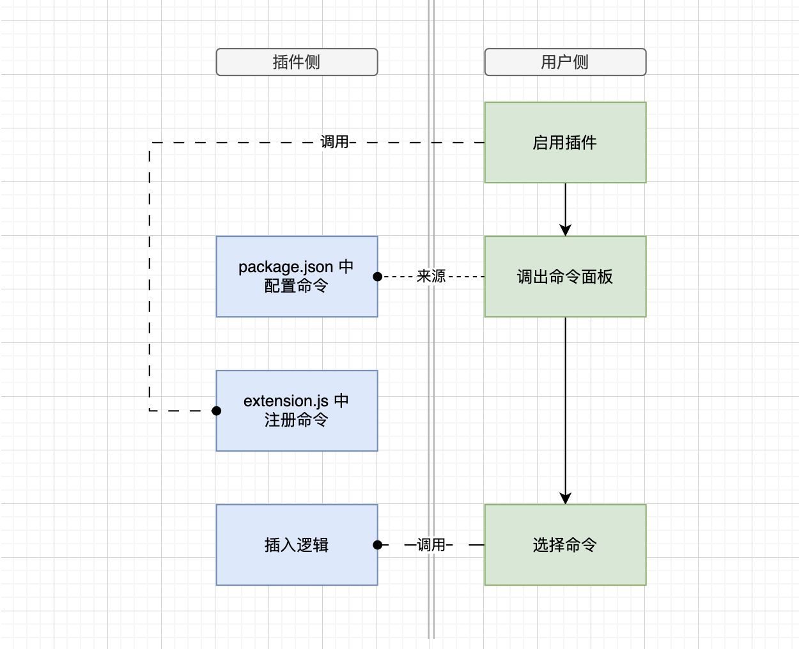
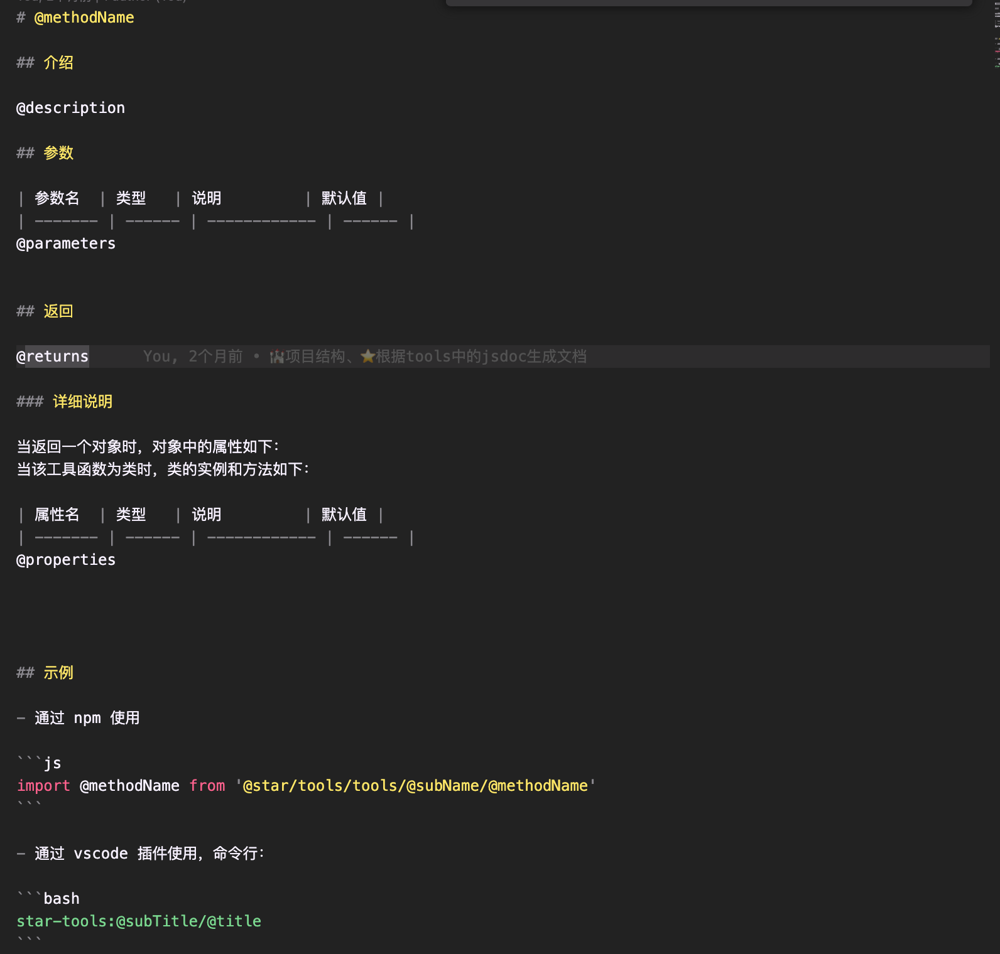
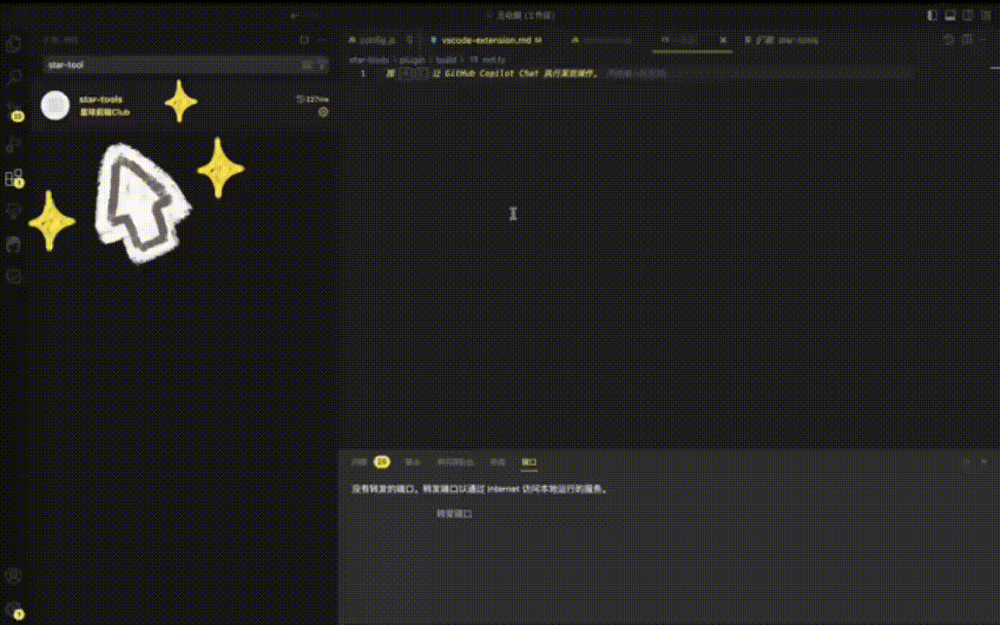

## 需求

实现一个工具函数库，可以通过 npm 包和 vscode 插件两种方式使用

#### 工具函数库目录结构：

```
star-tools
├── validators
│   └── index.ts 计划把验证函数都放到这一个文件中
├── 3d
│   ├── control1.ts 因为 3d 类似 control 这种代码会比较长，是一个类，所以单独用文件
│   ├── control2.ts
│   └── index.ts 引入 control1、control2 等然后统一导出
└── ...
    ├── ...
    └── index.ts
```

#### 期望的 npm 包使用方式：

```js
import {control1} 'star-tools/3d'
```

control1 拿到的就是 ts 源码

#### 期望通过 vscode 插件使用的方式

1. 调出 vscode 命令面板
2. 每个函数对应一个命令，比如输入 star-tools:3d/control1，找到这个命令
3. 选中命令后 enter
4. control1.ts 中的代码插入到当前工作区的 focus 处

## 项目目录制定

两种方式在一个项目中，共用一份源码，主要是为了不维护双份的工具函数  
如果不考虑两种方式共用一个项目，

#### 对于 npm 包引用的方式，目录结构：

```
star-tools
├── validators、3d、... 目录不变
├── .gitignore
└── package.json
```

直接 publish 源码，install 的就是源码，可以 import {control1} 'star-tools/3d' 引用到

#### vscode 插件目录结构

```
star-tools
├── src
│   └── extension.ts 插件的入口文件，主要是插件的逻辑代码
├── tools
│   └── 省略，就是把三个分类文件夹直接移动过来
├── .gitignore
├── package.json
└── tsconfig.json
```

#### 结论

显而易见了，就直接用 vscode 插件的目录结构，这样直接 publish 源码仍然可以引用到工具函数，并且两种方式共用同一份 tools

> 目前来看，这样的目录结构虽然 ok，但是会有不合理的地方，比如要把只和 vscode 相关的部分也发布到了 npm，这个会在稍后解决。

## 前置知识恶补

整个开发过程其实很不顺利，开发之前要先做一些调研，有一些前置知识会少走弯路。但很矛盾的是，一开始根本没有头绪，都不知道要先掌握哪些基本的前置知识。希望我总结的这些前置知识可以让你少走弯路咯 ~

### 进一步明确需求

在这个项目中：

- 由于插件的逻辑是用 ts 编写的，所以这部分代码需要编译为 js，因为 vscode 插件的运行时需要时 commonjs 模块规则
- 作为 vscode 插件时：代码片段作为源码直接插入，不需要把 ts 编译为 js。
- 作为 npm 包引用时：~~ 同上 ~~~

### 一些有用的 API

- 同步读取文件用 fs.readFileSync

### 各种有用的配置文件

- package.json : 配置主入口、依赖、scripts 等、开发和发布后都要用到
- tsconfig.json : 负责把 ts 编译 为 js。vscode 插件运行时只能是 js，如果插件源码是 ts，tsconfig 是必要的（或者用一些其他的打包工具内部集成了 ts 编译为 js 的能力）
- .vscode 目录下的配置文件是用来配置 vscode 调试功能的，插件发布后无关。
- .npmignore 用来过滤发布到 npm 的文件。
- .vscodeignore 用来过滤发布到 [marketplace](https://marketplace.visualstudio.com/) 的文件。

- package.json 中的 scripts 脚本，& 是并行，&& 是串联进行
- package.json 中的 dependencies 是运行时的依赖，对于 vscode 插件来说，安装插件时，自动安装。

### F5 调试插件时 干嘛了

调试的入口文件为 .vscode/launch.json，一般情况下，vscode 左侧 debugger 工具面板都会自动定位到 .vscode/launch.json 中的 第一个命令  
  
按下 f5 时，先经历了这样的过程，然后再把调试窗口启动  
  
原来 f5 并不神秘，就是 npm run dev 哇，实际执行的脚本在 star-tools 中是

```bash
yarn run remove-out && tsc && yarn run move-src && node ./build/genVscdPkg.js
```

只看 tsc，它是负责把 ts 编译为 js 的，之后插件才能在 vscode 的环境中运行起来。编译之前会先读取 tsconfig.json 中的配置，然后开始编译并输出编译后的代码。

> remove-out、move-src、node ./build/genVscdPkg.js 先不管，这些都属于对目录和文件内容的定制化处理。会在后面的优化中提到  
> 

- 一般情况下 rootDir 都等同于当前目录所以是 './'
- includes 是参与编译的部分
- 编译后输出到 out 目录下，out 目录下的文件与 src 下的对应
- 配置 mapSource 为 true 方便调试，所以可以看到 out 目录下都有对应 .map.js

================== ok！上面编译阶段就完成了， ====================  
这时 vscode 就会把编译窗口启动，开始运行代码，再次看 package.json。其中 main 选项配置的文件就是运行时的入口文件

```json
"main": "./out/main.js",
```

运行时就是插件的逻辑了，取决于插件的功能啦，star-tools 最开始的逻辑就是把每个工具函数都注册为命令，然后巴拉巴拉...(后面讲具体功能再说)

### vsce publish 干嘛了 ？

运行 vsce publish 命令后，经历了这样的过程：  


- 使用 yarn run esbuild-base 来编译，是因为 esbuild 这个打包工具在 tsc 的基础上有一些扩展功能比如压缩合并等，编译之前也是读取了 tsconfig 的配置。（其他也是针对项目的定制化处理，暂且不说）
- 编译打包之后输出到 out 文件夹

============= 发布准备结束！下面就到发布阶段了 ==============  
（其实上面的流程也是编译阶段，和开发调试时不一样在于配置不同输出不同）

- 读取 .vscodeignore 对文件进行过滤
- 发布到 marketplace

### 安装插件 又干嘛了 ？

点击安装 => 下载发布到 marketplace 的插件源码 => 根据 package.json 中的 dependencies（‼️ 注意 ，要考的）安装依赖  
  
什么时候运行呢？由 package.json 中的配置项 activationEvents 决定

- 不配置或者为 [] ：当在命令面板中选择插件相关的命令时开始进入运行时
- 配置为 \* 号 ： vscode 启动就进入运行时

======================= 安装阶段 🔚 =========================

运行时入口文件是 package.json 中的 main，接下来同开发调试时啦

### npm publish 比 vsce publish 简单多了


- 不需要 tsc 编译了，因为就是发布源码，直接引用。（至于 node ./build/genNpmPkg 先不管，也是属于对目录和文件内容的定制化处理）

### npm install

过滤后安装的包结构：

```
根目录
├── tools
│   └── ... 源码结构
├── package.json
└── readme.md
```

## 插件开发插件第一阶段 基本功能

### 功能点

  
从代码上来讲，图中三部分对应以下三段代码：

#### 配置命令

- package.json

```json
// ...
"contributes": {
        "commands": [
            {
                "command": "star-tools.3d.DeviceOrientationControls",
                "title": "star-tools: 3d相关/陀螺仪控制器"
            }
            //...
        ]
},
// ...
```

#### 注册命令

- src/extension.ts

```js
const registerCommand =  (subName: string, methodFileName: string, method: fs.PathLike) => {
  const methodName = methodFileName.split(".")[0];
  const commandName = `star-tools.${subName}.${methodName}`;
  const content =    (method as string); //processSourceFile 把文件作为字符串读取，逻辑省略
  return vscode.commands.registerCommand(commandName, () => whenCommand(methodName, content));
};
export async function activate(context: vscode.ExtensionContext) {
  // ... 读取目录逻辑省略
  // subName 为分类名称如 “3d”
  // methodFileName 为函数名称如 “DeviceOrientationControls.ts”
  // method 为文件对应路径
  context.subscriptions.push( registerCommand(subName, methodFileName, method))
}
```

#### 插入代码片段

- src/extension.js

```js
const whenCommand = (methodName: string, content: string) => {
  const editor = vscode.window.activeTextEditor;
  if (!editor) {
    vscode.window.showWarningMessage("star-tools: 工作区打开文件后才能使用该功能");
    return;
  }
  const { selections } = editor;
  if (selections.length === 0) {
    vscode.window.showWarningMessage("star-tools: 请先选择一个区域");
    return;
  }
  const firstSelection = selections[0];
  const { start, end } = firstSelection;
  const range = new vscode.Range(start, end); //计算选区范围

  editor.edit((editBuilder) => {
    editBuilder.replace(range, content); //替换选区
  });

  vscode.window.showInformationMessage(`✅ 已插入函数: ${methodName}`);
};
```

## 插件开发插件第二阶段 功能优化

做了一些规范化和自动化的事

### 每个文件对应一个代码片段

- 符合封闭开放原则，对修改封闭，对增加开放,易于维护
- 利于 AST 解析（后面会用到）

```ts
import aaa from 'aaa'  //也可以引用多个，或者没有依赖
// 主体代码部分 start
type TXxx {

}
function bbb (){

}
function xxx (){
   bbb()
}
// 主体代码部分 end
export default xxx //每个工具函数都有一个独立的文件，导出都用 export default
```

### 代码片段分割

vscode 插件的形式使用时，插入时，应该剔除 export 语句，并且将 import 插入顶部

1. 改写 processSourceFile，加入 AST 解析逻辑

```ts
export function processSourceFile(filePath: string) {
  const sourceFile = ts.createSourceFile(filePath, fs.readFileSync(filePath).toString(), ts.ScriptTarget.Latest, true);

  let imports: ts.ImportDeclaration[] = [];
  let exportDefault: ts.ExportAssignment | any = null;
  let otherStatements: ts.Statement[] = [];

  function findImportsAndExports(node: ts.Node) {
    if (ts.isImportDeclaration(node)) {
      imports.push(node);
    } else if (ts.isExportAssignment(node)) {
      exportDefault = node;
    } else {
      ts.isStatement(node) && otherStatements.push(node);
    }

    ts.forEachChild(node, findImportsAndExports);
  }

  ts.forEachChild(sourceFile, findImportsAndExports);

  // 将import语句转为字符串
  let importStr = imports.map((imp) => sourceFile.text.substring(imp.getStart(), imp.getEnd())).join("\n");

  // 将除了export和import之外的语句转为字符串
  let bodyStart = imports.length ? imports[imports.length - 1].getEnd() : 0;
  let bodyEnd = exportDefault ? exportDefault.getStart() : sourceFile.getEnd();
  let bodyStr = sourceFile.text.substring(bodyStart, bodyEnd);

  // 将export语句转为字符串
  let exportStr = exportDefault ? sourceFile.text.substring(exportDefault.getStart(), exportDefault.getEnd()) : "";

  return { importStr, bodyStr, exportStr };
}
```

2. 改写 whenCommand

```js
const whenCommand = (methodName: string, content: FileContent) => {
  const editor = vscode.window.activeTextEditor;
  if (!editor) {
    vscode.window.showWarningMessage("star-tools: 工作区打开文件后才能使用该功能");
    return;
  }
  const { selections } = editor;
  if (selections.length === 0) {
    vscode.window.showWarningMessage("star-tools: 请先选择一个区域");
    return;
  }
  const firstSelection = selections[0];
  const { start, end } = firstSelection;
  const range = new vscode.Range(start, end);

  editor.edit((editBuilder) => {
    editBuilder.insert(new vscode.Position(0, 0), content.importStr + "\n"); //引用
    editBuilder.replace(range, content.bodyStr); //主体
  });

  vscode.window.showInformationMessage(`✅ 已插入函数: ${methodName}`);
};
```

## 开发插件的第三阶段 架构优化

基于《目录结构制定》这一节，当前项目的结构是：

```
star-tools
├── src
│   └── extension.ts 插件的入口文件，主要是插件的逻辑代码
├── tools
│   └── 省略，就是把三个分类文件夹直接移动过来
├── .gitignore
├── package.json
└── tsconfig.json
```

会有一些问题，我们接下来要解决：

- npm 的使用方式和 vscode 插件的使用方式，发布时，package.json 不同。
- vsce publish 之前，需要在 package.json 的 contribute.commands 中手动配置命令。

### 目录再次调整

vscode 插件使用方式和 npm 使用方式的 package.json 不同，应该拆分，调整后的目录为：

```
star-tools
├── plugin
│   ├── build
│   ├── src
│   │   └── extension.ts  // 插件的入口文件，主要是插件的逻辑代码
│   ├── tools
│   │   └── 省略，就是把三个分类文件夹直接移动过来
│   ├── .vscodeignore
│   ├── tsconfig.json
│   ├── package.json
│   └── ...
├── npm
│   ├── package.json
│   ├── .npmignore
│   └── README.md
└── .gitignore
```

```json
// plugin/package.json
{
  "name": "star-tools",
  "displayName": "star-tools",
  "publisher": "star-fe-developer-club",
  "description": "",
  "version": "0.0.15",
  "engines": {
    "vscode": "^1.84.0"
  },
  "categories": ["Other"],
  "activationEvents": [],
  "main": "./out/main.js",
  "contributes": {
    "commands": [
      // 省略，与tools下的文件一一对应
    ]
  },
  "scripts": {
    "dev": "yarn run remove-out && tsc && yarn run move-src && node ./build/genVscdPkg.js",
    "prod:vs": "yarn run remove-out && yarn run esbuild-base && && node ./build/genVscdPkg.js",
    "vscode:prepublish": "yarn run prod:vs",
    "esbuild-base": "esbuild ./src/main.ts --bundle --outfile=out/main.js --external:vscode --external:typescript --format=cjs --platform=node",
    "remove-out": "rm -rf out", //编译前先删掉已有的out
    "move-src": "mv out/src/** out && rm -rf out/src" //开发环境编译后整理目录，out/src/extension.js 的 src 那层去掉（强迫症）
  },
  "devDependencies": {
    // 省略
  },
  "dependencies": {
    // 与tools下代码片段的依赖无关，取决于src下插件源码用到的依赖
    "typescript": "^5.3.3"
  }
}
```

```json
// npm/package.json
{
  "name": "tools_yxr",
  "version": "0.0.4",
  "description": "",
  "main": "./index.js",
  "scripts": {
    "prepublish": "cp -r ../plugin/tools/utils ." //发布前把tools/utils拷贝过来
  },
  "devDependencies": {
    // 省略
  },
  "dependencies": {
    // 取决于 utils 的依赖
  }
}
```

1. npm 和 plugin 拆分，两个 package.json 不冲突，独自管理，差别直接看注释
2. tools 放在 plugin 下面，因为 ① 只有 tools/utils 支持 npm 使用 ② 避免大量改动 extension 中的逻辑
3. npm 发布前做一个拷贝操作。这样发布到 npm 的 utils 和 plugin 下的一样，不用维护两份。

### 自动生成命令

vscode 插件使用时自动生成命令，插入 package.json。

- package.json 中，开发和生产都有这段脚本 “&& node ./build/genVscdPkg.js”
- plugin/build/genVscdPkg.js 就是用来处理自动写入命令的

```js
// ...
// getSubTitle 是通过简单的映射从英文到中文标题，类似有个这样的数据结构[["3d", "3d相关"], ["validators", "表单验证"]]
// parseContent 利用AST解析出代码片段中JSDOC中的代码片段标题
// updateVersion 自动更新版本号
pkg.contributes.commands = methodFiles.map(({ subName, methodFileName, method }) => {
  const subTitle = getSubTitle(subName);
  const name = methodFileName.replace(".ts", "");
  const title = parseContent(method).title || name;
  console.log("⭐️ 生成命令", `star-tools.${subName}.${name}`, "=>", `star-tools: ${subTitle}/${title}`);
  return {
    command: `star-tools.${subName}.${name}`,
    title: `star-tools: ${subTitle}/${title}`,
  };
});

fs.writeFileSync("./package.json", JSON.stringify(pkg, null, 4), "utf8");
console.log("✅ package.json 写入完成 ⚙⚙⚙");
```

## 开发插件第四阶段 配套文档

### 用 docusaurus

在原有的架构上多一个 website 目录，与 plugin 和 npm 隔离

```
star-tools
├── ... 不变
└── website（新增）
    ├── scripts
    ├   ├── template.md
    ├   └── genDocs.js
    ├── package.json
    ├── docs 文档目录
    └── ... 其他结构参考 docusaurus
```

其他结构参考 docusaurus [官方 demo](https://codesandbox.io/p/devbox/beautiful-archimedes-qdeo7)

### 自动生成文档

1. 预设文档模板 website/scripts/template.md



2. website/package.json 添加命令

贡献者（开发者）在添加代码片段后需要用命令去生成文档，可以是一个目录，也可以是一个文件，也可以全量更新，会根据参数解析。

```bash
yarn run create-docs path=/3d/SpaceHelper.ts # 拿一个文件举例子
```

```json
// ...
"scripts": {
 "create-docs": "node ./scripts/genDocs.js",
}
// ...
```

3. website/scripts/genDocs.js 读取模板，替换占位符

```js
// createAllDocs 较为简单，不放代码了
// createCategory 较为简单，不放代码了
// parseContent 再次用到 AST，分析出代码片段源文件中的 JSDoc，
const createMethodDoc = ({ subName, methodName, method }) => {
  const subTitle = getSubTitle(subName); // 获取子标题
  const mdPath = path.join(__dirname, `../docs/${subName}/${methodName}.md`); // 构造 Markdown 文件路径
  if (fs.existsSync(mdPath)) {
    fs.unlinkSync(mdPath);
  } // 如果 Markdown 文件已存在，删除它
  const { title, description, parameters, returns, properties } = parseContent(method, methodName); // 解析方法内容，获取标题、描述、参数、返回值和属性
  console.log("⭐️ 生成文档", mdPath, ":\n"); // 打印生成文档的信息
  const template = fs.readFileSync(path.join(__dirname, "./template.md"), "utf8"); // 读取模板文件
  let mdStr = template // 替换模板中的占位符 start
    .replace(/@methodName/g, methodName);
  // ...  省略
  // 替换模板中的占位符 end
  fs.writeFileSync(mdPath, mdStr); // 写入生成的 Markdown 字符串到文件
};
const parseScript = () => {
  // 打印命令行参数的第二个值
  console.log("process.argv[2]:", process.argv[2]);

  // 如果没有提供命令行参数的第二个值，那么生成所有文档
  if (!process.argv[2]) {
    createAllDocs();
    return;
  }

  // 从命令行参数的第二个值中获取路径字符串
  const pathStr = process.argv[2].split("=")[1];

  // 构造源代码路径和 Markdown 文档路径
  const sourceCodePath = path.join(__dirname, "../../plugin/tools" + pathStr);
  const mdDocPath = path.join(__dirname, "../docs" + pathStr);

  // 获取源代码路径的文件或目录状态
  const stats = fs.statSync(sourceCodePath);

  // 检查 sourceCodePath 是文件夹还是文件
  if (stats.isDirectory()) {
    // 如果是目录，获取目录名作为子分类名，然后创建该子分类的文档
    const subName = path.basename(sourceCodePath);
    createCategory(subName);
  } else if (stats.isFile()) {
    // 如果是文件，获取文件名和其所在目录名，然后创建该方法的文档
    const methodFileName = path.basename(sourceCodePath);
    const subName = path.basename(path.dirname(sourceCodePath));
    createMethodDoc({ subName, methodName: methodFileName.split(".")[0], method: sourceCodePath });
  } else {
    // 如果既不是文件也不是目录，打印错误信息
    console.log("❌ 文件或目录路径不正确：", sourceCodePath);
  }
};
parseScript();
```

### 文档部署

docusaurus 集成了打包的能力，package.json 中预置的命令就够用了。

- npm run dev 本地启动
- npm run build 生产环境打包部署用

## 演示



## 展望

### 在线搜索

随着代码片段数量的增长，这种方式可能会带来一些问题。

- 安装我们的 VS Code 插件时，所有的代码片段都会被下载到用户的本地空间，浪费资源。
- 需要添加、删除或修改代码片段时，可能需要频繁地修改项目文件，频繁发版。

因此，考虑将代码片段存储在后端数据库中，通过接口请求搜索代码片段。

### AI 赋能

从需求定位到代码片段会有个问题：有些用户可能清楚自己的需求，但是无法准确地提炼出能够定位到特定代码片段的关键词。  
为了解决这个问题，计划利用大语言模型的能力来帮助用户定位到他们需要的代码片段。  
目前是想要用 langchain。大致思路是：

- 用 Langchain 的 Text Splitters 将命令描述信息分割成块，命令名称就不用分割了因为很短.

```js
import { RecursiveCharacterTextSplitter } from "langchain/text_splitter";
const splitter = RecursiveCharacterTextSplitter.fromLanguage("js", {
  chunkSize: 32,
  chunkOverlap: 0,
});
const jsOutput = await splitter.createDocuments(["代码片段"]);
```

- 用 Langchain 的 FaissStore 和 OpenAIEmbeddings 来创建一个向量数据库。

```js
import { FaissStore } from "langchain/vectorstores/faiss";
import { OpenAIEmbeddings } from "langchain/embeddings";
const embedding = new OpenAIEmbeddings(); // 使用OpenAI的embedding模型
const vectorStore = await FaissStore.fromTexts(jsOutput, metadata, embedding); //metadata 为和 doc 相关联的元信息（比如说对应原文第n行数据，相关联的对象等等）若不需要直接传output也可以。
```

- 用向量数据库的向量搜索能力（similarity Search WithStore）把用户需求文本作为入参，来匹配命令进而得到代码块

```js
const searchRes = await vectorStore.similaritySearchWithScore(prompt, topK); //prompt 是用户输入，topK控制匹配结果数
```

- 后续内容变多，需要结合 Langchain 的 APIChain 能力，在线搜索。

```js
import { OpenAI } from "langchain/llms/openai";
import { APIChain } from "langchain/chains";
const OPEN_METEO_DOCS = `BASE URL: 接口地址`;
const model = new OpenAI();
const chain = APIChain.fromLLMAndAPIDocs(model, OPEN_METEO_DOCS);
const res = await chain.call({
  question: "关键词",
});
console.log({ res });
```

## 心碎记录（to myself）

- 没有这个意识：只有插件运行时的逻辑代码需要编译，代码片段不需要编译。并且不知道以文本形式读取代码片段应该用哪个 API。向 gpt 询问的时候，由于不明确这一点，导致误导越来越深。又是装 babel 又是配置的，浪费了三个小时。最后插入的代码是编译后的，才恍然大悟，自己一开始的意识是错的。
- 由于 tsconfig 配置不熟悉，不知道 esbuild 这个打包工具。一开始输出的是 out/src/extension.js，最后调整为 out/main.js 的过程也很坎坷，做了一下无用功，比如写脚本还有通过 copyfiles 去整理 out 目录之类的。
- 由于不知道.vscodeignore 配置文件（关键是 vsce publish 的时候过滤了所有 ts 文件），导致发布时没有 tools 文件夹，在生产环境使用插件时注册命令的逻辑就出错了
- 由于不知道.npmignore，一开始发布的 npm 包，包含了很多无用代码
- 由于忘记了 typescrpt 是在运行时也用到的， dependencies 没放这个依赖，而是放到 devDependencies，开发调试没问题，别人安装插件使用时就有问题
