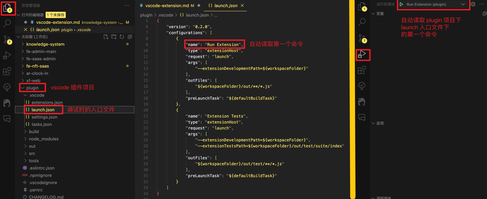
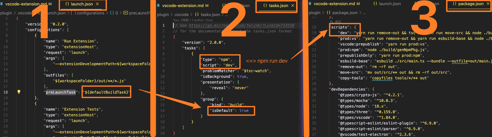
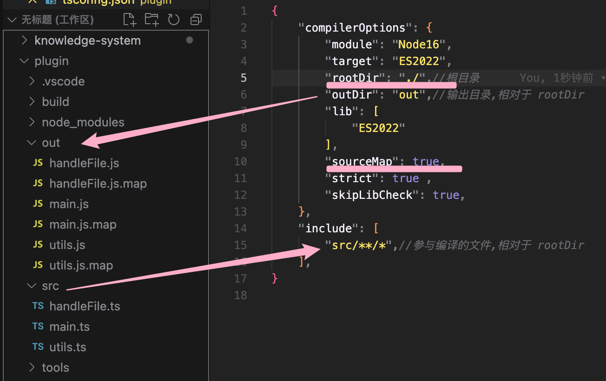
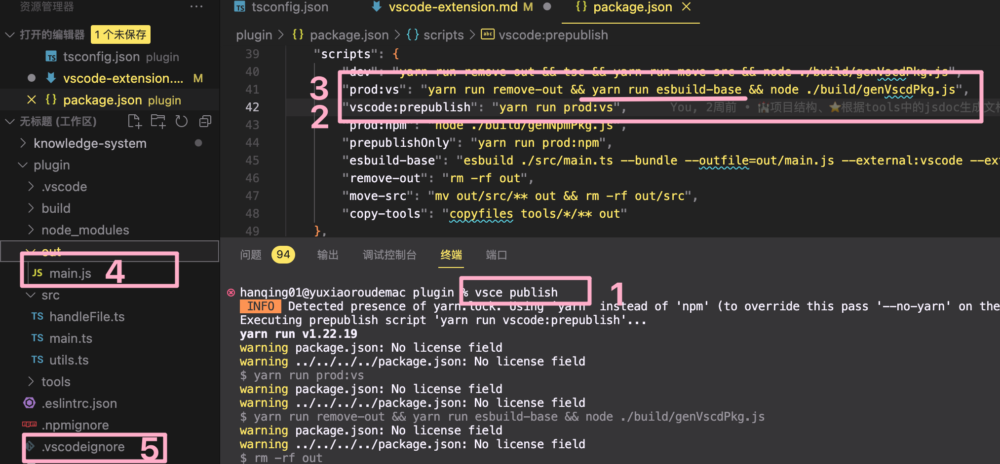
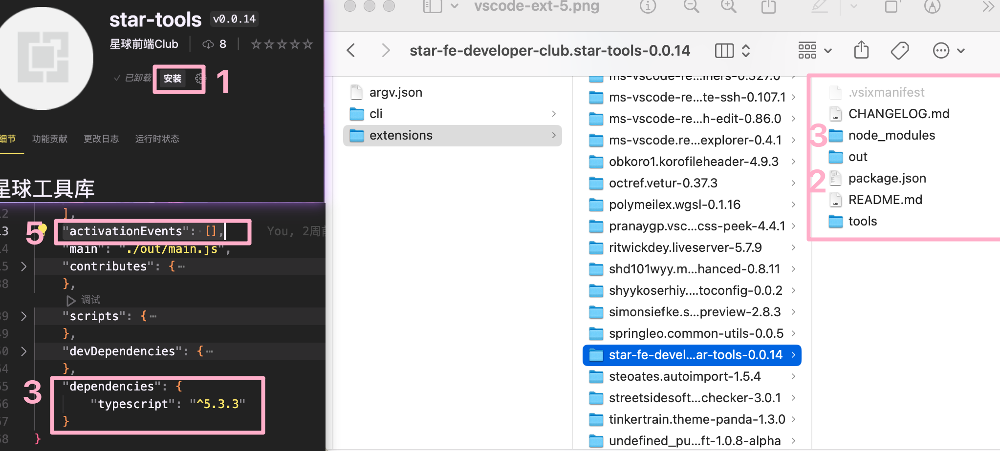
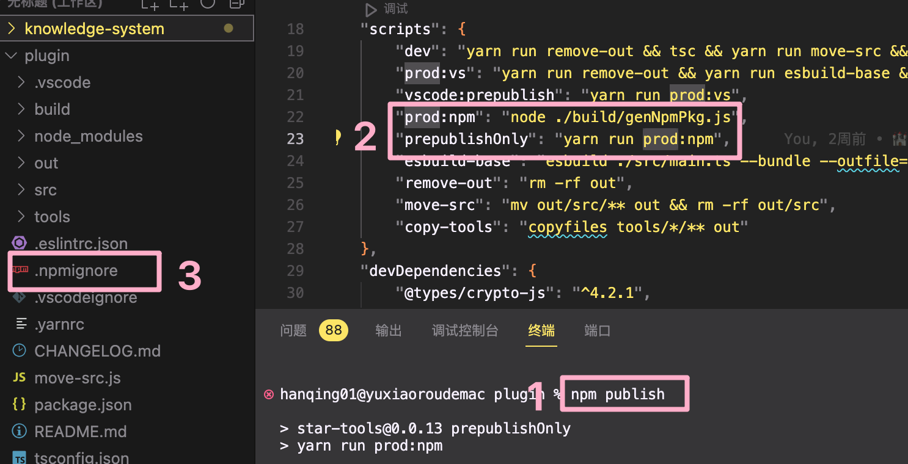

## 需求

实现一个工具函数库，可以通过 npm 包和 vscode 插件两种方式使用

#### 工具函数库目录结构：

- star-tools
  - validators
    - index.ts 计划把验证函数都放到这一个文件中
  - 3d
    - control1.ts 因为 3d 类似 control 这种代码会比较长，是一个类，所以单独用文件
    - control2.ts
    - index.ts 引入 control1、control2 等然后统一导出
  - ...
    - ...
    - index.ts

#### 期望的 npm 包使用方式：

```js
import {control1} 'star-tools/3d'
```

control1 拿到的就是 ts 源码

#### 期望通过 vscode 插件使用的方式

1. 调出 vscode 命令面板
2. 每个函数对应一个命令，比如输入 star-tools:3d/control1，找到这个命令
3. 选中命令后 enter
4. control1.ts 中的代码插入到当前工作区的 focus 处

## 项目目录制定

两种方式在一个项目中，共用一份源码，主要是为了不维护双份的工具函数  
如果不考虑两种方式共用一个项目，

#### 对于 npm 包引用的方式，目录结构：

- star-tools
  - validators、3d、... 目录不变
  - .gitignore
  - package.json

直接 publish 源码，install 的就是源码，可以 import {control1} 'star-tools/3d' 引用到

#### vscode 插件目录结构

- star-tools
  - src
    - extension.ts 插件的入口文件，主要是插件的逻辑代码
  - tools
    - 省略，就是把三个分类文件夹直接移动过来
  - .gitignore
  - package.json
  - tsconfig.json

#### 结论

显而易见了，就直接用 vscode 插件的目录结构，这样直接 publish 源码仍然可以引用到工具函数，并且两种方式共用同一份 tools

> 目前来看，这样的目录结构虽然 ok，但是会有不合理的地方，比如要把只和 vscode 相关的部分也发布到了 npm，这个会在稍后解决。

## 前置知识恶补

整个开发过程其实很不顺利，开发之前要先做一些调研，有一些前置知识会少走弯路。但很矛盾的是，一开始根本没有头绪，都不知道要先掌握哪些基本的前置知识。希望我总结的这些前置知识可以让你少走弯路咯 ~

### 各种有用的配置文件

- package.json : 配置主入口、依赖、scripts 等、开发和发布后都要用到
- tsconfig.json : 负责把 ts 编译 为 js。vscode 插件运行时只能是 js，如果插件源码是 ts，tsconfig 是必要的（或者用一些其他的打包工具内部集成了 ts 编译为 js 的能力）
- .vscode 目录下的配置文件是用来配置 vscode 调试功能的，插件发布后无关。
- .npmignore 用来过滤发布到 npm 的文件。
- .vscodeignore 用来过滤发布到 [marketplace](https://marketplace.visualstudio.com/) 的文件。

### F5 调试插件时 干嘛了

调试的入口文件为 .vscode/launch.json，一般情况下，vscode 左侧 debugger 工具面板都会自动定位到 .vscode/launch.json 中的 第一个命令  
  
按下 f5 时，先经历了这样的过程，然后再把调试窗口启动  
  
原来 f5 并不神秘，就是 npm run dev 哇，实际执行的脚本在 star-tools 中是

```bash
yarn run remove-out && tsc && yarn run move-src && node ./build/genVscdPkg.js
```

只看 tsc，它是负责把 ts 编译为 js 的，之后插件才能在 vscode 的环境中运行起来。编译之前会先读取 tsconfig.json 中的配置，然后开始编译并输出编译后的代码。
（remove-out、move-src、node ./build/genVscdPkg.js 先不管，这些都属于对目录和文件内容的定制化处理。）  


- 一般情况下 rootDir 都等同于当前目录所以是 './'
- 对于 star-tools 来说工具函数是不需要编译的，因为 star-tools 不参与运行，充当代码片段的作用。和插件相关的逻辑代码才需要编译，逻辑代码都在 src 下。所以配置了 includes
- 编译后输出到 out 目录下，out 目录下的文件与 src 下的对应
- 配置 mapSource 为 true 方便调试，所以可以看到 out 目录下都有对应 .map.js

================== ok！上面编译阶段就完成了， ====================  
这时 vscode 就会把编译窗口启动，开始运行代码，再次看 package.json。其中 main 选项配置的文件就是运行时的入口文件

```json
"main": "./out/main.js",
```

运行时就是插件的逻辑了，取决于插件的功能啦，star-tools 最开始的逻辑就是把每个工具函数都注册为命令，然后巴拉巴拉...(后面讲具体功能再说)

### vsce publish 干嘛了 ？

运行 vsce publish 命令后，经历了这样的过程：  


- 使用 yarn run esbuild-base 来编译，是因为 esbuild 在 tsc 的基础上有一些扩展功能比如压缩等，编译之前也读取了 tsconfig 的配置。我这里其实只是强迫症想合并到一个文件。
- 编译打包之后输出到 out 文件夹

============= 发布准备结束！下面就到发布阶段了 ==============  
（其实上面的流程也是编译阶段，和开发调试时不一样在于配置不同输出不同）

- 读取 .vscodeignore 对文件进行过滤
- 发布到 marketplace

### 安装插件 又干嘛了 ？

点击安装 => 下载发布到 marketplace 的插件源码 => 根据 package.json 中的 dependencies（‼️ 注意 ，要考的）安装依赖  
  
什么时候运行呢？由 package.json 中的配置项 activationEvents 决定

- 不配置或者为 [] ：当在命令面板中选择插件相关的命令时开始进入运行时
- 配置为 \* 号 ： vscode 启动就进入运行时

======================= 安装阶段 🔚 =========================

运行时入口文件是 package.json 中的 main，接下来同开发调试时啦

### npm publish 比 vsce publish 简单多了



- 不需要 tsc 编译了，因为就是发布源码，直接引用。（至于 node ./build/genNpmPkg 先不管，也是属于对目录和文件内容的定制化处理）

### npm install

过滤后安装的包结构：

```
- star-tools
  - tools
    - ... 源码结构
  - package.json
  - readme.md
```


### 注意

- 发布时版本号要更新

### 开发插件第一阶段 各种配置

#### 工具函数那么多，每个命令都手动注册一下太累了

应该直接读取文件目录，和 tools/xxx/index.ts,然后拿到函数名称，循环注册。package.json 中 commands 的配置就先手动配，后面会改成图形界面的，就不用一一列在 commands 的数组里了

#### fs.require 没办法读取 tools 下的 ts 源码

本来通过 fs.require(tools/xxx/index.ts) 去读文件内容，然后拿到文件的对象，进而到函数名，但 fs.require 没办法读 ts 文件内容。
我去问了 gpt，gpt 提供了几个方法，然后全踩坑了。。。其中花时间最多的就是 gpt 说用 babel，babel 配置就搞了 3 小时，最后知道了 gpt 少说了一个依赖。  
真的不要太相信 gpt 了。。
babel 终于能运行了，但实际上 ts 还是被编译成 js，fs.require 读到的也是编译之后的了，所以一开始思路就是错的。
真正的解法是通过 ast 语法树去解析拿到函数代码片段

#### 打包目录整理

一开始没加入 ast 的逻辑，就先试试能不能直接读取源码，整个源码文件内容全部拿出来然后插入到用户的编辑器中。在默认的配置下（vscode 插件代码模板的配置），打包失败，因为 tsconfig 的 rootDir 是 src，但是 extension 逻辑中要读取 src 同级 tools 目录下的内容。所以要修改 rootDir 为’./‘。然后打包之后目录

- star-tools
  - src
    - extension.ts
  - tools
    - 省略，就是把三个分类文件夹直接移动过来
  - out
    - src
      - extension.js
      - ...
  - package.json
  - .gitignore
  - tsconfig.json
  - ...
    这个也不符合预期，gpt 说用脚本把 src 里的东西拿出来到 out 下，然后我就写了 node 脚本文件名为 move-src.js，然后再 package.json 中直接配置 node move-src.js 来完成移动操作，
    npm run compile && node-move-src.js ,先编译再移动，注意&&是同步操作，&是异步操作。需要前面完成了再进行后面的就得用&&
    确实可以。然后 out 部分就变成了
- out
  - extension.js
  - ...
    然后发布插件了

#### 安装插件之后缺少 tools 目录

虽然本地调试没问题了，但是用另一个电脑搜索安装插件，命令不存在，我看了一下 .vscode/extensions/star-tools/ 发现插件目录是

- star-tools
  - out
    - extension.js
    - ...
  - package.json
  - ...
    tools 文件夹没有了，那行吧那就打包的时候把 tools 拷贝到 out 下面吧

#### 打包目录继续整理

这次 gpt 教了一个办法安装一个开发时的依赖，package.json 中直接配置脚本就行，不用自己写一个脚本。依赖是 copyfiles，配命令也是试了好几次，因为看不懂参数，就靠蒙。终于拷贝成功了。
本地看 out 目录变成了，每次改目录都得记得检查 package.json 中的 main 和 extension.ts 中的逻辑是不是要改路径

- out
  - extension.js
  - ...
  - tools

然后强迫症的我觉得这样比较乱就又想改目录了，改成这样

- out - core - extension.js - ... - tools
  我寻思移动文件可不可以直接用 copyfiles 这样的依赖不自己写 node 脚本，问了半天试了几次不靠谱的办法，发现直接配置 mv 命令就行，linux 和 unix 本身支持，windows 上用 move
  "move-src": "mv out/src/\*\* out && rm -rf out/src",
  本地调试可以了，然后发布

#### 安装插件之后缺少 tools 目录

还是没有 tools，然后发现是 vsce publish 的时候过滤掉了 ts 文件。我忘记我咋知道的了。配置一下 .vscodeignore 把 ts 那条删掉。
那也就是说其实不用 copyfiles 了，直接能读取源码。。。

#### npm 包也更新一下试试

npm publish 了一下，有些没用的文件也传上去了比如 .vscodeignore ,既然可以配 .vscodeignore,那应该 npm publish 也有可以配的那就是 .npmignore

### 📢 总结

#### 折腾来折腾去，发现自己频繁踩坑就是因为前置知识匮乏，前置知识补充：

#### 有了前置知识，结合需求就会有正确的思路

1. 在我的项目中，tools 下的代码实际上就像代码片段一样，是用来把 ts 源码原封不动拷贝出来的，不是插件运行时的逻辑。所以这些代码是完全不需要编译的，并且一定不能编译为 js
2. tsconfig 中三个重要的配置项
   <code>outDir</code>、<code>includes</code>、<code>excludes</code> 需要配合使用才能实现只编译 src 不编译 tool，但是又能访问到 tool
3. 打包需要处理一下目录结构所以会有 yarn run move-src 这段
4. 所以搞 babel、复制文件纯踩坑，是没必要的流程

### 开发插件第二阶段 用上 AST

每个文件固定格式，比如 xxx.ts

```ts
import aaa from 'aaa'  //也可以引用多个，或者没有依赖
// 主体代码部分 start
type TXxx {

}
function bbb (){

}
function xxx (){
   bbb()
}
// 主体代码部分 end
export default xxx //每个工具函数都有一个独立的文件，导出都用 export default
```

这样固定格式了之后，通过 npm 引用就是这样的，统一了就比较规范

```ts
import xxx from "star-tools/【分类】/xxx";
```

不过固定格式，更主要的是为了以插件形式使用的时候，ast 解析更容易
用 ast 解析文件分成三部分，import 语句部分 importStr，export default 语句部分 exportStr，除了这两部分就是主体代码 bodyStr
使用时把 importStr 插入到编辑器顶部，
bodyStr 插入到编辑器焦点处

#### 用了 ast 之后，本地调试没问题，别人安装使用报：“命令找不到”

没办法在生产环境调试，所以只能改代码把打印都变成 vscode 的消息通知，（注意 消息通知不能是勿扰模式，否则看不到）
发现 active 根本就没走到
应该是 import 那里就有问题了
ast 这个功能用到了 typescript 这个依赖，是在运行时有用到的，应该在 dependencies 下而不是 devDependencies。这样用户安装插件的时候就会自动安装 typescript 这个依赖
把依赖位置改了之后好了

### 开发插件的第三阶段 打包优化

针对两种使用方式自动改写 package.json。区别：

- 名称 star-tools 、 @star/tools
- 依赖 typescript 、 取决于工具函数的依赖比如 three
- 贡献 用 ast 的方式生成命令面板中的命令选项 、 无

### 开发插件第四阶段 自动生成文档

- star-tools
  - tools
    - validators
      - phoneNumber.ts
      - chineseName.ts
    - 3d
      - control1.ts
    - xxx
      - x1.ts
      - x2.ts
  - src
    - extension.ts
  - package.json
  - tsconfig.json
  - .gitignore
  - .vscodeignore
  - ...
