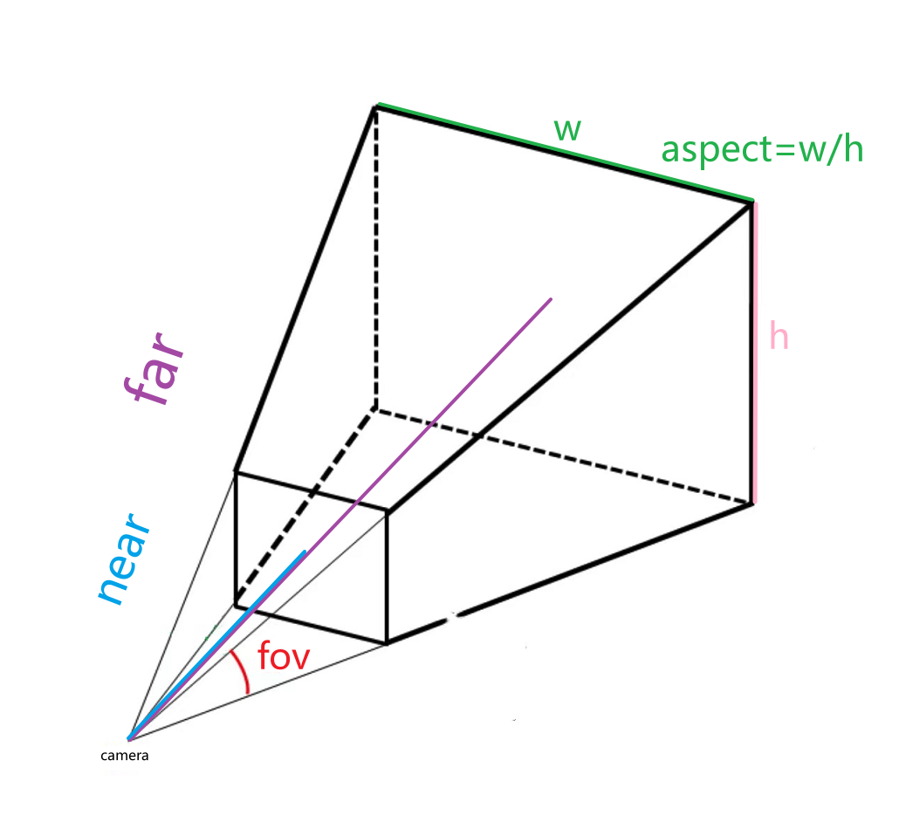
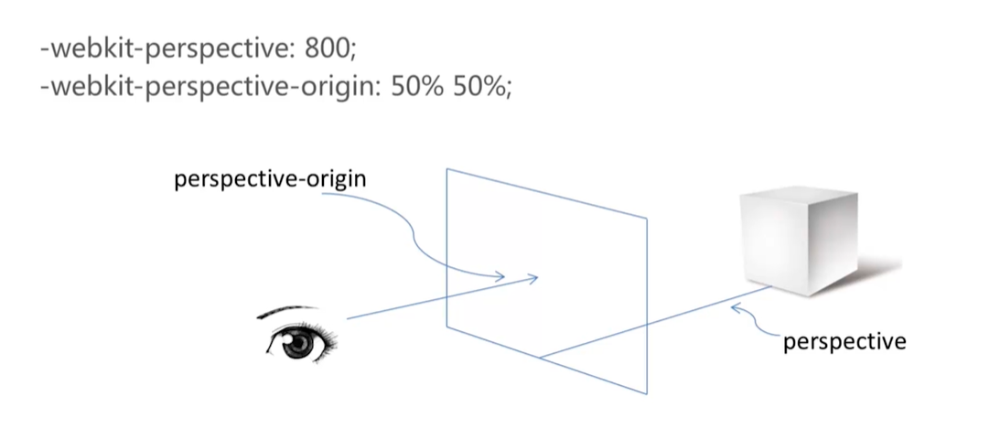

<!--
 * @Author: 鱼小柔
 * @Date: 2022-01-09 16:31:10
 * @LastEditors: your name
 * @LastEditTime: 2022-01-16 18:12:37
 * @Description: web3d
-->

# web3d

## Three.js 一个简单的例子

Three.js 构建 3D 世界主要依赖于五大要素：场景(舞台)、相机、光照、物体(演员)、渲染器。  
直接来看个简单的[demo]()吧,demo 的代码如下，通过预览 demo 和看注释可以大致的了解一下几个要素的作用和关系。

```html
<!DOCTYPE html>
<html>
  <head>
    <meta charset="utf-8" />
    <title>3D Character</title>
    <link href="styles/main.css" rel="stylesheet" />
    <script src="https://cdnjs.cloudflare.com/ajax/libs/three.js/110/three.min.js"></script>
  </head>
  <body>
    <canvas id="app-canvas"></canvas>
    <script src="scripts/threejs-main.js"></script>
  </body>
</html>
```

```js
class App {
  constructor(canvas) {
    this.cube = App.createBox(); //创建一个物体
    this.scene = App.createScene() //创建场景并把灯光、物体加到场景中
      .add(App.createDirectionalLight())
      .add(this.cube);
    this.camera = App.createCamera(); //创建相机
    this.renderer = App.createRenderer(canvas); //创建渲染器
    this.update(); //绘制
  }

  /**
   * 创建场景
   */
  static createScene() {
    let scene = new THREE.Scene();
    scene.background = new THREE.Color("black");
    return scene;
  }

  /**
   * 创建点光源
   */
  static createDirectionalLight() {
    let light = new THREE.DirectionalLight(0xffffff, 2);
    light.position.set(0, 400, 350);
    return light;
  }

  /**
   * 创建相机
   */
  static createCamera() {
    let camera = new THREE.PerspectiveCamera(
      50,
      window.innerWidth / window.innerHeight,
      0.1,
      1000
    );

    // 相机的位置
    camera.position.set(0,0,10)
    return camera;
  }

  /**
   * 创建渲染器
   */
  static createRenderer(canvas) {
    let renderer = new THREE.WebGLRenderer({ canvas });
    renderer.setPixelRatio(window.devicePixelRatio);
    return renderer;
  }

  /**
   * 创建物体
   */
  static createBox() {
    const cubeGeometry = new THREE.BoxGeometry(1, 2, 3); //边长为5的正方体（几何体无样式
    const cube = new THREE.Mesh(cubeGeometry); //物体
    cube.position.set(0, 0, 0); //物体位置
    return cube;
  }

  resize() {
    let canvasSize = this.renderer.getSize(new THREE.Vector2()); //画布大小
    let windowSize = new THREE.Vector2(window.innerWidth, window.innerHeight); //视口大小
    if (!canvasSize.equals(windowSize)) {
      this.renderer.setSize(windowSize.x, windowSize.y, false); //重置画布比例
      this.camera.aspect = windowSize.x / windowSize.y; //重置相机空间
      this.camera.updateProjectionMatrix();
    }
  }

  /**
   * 绘制函数
   */
  update() {
    this.resize();
    this.cube.rotateY(0.01); //以当前的位置为基础旋转 0.01弧度
    this.renderer.render(this.scene, this.camera); //每一帧的渲染
    window.requestAnimationFrame(() => {
      this.update(); //每一帧都会触发绘制
    });
  }
}

new App(document.getElementById("app-canvas"));
```

## Three 中的空间关系

### 世界坐标 0,0,0

在屏幕的中心

### 相机空间

图形学中相机有透视相机会和正交相机两种，对应的投影也有透视投影和正交投影两种。在实际的应用中，已透视投影为主，正交投影的方式一般只应用于 3d 游戏的一些 2d 关卡中。我们这里只讲透视相机。  
先看创建相机的构造函数

```js
new THREE.PerspectiveCamera(
  50, //fov
  window.innerWidth / window.innerHeight, //aspect
  0.1, //near
  1000 //far
);
```

参数代表什么意思呢？看图就知道了~

看图可以知道,相机空间是一个四棱台。这个四棱台在空间中的位置是跟随相机的位置和相机的朝向去移动的。物体在棱台的内部才是可见的,否则就超出视野范围了，看不到了。所以物体的可见性和①物体与相机的位置关系②相机的朝向③相机空间都是密切相关的。  
所以下面就来说一下相机的位置(position)、相机的朝向(up)
### 坐标系
这里的物体包含部分光源(如点光源)、相机、其他物体(如模型)


## css 中的透视

https://www.cnblogs.com/yanggeng/p/11285856.html
眼睛、视口、物体。与 css 属性 perspective、perspective-origin 的关系如图。
以屏幕为 Z=0 的平面，从屏幕的 perspective-origin 位置为出发点，以 perspective 为长度，向屏幕的正前方做垂线， 垂线的另一端为视点所在位置。视点与屏幕四个顶点分别画射线，形成了一个透视空间，就像我们现实生活中眼睛看到的空间范围。  
  
改变 perspective-origin，会产生物体在移动的视觉效果，其实这是因为视点与物体产生了相对运动，物体没有动，但是看起来是动的。当视点向左移动时，物体相对向右运动，视点向右移动，物体反之。垂直方向也是同理的。
改变 perspective，perspective 的值越小，离 Z 平面越近，透视效果更明显。
translateZ 代表物体离屏幕的距离，当 translateZ 越大则说明离屏幕越近，离视点越近，所以物体会逐渐变大。当 translateZ>perspective 时，说明物体在视点的背后了，这个时候物体会消失，因为已经超出了视野范围。
[体验](https://3dtransforms.desandro.com/perspective)
