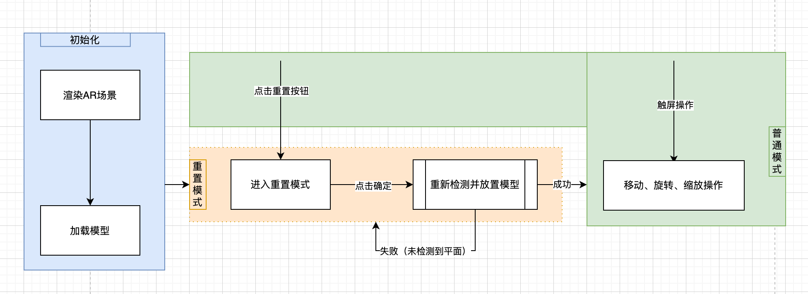
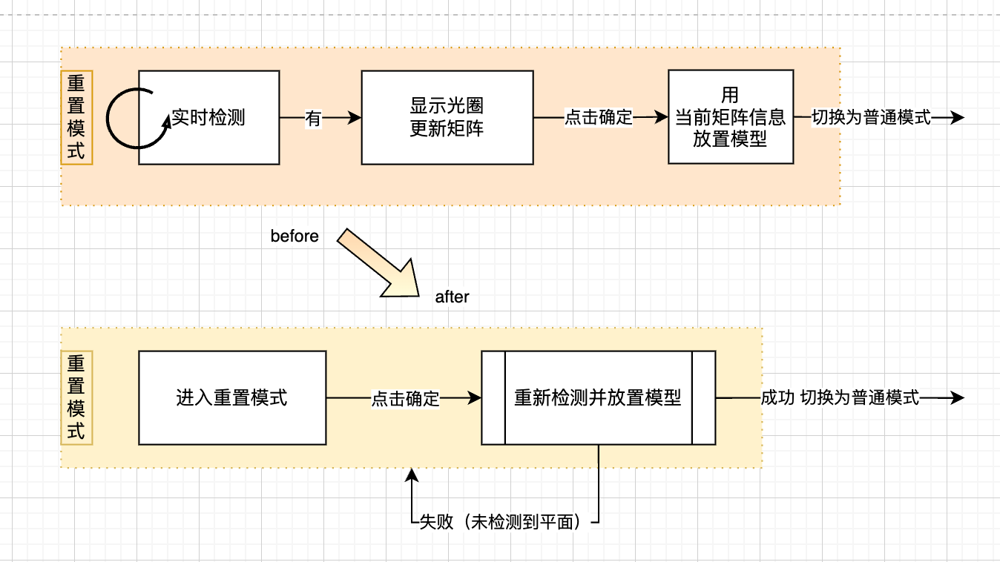

这篇文章的重点在于需要实现平面检测的 AR 项目选择技术方案的可能性、微信小程序 visiokit 平面检测能力的具体介绍，希望可以帮助大家在前期技术调研上省时省力些。

AR 增强现实，是指在真实世界的基础上，通过计算机生成的虚拟信息，将虚拟信息与真实世界进行融合，从而达到增强现实的效果。

## 核心技术及相关技术栈

想要实现 WebAR 效果，四个步骤：读取、识别、跟踪、渲染。  
拿扫福举 🌰：
打开相机画面（读取）、扫到福字（识别）、渲染虚拟场景比如小兔子跳出来的动画（渲染）


技术上说，粗略流程：


技术栈：


### 🍚 读取

- 浏览器中：WebRTC.js，最关键的 API 方法是 getUserMedia() ，实时获取摄像头的视频流

- 微信小程序中：腾讯视频云的 liteavsdk

> [微信官方总结两者区别](https://developers.weixin.qq.com/community/develop/article/doc/0008ae6f288ee85cb1f7344f35b413)

### 🥬 识别与跟踪

浏览器中可用的库 ： JSARToolKit、Tracking.js、jsFeat、js-aruco

- JSARToolKit（1999 年发布，一直更新至今） 和 js-aruco 都是基于特定的标记去跟踪的，而不能像 Tracking.js 那样进行特征检测。它们依赖于事先印刷好的标记，通过检测标记的位置和方向，从而定位和跟踪物体。在使用这些库时，需要将标记嵌入到需要跟踪的物体上，因此它们更适用于需要定向和固定跟踪的应用场景。
- Tracking.js 和 jsFeat 等库则使用计算机视觉算法进行特征检测和跟踪，可以在图像中检测和跟踪目标对象，而不需要特定的标记。这些库更适用于需要动态跟踪的场景，例如手势识别、人体识别等应用。不过对于 web 端来说，算力可能跟不上。

微信小程序中可用的库：

- Vision Kit 是一个使用一些深度学习框架 （如 TensorFlow） 进行深度学习的训练和推断，结合一些计算机视觉算法（如 OpenCV），形成的识别追踪库。具备：平面检测、人脸识别、手势识别、跟踪等能力。
  > AR 中最难部分就是跟踪

### 🍽️ 渲染

浏览器中可用的库：Three.js、Babylon.js、playCanvas、pixi.js(2d)

- [Three.js](https://threejs.org/) 是最早出现的 WebGL 库之一，提供了丰富的 3D 渲染和动画功能，支持多种 3D 模型格式和材质。
- [Babylon.js](https://www.babylonjs.com/) 是由微软开发的 3D 游戏引擎，也提供了类似的 3D 渲染和动画功能，并支持物理引擎和多人游戏等高级特性。
- [playCanvas](https://playcanvas.com/) 则是一款基于 WebGL 的在线游戏开发平台，提供了完整的游戏开发工具和游戏发布服务，可以方便地在 Web 浏览器中创建和发布高品质的 3D 游戏。

微信小程序中可用的库，几乎都是 three 的微信小程序定制版：

- [three.weapp](https://github.com/yannliao/threejs.miniprogram)
- [threejs-miniprogram](https://github.com/wechat-miniprogram/threejs-miniprogram)
- [threejs-wx](https://github.com/amorwilliams/threejs-wx)

### 🍱 技术方案

在 web 端（包括小程序）实现完整的 AR 能力，有哪些技术方案呢？

| 方案 and 能力                                           | 特定图像识别 | 特征检测 | 性能 |
| ------------------------------------------------------- | ------------ | -------- | ---- |
| AR.js（WebRTC+JSARToolKit+Three.js/Babylon.js/A-Frame） | ✔️           | ×        | ✔️   |
| WebRTC + trackingJS + ThreeJS                           | ✔️           | ✔️       | ×    |
| video 标签 + ThreeJS + 陀螺仪                           | ×            | ×        | ✔️   |
| 微信小程序 vision kit + threejs-miniprogram             | ✔️           | ✔️       | ✔️   |
| 其他小程序                                              | ？           | ？       | ？   |

- 陀螺仪（伪 AR）  
  效果类似小程序官方 threedof 示例,demo 路径：交互动画-xframe-总览-AR 能力-ThreeDof AR 相机旋转  
  

- 特定图像识别（AR.js 官网示例
  如左图，二维码就是一个约定好的标记；如右图平放的恐龙图片也是一个约定好的标记。（中间展示的是地理位置识别）。
  
- 特征检测
  下面会详细介绍平面检测，就不放图啦

## 项目实践

### 关键点：

- 识别现实世界中的平面，将一个 3D 人物模型“放置”在平面上。
- 可以反复多次识别，重置模型位置。
- 对 3D 模型可进行简单的平移、旋转、缩放操作以便于完成虚拟人物与现实中的人合影。

#### 演示


<video src="./assets/7.mp4" width="300px" autoplay controls> </video>

#### 玩法流程



### 技术方案确定：

因为需要 “识别现实世界中的水平面”，也就是说需要特征检测，所以明（wu🤷🏻‍♀️）智（nai🤷‍♂️）の选择了微信小程序，采用 vision kit + threejs-miniprogram 的技术方案。

## 微信小程序中的 AR 平面检测能力

vision kit 有 v1 v2 两个版本，高版本不一定更好哦，下面先介绍一下差异性。


#### ⭐️ API（能力）

v2 肯定比 v1 多喽～

- v1 调用 hitTest 进行平面检测。
- v2 除了 hitTest，还增加了实时监听平面的功能，事件有：'addAnchors'、'updateAnchors'、'removeAnchors'
- v1 只能检测水平面
- v2 除了水平面，也可以识别竖平面

#### ⚖ 稳定性

v1 版本不如 v2 版本稳定。

- v1 版本有动态物体从镜头前经过就会把 3D 模型带走，v2 版本不会。
- 但当镜头晃动速率较高的时候，不论哪个版本，模型还是会漂移。

> 以上是实践总结，以下是官方说法\
> V1 版，当手机摄像头没有朝向地面时，3D 模型会漂移、忽大忽小、无法停留在开始的位置。原因是 AR 以地面为跟踪目标，如果地面从手机画面中消失，V1 版 AR 就无法正常运行。\
> V2 版，AR 以房间环境为跟踪目标，不会因为手机姿态造成 3D 模型漂移。但遮住手机摄像头，V2 版 AR 也无法正常运行。

#### ✌🏻 准确性与成功率

v2 检测准确性高于 v1，但成功率低于 v1，具体难度取决于手机。  
通过项目实践的经验，个人认为原因是：

- v2 是真的检测现实中的平面，如果对准的位置是墙，那一定是检测不到的（准确高），但有些手机对准地面可能需要手机放平才检测到（难度高）。
- v1 之所以容易，是因为 v1 并没有识别现实场景，而是直接去生成一个水平面。所以 v1 几乎每次都成功（难度低），但手机不对着地面的时候，模型会悬空（准确低）。

#### 🔌 兼容性

距线上数据统计，**支持 v2 版本的用户 ： 仅支持 v1 版本的用户 ≈ 5 ：1**

> 官方数据：
> [对微信版本要求、不同手机支持程度](https://zhuanlan.zhihu.com/p/544052686)

#### 世界坐标系原点的变化

- v1 以识别成功的平面中心点，为世界坐标系原点。也就是说每次 hitTest 世界坐标的原点都更新了。
- v2 以手机相机的开始位置，为世界坐标系原点。也就是说 createVkSession 运行成功的瞬间，出现相机画面，屏幕中心点为世界坐标原点。后面 hitTest 再也不变了。

## 🪜 难点之向后兼容

（下面的代码都视作伪代码）

### 原文

VK_STORAGE_KEY -- 本地存储中代表当前用户使用的平面检测版本  
HIT_FAIL_STORAGE_KEY -- 本地存储中代表连续检测失败的次数

#### 原则

- 由于我们是线下活动，人来人往，对稳定性要求极高，否则模型经常飘走无法完成最终的打卡拍照功能，所以我们需要优先使用 v2。
- 但由于部分手机（比如 iphone13 mini）检测成功率低，总是无法放置模型体验也不好，所以我们做了版本降级的逻辑：当 v2 连续第 6 次检测不到时，切换为 v1 版本。
- 对于根本无法支持 AR 功能的情况，我们提供了自拍模式，用相机画面+动态贴图的方式来实现合影。
  > 有些手机，系统版本支持，但是硬件不支持，无法通过版本提前预判，只能在创建 AR 会话的回调函数中感知。

#### 兼容逻辑

```ts
enum VkVersion {
  V0 = "v0",
  V1 = "v1",
  V2 = "v2",
  V2_1 = "v2_1",
  Error = "v_error",
}
function setSupportVK() {
  let canUseV;
  // compareVersion 用来比较 当前微信基础库版本与目标基础库版本，微信官方提供了类似的方法，不写了
  if (compareVersion("2.20.0") < 0) {
    //①系统不支持 AR
    canUseV = VkVersion.V0;
    showCantArToast(); // toast 提示
  } else {
    if (compareVersion("2.22.0") >= 0 && Taro.isVKSupport(VkVersion.V2)) {
      // ②系统支持 v2
      canUseV = VkVersion.V2;
    } else {
      // ③系统仅支持 V1
      canUseV = VkVersion.V1;
      showLowVersionModal(); //弹窗 提示用户使用低版本或使用自拍
    }
  }
  Taro.setStorageSync(VK_STORAGE_KEY, canUseV);
  return canUseV;
}
// ④系统支持 AR，但设备不支持 AR
// session.start 回调 error 时执行这个方法
function setErrSupportVK() {
  showCantArToast(); // toast 提示
  Taro.setStorageSync(VK_STORAGE_KEY, VkVersion.Error);
}
// 用户在使用过程中，由于检测频繁失败，从 v2 降级到 v1
// 每次 session.hitTest 之后都执行这个方法进行记录次数
export const checkUseLowVersion = (success: boolean) => {
  const hitFailCount = Number(Taro.getStorageSync(HIT_FAIL_STORAGE_KEY));
  if (success) {
    Taro.setStorageSync(HIT_FAIL_STORAGE_KEY, 0);
  } else {
    Taro.setStorageSync(HIT_FAIL_STORAGE_KEY, hitFailCount + 1);
    if (hitFailCount === 5) {
      // ⑤ v2 降级为 v1
      showLowVersionModal(); //降级通知弹窗
      Taro.setStorageSync(VK_STORAGE_KEY, VkVersion.V1);
    }
  }
};
```

想要更好的体验，只能期待(\*❦ω❦)vision kit 和硬件升级 🥺

### 20230723

除了这个标题下，其他都是 6 月底的原文。项目结束后，针对版本兼容的优化没有停止，有收获！！！所以来补充。  
两个思路，（一）是从提高 v2 的检测成功率入手；（二）是从提高 v1 的稳定性入手。虽然无法从根本解决问题，但是通过优化业务流程间接的解决了（一）！那就是实时检测平面，而不是用户点击的时候去检测。

#### 流程图对比：



#### 效果图比：

<div style="flex">
<video src="./assets/10.mp4" width="300px" autoplay controls> </video>  
<video src="./assets/11.mp4" width="300px" autoplay controls> </video>
</div>

#### 核心代码

- detecting 表示当前是否为重置模式
- reticle 为光圈对象
- currentAnchor 用来存储当前变换矩阵的信息

代码上的变化就是：

- 每一帧都调用 hitTest。
- 用户点击确认后，不进行 hitTest 而是直接使用 currentAnchor 来为模型做矩阵变换。

```ts
// 主渲染函数增加逻辑：
if (detecting && reticle) {
  const hitTestRes = session.hitTest(0.5, 0.5);
  if (hitTestRes.length) {
    // 应用变换的逻辑
    // ...
    // 应用变换的逻辑
    if (reticle.position.z != 0) {
      reticle.visible = true;
      currentAnchor = anchor;
    } else {
      reticle.visible = false;
    }
  } else {
    reticle.visible = false;
  }
}
```

## 其他坑点
没有得到完美解决，就当给大家打个预防针吧  

- 重置与平移功能不兼容
  市面上的小程序也没有重置和平移功能并存的，基本上都是重置+旋转+缩放，可能大家都发现了这个问题吧。在体验的过程中，使用重置功能后，平移方向会不对。正常来说应该在渲染函数中拿到 ar 相机的位置，然后基于它去计算模型的平移，但实际上拿不到正常的 ar 相机位置，目前分析是 vksession 没有这个能力或者是个 bug。
- 内存问题
  小程序 AR 普遍存在内存问题，我们的小程序也是，代码层面已经做了 vksession 的卸载，还有 3d 虚拟场景的卸载，但问题仍然没有完全解决。不知道是不是小程序的 three 或者 vksession 本身有内存问题，还有待研究。


