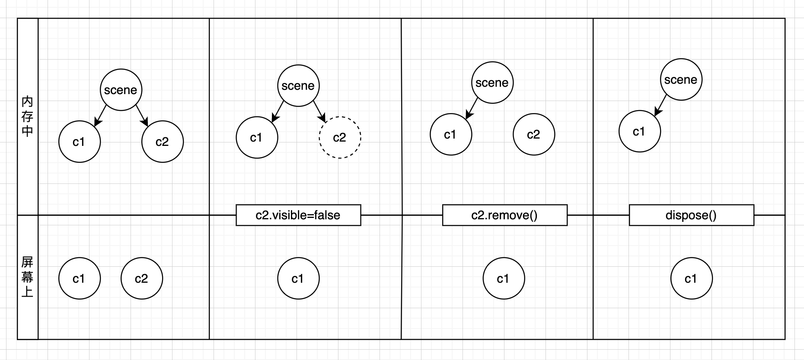
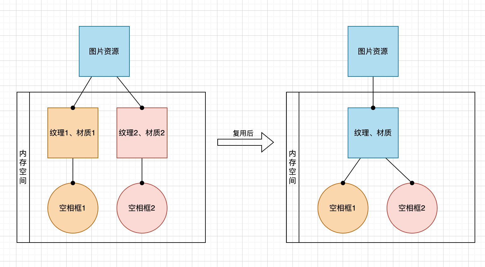
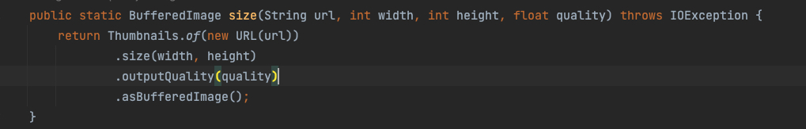

结合项目中的应用，分享一些用的或了解到的渲染方面的性能优化。

## 项目背景

扫码预览： 

- 场景中的元素就分为两个部分，渲染无真实的 PBR 效果。  
  ① 模型（包括艺术馆建筑和内部装饰等）：blender 导出模型，资源形式是 .gltf+.bin+烘焙图。  
  ② 作品：程序创建的 THREE.Mesh。

- 功能上很简单，重在展示与浏览，无角色交互等。  
  ① 模型数据是动态的，可能超过 10 层，也可能只有 1、2 层。  
  ② 作品中的图画为用户上传，图片尺寸（像素）体积(字节数)不可控。
  ③ 用户交互方面是控制相机运动浏览场景

- 技术栈 three.js

## 分层加载

由于数据量不固定，分批加载数据肯定是必要的，在我们的项目中就是分层加载数据。其实这就像列表分页和虚拟滚动列表（virtual-list）一样。这种方案不仅是对渲染的性能优化，也是对加载阶段的优化。  
那么怎么样在每批内进行优化，以提高每批的数据量带来更好的用户体验呢？

## 做好 GC

3d 场景中总会涉及一些删除物体的场景，比如在我们的案例中，作品数据会由于用户上传替换某一个作品也可能整体切换一批作品，这种情况下就涉及删除原有的作品，创建新的作品。如果删除工作不彻底，就会造成内存泄露。  
那怎么删除才是真正的释放内存呢？

### 相关 API 介绍

每个 three.js 实例的创建都会消耗大量的内存因为 three.js 会创建特殊对象如 geometry、material；WebGL 相关的实体如 buffers（缓冲区）或 shader。然而，这些对象不是自动释放的，我们调用特殊的 API 来手动释放这些资源。
想将 3d 物体从场景中删除/隐藏, 通常有三种方法, visible = false, remove(), dispose().



- obj.visible = false ：对象本身所占内存空间并没有改变。对象会被 renderer 遍历到, 但是不参与渲染（因为做了一层 visible=true 的判断）。
  > 使用 Raycaster 类来投影时, visible = false 的模型由于还存在于父级的 Object3D 类中, 所以会被投影投到, 这是一个需要注意的点.
- obj.remove() ： 对象本身所占内存空间并没有改变。在对象父级的 Object3D 中删除了该对象的索引，对象不会被 renderer 遍历到。 不参与渲染。
- geometry/material/texture.dispose():就是上面提到的 three 提供的特殊 API，真正的释放内存。

> 可以通过 WebGLRenderer.info 来获取 webglrender 所占用的资源来检查内存占用情况

### 应用

在我们的项目中，涉及作品删除操作的都会对作品的材质、纹理、几何体进行 dispose()  
以下是一个通用的方法(traverse 会对 obj 的后代元素进行遍历)：

```js
  freeUp(obj) {
    obj.traverse((current) => {
      const {geometry,material} = current
      if(geometry){
        geometry.dispose();
      }
      if(material){
        material.dispose();
        material.map?.dispose();
        material.envMap?.dispose();
      }
    })
  }
```

## 共享与复用

刚刚提到了每创建一个纹理或材质，都需要开辟一个单独的内存空间。共享与复用就是让相同纹理（材质、几何体）用同一块内存，减少重复创建。

### 图示



```js
const texture1 = new TextureLoader().load("test.png");
const material1 = new MeshBasicMaterial({ map: texture1 });
const texture2 = new TextureLoader().load("test.png");
const material2 = new MeshBasicMaterial({ map: texture2 });
```

像上面这样的代码，虽然 material1 和 material2 “长得一样”但实际上是用了两个独立的内存空间。对应图中左边的结构。  
我们要做的就是稍微管理一下纹理、材质，变成右边的结构。

### 应用

比如在我们的项目中，空画框的展示位，画框的大小可能不同，但是纹理和材质是相同的，这种情况下就可以共享材质。所以我们的项目中会有类似这样的代码:

```js
getEmptyFrameTexture() {
    if (!ExhibitHelper.EMPTY_NFT_TEXTURE) {
      ExhibitHelper.EMPTY_NFT_TEXTURE = new TextureLoader().load(EMPTY_FRAME_URL);
    }
    return ExhibitHelper.EMPTY_NFT_TEXTURE;
}
```

当然，并不是所有的“长得一样”的情况都适用于共享。共享后需要注意的一点是，对于共享材质的 object 3d 来说，只要一个 object 3d 对材质进行了修改，其他的也会同步修改。  
在我们的项目中，空相框需要发生改变时（用户上传图片后），整个 object 3d 会销毁，重新创建，所以是不存在改变材质的情况，所以适用于这种优化。还比如，在我们的艺术馆中，每一层都有相同的 logo，如果 logo 是支持后台配置图片，在运行时去创建响应的 object 3d，logo 仅做静态展示，并且总是保持各个楼层的 logo 都保持一致，这种情况下也是很适用于共享材质与纹理甚至是几何体。

## 降低 texture 尺寸

### 基础认知

- 纹理尺寸越大，在内存中占用的空间越大。一个 1024\*1024 的纹理图占用内存是 512\*512 的 4 倍。
  > 纹理图片压缩后虽然字节数会变少但是在 GPU 使用纹理图的时候仍然是需要解压缩的，解压后又是原图的字节数。所以最直观的是看尺寸。
- 从读取纹理到最终显示在屏幕上，有一个从纹理像素 texel 到屏幕像素 pixel 的映射过程，也就是需要针对纹理的所有像素点进行计算，纹理尺寸最大，运算量也越大。
- 纹理长宽是 2 的整数次幂，比如 128、256、512，那么在存储时使用内存的效率较高，否则容易产生内存碎片。
  > 移动端，WebGL2RenderingContext.MAX_TEXTURE_SIZE = 3397（不知道为什么是这个数，请大佬指教）。

综上，降低纹理尺寸对空间和时间上都有优化作用。

<!-- TODO 崩溃实验 -->

### 应用

在我们的项目中，关于降低纹理尺寸的优化主要在两方面：对美术输出的模型纹理图做限制、对用户上传的图片做尺寸压缩处理

#### 模型纹理图

模型中的纹理尺寸尽量用 512\*512，较为复杂的情况（元素较多）用 1024\*1024。

> tips: 512\*512 光线烘焙可能会出现锯齿，可以对图片中光线的部分模糊处理一下

#### 用户上传图片的压缩处理

由于用户上传的图片尺寸不可控，所以上传后对图片进行处理，原图保留并且生成对尺寸等比缩小后的图片，3d 场景中展示小尺寸图片，全屏查看时展示原图。  
缩小后纹理尺寸为 512\*512 以内。虽然 2048\*2048 理论上是支持的，但是 512 移动端完全够用了。这样可以增加作品展示的数量，也就是说分层加载时，层数可以增加，带来更好的用户体验。  
压缩是在后端处理的～ java 代码：



## 降低 material 复杂性

### 材质简单说明

three 支持的材质有多种 MeshBasicMaterial、MeshLambertMaterial、MeshPhongMaterial、MeshStandardMaterial 等，[各个材质的区别详见](https://r105.threejsfundamentals.org/threejs/lessons/threejs-materials.html)。  
其中 MeshBasicMaterial 不是 PBR（基于物理渲染的）材质，在呈现的效果上是无法写实的，但性能上是最好的，移动端建议能用 MeshBasicMaterial 就用 MeshBasicMaterial。  
性能排序(高到低)：MeshBasicMaterial ➡ MeshLambertMaterial ➡ MeshPhongMaterial ➡ MeshStandardMaterial ➡ MeshPhysicalMaterial。

<!-- TODO 材质实验，现在美术导出的是basic了但是不手动创建有些地方是黑的，看看是不是默认参数不对。 https://github.com/mrdoob/three.js/pull/7635  -->

#### 自问自答

用 stander 材质，但是实际效果和 basic 一样（不做复杂的金属度粗糙度），性能是不是和 basic 一样？当然不是！还是会有大量的计算。

### 小经验小 tips

blender 导出的材质默认是 MeshStandardMaterial（最耗性能的材质），由于美术一直没有找到导出 MeshBasicMaterial 的方法，只好在加载模型时代码层面手动转一下：

```js
// GLTFGroup 是加载成功的回调传给业务层的参数，也就是模型中的根对象
GLTFGroup.traverse((child) => {
  if (child.material) {
    const map = child.material.map;
    child.material = new THREE.MeshBasicMaterial({
      // 纹理贴图应用上
      map: map,
      // 以下两个属性是为了保证透明材质的正常渲染
      transparent: true,
      alphaTest: 0.5,
    });
  }
});
```

> 手动转，对性能是不是有影响？


## 用 buffer geometry 代替 geometry

### 区别

<!-- TODO 有点图会比较好 -->

BufferGeometry 使用 bufferAttribute 来存储所有的顶点、面、颜色数据，可以直接传输给 GPU，不需要经过 CPU 处理。
Geometry 使用 Vector3、 Color 等对象存储物体的属性（顶点位置、面、颜色等），需要额外的内存开销，并且需要转换为 bufferGeometry 再传输给 GPU 渲染使用。
所以，不论是从空间还是时间上，BufferGeometry 的性能是肯定优于 Geometry 的。  
当然，Geometry 也有自己的优点那就是易于理解，方便使用。
如果场景中有复杂的几何体或者非常大量的情况，可以用 BufferGeometry 进行优化。

### 应用

在我们的项目中，模型结构比较复杂，所以从模型软件导出时几何体都是用 buffer geometry。（blender 导出 gltf 时默认就是 buffer geometry，也算是比较省心啦）  
作品本身只是两个面片叠加，几何体很简单、并且数量也少，所以作品仍然是用 geometry 去创建的。  
buffer geometry 具体怎么用 [还是看官方文档](https://threejs.org/docs/#api/en/core/BufferGeometry)。这里就用矩形来举例子对比一下 geometry 和 BufferGeometry 写法上的区别。实际上，BufferGeometry 对于初学者来说不好理解，如果有机会学透了再来专门写文章记录 📝 一下 😁。

```js
// 宽 w 长 h 的矩形
// 用 geometry
new PlaneGeometry(3, 4, 1, 1);
// 用 buffer geometry
createPlanBufferGeo(w,h){
    const geometry = new BufferGeometry();
    const vertices = new Float32Array( [
      //三角形1的三个顶点坐标
    	-w/2, -h/2,  0, //↖️
    	 w/2, -h/2,  0, //↘️
    	 w/2,  h/2,  0, //↗️
      //三角形2的三个顶点坐标
    	 w/2,  h/2,  0, //↗️
    	-w/2,  h/2,  0, //↖️
    	-w/2, -h/2,  0 //↙️
    ] );

    // itemSize = 3 因为每个顶点都是一个三元组。
    geometry.setAttribute( 'position', new BufferAttribute( vertices, 3 ) );
    return geometry

}
```

## 主动降帧

当手机电量低，性能差的时候，可以通过主动降帧来节省功耗，在流畅度和持久度上平衡一下。  
有些浏览器是能跑多快跑多快，但就我们项目来说超过 60 帧没必要，这种情况下也应用了主动降帧。

```js
// 创建一个时钟对象Clock
let clock = new THREE.Clock();
//单位秒  间隔多长时间渲染渲染一次（30FPS
let renderT = 1 / 30;
let timeS = 0;
function animate() {
  //.getDelta()方法获得两帧的时间间隔
  let T = clock.getDelta();
  timeS += T;
  // 通过时间判断，降低renderer.render执行频率
  if (timeS > renderT) {
    this.renderer.render(this.scene, this.camera);
    timeS = 0;
  }
  requestAnimationFrame(animate);
}
```

## 其他

### batch

batch，在各种 MVxx 框架（如 Vue、React）中，Batch Update 可以理解为将一段时间内对 model 的修改批量更新到 view 的机制。  
在 webGL 中（model->view)的过程为 DrawCall（专业含义：Draw Call 是 CPU 调用图形编程接口，比如 DirectX 或 OpenGL，来命令 GPU 进行渲染的操作）。DrawCall 之前 CPU 要进行大量的工作，DrawCall 了 GPU 就开始渲染。GPU 的渲染能力是很强的，因此渲染速度往往快于 CPU 提交命令的速度。如果 DrawCall 的数量太多，CPU 就会把大量时间花费在提交 DrawCall 命令上，造成 CPU 的过载。而 batch 就是减少 DrawCall 的一种方式，把多次的更改合并到一次渲染。

### LOD

LOD（Level of Details）技术指的是将场景中的模型按不同精度分为 N 套，按照模型与相机的距离远近，动态切换模型的精度，距离相机较近的模型采用精细模型展示，而距离相机较远的模型使用较为粗糙的模型进行展示。对于大的场景，使用 LOD 技术也是一个有效提升帧率的手段，可以有效减少整个场景中的渲染三角面数。  
LOD 其实是基于模型减面从而优化性能这个思路出发的一个具体方案。

### 网格模型合并

纯静态展示的部分可以进行网格模型合并，多个小模型合并为一个大模型。[详见这个例子](http://threejs.bld.mobi/forum.php?mod=viewthread&tid=170)  
因为合并后就是一个对象了，不能单独识别其中的某个原物体，所以如果是动态交互的就不太适用。

[three LOD 官方例子](https://threejs.org/examples/?q=lod#webgl_lod)
