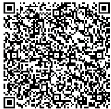
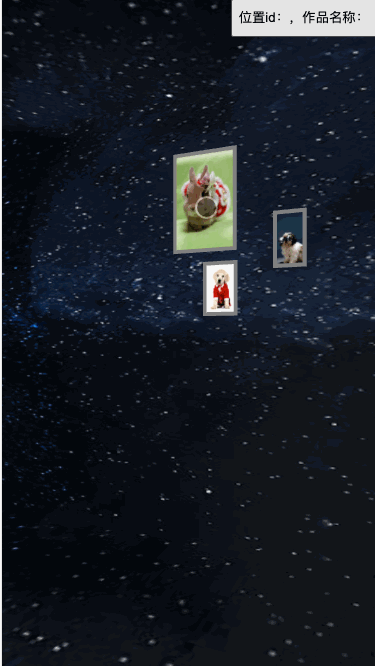

这篇是接着上一篇的，如果没有开发基础，建议先把上一篇前面两小节看过再来看～

#### 说在前面

真实案例线上预览:
demo 预览:  
[demo 完整代码](https://codesandbox.io/p/sandbox/green-sunset-xsps3f)

## 交互：相机运动

首先要有一个基础认知那就是在 3D 空间浏览场景通常是相机运动而不是模型运动，所以主体思路就是识别移动端的手势（在 pc 端就是鼠标操作），根据手势和滑动距离来计算相机的运动方式与运动距离。  
很多 3d 项目基本都是用相机轨道运动 orbitController 所以先介绍一下 orbitController。

### orbitController

[官方例子感受一下～](https://threejs.org/examples/?q=orb#misc_controls_orbit) 运动解析：

#### 首先想象相机在一个**球面**的某个位置：

- 左键水平拖动，相机的运动轨迹是类似经线一样的曲线运动。
- 左键竖直拖动，相机的运动轨迹是类似纬线一样的曲线运动。
- 鼠标滚轮滚动，相机的运动轨迹朝着球心远近平移。
  > 注意 是圆角坐标系的曲线运动，而不是相机自转  
  > 

#### 然后再想象相机在一个垂直于屏幕的**平面**上，

- 右键水平拖动，相机的运动轨迹是横向平移。
- 右键竖直拖动，相机的运动轨迹是远近平移。
  > 可以通过配置，修改平面是平行于屏幕的，这样，右键竖直拖动，相机的运动轨迹是垂直平移。

### 核心逻辑

实际项目中的交互可能无法复用 OrbitControl 等 three 封装好的组件（比如我们的就是），不过定义一套交互系统无外乎两个关键点。

- 移动端监听 touch 事件、pc 端监听鼠标键盘事件
- 控制相机运动

下面就用

- 单指水平滑动：相机原地自转
- 单指垂直滑动：相机沿着平行于 y 轴的方向平移
- 斜着滑：以上两种运动结合

举例子。 结合 demo 效果和[结合 demo 效果和完整代码看更好理解](https://codesandbox.io/p/sandbox/green-sunset-xsps3f)，别忘记调为手机模式哦～

#### 流程


#### 代码

```js
import { Vector2 } from "three";

/**
 * 自定义控制器
 * 单指滑动，水平分量负责绕y轴旋转，垂直分量负责y轴方向平移
 * object 就是相机
 * domElement 就是 canvas
 */
class CustomControls {
  // static single = null;
  constructor(object, domElement) {
    /* ==================== 实例属性 ==================== */

    // 控制的对象
    this.object = object;
    // canvas
    this.domElement = domElement;
    this.domElement.style.touchAction = "none"; // disable touch scroll
    // 旋转速度
    this.rotateSpeed = 1;
    // 位移速度
    this.panSpeed = 10;

    // 控制的对象最高位置
    this.panRangeMax = 10;
    // 控制的对象最低位置
    this.panRangeMin = 0;

    // 是否启用
    this.enabled = true;

    /* ==================== 内部变量和方法 ==================== */

    const scope = this;
    let deltaPan = 0; //实时平移量
    let deltaRotate = 0; //实时旋转量
    let pointStart = new Vector2(); //上一次的touch位置

    // 控制平移的范围
    function getSafePosY(oldY, panOffset) {
      if (oldY + panOffset > scope.panRangeMax) {
        return scope.panRangeMax;
      }
      if (oldY + panOffset < scope.panRangeMin) {
        return scope.panRangeMin;
      }
      return oldY + panOffset;
    }

    // 控制旋转角度在0~2PI
    function getSafeRoY(old, delta) {
      return (old + delta) % (2 * Math.PI);
    }

    // 不使用阻尼的运动
    function acting() {
      scope.object.position.y = getSafePosY(object.position.y, deltaPan);
      scope.object.rotation.y = getSafeRoY(
        scope.object.rotation.y,
        deltaRotate
      );
    }

    function onTouchStart(e) {
      // 禁用、非单指则不继续监听move和end事件
      if (scope.enabled === false) return;
      const touchNumber = e.touches.length;
      if (touchNumber !== 1) {
        return;
      }

      // 取出初始触控点，记录到pointStart中，作为初始向量
      const touch = e.touches[0];
      const { pageX, pageY } = touch;
      pointStart.x = pageX;
      pointStart.y = pageY;
    }

    function onTouchMove(e) {
      // 禁用、非单指则不触发相机运动的逻辑
      if (scope.enabled === false) return;
      const touchNumber = e.touches.length;
      if (touchNumber !== 1) {
        return;
      }
      // 计算触控滑动向量
      const touch = e.touches[0];
      const { pageX, pageY } = touch;
      const pointerMove = new Vector2(pageX, pageY);
      const deltaMove = new Vector2().subVectors(pointerMove, pointStart);
      // 以“竖向滑动为一屏距离则可以移动一米”为平移单位速度
      const perPan = (deltaMove.y / scope.domElement.clientHeight) * 1;
      // 此次平移的距离
      deltaPan += scope.panSpeed * perPan;
      // 以“横向滑动为一屏距离则可以转一圈”为单位旋转速度
      const perRo = (deltaMove.x / scope.domElement.clientHeight) * 2 * Math.PI;
      // 此次旋转的弧度
      deltaRotate += scope.rotateSpeed * perRo;
      // 运动（无阻尼）
      acting();
      // 更新 pointStar 的值，为下次进入 move 事件做准备
      pointStart.copy(pointerMove);
    }

    /* ==================== 构造函数逻辑 ==================== */
    // 监听 touch 事件
    scope.domElement.addEventListener("touchstart", onTouchStart);
    scope.domElement.addEventListener("touchmove", onTouchMove);
  }
}
```

#### 效果

  
有两个问题：

- 有时转速很快，出现了乱转的情况。这是因为我们相机的运动逻辑没有写到帧渲染函数中。
- 对比 OrbitControls 少了惯性效果，看起来很生硬。

下面就来解决这两个问题

### 阻尼效果

#### 流程


#### 代码


```js
import { Vector2 } from "three";

/**
 * 自定义控制器
 * 单指滑动，水平分量负责绕y轴旋转，垂直分量负责y轴方向平移
 * object 就是相机
 * domElement 就是 canvas
 */
class CustomControls {
  static update() {
    //（新增）
    //controls与App3dScene模块独立，主渲染函数在App3dScene中
    //模仿TWEEN，update挂在静态函数上，方便插入主渲染函数
  }
  // static single = null;
  constructor(object, domElement) {
    /* ==================== 实例属性 ==================== */
    this.object = object;
    // .... 不变
    this.enabled = true;
    // 阻尼系数 越小惯性越大 1的时候没有惯性效果（新增）
    this.dampingFactor = 0.1;

    /* ==================== 内部变量和方法 ==================== */

    // ... 删掉 acting 方法其他不变

    function onTouchMove(e) {
      if (scope.enabled === false) return;
      // ... 删掉 acting() 调用，其他不变
      pointStart.copy(pointerMove);
    }

    /* ==================== 构造函数逻辑 ==================== */
    // 监听 touch 事件
    scope.domElement.addEventListener("touchstart", onTouchStart);
    scope.domElement.addEventListener("touchmove", onTouchMove);

    // 相机运动（有阻尼），主渲染函数调用update （新增）
    CustomControls.update = function() {
      //当前帧相机运动
      const stepPan = scope.dampingFactor * deltaPan;
      const stepRo = scope.dampingFactor * deltaRotate;
      scope.object.position.y = getSafePosY(scope.object.position.y, stepPan);
      // ！！！不要用 rotateY()，当其他地方也有旋转操作会有 bug，具体原因涉及较多 欧拉角四元数转换计算，不展开说明
      scope.object.rotation.y = getSafeRoY(scope.object.rotation.y, stepRo);
      //下一帧预备
      deltaPan *= 1 - scope.dampingFactor;
      deltaRotate *= 1 - scope.dampingFactor;
    };
  }
}
```

#### 效果


## 交互：物体捕捉

### 射线检测

3d 空间的物体不像 dom 可以绑定各种事件监听，而是用射线检测对物体进行拾取。  
关键代码就两行：

```JS
const raycaster = new Raycaster(); //射线
raycaster.setFromCamera(pointer, camera); //由相机发出射线
const intersects = raycaster.intersectObjects(targetObjects, false); // 检测
```

结合我们的 demo，传入对应的参数，就可以捕获场景中的作品了。详见 demo

```js
class PickHelper {
  /**
   * @targetDom 一般是canvas元素
   * @camera {THREE.Object3D} 3d场景中的相机
   * @targetObjects {Array} 3d场景中需要捕获的群体
   * @handlePick {Function} 拾取后回调
   */
  constructor({ targetDom, camera, targetObjects, handlePick = () => {} }) {
    // 实例属性和方法 ================================
    this.enabled = true; // 是否启用拾取

    // 内部变量 =====================================
    const raycaster = new Raycaster(); //射线
    const pointer = new Vector2(); //用来存click点的数据
    const handleTrigger = (e) => {
      // console.log(e)
      if (!this.enabled) {
        return;
      }
      // 记录了归一化的鼠标位置,无论画布的尺寸，
      pointer.x = (e.clientX / e.target.clientWidth) * 2 - 1;// 我们需要一个从左到右，落入区间（-1，1）的值，
      pointer.y = -(e.clientY / e.target.clientHeight) * 2 + 1;// 类似的，也需要一个从下到上，落入区间（-1，1）的值。
      // ==========================
      // 如果用了hammer,e是hammer包装过一层的，标准的取值应该是e.srcEvent.pageY,而不是用e.center.y
      // 因为如果 e.target 有滚动（有scrollY）那么只能用pageY；水平方向同理
      // 需要注意的是100vh有时候会超过window.innerHeight，这样就有了scrollY，比如Safari浏览器
      // ==========================
      raycaster.setFromCamera(pointer, camera); //由相机发出射线
      const intersects = raycaster.intersectObjects(targetObjects, false); // 检测
      if (intersects.length <= 0) {
        return;
      }
      const [firstPickOne] = intersects.map((item) => item.object); //结果传给回调函数
      handlePick(firstPickOne);
    };

    // 构造函数逻辑，注册点击事件
    targetDom.addEventListener("click", handleTrigger);
    // 实例方法
    this.destroy = () => {
      targetDom.removeEventListener("click", handleTrigger);
    };
  }
}
```

大概效果就是  


## 扩展

- 实际的移动端 web 应用交互会更复杂一些，如果涉及手势识别比较多的建议用 hammer.js
- 点击后需要相机做过度运镜可以结合 Tween.js
- 使用 hammer.js 注册事件，捕获物体时，需要用原生的 e.target.pageX,e.targe.pageY。否则有些浏览器会捕获不准。详见代码注释
- 捕获对象发生改变时候（比如更新图片了），需要更新 picker 中的 targeObjects
