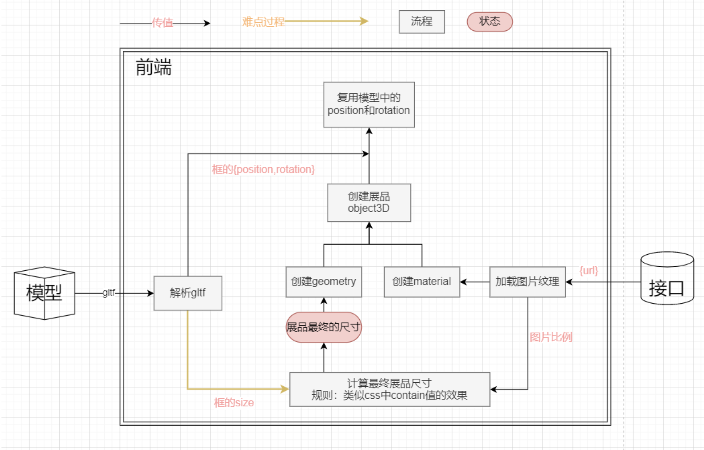
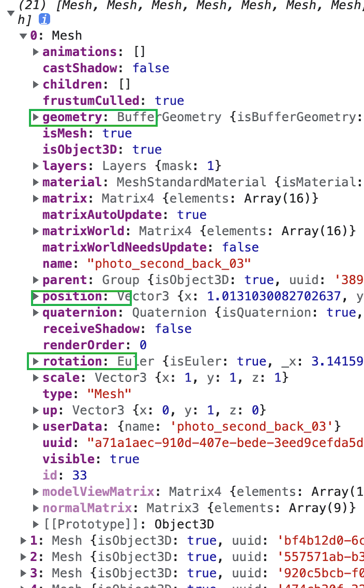
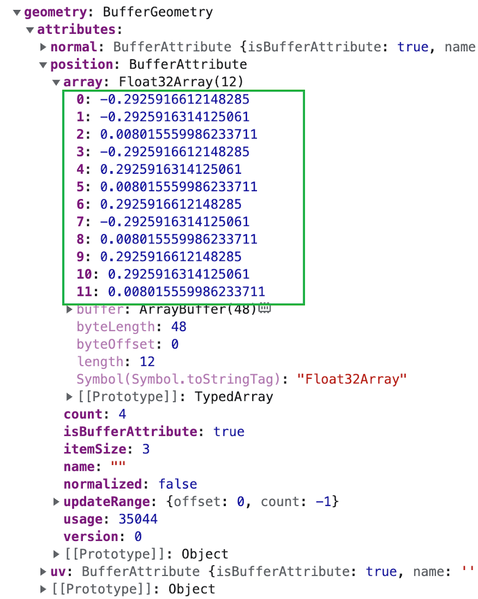
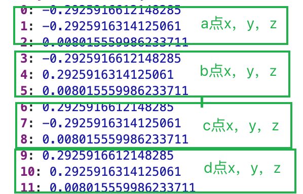
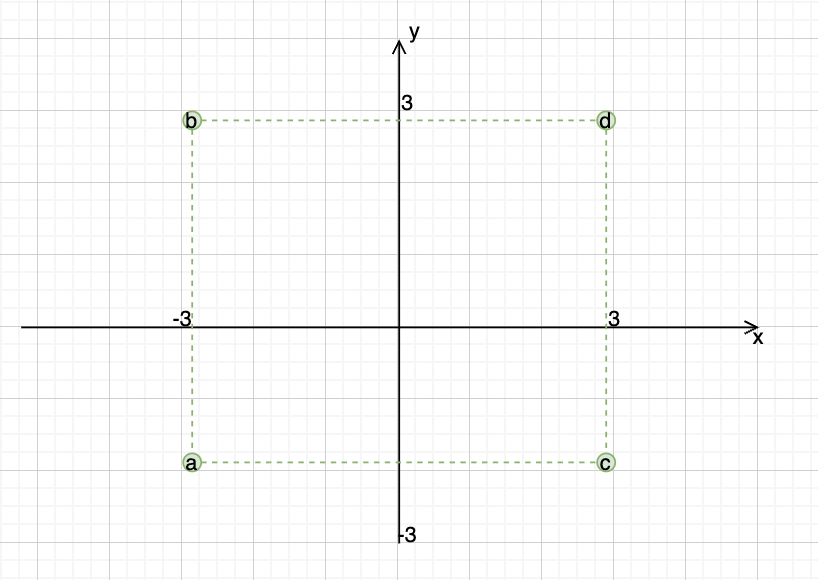
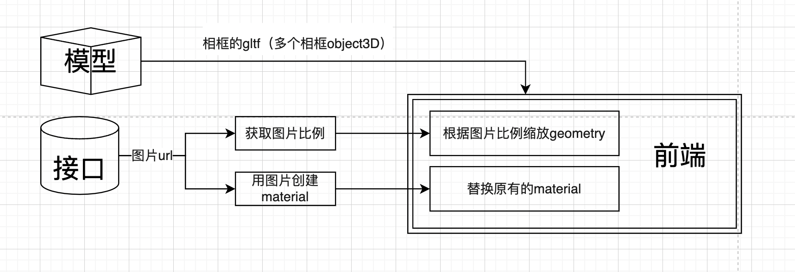

带你入门 web3d 开发  
先看一下案例：  
【gif 演示】
分为模型显示、数据与模型结合、简单交互三部分内容。web 3d 开发的基础部分都涉及到啦，内容优点杂，但不深。带大家入入门。

## 介绍

场景搭建：采用“面片系统”(几何结构+烘焙贴图)的方案搭建场景，避免纯模型加载导致的性能过载又保持了结构丰富美观的优点。  
动态数据与模型融合：动态数据指用户上传的图片，画框是模型中的一部分。上传后两者要相互适应，图片数据与模型融合。  
交互系统：垂直空间结合单指滑动、双指缩放的交互模式浏览馆内。

## three api

#### 3d 空间中的物体

创建、变换

#### 加载外部资源的 loader

加载模型

## 场景搭建：模型显示

首先得准备几个东西：相机、物体、场景、canvas
能否看到物体，取决于物体是否在相机的空间内。（3d 空间最常用的是透视相机，下文所述“相机”都是指透视相机）。反应到代码中相机的位置、物体的位置、相机空间的大小就很重要。  
相机空间示意图：

<!--  -->

#### 举个例子

实现这样的效果：
【立方体里相机、立方体图和代码，注释位置空间啥的】

### 实际工作中的小技巧 or 注意点

如果模型是动态数据，并且存在组合情况，比如我的项目中整体呈现的是一座楼，每一层都有一个独立的模型文件，层层之间自由组合形成不同的楼。  
以下称模型文件中楼层主体部分为“楼层主体”，整个模型的空间成为“世界空间”。

- 在模型软件中，不同模型文件的世界空间原点相对于楼层主体都在类似位置。不能 a 模型文件的原点在楼层的房顶左上角，b 模型文件的原点在楼层的地面中间，这样杂乱的原点在组合楼层时需要每个楼层单独位移调整，徒增麻烦。
- 模型软件与 three 坐标轴不一样，需要模型设计师制作模型的时以 three 的坐标轴为准。比如 blender 中 z 轴朝上，而在 three 中 y 轴朝上。并且需要楼层正面保持统一性。不能 a 楼层的正面是朝 z 轴正方向，b 楼层的正面朝 x 轴的负方向。
- 不同模型文件楼层主体尺寸应该保持差不多的尺寸。不能 a 的楼层主体是 5m\*5m\*5m，b 的楼层主体是 500m\*500m\*500m。这样组合时，楼层堆叠就很不协调，而且可能会超出相机空间或显示太小。

## 动态数据与模型融合：画作处理

### 射线检测

3d 空间的物体不像 dom 可以绑定各种事件监听（比如点击），而是用射线检测对物体进行拾取。  
下面是一个基础示例：

```js
```

### 图片数据与模型的融合方案

具体的处理流程如下：  
解析模型数据，得到相框的位置、旋转量、尺寸。从后端获取图片 url。根据这些信息去创建新的相框物体、图画物体。

加载模型后，查看相框的数据，如图:  
 
可以看到相框的位置和旋转量容易获取分别是 position、rotation。但是相框的大小不好获取，没有边长参数而是一组顶点数据如图：

那怎么从这些数字中计算出画框的长宽呢，利用正方形的几何特点，取巧的解析了边长数据。如图一看便知  
 

所以边长其实就是：2*|position[0]| 即：Math.abs(position[0])*2

```js
//关键代码
```

### 为什么不呢？

### 上传图片大小的控制

思路：模型提供空位，图片不超过空位范围，类似 object-fit：contain 的效果。关键在于实现 contain 效果，得知道：

- 模型是个黑盒，怎么知道模型中哪些是相框
- 相框的大小是多少，上传的图片比例是多少
  然后  
  图片等比缩放到相框中

### 具体实现流程

1. step1
   相框的位置、旋转量、尺寸、图片的 url、尺寸都是来自后端的 json，根据这些信息去创建展品（本质是 3d 物体）。  
     
   这个方案符合常规的开发思路，对前端来说是最友好最方便的。但实际上可行性差，因为模型软件不具备直接导出部分 json 数据的能力，模型导出的数据是二进制文件或者类似这样的 json：可以看出来是很不直观的，不满足我们预设的数据结构。  
   这种时候就需要针对模型软件开发一个插件，实现一层数据的转化。模型软件我们完全是不熟知的，所以这个方案的可行性很低。
2. step2
   模型软件导出模型，前端加载模型。结合后端的图片 url，把模型原有的纹理替换掉。
   
   这个方案复用了模型中的 3d 相框的位置、旋转量、几何体，无需知道这三个信息的具体值，只需要获取到纹理进行替换，获取到几何体进行缩放。看起来好像挺容易的，但实际效果会不尽如我们的期望。比如会出现纹理映射不正确的问题，本来我们期望的左图这样，实际映射后是右图。
   
   
   要避免这种情况，需要制作模型的人有一定的纹理映射知识，在制作模型中去注意把纹理铺满整个几何体。这对于模型制作者来说会有一定的学习成本，而且这也增加了工作流程中的沟通成本。所以这个方案可行性也不高。
3. step3

## 交互

- hammer
- 阻尼
- scrollY

## 加载优化

业务场景说明：  
.gltf+.bin+图片  
是 3d 场景，是真实模型，但无光影信息，图片都是烘焙后的  
不追求写实效果，有氛围感就够了

### 资源体积减小

纹理关联的图片资源尺寸减小，纹理贴图由 2048x2048 降低为 512x512，移动端 512 够用了。
有些烘焙是涉及光的，图片降为 512 后可能会有锯齿，模糊处理一下。
【2048 和 512】对比

### 模型加载的前置资源处理

模型加载过程中有 loading 页面用于过度，loading 页面资源数量和体积应该小。否则会推迟模型开始加载资源的时间起点。

- 体积减小
  loading 不要太复杂，适当降帧
- 数量减少
  背景图片变为背景颜色

### 去掉非必要的前置资源

- 图片纹理后置

### 分批
