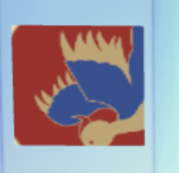

# 带你入门 web3d 开发

真实案例欢迎扫码体验：  
  
里面主要就涉及模型显示、数据与模型结合、场景交互三部分内容。本文也是从这三个点出发，举简单的例子带大家入入门，web 3d 开发的基础部分都有涉及，内容有点杂，但都很好理解哦。

## three api

首先还是要先介绍一下 three 基础的 api （概念、功能模块）

- 帧的概念  
  three 里面必写的逻辑

```js
update() {
    //每帧渲染
    //...
    //每帧渲染
    window.requestAnimationFrame(() => {
      update();
    });
  }
```

- scene  
  所有物体都会在 scene 对象下
- Object 3D （包括相机）  
  最基础的属性：position、rotation 。物体 3d 变换可以通过设置如上两个属性进行，比如相机的运镜效果就是通过改变相机的 position 和 rotation 来实现的。
- 相机  
  3d 空间最常用的是透视相机，下文所述“相机”都是指透视相机

- loader  
  用来加载外部资源，如纹理图片、3d 模型等。如 GLTFLoader 用来加载 gltf、glb 等模型文件。TextureLoader 用来加载纹理图片。
- canvas 元素
- render  
  把 3d 空间在相机中的画面渲染到 canvas

#### 基础示 🌰

```js
class App3dScene {
  constructor() {
    this.canvas = document.getElementById("app-canvas");
    this.renderer = App3dScene.createRenderer(this.canvas);
    this.scene = App3dScene.createScene();
    this.camera = App3dScene.createCamera();
    this.scene.add(this.camera);
    this.update();
    this.onWindowResize();
  }

  static createScene() {
    return new THREE.Scene();
  }

  static createCamera() {
    const camera = new THREE.PerspectiveCamera(
      70,
      window.innerWidth / window.innerHeight,
      0.01,
      10000
    );
    return camera;
  }

  static createRenderer(canvas) {
    const renderer = new THREE.WebGLRenderer({
      antialias: true,
      alpha: true,
      canvas,
    });
    renderer.setSize(canvas.clientWidth, canvas.clientHeight);
    return renderer;
  }

  update() {
    //   console.log('update')
    this.renderer.render(this.scene, this.camera);
    this.req = window.requestAnimationFrame(() => {
      this.update();
    });
  }

  destroy() {
    window.cancelAnimationFrame(this.req);
    window.removeEventListener("resize", this.fn);
  }

  onWindowResize() {
    const fn = () => {
      this.camera.aspect = window.innerWidth / window.innerHeight;
      this.camera.updateProjectionMatrix();
      this.renderer.setSize(window.innerWidth, window.innerHeight);
    };
    window.addEventListener("resize", fn, false);
    this.fn = fn;
  }
}
```

## 功能与技术点介绍

真实案例的细节和功能比较多，下文讲解技术点只说最核心的部分，业务相关的就略过啦。

- 模型显示：采用“面片系统”(几何结构+烘焙贴图)的方案搭建场景。代码上和加载 3d 模型一样，区别在于模型资源内部不同。这种方式属于一种性能优化。
- 动态数据与模型融合：动态数据指用户上传的图片，画框是模型中的一部分。上传后两者要相互适应，图片数据与模型融合。
- 交互系统：单指滑动浏览，点击可与场景中的物体交互。点击后能捕获到对应的画框。

[下文技术点集合 demo 源码点这里](https://codesandbox.io/p/sandbox/green-sunset-xsps3f?file=%2Fsrc%2FApp.jsx),demo 扫码体验：  


## 模型显示

对于刚入门 3D 开发的人来说，可能经常遇到一个问题，就是明明把物体或模型加到场景中了，但是没显示出来。所有的原因都可以归结于空间关系不对。所以下面我们先来说说空间关系。

### 空间关系

物体在相机的视野范围内（图中灰色的四棱台空间）才能看到物体。反应到代码中相机的位置、物体的位置、相机空间的大小、模型大小就很重要。

下文中的相机传参与图片对应

```js
static createCamera() {
    const camera = new THREE.PerspectiveCamera(
      90,//fov
      window.innerWidth / window.innerHeight,//width/height
      0.01,//near
      10000//far
    );
    return camera;
}
```

回顾我们对实际案例，相机是在模型里面的。我们先简单举个例子，让相机位于一个正方体中间。

```js
function createCube() {
  const cubeGeometry = new THREE.BoxGeometry(15, 15, 15);
  cubeGeometry.scale(-1, 1, 1); //图贴到里面
  const loader = new THREE.TextureLoader();
  const f = loader.load(`https://res5.xingtuyunlian.com/1651199904993468893`);
  const cubeMaterial = [
    new THREE.MeshBasicMaterial({ color: "blue", transparent: true }), //right
    new THREE.MeshBasicMaterial({ color: "yellow", transparent: true }), //left
    new THREE.MeshBasicMaterial({ transparent: true, color: "red" }), //top
    new THREE.MeshBasicMaterial({ transparent: true, color: "green" }), //bottom
    new THREE.MeshBasicMaterial({ color: "black", transparent: true }), //front
    new THREE.MeshBasicMaterial({ map: f, transparent: true }), //back 背面为图片，其他面都是颜色
  ];
  const cube = new THREE.Mesh(cubeGeometry, cubeMaterial);
  return cube;
}
class App3dScene {
  constructor() {
    // ....
    this.camera = App3dScene.createCamera();
    this.camera.position.set(0, 0, 0); //相机放在原点
    const cube = createCube(); //创建边长为5,各个面颜色不同的正方体
    cube.position.set(0, 0, 0); //正方体也放在原点偏下的位置
    // 实现相机正好在物体的正中央
    this.scene.add(this.camera, model);
    // ....
  }
  //...
}
```
大概效果就是：  


> 相机默认是朝向 z 轴负方向的！也就是说相机和其他物体（正方向都是+z）不一样。

模型能否正常显示其实和正方体是一样的，也是需要注意模型与相机的空间位置关系。因模型资源不能直接对外使用，所以不直接用模型举例啦，模型加载与直接创建物体区别在于：

- 要用对应的 loader 加载，比如 gltf 文件用 GLTFLoader。

```js
// dirName 目录 fileName 文件名
function loadGLTFGroup(dirName, fileName) {
  // 封装为 promise 实际业务中用起来更方便
  return new Promise((resolve) => {
    const loader = new GLTFLoader().setPath(`${dirName}`);
    const loadSuccess = (model) => {
      const GLTFGroup = model.scene;
      resolve(GLTFGroup);
    };
    // 还支持 progress error 回调函数
    loader.load(fileName, loadSuccess);
  });
}
```

- 模型是外部资源，需要注意的点会多一点，主要是与美术同事的对接上会有一些协定。下一小节具体列出

### 实际工作中的 tips

如果模型是动态数据，并且存在组合情况，比如我的项目中整体呈现的是一座楼，每一层都有一个独立的模型文件，层层之间自由组合形成不同的楼。  
以下称模型文件中楼层主体部分为“楼层主体”，整个模型的空间成为“世界空间”。

- 在模型软件中，不同模型文件的世界空间原点相对于楼层主体都在类似位置。不能 a 模型文件的原点在楼层的房顶左上角，b 模型文件的原点在楼层的地面中间，这样杂乱的原点在组合楼层时需要每个楼层单独位移调整，徒增麻烦。
- 模型软件与 three 坐标轴不一样，需要模型设计师制作模型的时以 three 的坐标轴为准。比如 blender 中 z 轴朝上，而在 three 中 y 轴朝上。并且需要楼层正面保持统一性。不能 a 楼层的正面是朝 z 轴正方向，b 楼层的正面朝 x 轴的负方向。
- 不同模型文件楼层主体尺寸应该保持差不多的尺寸。不能 a 的楼层主体是 5m\*5m\*5m，b 的楼层主体是 500m\*500m\*500m。这样组合时，楼层堆叠就很不协调，而且可能会超出相机空间或显示太小。
- gltf 文件渲染需要设置 render.encoding = sRGBEncoding; 否则色彩显示不对

## 动态数据与模型融合：画作处理

<!-- [结合demo效果和完整代码看更好理解]() -->

### 图片数据与模型的融合方案
#### 需求说明
有如下比例不一的图片：  

要在模型的画框里显示,画框的是模型中的一部分。(例子中画框摆放看起来比较随意，因为无法用真实数据，是模拟的，实际是模型设计师契合模型严格摆放的)  
  
细节功能点包括：
- 画框要适配图片的比例进行变形
- 最后的不超过预设的画框的范围，类似 object-fit：contain

#### 思路
废话不多说，直接看流程图：  
  
模型中的相框部分单独作为一个 glb 文件，与其他部分（墙壁、房顶、底面、摆件等）剥离开来，方便解析。
解析模型数据，得到相框的位置、旋转量、尺寸。从后端获取图片 url。根据这些信息去创建新的相框物体、图画物体。  

通过 loader 加载模型后，查看相框模型的数据，如图:  

可以看到相框的位置和旋转量容易获取分别是 position、rotation。但是相框的大小不好获取，没有边长参数而是一组顶点数据。  

那怎么从这些数字中计算出画框的长宽呢，利用正方形的几何特点，取巧地解析了边长数据:  

所以边长其实就是：2*|position[0]| 即：Math.abs(position[0])*2


#### 代码
```js
// 关键方法一 从模型中解析出相框的数据（锚点数据）
function getAnchors(dirName, fileName) {
  const loader = new GLTFLoader().setPath(`${dirName}`);
  const loadSuccess = (v) => {
    // 从模型中取出锚点信息
    let anchors = v.scene.children.map((item, index) => {
      // 获取 位置、旋转等信息
      const { position, rotation, name, geometry, material } = item;
      // 计算边长
      const halfOfWidth = geometry.attributes.position.array[0];
      const sideLength = 2 * Math.abs(halfOfWidth);
      // 获取相框 框框的颜色
      const borderColor = material.color;
      // 记录锚点信息
      return {
        position,
        rotation,
        name: `floor-${floorIndex + 1}~${name}`,
        imgIndex: index,
        sideLength,
        borderColor,
      };
    });
    resolve(anchors);
  };

  loader.load(fileName, loadSuccess);
}

// 关键方法二 图片不超过相框范围，类似 object-fit：contain 的效果。
/**
 *
 * @param {Number} naturalWidth 图片的宽
 * @param {Number} naturalHeight 图片的高
 * @param {Number} maxSize 相框边长
 * @returns
 */
function calculateSize(naturalWidth, naturalHeight, maxSize) {
  let size = [];
  const k = naturalHeight / naturalWidth;
  if (k > 1) {
    //竖版
    const h = maxSize;
    const w = h / k;
    size = [w, h];
  }
  if (k === 1) {
    //正方形
    size = [maxSize, maxSize];
  }
  if (k < 1) {
    //横版
    const w = maxSize;
    const h = w * k;
    size = [w, h];
  }
  return size;
}

// 关键方法三 获取图片自然宽高
function getTexture(imgUrl) {
  return new Promise((res, rej) => {
    const loadSuccess = (result) => {
      const { naturalHeight, naturalWidth } = result.source.data;
      res({ texture, nw: naturalWidth, nh: naturalHeight });
    };
    const texture = new TextureLoader().load(imgUrl, loadSuccess);
  });
}
```

剩下的就是拿到这些信息去创建画作了，比较简单就不放代码了。
[demo完整源码点这里](https://codesandbox.io/p/sandbox/green-sunset-xsps3f?file=%2Fsrc%2FApp.jsx)  


### 更多思考

#### 另一种方案

相框的位置、旋转量、尺寸、图片的 url、尺寸都是来自后端的 json，根据这些信息去创建画作(3d object)，而不需要解析模型数据。  
  
这个方案符合常规的开发思路，对前端来说是最友好最方便的。但实际上可行性差，因为模型软件不具备直接导出部分 json 数据的能力，模型导出的数据是二进制文件或者类似这样的 json：是很不直观的，不满足我们所需的数据结构。  
如果偏要模型导出指定的数据结构，还需要针对模型软件开发一个插件，成本更大不如用上面的 loader 方式解析 glb 二进制数据。

#### 另二种方案

不用解析每个相框的定位、边长等信息，直接把相框的几何体按照图片的比例收缩，然后把图片纹理贴到相框上并留些边框的距离。

这个方案复用了模型中的 3d 相框的位置、旋转量、几何体，看起来不用读取顶点数据了，少了计算，省了事儿。但局部纹理贴图（需要留边距）还是需要计算出边长的具体值，three 里可没有 css 的 calc(100%-边距 px)这样的算法。
就算不考虑边距，复用几何体对模型的依赖比较大，可能出现如下的情况。  
期望：

可能的错误情况：
  
要避免这种情况，需要模型设计师有一定的纹理映射知识，这对于模型制作者来说会有一定的学习成本，增加了工作流程中的沟通成本。所以这个方案可行性也不高。

## 交互
写不动了，下篇见 ～
